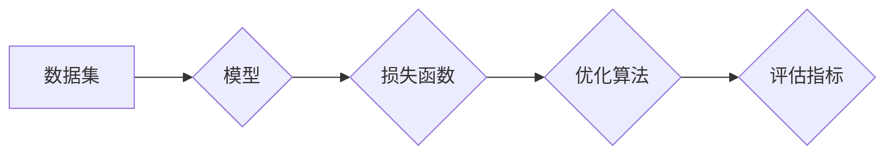

## 1. 背景介绍

### 1.1 人工智能与机器学习

人工智能（Artificial Intelligence, AI）旨在使机器能够像人类一样思考和行动，而机器学习（Machine Learning, ML）则是实现人工智能的一种重要途径。简单来说，机器学习就是让计算机从数据中学习规律，并利用学习到的规律对未知数据进行预测。

### 1.2 机器学习的类型

根据学习方式的不同，机器学习可以分为以下几类：

* **监督学习（Supervised Learning）：** 从带有标签的训练数据中学习一个模型，用于预测未知数据的标签。例如，根据历史邮件数据训练一个垃圾邮件分类器。
* **无监督学习（Unsupervised Learning）：** 从无标签的训练数据中学习数据的结构或模式。例如，对用户进行聚类分析，发现不同用户的群体特征。
* **强化学习（Reinforcement Learning）：** 智能体通过与环境交互学习如何选择最佳行动，以最大化长期累积奖励。例如，训练一个 AlphaGo 程序，使其能够在围棋比赛中战胜人类顶尖棋手。

### 1.3 机器学习的应用

机器学习已经在各个领域得到了广泛应用，例如：

* **图像识别：** 人脸识别、物体检测、自动驾驶等。
* **自然语言处理：** 机器翻译、语音识别、文本分类等。
* **金融风控：** 信用评分、欺诈检测、风险预测等。
* **医疗诊断：** 疾病预测、药物研发、个性化治疗等。

## 2. 核心概念与联系

### 2.1 数据集

数据集是机器学习的燃料，它包含了用于训练和评估模型的数据样本。一个典型的数据集通常包含以下部分：

* **特征（Feature）：** 描述数据样本的属性或特征，例如身高、体重、年龄等。
* **标签（Label）：**  表示数据样本所属的类别或目标值，例如是否患病、股票价格涨跌等。
* **训练集（Training Set）：** 用于训练模型的数据样本集合。
* **验证集（Validation Set）：** 用于调整模型超参数的数据样本集合。
* **测试集（Test Set）：** 用于评估最终模型性能的数据样本集合。

### 2.2 模型

模型是机器学习的核心，它是一个能够从数据中学习规律的函数或算法。常见的机器学习模型包括：

* **线性回归（Linear Regression）：** 用于预测连续目标变量的线性模型。
* **逻辑回归（Logistic Regression）：** 用于预测离散目标变量的线性模型。
* **决策树（Decision Tree）：**  根据特征进行一系列决策，最终预测目标变量的树形模型。
* **支持向量机（Support Vector Machine, SVM）：**  通过寻找数据样本之间的最大间隔超平面进行分类的模型。
* **神经网络（Neural Network）：**  由大量神经元组成的网络结构，能够学习复杂的非线性关系。

### 2.3 损失函数

损失函数用于衡量模型预测值与真实值之间的差异，是模型训练的目标函数。常见的损失函数包括：

* **均方误差（Mean Squared Error, MSE）：** 用于回归问题的损失函数，衡量预测值与真实值之间平方差的平均值。
* **交叉熵（Cross Entropy）：** 用于分类问题的损失函数，衡量预测概率分布与真实概率分布之间的差异。

### 2.4 优化算法

优化算法用于寻找损失函数的最小值，从而更新模型参数，提高模型性能。常见的优化算法包括：

* **梯度下降（Gradient Descent）：**  沿着损失函数梯度的反方向更新模型参数。
* **随机梯度下降（Stochastic Gradient Descent, SGD）：**  每次只使用一个样本或一小批样本更新模型参数，速度更快。
* **Adam 优化器：**  结合了动量和自适应学习率的优化算法，收敛速度更快，效果更好。

### 2.5 评估指标

评估指标用于衡量模型的性能，常见的评估指标包括：

* **准确率（Accuracy）：**  预测正确的样本数占总样本数的比例。
* **精确率（Precision）：**  预测为正例的样本中真正例的比例。
* **召回率（Recall）：**  所有正例样本中被预测为正例的比例。
* **F1 值：**  精确率和召回率的调和平均值。

### 2.6 核心概念联系图



## 3. 核心算法原理具体操作步骤

### 3.1 线性回归

线性回归是一种用于预测连续目标变量的线性模型，其基本假设是目标变量与特征之间存在线性关系。

#### 3.1.1 原理

线性回归的目标是找到一条直线（或超平面），使得所有数据点到这条直线的距离之和最小。这条直线的方程可以表示为：

$$
y = w_0 + w_1 x_1 + w_2 x_2 + ... + w_n x_n
$$

其中，$y$ 是目标变量，$x_1, x_2, ..., x_n$ 是特征，$w_0, w_1, w_2, ..., w_n$ 是模型参数，也称为权重。

#### 3.1.2 操作步骤

1. **准备数据：** 收集并清洗数据，将数据划分为训练集和测试集。
2. **选择模型：** 选择线性回归模型。
3. **训练模型：** 使用训练集数据训练模型，找到最佳的模型参数。
4. **评估模型：** 使用测试集数据评估模型的性能，例如使用均方误差（MSE）等指标。
5. **预测：** 使用训练好的模型对新的数据进行预测。

#### 3.1.3 代码实例

```python
import numpy as np
from sklearn.linear_model import LinearRegression
from sklearn.model_selection import train_test_split
from sklearn.metrics import mean_squared_error

# 准备数据
X = np.array([[1, 2], [2, 3], [3, 4], [4, 5], [5, 6]])
y = np.array([3, 4, 5, 6, 7])

# 划分训练集和测试集
X_train, X_test, y_train, y_test = train_test_split(X, y, test_size=0.2, random_state=42)

# 创建线性回归模型
model = LinearRegression()

# 训练模型
model.fit(X_train, y_train)

# 预测
y_pred = model.predict(X_test)

# 评估模型
mse = mean_squared_error(y_test, y_pred)
print("均方误差:", mse)
```

### 3.2 逻辑回归

逻辑回归是一种用于预测离散目标变量的线性模型，通常用于二分类问题。

#### 3.2.1 原理

逻辑回归使用 sigmoid 函数将线性回归模型的输出转换为概率值，表示样本属于正类的概率。sigmoid 函数的公式如下：

$$
sigmoid(z) = \frac{1}{1 + e^{-z}}
$$

其中，$z$ 是线性回归模型的输出。

#### 3.2.2 操作步骤

1. **准备数据：** 收集并清洗数据，将数据划分为训练集和测试集。
2. **选择模型：** 选择逻辑回归模型。
3. **训练模型：** 使用训练集数据训练模型，找到最佳的模型参数。
4. **评估模型：** 使用测试集数据评估模型的性能，例如使用准确率、精确率、召回率等指标。
5. **预测：** 使用训练好的模型对新的数据进行预测。

#### 3.2.3 代码实例

```python
import numpy as np
from sklearn.linear_model import LogisticRegression
from sklearn.model_selection import train_test_split
from sklearn.metrics import accuracy_score

# 准备数据
X = np.array([[1, 2], [2, 3], [3, 4], [4, 5], [5, 6]])
y = np.array([0, 0, 1, 1, 1])

# 划分训练集和测试集
X_train, X_test, y_train, y_test = train_test_split(X, y, test_size=0.2, random_state=42)

# 创建逻辑回归模型
model = LogisticRegression()

# 训练模型
model.fit(X_train, y_train)

# 预测
y_pred = model.predict(X_test)

# 评估模型
accuracy = accuracy_score(y_test, y_pred)
print("准确率:", accuracy)
```

### 3.3 决策树

决策树是一种根据特征进行一系列决策，最终预测目标变量的树形模型。

#### 3.3.1 原理

决策树的构建过程是一个递归的过程，每次选择一个最佳特征对数据进行划分，使得划分后的子集纯度更高。常用的特征选择指标包括信息增益、信息增益率、基尼系数等。

#### 3.3.2 操作步骤

1. **准备数据：** 收集并清洗数据，将数据划分为训练集和测试集。
2. **选择模型：** 选择决策树模型。
3. **训练模型：** 使用训练集数据训练模型，构建决策树。
4. **评估模型：** 使用测试集数据评估模型的性能，例如使用准确率、精确率、召回率等指标。
5. **预测：** 使用训练好的模型对新的数据进行预测。

#### 3.3.3 代码实例

```python
import numpy as np
from sklearn.tree import DecisionTreeClassifier
from sklearn.model_selection import train_test_split
from sklearn.metrics import accuracy_score

# 准备数据
X = np.array([[1, 2], [2, 3], [3, 4], [4, 5], [5, 6]])
y = np.array([0, 0, 1, 1, 1])

# 划分训练集和测试集
X_train, X_test, y_train, y_test = train_test_split(X, y, test_size=0.2, random_state=42)

# 创建决策树模型
model = DecisionTreeClassifier()

# 训练模型
model.fit(X_train, y_train)

# 预测
y_pred = model.predict(X_test)

# 评估模型
accuracy = accuracy_score(y_test, y_pred)
print("准确率:", accuracy)
```

## 4. 数学模型和公式详细讲解举例说明

### 4.1 线性回归

#### 4.1.1 模型公式

线性回归模型的公式可以表示为：

$$
y = w_0 + w_1 x_1 + w_2 x_2 + ... + w_n x_n
$$

其中，$y$ 是目标变量，$x_1, x_2, ..., x_n$ 是特征，$w_0, w_1, w_2, ..., w_n$ 是模型参数，也称为权重。

#### 4.1.2 损失函数

线性回归常用的损失函数是均方误差（MSE），其公式如下：

$$
MSE = \frac{1}{m} \sum_{i=1}^{m} (y_i - \hat{y_i})^2
$$

其中，$m$ 是样本数量，$y_i$ 是第 $i$ 个样本的真实值，$\hat{y_i}$ 是第 $i$ 个样本的预测值。

#### 4.1.3 优化算法

线性回归常用的优化算法是梯度下降，其公式如下：

$$
w_j = w_j - \alpha \frac{\partial MSE}{\partial w_j}
$$

其中，$\alpha$ 是学习率，$\frac{\partial MSE}{\partial w_j}$ 是损失函数对参数 $w_j$ 的偏导数。

#### 4.1.4 举例说明

假设我们有一组数据，表示房屋面积和房价之间的关系：

| 面积 (平方米) | 房价 (万元) |
|---|---|
| 50 | 500 |
| 60 | 600 |
| 70 | 700 |
| 80 | 800 |
| 90 | 900 |

我们可以使用线性回归模型来预测房价。假设模型公式为：

$$
y = w_0 + w_1 x
$$

其中，$y$ 是房价，$x$ 是房屋面积，$w_0$ 和 $w_1$ 是模型参数。

使用梯度下降算法求解模型参数，假设学习率 $\alpha$ 为 0.01，初始参数 $w_0$ 和 $w_1$ 都为 0。

经过多次迭代后，可以得到最佳的模型参数 $w_0$ 和 $w_1$，例如 $w_0 = 100$，$w_1 = 10$。

此时，我们可以使用训练好的模型预测其他房屋面积对应的房价，例如：

* 当房屋面积为 100 平方米时，预测房价为：$y = 100 + 10 \times 100 = 1100$ 万元。

### 4.2 逻辑回归

#### 4.2.1 模型公式

逻辑回归模型的公式可以表示为：

$$
p = sigmoid(z) = \frac{1}{1 + e^{-z}}
$$

其中，$p$ 是样本属于正类的概率，$z$ 是线性回归模型的输出，其公式为：

$$
z = w_0 + w_1 x_1 + w_2 x_2 + ... + w_n x_n
$$

#### 4.2.2 损失函数

逻辑回归常用的损失函数是交叉熵，其公式如下：

$$
J(\theta) = -\frac{1}{m} \sum_{i=1}^{m} [y^{(i)} \log h_\theta(x^{(i)}) + (1 - y^{(i)}) \log (1 - h_\theta(x^{(i)}))]
$$

其中，$m$ 是样本数量，$y^{(i)}$ 是第 $i$ 个样本的真实标签，$h_\theta(x^{(i)})$ 是模型对第 $i$ 个样本的预测概率。

#### 4.2.3 优化算法

逻辑回归常用的优化算法是梯度下降，其公式与线性回归相同。

#### 4.2.4 举例说明

假设我们有一组数据，表示用户的年龄和是否点击广告之间的关系：

| 年龄 | 是否点击广告 |
|---|---|
| 20 | 0 |
| 25 | 0 |
| 30 | 1 |
| 35 | 1 |
| 40 | 1 |

我们可以使用逻辑回归模型来预测用户是否点击广告。假设模型公式为：

$$
p = sigmoid(z) = \frac{1}{1 + e^{-(w_0 + w_1 x)}}
$$

其中，$p$ 是用户点击广告的概率，$x$ 是用户的年龄，$w_0$ 和 $w_1$ 是模型参数。

使用梯度下降算法求解模型参数，假设学习率 $\alpha$ 为 0.01，初始参数 $w_0$ 和 $w_1$ 都为 0。

经过多次迭代后，可以得到最佳的模型参数 $w_0$ 和 $w_1$，例如 $w_0 = -5$，$w_1 = 0.1$。

此时，我们可以使用训练好的模型预测其他用户年龄对应的点击广告的概率，例如：

* 当用户年龄为 30 岁时，预测点击广告的概率为：$p = sigmoid(-5 + 0.1 \times 30) = 0.731$。

### 4.3 决策树

#### 4.3.1 信息增益

信息增益是决策树常用的特征选择指标，它表示使用某个特征对数据进行划分后，信息的不确定性减少的程度。信息增益越大，说明该特征越重要。

信息增益的计算公式如下：

$$
Gain(S, A) = Entropy(S) - \sum_{v \in Values(A)} \frac{|S_v|}{|S|} Entropy(S_v)
$$

其中，$S$ 是数据集，$A$ 是特征，$Values(A)$ 是特征 $A$ 的所有取值，$S_v$ 是特征 $A$ 取值为 $v$ 的子集，$Entropy(S)$ 是数据集 $S$ 的熵，其计算公式如下：

$$
Entropy(S) = -\sum_{i=1}^{C} p_i \log_2 p_i
$$

其中，$C$ 是类别数量，$p_i$ 是第 $i$ 类样本在数据集 $S$ 中的比例。

#### 4.3.2 举例说明

假设我们有一组数据，表示用户的年龄、性别和是否购买产品之间的关系：

| 年龄 | 性别 | 是否购买产品 |
|---|---|---|
| 青年 | 男 | 是 |
| 青年 | 女 | 是 |
| 中年 | 男 | 是 |
| 中年 | 女 | 否 |
| 老年 | 男 | 否 |
| 老年 | 女 | 否 |

我们可以使用决策树模型来预测用户是否购买产品。

首先，我们需要选择一个最佳特征作为根节点。我们可以计算每个特征的信息增益，选择信息增益最大的特征作为根节点。