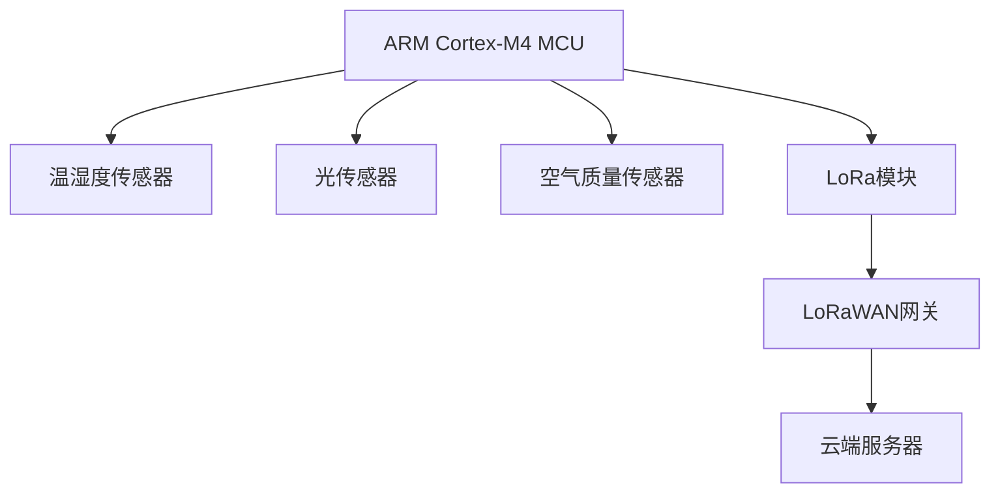
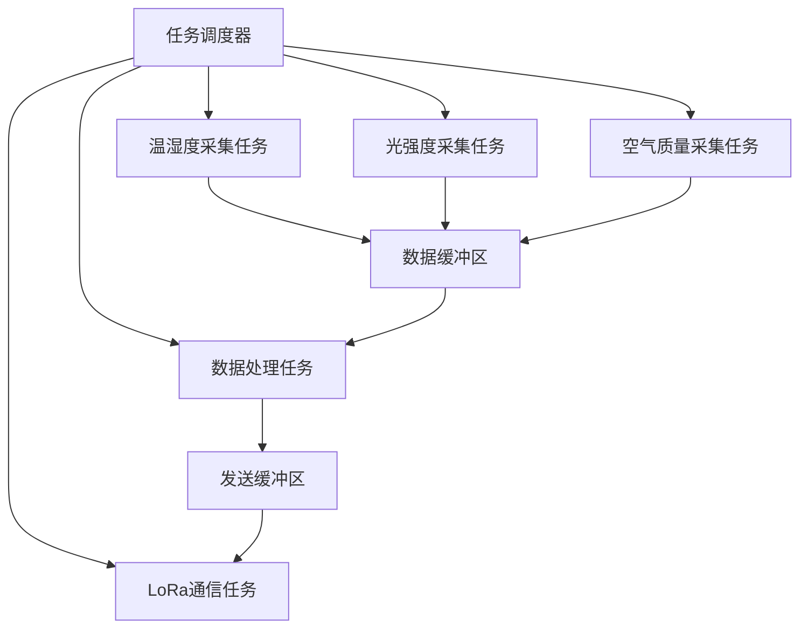

# 架构设计中的嵌入式系统和物联网架构

## 1.背景介绍

### 1.1 嵌入式系统概述

嵌入式系统是一种专用计算机系统,被设计用于执行特定的任务或功能。它们通常由微控制器或微处理器、内存、输入/输出(I/O)设备以及必要的软件组件组成。嵌入式系统被广泛应用于各种领域,包括消费电子产品、工业控制系统、医疗设备、汽车电子系统等。

嵌入式系统的特点包括:

- 专用性: 针对特定应用领域进行优化设计
- 实时性: 能够及时响应外部事件并满足严格的时间约束
- 可靠性: 需要在恶劣环境下稳定运行
- 低功耗: 由于许多嵌入式系统使用电池供电,因此需要优化能耗
- 紧凑性: 体积和重量通常受到限制

### 1.2 物联网(IoT)概述

物联网(IoT)是一个庞大的网络,将各种物理设备(如传感器、执行器、家用电器等)连接到互联网,使它们能够相互通信和交换数据。物联网的目标是创建一个智能化的环境,在这个环境中,物理世界和虚拟世界之间存在无缝连接。

物联网的主要特征包括:

- 互连性: 各种设备都可以连接到互联网
- 物物相连: 设备之间可以直接进行通信和数据交换
- 数据交换: 大量数据在设备和云端之间流动
- 远程监控: 物联网设备可以远程监控和控制
- heterogeneity: 物联网由多种不同类型的设备组成

物联网的应用范围非常广泛,包括智能家居、智能城市、工业自动化、医疗保健、农业等领域。

## 2.核心概念与联系

### 2.1 嵌入式系统与物联网的关系

嵌入式系统是物联网的核心组成部分。在物联网中,各种传感器、执行器、控制器等都是以嵌入式系统的形式存在。这些嵌入式系统负责采集环境数据、执行控制命令、处理数据等任务。它们通过有线或无线网络与云端系统或其他设备进行通信和数据交换。

可以说,没有嵌入式系统,就无法实现物联网的核心功能。嵌入式系统是物联网的"感知层"和"执行层",负责与物理世界的交互。同时,嵌入式系统也需要与云端系统和其他设备进行无缝集成,才能发挥最大效用。

### 2.2 架构设计的重要性

在嵌入式系统和物联网领域,架构设计扮演着至关重要的角色。良好的架构设计可以确保系统具有高度的可扩展性、可维护性、安全性和性能。同时,架构设计还需要考虑系统的实时性、可靠性、低功耗等特殊需求。

架构设计不仅涉及硬件层面的选择和组织,还包括软件架构的设计。软件架构决定了系统各个模块之间的通信方式、数据流向、任务分配等,直接影响系统的整体性能和特性。

因此,在嵌入式系统和物联网项目中,架构设计是一个关键环节,需要全面考虑各种技术和非技术因素,以实现系统的优化和高效运行。

## 3.核心算法原理具体操作步骤

在嵌入式系统和物联网架构中,核心算法主要体现在以下几个方面:

### 3.1 任务调度算法

嵌入式系统通常需要同时执行多个任务,如数据采集、控制算法、通信等。任务调度算法决定了这些任务的执行顺序和优先级,以确保实时性和高效性。常见的任务调度算法包括:

1. 率单雄作业(Rate Monolithic)算法
2. 基于优先级的抢占式调度算法
3. 基于最早截止时间优先(EDF)的调度算法

这些算法的核心思想是根据任务的优先级、周期性和截止时间等因素,动态分配CPU时间片,从而实现实时调度。

#### 率单雄作业算法步骤

1) 确定所有任务的执行周期
2) 构建周期性调度表,安排每个任务在其执行周期内的执行时间点
3) 在运行时,根据调度表执行各个任务

#### 基于优先级的抢占式调度算法步骤

1) 为每个任务分配优先级
2) 当有新任务到达时,选择优先级最高的任务执行
3) 如果有更高优先级的任务到达,则暂停当前任务,转而执行优先级更高的任务
4) 所有任务执行完毕后,进入闲置状态

### 3.2 数据处理算法

嵌入式系统和物联网设备需要处理来自各种传感器的大量数据,例如图像、声音、温度等。数据处理算法负责对这些数据进行滤波、压缩、特征提取等处理,以减小数据量、提高处理效率。常见的数据处理算法包括:

1. 信号处理算法(FFT、滤波器等)
2. 图像处理算法(边缘检测、目标跟踪等)
3. 数据压缩算法(哈夫曼编码、LZW等)

#### 快速傅里叶变换(FFT)算法步骤

1) 将时域信号分成偶数部分和奇数部分
2) 分别对偶数部分和奇数部分进行FFT运算
3) 利用对称性合并偶数部分和奇数部分的FFT结果

### 3.3 通信协议

为了实现嵌入式系统与云端或其他设备之间的数据交换,需要采用标准的通信协议。常见的通信协议包括:

1. 针对低功耗广域网(LPWAN)的LoRaWAN、NB-IoT等协议
2. 针对局域网的WiFi、Bluetooth、ZigBee等协议
3. 针对工业控制的现场总线协议(如CAN、Profibus等)

#### LoRaWAN通信协议步骤

1) 终端设备使用LoRa调制技术发送数据包
2) 网关接收数据包,并通过IP网络将数据转发到网络服务器
3) 网络服务器对数据包进行解码和处理
4) 如需下行通信,网络服务器将命令打包并发送给终端设备

## 4.数学模型和公式详细讲解举例说明

在嵌入式系统和物联网领域,许多算法和模型都需要使用数学工具进行描述和分析。以下是一些常见的数学模型和公式:

### 4.1 任务调度模型

对于周期性实时任务,可以使用周期性模型进行描述和分析。设有n个周期性任务$\tau_i(C_i, T_i)$,其中$C_i$表示任务的worst-case execution time,$ T_i $表示任务的周期。则任务集合的利用率可以表示为:

$$U = \sum_{i=1}^{n}\frac{C_i}{T_i}$$

根据利用率界限测试,如果$U \leq n(2^{1/n} - 1)$,则任务集合可以按期限调度。

对于基于优先级的抢占式调度算法,可以使用速率单雄作业模型进行分析。设有n个任务,任务$\tau_i$的执行时间为$C_i$,周期为$T_i$,相对截止时间为$D_i$,优先级为$\pi_i$。则任务$\tau_i$的worst-case响应时间$R_i$可以通过以下迭代公式求得:

$$R_i^{(v+1)} = C_i + \sum_{\pi_j > \pi_i}\left\lceil\frac{R_i^{(v)}}{T_j}\right\rceil C_j$$

其中$R_i^{(0)} = C_i$。当$R_i^{(v+1)} = R_i^{(v)}$时,迭代终止,得到$\tau_i$的worst-case响应时间。

### 4.2 信号处理模型

在信号处理领域,常常需要使用傅里叶变换将时域信号转换到频域。对于一个时域信号$x(t)$,它的连续时间傅里叶变换(CTFT)定义为:

$$X(j\omega) = \int_{-\infty}^{\infty}x(t)e^{-j\omega t}dt$$

而对于一个离散时间序列$x[n]$,它的离散时间傅里叶变换(DTFT)定义为:

$$X(e^{j\omega}) = \sum_{n=-\infty}^{\infty}x[n]e^{-j\omega n}$$

在实际应用中,通常使用快速傅里叶变换(FFT)算法来高效计算DFT,其计算复杂度为$O(N\log N)$,而直接计算DFT的复杂度为$O(N^2)$。

### 4.3 通信信道模型

在无线通信领域,常常需要对信道进行建模和分析。一个常见的信道模型是加性高斯白噪声(AWGN)信道模型,它假设接收信号等于发送信号加上一个高斯白噪声:

$$y = x + n$$

其中$x$为发送信号,$n$为高斯白噪声,服从均值为0、方差为$\sigma^2$的正态分布。在该信道模型下,可以计算出信噪比(SNR)与误码率(BER)之间的关系,为通信系统的设计提供理论指导。

对于窄带信号在瑞利衰落信道中的传输,其信号包络服从瑞利分布:

$$p(r) = \frac{r}{\sigma^2}e^{-\frac{r^2}{2\sigma^2}}, \quad r \geq 0$$

其中$\sigma^2$是信号功率。基于此,可以分析瑞利衰落对通信系统的影响,并设计相应的均衡和编码策略。

## 4.项目实践:代码实例和详细解释说明

为了更好地理解嵌入式系统和物联网架构的实现,我们将通过一个具体的项目实践来演示相关概念和技术。该项目是一个基于ARM Cortex-M4微控制器的环境监测系统,包括温湿度、光照强度和空气质量的检测。它将采集的环境数据通过LoRaWAN网络发送到云端,并在云端进行数据存储和可视化展示。

### 4.1 硬件架构

该项目的硬件架构如下所示:

其中,ARM Cortex-M4微控制器是系统的核心,负责读取各种传感器数据、执行数据处理算法、控制LoRa模块进行数据发送等任务。LoRa模块通过LoRaWAN网关与云端服务器进行通信。

### 4.2 软件架构

该项目的软件架构采用基于任务的架构模式,如下所示:

各个任务的功能如下:

1. 温湿度采集任务: 周期性读取温湿度传感器数据,将数据存入缓冲区
2. 光强度采集任务: 周期性读取光传感器数据,将数据存入缓冲区
3. 空气质量采集任务: 周期性读取空气质量传感器数据,将数据存入缓冲区
4. 数据处理任务: 从缓冲区读取原始数据,执行滤波、编码等处理,将处理后的数据存入发送缓冲区
5. LoRa通信任务: 从发送缓冲区读取数据,通过LoRa模块发送到LoRaWAN网关

任务调度器负责协调这些