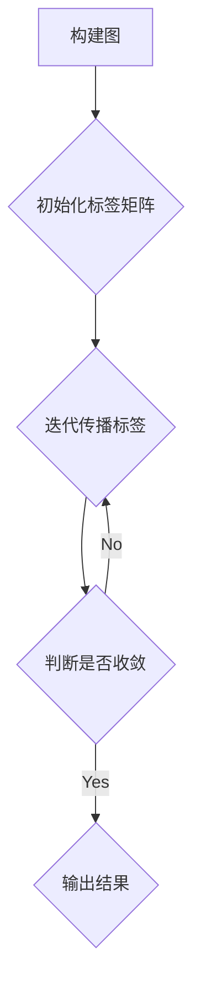
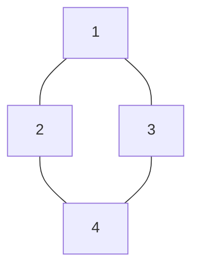

# 标签传播算法：入门指南与核心概念解析

作者：禅与计算机程序设计艺术

## 1. 背景介绍

### 1.1 什么是标签传播算法？

标签传播算法 (Label Propagation Algorithm, LPA) 是一种基于图的半监督学习算法，其核心思想是通过节点之间的关系，将已知节点的标签信息传播到未知节点，从而实现对未知节点的分类。与传统的监督学习算法相比，标签传播算法只需要少量的已标记数据，就能取得较好的分类效果，因此在实际应用中得到了广泛的关注。

### 1.2 标签传播算法的应用场景

标签传播算法可以应用于各种需要进行分类或聚类的场景，例如：

* **社交网络分析:**  识别社交网络中的用户群体、兴趣爱好等。
* **文本分类:** 对新闻、评论等文本数据进行分类。
* **图像识别:** 对图像进行分类，例如识别图像中的物体、场景等。
* **生物信息学:**  对基因、蛋白质等生物数据进行分类。

### 1.3 标签传播算法的优点

标签传播算法具有以下优点：

* **简单易懂:**  算法原理简单易懂，易于实现。
* **计算效率高:** 算法复杂度低，可以处理大规模数据集。
* **只需要少量标记数据:**  与传统的监督学习算法相比，标签传播算法只需要少量的已标记数据，就能取得较好的分类效果。


## 2. 核心概念与联系

### 2.1 图(Graph)

标签传播算法是基于图进行计算的，因此需要先了解图的基本概念。

图是由节点(Node)和边(Edge)组成的，记为 $G=(V,E)$，其中：

* $V$ 表示节点集合，$v_i \in V$ 表示图中的一个节点。
* $E$ 表示边集合，$e_{ij} \in E$ 表示节点 $v_i$ 和 $v_j$ 之间的一条边。

### 2.2  邻接矩阵(Adjacency Matrix)

邻接矩阵是表示图的一种常用方法，用一个 $n \times n$ 的矩阵 $W$ 来表示图中 $n$ 个节点之间的连接关系。

$$
W_{ij} = 
\begin{cases}
1, & \text{如果节点 } v_i \text{ 和 } v_j \text{ 之间存在边} \\
0, & \text{否则}
\end{cases}
$$

### 2.3 度矩阵(Degree Matrix)

度矩阵也是一个 $n \times n$ 的矩阵 $D$，对角线上的元素表示对应节点的度，其他元素为0。节点的度是指与其相连的边的数量。

$$
D_{ii} = \sum_{j=1}^{n} W_{ij}
$$

### 2.4 拉普拉斯矩阵(Laplacian Matrix)

拉普拉斯矩阵定义为度矩阵减去邻接矩阵，即：

$$
L = D - W
$$

拉普拉斯矩阵具有以下性质：

* 拉普拉斯矩阵是对称矩阵。
* 拉普拉斯矩阵是半正定矩阵，所有特征值非负。
* 拉普拉斯矩阵的最小特征值为0，对应的特征向量为全1向量。

### 2.5 标签矩阵(Label Matrix)

标签矩阵 $Y$ 是一个 $n \times c$ 的矩阵，其中 $n$ 表示节点的数量，$c$ 表示标签的数量。$Y_{ij}$ 表示节点 $v_i$ 属于标签 $j$ 的概率。

## 3. 核心算法原理具体操作步骤

标签传播算法的流程如下：

1. **构建图:**  根据数据之间的关系构建图，例如可以使用 KNN 算法构建图。
2. **初始化标签矩阵:**  将已知节点的标签信息赋给标签矩阵 $Y$ 中对应的元素，其他元素初始化为0。
3. **迭代传播标签:**  根据节点之间的关系，将已知节点的标签信息传播到未知节点，直到标签矩阵收敛。
4. **输出结果:**  根据标签矩阵中每个节点对应标签的概率，确定每个节点的最终标签。

### 3.1 标签传播公式

标签传播算法的核心是标签传播公式，该公式用于更新标签矩阵 $Y$ 中每个元素的值。

$$
Y_{ij}^{(t+1)} = \frac{1}{\sum_{k=1}^{n} W_{ik}} \sum_{k=1}^{n} W_{ik} Y_{kj}^{(t)}
$$

其中：

* $Y_{ij}^{(t)}$ 表示在第 $t$ 次迭代时，节点 $v_i$ 属于标签 $j$ 的概率。
* $W_{ik}$ 表示节点 $v_i$ 和 $v_k$ 之间的权重，如果节点 $v_i$ 和 $v_k$ 之间存在边，则 $W_{ik} > 0$，否则 $W_{ik} = 0$。

### 3.2 算法流程图



## 4. 数学模型和公式详细讲解举例说明

### 4.1 标签传播公式推导

标签传播公式可以从随机游走的角度进行理解。假设有一个随机游走者在图上游走，每次游走时，它会从当前节点随机选择一个邻居节点，并移动到该节点。

设 $P_{ij}$ 表示随机游走者从节点 $v_i$ 出发，最终停留在节点 $v_j$ 的概率。根据随机游走的定义，可以得到：

$$
P_{ij} = \sum_{k=1}^{n} P_{ik} W_{kj}
$$

其中，$W_{kj}$ 表示从节点 $v_k$ 到节点 $v_j$ 的转移概率。

将上式写成矩阵形式，得到：

$$
P = PW
$$

对上式进行变形，得到：

$$
P(I-W) = 0
$$

由于 $P$ 是概率矩阵，因此其行和为1，即 $P1 = 1$。将 $P1 = 1$ 代入上式，得到：

$$
(I-W)1 = 0
$$

这表明，向量 $1$ 是矩阵 $(I-W)$ 的特征向量，对应的特征值为0。

根据拉普拉斯矩阵的定义，可知：

$$
L = D - W
$$

因此，向量 $1$ 也是拉普拉斯矩阵 $L$ 的特征向量，对应的特征值为0。

假设标签矩阵 $Y$ 的每一列都是拉普拉斯矩阵 $L$ 的特征向量，即：

$$
LY = 0
$$

将拉普拉斯矩阵的定义代入上式，得到：

$$
(D-W)Y = 0
$$

对上式进行变形，得到：

$$
DY = WY
$$

将度矩阵的定义代入上式，得到：

$$
\begin{aligned}
\begin{bmatrix}
D_{11} & 0 & \cdots & 0 \\
0 & D_{22} & \cdots & 0 \\
\vdots & \vdots & \ddots & \vdots \\
0 & 0 & \cdots & D_{nn}
\end{bmatrix}
\begin{bmatrix}
Y_{11} & Y_{12} & \cdots & Y_{1c} \\
Y_{21} & Y_{22} & \cdots & Y_{2c} \\
\vdots & \vdots & \ddots & \vdots \\
Y_{n1} & Y_{n2} & \cdots & Y_{nc}
\end{bmatrix}
&=
\begin{bmatrix}
W_{11} & W_{12} & \cdots & W_{1n} \\
W_{21} & W_{22} & \cdots & W_{2n} \\
\vdots & \vdots & \ddots & \vdots \\
W_{n1} & W_{n2} & \cdots & W_{nn}
\end{bmatrix}
\begin{bmatrix}
Y_{11} & Y_{12} & \cdots & Y_{1c} \\
Y_{21} & Y_{22} & \cdots & Y_{2c} \\
\vdots & \vdots & \ddots & \vdots \\
Y_{n1} & Y_{n2} & \cdots & Y_{nc}
\end{bmatrix} \\
\Rightarrow \\
\begin{bmatrix}
D_{11}Y_{11} & D_{11}Y_{12} & \cdots & D_{11}Y_{1c} \\
D_{22}Y_{21} & D_{22}Y_{22} & \cdots & D_{22}Y_{2c} \\
\vdots & \vdots & \ddots & \vdots \\
D_{nn}Y_{n1} & D_{nn}Y_{n2} & \cdots & D_{nn}Y_{nc}
\end{bmatrix}
&=
\begin{bmatrix}
\sum_{k=1}^{n} W_{1k}Y_{k1} & \sum_{k=1}^{n} W_{1k}Y_{k2} & \cdots & \sum_{k=1}^{n} W_{1k}Y_{kc} \\
\sum_{k=1}^{n} W_{2k}Y_{k1} & \sum_{k=1}^{n} W_{2k}Y_{k2} & \cdots & \sum_{k=1}^{n} W_{2k}Y_{kc} \\
\vdots & \vdots & \ddots & \vdots \\
\sum_{k=1}^{n} W_{nk}Y_{k1} & \sum_{k=1}^{n} W_{nk}Y_{k2} & \cdots & \sum_{k=1}^{n} W_{nk}Y_{kc}
\end{bmatrix}
\end{aligned}
$$

由上式可以得到：

$$
D_{ii}Y_{ij} = \sum_{k=1}^{n} W_{ik}Y_{kj}
$$

对上式进行变形，得到：

$$
Y_{ij} = \frac{1}{D_{ii}} \sum_{k=1}^{n} W_{ik}Y_{kj}
$$

将度矩阵的定义代入上式，得到：

$$
Y_{ij} = \frac{1}{\sum_{k=1}^{n} W_{ik}} \sum_{k=1}^{n} W_{ik}Y_{kj}
$$

这就是标签传播公式。

### 4.2  举例说明

假设有如下图所示的图：



其中，节点1和节点2的标签已知，分别为标签1和标签2，节点3和节点4的标签未知。

根据图的结构，可以得到邻接矩阵 $W$ 和度矩阵 $D$：

$$
W = 
\begin{bmatrix}
0 & 1 & 1 & 0 \\
1 & 0 & 0 & 1 \\
1 & 0 & 0 & 1 \\
0 & 1 & 1 & 0
\end{bmatrix},
D = 
\begin{bmatrix}
2 & 0 & 0 & 0 \\
0 & 2 & 0 & 0 \\
0 & 0 & 2 & 0 \\
0 & 0 & 0 & 2
\end{bmatrix}
$$

初始化标签矩阵 $Y$：

$$
Y^{(0)} = 
\begin{bmatrix}
1 & 0 \\
0 & 1 \\
0 & 0 \\
0 & 0
\end{bmatrix}
$$

根据标签传播公式，可以计算得到第一次迭代后的标签矩阵 $Y^{(1)}$：

$$
\begin{aligned}
Y_{11}^{(1)} &= \frac{1}{2} (W_{11}Y_{11}^{(0)} + W_{12}Y_{21}^{(0)} + W_{13}Y_{31}^{(0)} + W_{14}Y_{41}^{(0)}) = \frac{1}{2} (0 + 1 \times 0 + 1 \times 0 + 0) = 0 \\
Y_{12}^{(1)} &= \frac{1}{2} (W_{11}Y_{12}^{(0)} + W_{12}Y_{22}^{(0)} + W_{13}Y_{32}^{(0)} + W_{14}Y_{42}^{(0)}) = \frac{1}{2} (0 + 1 \times 1 + 1 \times 0 + 0) = \frac{1}{2} \\
Y_{21}^{(1)} &= \frac{1}{2} (W_{21}Y_{11}^{(0)} + W_{22}Y_{21}^{(0)} + W_{23}Y_{31}^{(0)} + W_{24}Y_{41}^{(0)}) = \frac{1}{2} (1 \times 1 + 0 + 0 + 1 \times 0) = \frac{1}{2} \\
Y_{22}^{(1)} &= \frac{1}{2} (W_{21}Y_{12}^{(0)} + W_{22}Y_{22}^{(0)} + W_{23}Y_{32}^{(0)} + W_{24}Y_{42}^{(0)}) = \frac{1}{2} (1 \times 0 + 0 + 0 + 1 \times 0) = 0 \\
Y_{31}^{(1)} &= \frac{1}{2} (W_{31}Y_{11}^{(0)} + W_{32}Y_{21}^{(0)} + W_{33}Y_{31}^{(0)} + W_{34}Y_{41}^{(0)}) = \frac{1}{2} (1 \times 1 + 0 + 0 + 1 \times 0) = \frac{1}{2} \\
Y_{32}^{(1)} &= \frac{1}{2} (W_{31}Y_{12}^{(0)} + W_{32}Y_{22}^{(0)} + W_{33}Y_{32}^{(0)} + W_{34}Y_{42}^{(0)}) = \frac{1}{2} (1 \times 0 + 0 + 0 + 1 \times 0) = 0 \\
Y_{41}^{(1)} &= \frac{1}{2} (W_{41}Y_{11}^{(0)} + W_{42}Y_{21}^{(0)} + W_{43}Y_{31}^{(0)} + W_{44}Y_{41}^{(0)}) = \frac{1}{2} (0 + 1 \times 0 + 1 \times \frac{1}{2} + 0) = \frac{1}{4} \\
Y_{42}^{(1)} &= \frac{1}{2} (W_{41}Y_{12}^{(0)} + W_{42}Y_{22}^{(0)} + W_{43}Y_{32}^{(0)} + W_{44}Y_{42}^{(0)}) = \frac{1}{2} (0 + 1 \times 0 + 1 \times 0 + 0) = 0
\end{aligned}
$$

因此，第一次迭代后的标签矩阵为：

$$
Y^{(1)} = 
\begin{bmatrix}
0 & \frac{1}{2} \\
\frac{1}{2} & 0 \\
\frac{1}{2} & 0 \\
\frac{1}{4} & 0
\end{bmatrix}
$$

重复上述步骤，直到标签矩阵收敛。最终得到的标签矩阵为：

$$
Y = 
\begin{bmatrix}
0 & 1 \\
1 & 0 \\
\frac{1}{2} & \frac{1}{2} \\
\frac{1}{2} & \frac{1}{2}
\end{bmatrix}
$$

根据标签矩阵，可以确定节点3和节点4的标签分别为标签1和标签2。

## 5. 项目实践：代码实例和详细解释说明

### 5.1 Python 代码实现

```python
import numpy as np

def label_propagation(W, Y, max_iter=100, tol=1e-4):
    """
    标签传播算法

    参数:
        W: 邻接矩阵
        Y: 标签矩阵
        max_iter: 最大迭代次数
        tol: 收敛阈值

    返回值:
        Y: 标签矩阵
    """

    n = W.shape[0]
    D = np.diag(np.sum(W, axis=1))
    for _ in range(max_iter):
        Y_prev = Y.copy()
        Y = np.linalg.inv(D) @ W @ Y
        if np.linalg.norm(Y - Y_prev) < tol:
            break
    return Y

# 示例数据
W = np.array([[0, 1, 1, 0],
              [1, 0, 0, 1],
              [1, 0, 0, 1],
              [0, 1, 1, 0]])
Y = np.array([[1, 0],
              [0, 1],
              [0, 0],
              