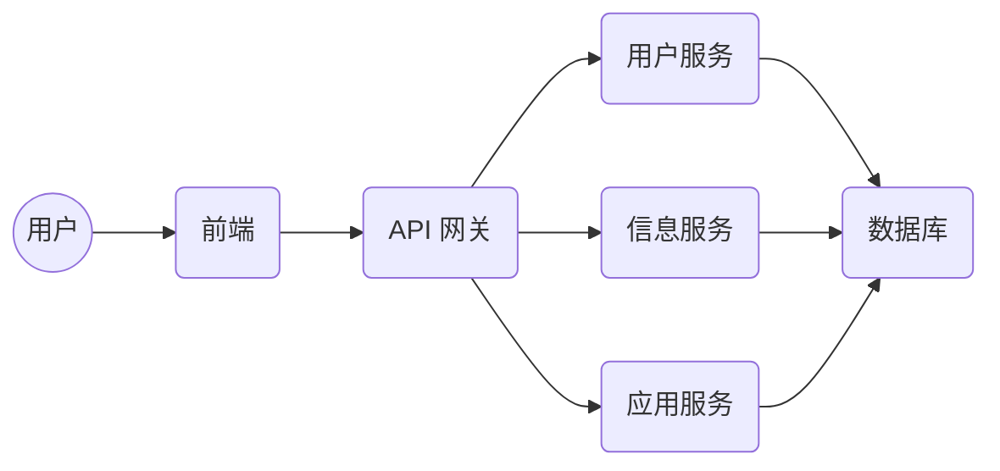
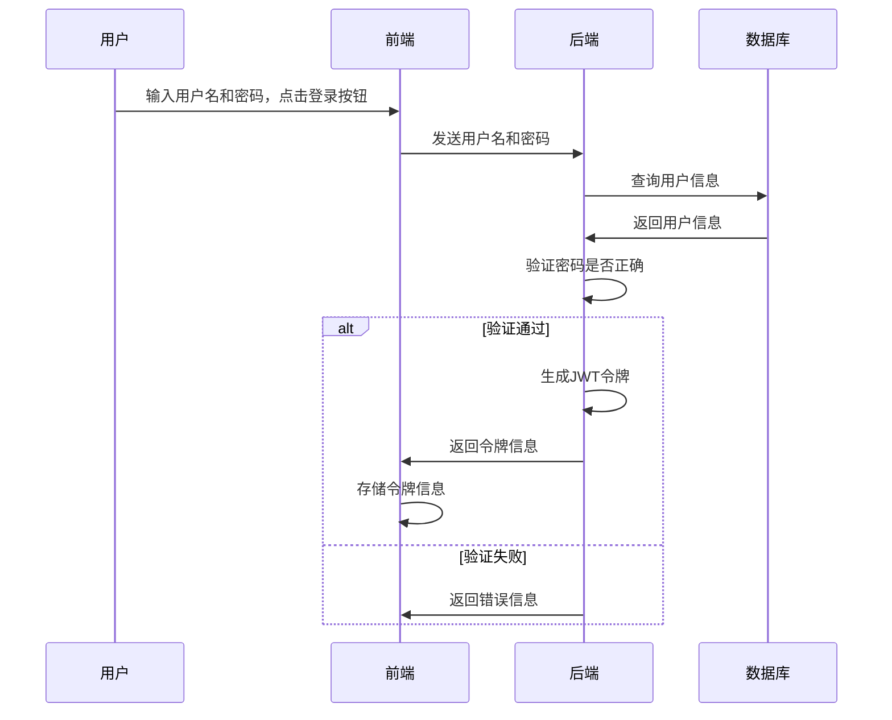
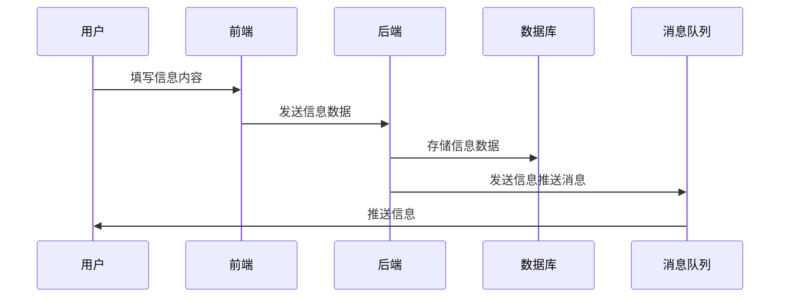

##  校园门户网系统详细设计与具体代码实现

作者：禅与计算机程序设计艺术

## 1. 背景介绍

### 1.1 校园信息化建设现状与需求

随着信息技术的飞速发展，高校校园信息化建设已经取得了长足的进步。然而，传统的校园信息系统往往存在着信息孤岛、用户体验差、功能单一等问题，难以满足新时代高校师生对信息化服务日益增长的需求。

为了解决这些问题，构建一个功能完善、安全可靠、易于使用、可扩展性强的校园门户网系统势在必行。校园门户网系统作为高校信息化的重要平台，旨在整合各类校园信息资源，为师生提供一站式的网络服务。

### 1.2 校园门户网系统建设目标

本项目旨在设计和实现一个功能完善、安全可靠、易于使用、可扩展性强的校园门户网系统，具体目标如下：

* **整合校园信息资源：** 将分散在各个部门和系统的信息资源进行整合，实现信息共享和协同办公。
* **提供个性化服务：** 根据不同用户的角色和需求，提供个性化的信息推送和服务推荐。
* **提升用户体验：** 采用现代化的Web技术，构建界面友好、操作便捷的系统平台。
* **保障系统安全：** 建立健全的安全防护体系，保障系统数据的安全性和可靠性。
* **实现可持续发展：** 采用模块化设计和开发，便于系统的扩展和维护。

## 2. 核心概念与联系

### 2.1 系统架构

本系统采用前后端分离的架构设计，具体架构图如下所示：



* **前端：** 负责用户界面的展示和交互逻辑，采用Vue.js框架实现。
* **API网关：** 作为系统入口，负责路由转发、身份认证、安全校验等功能。
* **用户服务：** 负责用户管理、角色权限管理、登录注册等功能。
* **信息服务：** 负责新闻公告、通知通告、学术活动等信息的发布和管理。
* **应用服务：** 负责整合其他校园应用系统，提供统一的访问入口。
* **数据库：** 存储系统数据，采用MySQL数据库。

### 2.2 功能模块

本系统主要包括以下功能模块：

* **用户管理模块：**  包括用户注册、登录、个人信息管理、密码修改等功能。
* **权限管理模块：**  基于角色的访问控制，实现不同用户对不同资源的访问权限管理。
* **信息发布模块：**  包括新闻公告、通知通告、学术活动等信息的发布、编辑、删除等功能。
* **信息查询模块：**  提供多种条件的信息查询功能，方便用户快速找到所需信息。
* **应用集成模块：**  通过API接口，整合其他校园应用系统，提供统一的访问入口。
* **系统管理模块：**  包括系统参数配置、日志管理、数据备份等功能。

### 2.3 技术选型

本系统采用以下技术：

* **前端技术：** Vue.js、Element UI、Axios
* **后端技术：** Spring Boot、Spring Security、MyBatis
* **数据库：** MySQL
* **缓存：** Redis
* **消息队列：** RabbitMQ

## 3. 核心算法原理具体操作步骤

### 3.1 用户登录认证流程

用户登录认证流程如下：

1. 用户在登录页面输入用户名和密码，点击登录按钮。
2. 前端将用户名和密码发送至后端API接口进行验证。
3. 后端根据用户名查询数据库，验证密码是否正确。
4. 如果验证通过，则生成JWT令牌，并将令牌信息返回给前端。
5. 前端将令牌信息存储在localStorage中，并在后续请求中携带该令牌。
6. 后端API接口拦截所有请求，验证令牌的有效性，如果令牌有效则允许访问受保护的资源。



### 3.2 信息发布流程

信息发布流程如下：

1. 用户在信息发布页面填写信息标题、内容、发布时间等信息。
2. 用户选择信息分类，并设置信息权限。
3. 用户点击发布按钮，前端将信息数据发送至后端API接口。
4. 后端API接口对信息数据进行校验，并存储至数据库。
5. 信息发布成功后，系统会将信息推送至相关用户。



## 4. 数学模型和公式详细讲解举例说明

本系统中未涉及复杂的数学模型和算法。

## 5. 项目实践：代码实例和详细解释说明

### 5.1 用户登录认证代码示例

**后端代码：**

```java
@RestController
@RequestMapping("/api/auth")
public class AuthController {

    @Autowired
    private AuthenticationManager authenticationManager;

    @Autowired
    private JwtTokenUtil jwtTokenUtil;

    @Autowired
