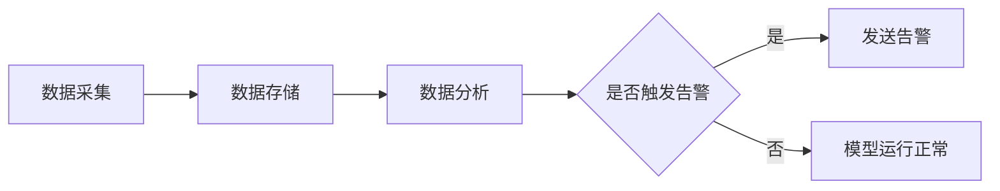

##  模型监控告警最佳实践:确保模型稳定运行

作者：禅与计算机程序设计艺术

## 1. 背景介绍

### 1.1 人工智能的崛起与模型应用挑战

近年来，人工智能（AI）技术飞速发展，已经在各个领域展现出巨大的应用价值。从图像识别、语音识别到自然语言处理，AI模型正在深刻地改变着我们的生活和工作方式。然而，随着AI应用的普及，如何确保模型在实际应用中的稳定性和可靠性成为了一个重要挑战。

### 1.2 模型衰退的风险与监控告警的必要性

模型在部署到生产环境后，会面临各种复杂的场景和数据分布的变化，这可能导致模型性能下降，即模型衰退。模型衰退会导致预测结果不准确，进而影响业务决策和用户体验。为了及时发现和解决模型衰退问题，建立一套完善的模型监控告警系统至关重要。

### 1.3 本文目标：提供模型监控告警最佳实践指南

本文旨在为广大AI开发者和运维人员提供一份模型监控告警的最佳实践指南，帮助读者了解模型监控告警的重要性、核心概念、关键技术和最佳实践，从而构建高效、可靠的模型监控告警系统，确保模型稳定运行，持续为业务创造价值。


## 2. 核心概念与联系

### 2.1 模型监控

模型监控是指对已部署到生产环境中的机器学习模型进行持续监测，跟踪其性能指标，并及时发现和诊断模型衰退问题。模型监控是保障模型稳定运行、持续优化模型性能的关键环节。

#### 2.1.1 监控指标

模型监控需要关注的指标包括但不限于：

* **性能指标**:  准确率、精确率、召回率、F1分数、AUC等。
* **数据指标**:  数据分布、特征重要性、缺失值比例等。
* **系统指标**:  请求延迟、吞吐量、错误率等。

#### 2.1.2 监控方法

常见的模型监控方法包括：

* **实时监控**:  对模型预测结果进行实时分析，及时发现异常。
* **离线监控**:  定期对历史数据进行分析，评估模型性能变化趋势。
* **A/B测试**:  将新模型与旧模型进行对比实验，评估新模型的性能提升。

### 2.2 模型告警

模型告警是指当模型监控系统检测到模型性能下降或出现异常时，及时发出警报，通知相关人员进行处理。模型告警是模型监控的重要组成部分，能够有效地避免模型衰退带来的损失。

#### 2.2.1 告警阈值

告警阈值是指触发告警的指标临界值。设置合理的告警阈值是确保告警及时有效的重要前提。

#### 2.2.2 告警方式

常见的模型告警方式包括：

* **邮件告警**:  将告警信息发送到指定邮箱。
* **短信告警**:  将告警信息发送到指定手机。
* **平台告警**:  在模型监控平台上显示告警信息。
* **Webhook**:  将告警信息推送到第三方系统。


### 2.3 模型监控与告警的关系

模型监控和告警是相辅相成的两个方面。模型监控为模型告警提供数据支撑，而模型告警则是模型监控的最终目的。只有将两者有机结合起来，才能构建完整的模型运维体系，确保模型稳定运行。

## 3. 核心算法原理具体操作步骤

### 3.1 确定监控指标和阈值

#### 3.1.1 选择合适的监控指标

选择合适的监控指标是模型监控的第一步。需要根据具体的业务场景和模型类型选择能够反映模型性能的关键指标。例如，对于分类模型，可以选择准确率、精确率、召回率等指标；对于回归模型，可以选择均方误差、平均绝对误差等指标。

#### 3.1.2  设置合理的告警阈值

设置合理的告警阈值是确保告警及时有效的重要前提。阈值设置过低会导致频繁误报，而阈值设置过高则会导致漏报。建议根据历史数据和业务经验，采用统计学方法或机器学习算法来确定合理的阈值。

### 3.2  选择合适的监控方法

#### 3.2.1 实时监控

实时监控适用于对模型预测结果有实时性要求的场景，例如在线推荐系统、欺诈检测系统等。实时监控可以通过流式计算平台（如Flink、Spark Streaming）实现，对模型预测结果进行实时分析，及时发现异常。

#### 3.2.2 离线监控

离线监控适用于对模型性能变化趋势进行分析的场景。离线监控可以通过批处理平台（如Spark、Hadoop）实现，定期对历史数据进行分析，评估模型性能变化趋势。

#### 3.2.3 A/B测试

A/B测试适用于评估新模型性能的场景。A/B测试可以将新模型与旧模型进行对比实验，评估新模型的性能提升。


### 3.3  搭建模型监控告警系统

#### 3.3.1 数据采集

模型监控告警系统需要采集模型的预测结果、输入数据、系统指标等数据。数据采集可以通过日志收集工具（如Logstash、Fluentd）、消息队列（如Kafka、RabbitMQ）等方式实现。

#### 3.3.2 数据存储

采集到的数据需要存储到数据库或数据仓库中，以便后续分析和查询。常用的数据库包括MySQL、PostgreSQL等，常用的数据仓库包括Hive、ClickHouse等。

#### 3.3.3 数据分析

对采集到的数据进行分析，计算监控指标，并与预设的阈值进行比较，判断是否触发告警。数据分析可以通过编写脚本、使用数据分析工具（如Pandas、Spark SQL）等方式实现。

#### 3.3.4 告警发送

当触发告警时，模型监控告警系统需要将告警信息发送给相关人员。告警发送可以通过邮件、短信、平台告警、Webhook等方式实现。

## 4. 数学模型和公式详细讲解举例说明

### 4.1 统计学方法

统计学方法是设置告警阈值的常用方法之一。常用的统计学方法包括：

#### 4.1.1  3σ原则

3σ原则是一种简单常用的异常值检测方法，其原理是假设数据服从正态分布，那么99.7%的数据应该落在均值 ± 3倍标准差的范围内。如果某个数据点落在该范围之外，则认为该数据点是异常值。

例如，假设某个模型的预测准确率服从均值为0.9，标准差为0.01的正态分布。根据3σ原则，可以设置告警阈值为0.87（0.9 - 3 * 0.01）和0.93（0.9 + 3 * 0.01）。当模型预测准确率低于0.87或高于0.93时，则触发告警。

#### 4.1.2  箱线图

箱线图是一种用于显示数据分散情况的统计图表。箱线图的上下边缘分别表示数据的上四分位数和下四分位数，箱体内的横线表示数据的中位数。箱线图可以用于识别异常值，例如落在上边缘或下边缘之外1.5倍箱体高度的数据点。

### 4.2 机器学习方法

机器学习方法也可以用于设置告警阈值。常用的机器学习方法包括：

#### 4.2.1  孤立森林

孤立森林是一种无监督异常值检测算法，其原理是假设异常值是“容易被孤立”的，即只需要很少几次随机划分就可以将异常值从正常数据中分离出来。孤立森林算法可以计算每个数据点的异常分数，异常分数越高，则该数据点越可能是异常值。

#### 4.2.2  One-Class SVM

One-Class SVM是一种单分类算法，可以用于学习数据的正常模式，并识别偏离正常模式的异常值。One-Class SVM算法可以计算每个数据点的决策值，决策值越低，则该数据点越可能是异常值。

## 5. 项目实践：代码实例和详细解释说明

### 5.1 使用Python实现简单的模型监控告警系统

以下是一个使用Python实现简单的模型监控告警系统的示例代码：

```python
import pandas as pd
from sklearn.metrics import accuracy_score
from sklearn.model_selection import train_test_split
from sklearn.linear_model import LogisticRegression
import smtplib
from email.mime.text import MIMEText

# 加载数据
data = pd.read_csv('data.csv')

# 划分训练集和测试集
X_train, X_test, y_train, y_test = train_test_split(
    data.drop('target', axis=1), data['target'], test_size=0.2)

# 训练模型
model = LogisticRegression()
model.fit(X_train, y_train)

# 预测测试集结果
y_pred = model.predict(X_test)

# 计算模型准确率
accuracy = accuracy_score(y_test, y_pred)

# 设置告警阈值
threshold = 0.9

# 判断是否触发告警
if accuracy < threshold:
    # 发送邮件告警
    sender = 'your_email@example.com'
    receiver = 'receiver_email@example.com'
    message = MIMEText(f'模型准确率低于阈值：{accuracy}')
    message['Subject'] = '模型告警'
    message['From'] = sender
    message['To'] = receiver
    with smtplib.SMTP_SSL('smtp.example.com', 465) as server:
        server.login(sender, 'your_password')
        server.sendmail(sender, receiver, message.as_string())

    print('已发送邮件告警！')
else:
    print('模型运行正常。')
```

### 5.2 代码解释

* 首先，加载数据并划分训练集和测试集。
* 然后，使用训练集训练逻辑回归模型。
* 接着，使用测试集评估模型性能，计算模型准确率。
* 然后，设置告警阈值。
* 最后，判断模型准确率是否低于阈值，如果低于阈值，则发送邮件告警。

## 6. 实际应用场景

### 6.1  电商推荐系统

电商平台可以使用模型监控告警系统来监控推荐系统的性能，例如点击率、转化率等指标。当推荐系统的性能下降时，系统可以及时发出告警，通知相关人员进行处理。

### 6.2 金融风控

金融机构可以使用模型监控告警系统来监控风控模型的性能，例如欺诈率、逾期率等指标。当风控模型的性能下降时，系统可以及时发出告警，避免风险。

### 6.3  医疗诊断

医疗机构可以使用模型监控告警系统来监控医疗诊断模型的性能，例如准确率、召回率等指标。当医疗诊断模型的性能下降时，系统可以及时发出告警，避免误诊。

## 7. 工具和资源推荐

### 7.1 开源模型监控工具

* **MLflow**:  一个开源的机器学习生命周期管理平台，提供模型跟踪、项目打包、模型部署和模型监控等功能。
* **TensorBoard**:  一个由 TensorFlow 提供的可视化工具，可以用于可视化模型结构、训练过程和评估指标等。
* **Evidently AI**:  一个开源的模型监控和可解释性平台，提供数据漂移检测、模型性能监控、模型解释等功能。

### 7.2 商业模型监控平台

* **Amazon SageMaker Model Monitor**:  一个托管的模型监控服务，可以监控模型的性能、数据质量和偏差等。
* **Google Cloud AI Platform Monitoring**:  一个托管的模型监控服务，可以监控模型的性能、数据偏差和特征重要性等。
* **Microsoft Azure Machine Learning**:  一个云机器学习平台，提供模型训练、部署和监控等功能。

## 8. 总结：未来发展趋势与挑战

### 8.1  模型监控告警的未来发展趋势

* **自动化**:  未来，模型监控告警系统将会更加自动化，能够自动识别模型衰退的原因，并自动采取措施进行修复。
* **智能化**:  未来，模型监控告警系统将会更加智能化，能够利用机器学习算法来预测模型衰退的风险，并提前采取措施进行预防。
* **可解释性**:  未来，模型监控告警系统将会更加注重可解释性，能够为模型衰退的原因提供更加清晰的解释，帮助用户更好地理解模型的行为。

### 8.2  模型监控告警面临的挑战

* **数据质量**:  模型监控告警系统的效果很大程度上取决于数据的质量。如果数据质量较差，则模型监控告警系统可能会出现误报或漏报的情况。
* **模型复杂性**:  随着模型复杂性的不断提高，模型监控告警系统的开发和维护成本也在不断增加。
* **可扩展性**:  随着数据量和模型数量的不断增加，模型监控告警系统需要具备良好的可扩展性，才能满足业务需求。

## 9. 附录：常见问题与解答

### 9.1  如何选择合适的监控指标？

选择合适的监控指标需要考虑以下因素：

* **业务目标**:  监控指标应该与业务目标相关联，例如，如果业务目标是提高点击率，那么就应该监控点击率指标。
* **模型类型**:  不同的模型类型需要监控不同的指标，例如，分类模型需要监控准确率、精确率等指标，而回归模型需要监控均方误差、平均绝对误差等指标。
* **数据特征**:  数据的特征也会影响监控指标的选择，例如，如果数据中存在很多缺失值，那么就需要监控缺失值比例指标。

### 9.2  如何设置合理的告警阈值？

设置合理的告警阈值需要考虑以下因素：

* **历史数据**:  可以根据历史数据来确定指标的正常波动范围，并将阈值设置在正常波动范围之外。
* **业务经验**:  可以根据业务经验来判断指标的合理范围，并将阈值设置在合理范围之外。
* **统计学方法**:  可以使用统计学方法来确定阈值，例如3σ原则、箱线图等。
* **机器学习方法**:  可以使用机器学习方法来确定阈值，例如孤立森林、One-Class SVM等。

### 9.3  如何处理模型告警？

当收到模型告警时，应该及时进行处理，处理步骤如下：

* **确认问题**:  首先需要确认问题是否真实存在，避免误报。
* **定位原因**:  如果问题真实存在，则需要定位问题的原因。
* **解决问题**:  找到问题的原因后，需要采取措施解决问题。
* **跟踪效果**:  问题解决后，需要跟踪观察模型的性能是否恢复正常。

##  10. Mermaid流程图

