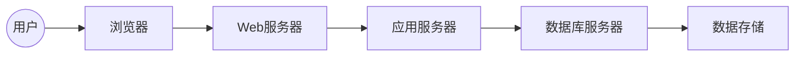
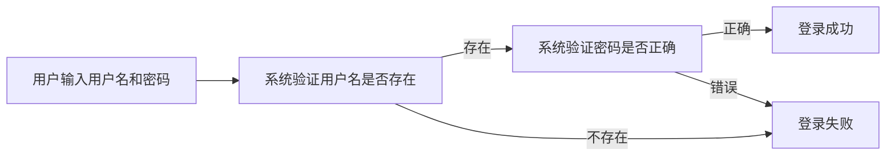
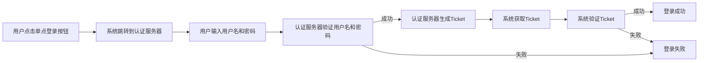
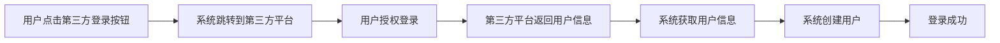
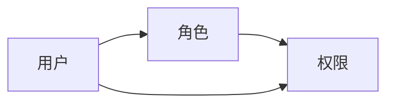
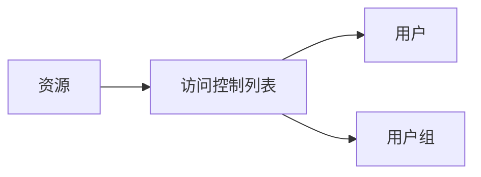
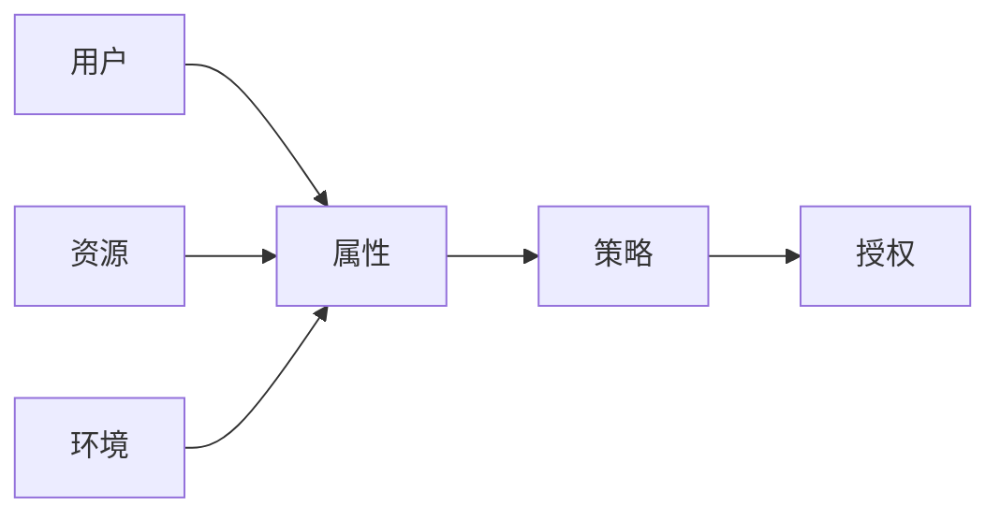
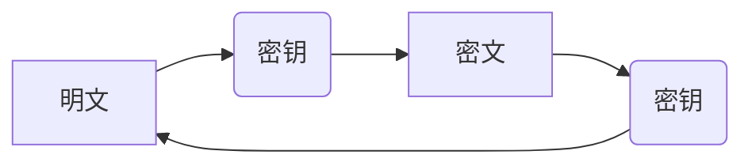
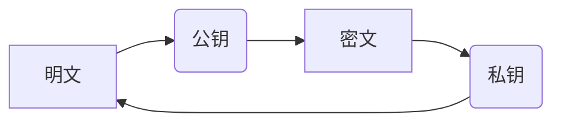

## 毕业设计管理系统设计与实现

作者：禅与计算机程序设计艺术

##  一、背景介绍

### 1.1 毕业设计管理现状与挑战

毕业设计是高等教育阶段的最后一个重要教学环节，是对学生四年学习成果的综合检验，也是学生迈向社会、走向工作岗位的重要桥梁。然而，传统的毕业设计管理模式存在诸多弊端，例如：

* **信息化程度低**:  许多高校仍然采用纸质文档和人工管理的方式，效率低下且容易出错。
* **缺乏透明度**: 学生难以实时了解毕业设计的进度和导师的反馈意见。
* **沟通效率低下**: 学生与导师之间的沟通主要依靠邮件和电话，缺乏便捷的交流平台。
* **资源共享困难**:  学生难以获取优质的毕业设计资源和案例参考。

### 1.2 毕业设计管理系统建设目标

为了解决上述问题，提高毕业设计管理水平和效率，越来越多的高校开始建设毕业设计管理系统。一个完善的毕业设计管理系统应该具备以下功能：

* **信息化管理**: 实现毕业设计全流程的在线管理，包括选题、开题、中期检查、论文提交、答辩等环节。
* **提高效率**: 简化流程，减少人工操作，提高工作效率。
* **增强透明度**:  让学生、导师和管理人员能够实时了解毕业设计的进度和相关信息。
* **促进交流**:  为学生和导师提供便捷的交流平台，方便双方沟通和交流。
* **资源共享**:  为学生提供丰富的毕业设计资源和案例参考。

## 二、核心概念与联系

### 2.1 系统用户角色

毕业设计管理系统主要涉及以下用户角色：

* **学生**: 参与毕业设计的学生，可以进行选题、提交开题报告、上传论文、查看导师评阅意见等操作。
* **导师**: 指导学生完成毕业设计的教师，可以发布课题、审核开题报告、评阅论文、提交指导意见等操作。
* **管理员**: 负责系统的维护和管理，包括用户管理、权限管理、数据统计等操作。

### 2.2 系统功能模块

毕业设计管理系统通常包括以下功能模块：

* **用户管理模块**:  负责管理系统用户，包括用户的注册、登录、信息修改、权限设置等。
* **课题管理模块**:  负责管理毕业设计课题，包括课题的发布、审核、修改、删除等。
* **选题管理模块**:  负责管理学生的选题，包括选题的申请、审核、调整等。
* **开题管理模块**:  负责管理学生的开题报告，包括开题报告的提交、审核、评阅等。
* **中期检查模块**:  负责管理学生的中期检查，包括中期检查报告的提交、审核、评阅等。
* **论文管理模块**:  负责管理学生的毕业论文，包括论文的提交、审核、评阅、查重等。
* **答辩管理模块**:  负责管理学生的毕业答辩，包括答辩安排、成绩评定等。
* **资源管理模块**:  负责管理毕业设计相关的资源，包括文献资料、案例参考、模板下载等。
* **系统管理模块**:  负责系统的设置和维护，包括系统参数设置、数据备份、日志管理等。

### 2.3  系统架构设计

毕业设计管理系统通常采用B/S架构，即浏览器/服务器架构。系统架构图如下所示：



* **用户**: 通过浏览器访问系统。
* **浏览器**: 向Web服务器发送请求。
* **Web服务器**: 接收请求，并将请求转发给应用服务器。
* **应用服务器**: 处理业务逻辑，并与数据库服务器进行交互。
* **数据库服务器**: 存储系统数据。

## 三、核心算法原理具体操作步骤

### 3.1 用户登录认证

用户登录认证是系统安全的重要保障，常见的用户登录认证方式包括：

* **用户名密码认证**: 用户输入用户名和密码进行登录，系统验证用户名和密码是否匹配。
* **单点登录**: 用户使用已有的账号登录系统，例如学校的统一身份认证系统。
* **第三方登录**: 用户使用第三方账号登录系统，例如微信、QQ等。

#### 3.1.1 用户名密码认证流程



#### 3.1.2  单点登录流程



#### 3.1.3 第三方登录流程



### 3.2  权限控制

权限控制是保证系统安全的重要手段，常见的权限控制模型包括：

* **RBAC**: 基于角色的访问控制，根据用户的角色分配不同的权限。
* **ACL**: 访问控制列表，为每个用户或用户组设置访问权限。
* **ABAC**: 基于属性的访问控制，根据用户的属性、资源的属性和环境信息进行动态授权。

#### 3.2.1  RBAC模型

RBAC模型将用户、角色和权限关联起来，用户通过扮演不同的角色获得不同的权限。



#### 3.2.2  ACL模型

ACL模型为每个资源设置一个访问控制列表，列表中记录了哪些用户或用户组可以访问该资源。



#### 3.2.3  ABAC模型

ABAC模型根据用户的属性、资源的属性和环境信息进行动态授权。



### 3.3 数据加密

数据加密是保护数据安全的重要手段，常见的加密算法包括：

* **对称加密**: 使用相同的密钥进行加密和解密。
* **非对称加密**: 使用不同的密钥进行加密和解密。

#### 3.3.1 对称加密

对称加密算法使用相同的密钥进行加密和解密，常见的对称加密算法包括DES、AES等。



#### 3.3.2 非对称加密

非对称加密算法使用不同的密钥进行加密和解密，常见的非对称加密算法包括RSA、ECC等。



## 四、数学模型和公式详细讲解举例说明

### 4.1  论文查重算法

论文查重是毕业设计管理系统的重要功能之一，常见的论文查重算法包括：

* **基于字符串匹配的算法**:  将论文文本转换为字符串，然后使用字符串匹配算法计算文本相似度。
* **基于语义分析的算法**:  对论文文本进行语义分析，提取文本的语义特征，然后计算文本相似度。

#### 4.1.1  基于字符串匹配的算法

##### (1)  编辑距离算法

编辑距离算法是指将一个字符串转换为另一个字符串所需的最小编辑操作次数。编辑操作包括插入、删除和替换字符。

**公式**:

```
D(i,j) = min {
    D(i-1, j) + 1,  // 删除操作
    D(i, j-1) + 1,  // 插入操作
    D(i-1, j-1) + cost,  // 替换操作
}
```

其中，D(i,j) 表示字符串 A 的前 i 个字符和字符串 B 的前 j 个字符的编辑距离，cost 表示替换操作的代价，如果 A[i] == B[j]，则 cost = 0，否则 cost = 1。

**示例**:

```
字符串 A:  kitten
字符串 B:  sitting

编辑距离:  3
```

##### (2)  最长公共子序列算法

最长公共子序列算法是指找到两个字符串中最长的公共子序列。

**公式**:

```
LCS(i,j) = 
    if (i == 0 || j == 0) {
        0
    } else if (A[i-1] == B[j-1]) {
        LCS(i-1, j-1) + 1
    } else {
        max(LCS(i-1, j), LCS(i, j-1))
    }
```

其中，LCS(i,j) 表示字符串 A 的前 i 个字符和字符串 B 的前 j 个字符的最长公共子序列长度。

**示例**:

```
字符串 A:  fish
字符串 B:  fosh

最长公共子序列:  fsh
```

#### 4.1.2 基于语义分析的算法

##### (1)  TF-IDF算法

TF-IDF算法是一种常用的文本向量化方法，它可以将文本转换为向量表示。

**公式**:

```
TF-IDF(t, d) = TF(t, d) * IDF(t)
```

其中，TF(t, d) 表示词语 t 在文档 d 中出现的频率，IDF(t) 表示词语 t 的逆文档频率。

**示例**:

```
文档:  The quick brown fox jumps over the lazy dog.

词语:  fox

TF(fox, d) = 1 / 9
IDF(fox) = log(1 / 1) = 0

TF-IDF(fox, d) = 0
```

##### (2)  余弦相似度

余弦相似度是一种常用的文本相似度计算方法，它可以计算两个文本向量之间的夹角余弦值。

**公式**:

```
similarity(A, B) = (A · B) / (||A|| * ||B||)
```

其中，A 和 B 表示两个文本向量，· 表示向量点积，||A|| 表示向量 A 的模。

**示例**:

```
向量 A:  [1, 0, 1]
向量 B:  [0, 1, 1]

similarity(A, B) = (1 * 0 + 0 * 1 + 1 * 1) / (sqrt(1^2 + 0^2 + 1^2) * sqrt(0^2 + 1^2 + 1^2)) = 0.707
```

### 4.2  毕业设计成绩评定模型

毕业设计成绩评定是毕业设计管理系统的核心功能之一，常见的毕业设计成绩评定模型包括：

* **百分制**:  将毕业设计成绩分为100分，根据各项指标的权重计算总成绩。
* **等级制**:  将毕业设计成绩分为优秀、良好、中等、及格和不及格五个等级。

#### 4.2.1  百分制

百分制评定模型通常将毕业设计成绩分为以下几个部分：

* **论文成绩**:  占总成绩的比例最高，通常为60%-70%。
* **答辩成绩**:  占总成绩的比例次之，通常为20%-30%。
* **平时成绩**:  占总成绩的比例较低，通常为10%-20%。

**公式**:

```
总成绩 = 论文成绩 * 论文权重 + 答辩成绩 * 答辩权重 + 平时成绩 * 平时权重
```

#### 4.2.2  等级制

等级制评定模型通常根据各项指标的得分情况，将毕业设计成绩划分为不同的等级。

**示例**:

| 等级 | 论文成绩 | 答辩成绩 | 平时成绩 |
|---|---|---|---|
| 优秀 | 90分以上 | 90分以上 | 90分以上 |
| 良好 | 80-89分 | 80-89分 | 80-89分 |
| 中等 | 70-79分 | 70-79分 | 70-79分 |
| 及格 | 60-69分 | 60-69分 | 60-69分 |
| 不及格 | 60分以下 | 60分以下 | 60分以下 |


## 五、项目实践：代码实例和详细解释说明

### 5.1  技术选型

本项目采用以下技术栈进行开发：

* **后端**:  Spring Boot
* **数据库**:  MySQL
* **前端**:  Vue.js

### 5.2  代码实例

#### 5.2.1  用户登录接口

```java
@RestController
@RequestMapping("/api/user")
public class UserController {

    @Autowired
    private UserService userService;

    @PostMapping("/login")
    public Result login(@RequestBody UserLoginRequest request) {
        // 校验用户名和密码
        User user = userService.findByUsername(request.getUsername());
        if (user == null || !user.getPassword().equals(request.getPassword())) {
            return Result.fail("用户名或密码错误");
        }

        // 生成token
        String token = JwtUtil.createToken(user.getId());

        // 返回token
        return Result.success(token);
    }
}
```

#### 5.2.2  论文提交接口

```java
@RestController
@RequestMapping("/api/paper")
public class PaperController {

    @Autowired
    private PaperService paperService;

    @PostMapping("/submit")
    public Result submit(@RequestParam("file") MultipartFile file,
                         @RequestParam("studentId") Long studentId) {
        // 校验文件格式和大小
        // ...

        // 保存文件
        // ...

        // 创建论文记录
        Paper paper = new Paper();
        paper.setStudentId(studentId);
        paper.setFilePath(filePath);
        paperService.save(paper);

        return Result.success();
    }
}
```

## 六、实际应用场景

毕业设计管理系统可以应用于各种类型的高校，包括：

* **综合性大学**:  管理全校学生的毕业设计。
* **理工科大学**:  管理理工科学生的毕业设计。
* **文科大学**:  管理文科学生的毕业设计。

## 七、工具和资源推荐

### 7.1  开发工具

* **IntelliJ IDEA**:  一款功能强大的Java IDE。
* **Visual Studio Code**:  一款轻量级的代码编辑器。
* **Navicat**:  一款数据库管理工具。

### 7.2  学习资源

* **Spring Boot官方文档**:  https://spring.io/projects/spring-boot
* **Vue.js官方文档**:  https://vuejs.org/
* **MySQL官方文档**:  https://dev.mysql.com/doc/

## 八、总结：未来发展趋势与挑战

### 8.1  未来发展趋势

* **智能化**:  利用人工智能技术，实现毕业设计选题推荐、论文查重、成绩评定等功能的智能化。
* **个性化**:  根据学生的兴趣爱好、专业方向等信息，提供个性化的毕业设计指导和服务。
* **移动化**:  开发移动端应用程序，方便学生和导师随时随地进行毕业设计相关的操作。

### 8.2  挑战

* **数据安全**:  如何保证系统数据的安全性和可靠性。
* **系统性能**:  如何提高系统的性能和稳定性，应对大规模用户访问。
* **用户体验**:  如何提升系统的用户体验，让用户操作更加便捷高效。

## 九、附录：常见问题与解答

### 9.1  如何注册账号？

学生和导师需要联系管理员进行账号注册。

### 9.2  忘记密码怎么办？

可以通过系统提供的“忘记密码”功能进行密码重置。

### 9.3  如何联系管理员？

可以通过系统提供的联系方式联系管理员。
