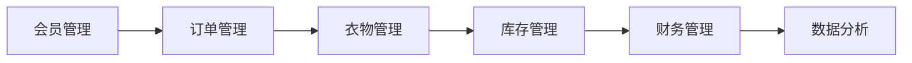

## 1. 背景介绍

### 1.1 洗衣行业现状与挑战

随着人们生活水平的提高和生活节奏的加快，洗衣服务的需求日益增长。传统的洗衣店管理模式存在着效率低下、信息不透明、服务质量参差不齐等问题，难以满足现代消费者的需求。

### 1.2 洗衣店管理系统的必要性

为了解决上述问题，提高洗衣店的运营效率和服务质量，洗衣店管理系统应运而生。该系统通过信息化手段，实现洗衣流程的自动化管理、客户关系的精细化运营、数据分析与决策支持等功能，为洗衣店带来诸多益处：

* **提高效率**: 自动化洗衣流程，减少人工操作，提高工作效率。
* **提升客户满意度**: 提供便捷的洗衣服务，实时跟踪洗衣进度，提高客户体验。
* **优化资源配置**: 精准掌握库存情况，合理安排人员排班，优化资源配置。
* **数据驱动决策**: 收集运营数据，进行分析和预测，为经营决策提供数据支持。

## 2. 核心概念与联系

### 2.1 系统用户角色

洗衣店管理系统涉及多种用户角色，包括：

* **店长**: 负责店铺的整体运营管理，包括员工管理、财务管理、数据分析等。
* **收银员**: 负责接收衣物、登记信息、收取费用、打印小票等。
* **洗衣工**: 负责衣物的洗涤、烘干、熨烫、打包等操作。
* **客户**: 通过系统下单、查询订单状态、评价服务等。

### 2.2 系统功能模块

洗衣店管理系统主要包括以下功能模块：

* **会员管理**:  管理会员信息，记录会员消费记录，提供会员专属服务。
* **衣物管理**:  登记衣物信息，分类管理不同类型的衣物，记录洗涤流程和状态。
* **订单管理**:  记录客户订单信息，跟踪订单状态，管理订单结算。
* **库存管理**:  管理洗涤用品库存，实时监控库存状态，提醒及时补充库存。
* **财务管理**:  记录收入和支出，生成财务报表，分析经营状况。
* **数据分析**:  收集运营数据，进行统计分析，生成报表，为经营决策提供数据支持。

### 2.3 核心概念联系

各个功能模块之间相互联系，共同构成完整的洗衣店管理系统。



## 3. 核心算法原理具体操作步骤

### 3.1 订单处理流程

1. **客户下单**: 客户通过系统或线下方式下单，选择洗衣服务类型、衣物数量、取衣时间等信息。
2. **生成订单**: 系统自动生成订单，分配唯一订单号，记录客户信息和订单详情。
3. **衣物分类**: 收银员根据衣物类型进行分类，并贴上相应的标签。
4. **洗涤操作**: 洗衣工根据衣物标签进行洗涤、烘干、熨烫等操作。
5. **订单完成**: 衣物洗涤完成后，系统自动更新订单状态为“已完成”。
6. **客户取衣**: 客户凭订单号或手机号码取衣。

### 3.2 库存管理算法

1. **设置安全库存**:  根据历史数据和经验，设置每种洗涤用品的安全库存量。
2. **实时监控库存**:  系统实时监控洗涤用品的库存数量，当库存量低于安全库存时，发出预警提醒。
3. **自动生成采购计划**:  根据库存情况和预警信息，系统自动生成采购计划，提醒店长及时补充库存。

## 4. 数学模型和公式详细讲解举例说明

### 4.1 营业额计算模型

```
营业额 = 订单数量 * 平均订单金额
```

**举例说明**: 某洗衣店一天完成了 100 个订单，平均每个订单的金额为 50 元，则该洗衣店当天的营业额为 100 * 50 = 5000 元。

### 4.2 库存周转率计算模型

```
库存周转率 =  (期初库存 + 期末库存) / 2 / 销售成本
```

**举例说明**: 某洗衣店某月期初库存为 1000 元，期末库存为 800 元，销售成本为 5000 元，则该洗衣店该月的库存周转率为 (1000 + 800) / 2 / 5000 = 0.18。

## 5. 项目实践：代码实例和详细解释说明

### 5.1 技术选型

* **后端**: Python + Django
* **前端**: Vue.js
* **数据库**: MySQL

### 5.2 代码实例

**订单模型**:

```python
from django.db import models

class Order(models.Model):
    order_no = models.CharField(max_length=20, unique=True)
    customer = models.ForeignKey('Customer', on_delete=models.CASCADE)
    clothes = models.ManyToManyField('Clothes')
    status = models.CharField(max_length=10, choices=STATUS_CHOICES, default='NEW')
    created_at = models.DateTimeField(auto_now_add=True)
    updated_at = models.DateTimeField(auto_now=True)

    STATUS_CHOICES = (
        ('NEW', '新订单'),
        ('PROCESSING', '处理中'),
        ('COMPLETED', '已完成'),
        ('CANCELED', '已取消'),
    )
```

**订单处理接口**:

```python
from rest_framework import viewsets
from .serializers import OrderSerializer

class OrderViewSet(viewsets.ModelViewSet):
    queryset = Order.objects.all()
    serializer_class = OrderSerializer

    def create(self, request, *args, **kwargs):
        # 生成订单号
        order_no = generate_order_no()
        # 创建订单
        order = Order.objects.create(order_no=order_no, customer=request.user, **request.data)
        # 返回订单信息
        serializer = self.get_serializer(order)
        return Response(serializer.data, status=status.HTTP_201_CREATED)
```

### 5.3 代码解释

* **订单模型**: 定义了订单的基本信息，包括订单号、客户、衣物、状态、创建时间、更新时间等。
* **订单处理接口**: 实现了创建订单的功能，包括生成订单号、创建订单记录、返回订单信息等。

## 6. 实际应用场景

### 6.1 小型洗衣店

小型洗衣店可以采用简化的洗衣店管理系统，主要实现订单管理、会员管理、收银结算等功能，以提高工作效率和客户满意度。

### 6.2 大型洗衣连锁店

大型洗衣连锁店需要更加完善的洗衣店管理系统，实现多门店管理、中央库存管理、数据分析与决策支持等功能，以提升整体运营效率和品牌形象。

## 7. 总结：未来发展趋势与挑战

### 7.1 未来发展趋势

* **智能化**:  利用人工智能技术，实现自动化洗涤、智能调度、个性化推荐等功能。
* **移动化**:  开发移动端应用程序，方便客户在线下单、查询订单状态、支付费用等。
* **数据化**:  收集和分析运营数据，为经营决策提供数据支持，实现精细化运营。

### 7.2 面临的挑战

* **数据安全**:  保护客户隐私和数据安全，防止数据泄露和滥用。
* **系统稳定性**:  保证系统的稳定性和可靠性，避免系统故障和数据丢失。
* **成本控制**:  控制系统开发和维护成本，提高系统的性价比。

## 8. 附录：常见问题与解答

### 8.1 如何选择合适的洗衣店管理系统？

选择洗衣店管理系统需要考虑以下因素：

* **功能**:  系统功能是否满足洗衣店的实际需求。
* **易用性**:  系统操作是否简单易懂，方便员工使用。
* **稳定性**:  系统是否稳定可靠，能够保证数据安全。
* **成本**:  系统价格是否合理，是否能够带来足够的收益。

### 8.2 如何保障洗衣店管理系统的数据安全？

保障洗衣店管理系统的数据安全可以采取以下措施：

* **数据加密**:  对敏感数据进行加密存储，防止数据泄露。
* **访问控制**:  设置用户权限，限制用户对数据的访问权限。
* **安全审计**:  定期进行安全审计，及时发现和修复安全漏洞。
* **数据备份**:  定期备份数据，防止数据丢失。
