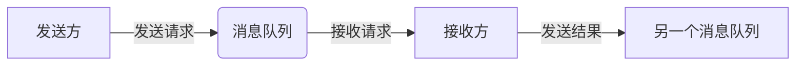
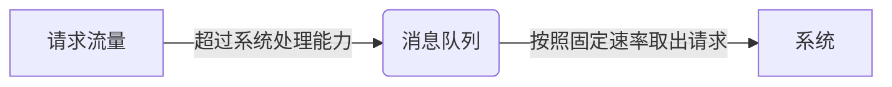

# 消息队列如何实现请求异步化和削峰填谷?

作者：禅与计算机程序设计艺术

## 1. 背景介绍

### 1.1 什么是消息队列？

消息队列（Message Queue，MQ）是一种应用程序对应用程序的通信方法。应用程序通过读写出入队列的消息（针对应用程序的数据）来通信，而无需专用连接来链接它们。消息传递指的是程序之间通过在消息队列中发送数据进行通信，而不是通过直接调用彼此来通信，队列的使用除去了接收和发送应用程序同时执行的要求。

### 1.2 为什么需要消息队列？

在现代软件架构中，分布式系统和微服务架构越来越流行，应用程序之间的交互变得越来越复杂。传统的同步调用方式已经无法满足高并发、高可用、高性能的要求。消息队列作为一种异步通信机制，可以有效地解决这些问题。

### 1.3 消息队列的优势

* **异步通信:** 发送方无需等待接收方处理完消息，即可继续发送下一个消息，提高了系统吞吐量。
* **解耦合:** 发送方和接收方无需知道彼此的存在，只需要关注消息本身，降低了系统耦合性。
* **削峰填谷:**  将突发流量缓存到队列中，避免系统过载，提高系统稳定性。
* **可靠性:** 消息队列可以保证消息的可靠传递，即使接收方不可用，消息也不会丢失。

## 2. 核心概念与联系

### 2.1 消息生产者（Producer）

消息生产者负责创建消息并将其发送到消息队列中。

### 2.2 消息队列（Queue）

消息队列是存储消息的容器，负责接收来自生产者的消息，并将其转发给消费者。

### 2.3 消息消费者（Consumer）

消息消费者负责从消息队列中接收消息并进行处理。

### 2.4 消息（Message）

消息是应用程序之间传递的数据单元，可以是任何格式的数据，例如文本、JSON、XML等。

### 2.5 联系

消息生产者将消息发送到消息队列，消息队列存储消息并将消息转发给消息消费者，消息消费者接收消息并进行处理。

## 3. 核心算法原理具体操作步骤

### 3.1 请求异步化

请求异步化是指将同步请求转换为异步请求，发送方无需等待接收方处理完请求，即可继续执行其他操作。

**操作步骤：**

1. 发送方将请求发送到消息队列。
2. 发送方立即返回，无需等待接收方处理完请求。
3. 接收方从消息队列中接收请求并进行处理。
4. 接收方将处理结果发送到另一个消息队列或通过其他方式通知发送方。

**流程图：**



### 3.2 削峰填谷

削峰填谷是指利用消息队列的缓存机制，将突发流量缓存到队列中，然后逐步处理，避免系统过载。

**操作步骤：**

1. 将系统处理能力设置为一个固定值。
2. 当请求流量超过系统处理能力时，将请求缓存到消息队列中。
3. 系统按照固定速率从消息队列中取出请求进行处理。

**流程图：**



## 4. 数学模型和公式详细讲解举例说明

### 4.1 Little's Law

Little's Law 是排队论中的一个重要定理，用于描述队列长度、到达率和平均等待时间之间的关系。

**公式：**

```
L = λW
```

其中：

* L 表示队列的平均长度
* λ 表示请求的平均到达率
* W 表示请求在队列中的平均等待时间

**举例说明：**

假设一个系统的平均处理能力为 100 个请求/秒，当前请求的平均到达率为 150 个请求/秒，那么根据 Little's Law 可以计算出请求在队列中的平均等待时间为：

```
W = L / λ = (150 - 100) / 150 = 0.33 秒
```

### 4.2 实际应用

在实际应用中，可以使用 Little's Law 来估算消息队列的长度，以及调整系统处理能力和消息队列长度，以满足性能需求。

## 5. 项目实践：代码实例和详细解释说明

### 5.1 使用 RabbitMQ 实现请求异步化

**代码实例：**

```python
import pika

# 连接到 RabbitMQ 服务器
connection = pika.BlockingConnection(pika.ConnectionParameters('localhost'))
channel = connection.channel()

# 声明队列
channel.queue_declare(queue='hello')

# 发送消息
channel.basic_publish(exchange='', routing_key='hello', body='Hello World!')
print(" [x] Sent 'Hello World!'")

# 关闭连接
connection.close()
```

**代码解释：**

* 首先，使用 `pika.BlockingConnection()` 连接到 RabbitMQ 服务器。
* 然后，使用 `channel.queue_declare()` 声明一个名为 `hello` 的队列。
* 接着，使用 `channel.basic_publish()` 发送消息到队列。
* 最后，使用 `connection.close()` 关闭连接。

### 5.2 使用 Kafka 实现削峰填谷

**代码实例：**

```java
import org.apache.kafka.clients.producer.*;

import java.util.Properties;

public class KafkaProducerExample {

    public static void main(String[] args) {
        // 设置 Kafka 生产者配置
        Properties props = new Properties();
        props.put("bootstrap.servers", "localhost:9092");
        props.put("acks", "all");
        props.