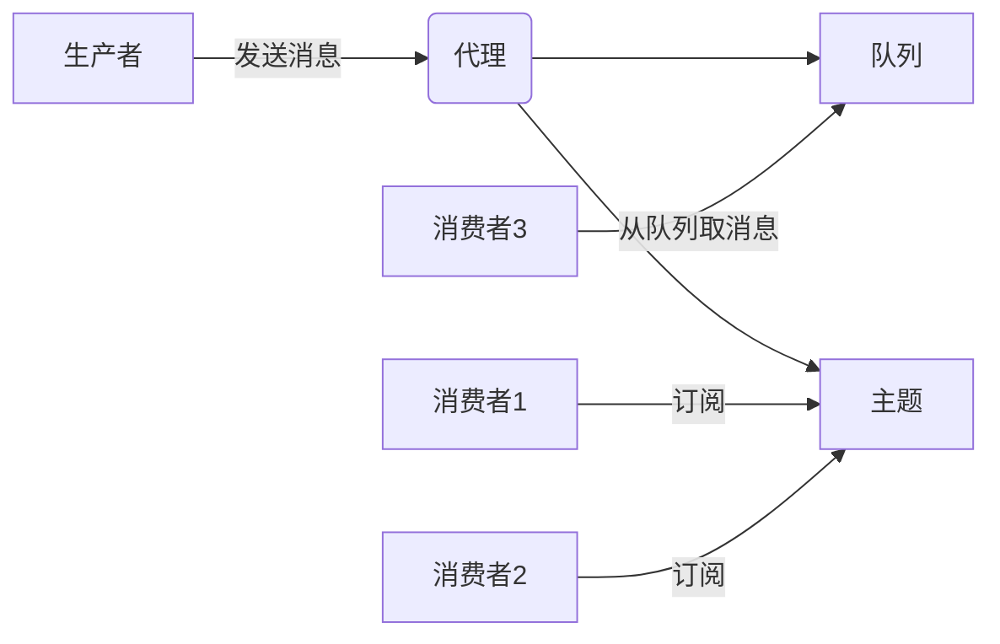

# 消息队列性能优化的十八般武艺

## 1.背景介绍

### 1.1 什么是消息队列

消息队列(Message Queue)是一种在应用程序之间传递数据的中间件技术。它可以解耦生产者和消费者,通过异步通信的方式来提高系统的可靠性、扩展性和可维护性。消息队列在分布式系统中扮演着关键角色,用于解决应用程序间的通信、系统集成、异步处理和负载均衡等问题。

### 1.2 消息队列的优势

- **解耦**:生产者和消费者之间完全解耦,互不影响,可以独立扩展和维护。
- **异步通信**:生产者只需将消息放入队列,不需要等待消费者处理完成即可返回,提高了系统的响应性能。
- **峰值处理能力**:可以利用队列来缓存短期的峰值流量,防止任何消息丢失,增强系统可用性。
- **可恢复性**:系统的一部分组件失效时,不会影响整个系统的运行,可以利用消息队列来暂存消息,等恢复后重新处理。

### 1.3 消息队列的应用场景

- **异步处理**:将耗时的操作通过消息队列进行异步处理,提高系统吞吐量和响应速度。
- **应用程序解耦**:不同的模块或应用程序通过消息队列进行集成,降低了应用之间的耦合度。
- **流量削峰**:可以利用队列来缓存大量的请求,避免短时间内的流量高峰直接把服务器压垮。
- **日志处理**:通过消息队列来记录关键操作日志,便于审计和监控。
- **事件驱动架构**:消息队列可以作为事件驱动架构的基础设施,支持事件的发布和订阅。

## 2.核心概念与联系

### 2.1 消息队列的核心概念

- **生产者(Producer)**:负责生成消息并将消息发送到消息队列中。
- **消费者(Consumer)**:从消息队列中取出并处理消息。
- **代理(Broker)**:存储和管理消息队列,负责消息的路由和转发。
- **队列(Queue)**:用于存储消息的队列,遵循先进先出(FIFO)原则。
- **主题(Topic)**:用于发布订阅模式,消息会被广播到所有订阅者。



### 2.2 消息队列的工作流程

1. 生产者创建消息并将其发送到代理。
2. 代理将消息存储在队列或主题中。
3. 消费者从队列或主题中订阅并取出消息。
4. 消费者处理消息并执行相应的业务逻辑。
5. 消费者向代理发送确认消息,代理将相应的消息从队列或主题中删除。

### 2.3 消息队列的模式

**点对点模式(Queue)**:一个消息只能被一个消费者消费,适用于每个任务在系统中只需要执行一次的场景。

**发布/订阅模式(Topic)**:一个消息可以被多个消费者订阅和消费,适用于消息需要被多个订阅者处理的场景。

## 3.核心算法原理具体操作步骤

消息队列的核心算法主要包括以下几个方面:

### 3.1 消息持久化

消息队列需要将消息持久化到磁盘或其他持久存储介质中,以防止消息在代理重启或出现故障时丢失。常见的持久化方式包括:

1. **文件持久化**:将消息序列化后写入文件系统。
2. **数据库持久化**:将消息存储在关系数据库或NoSQL数据库中。
3. **缓存持久化**:利用分布式缓存(如Redis)来存储消息。

无论采用何种持久化方式,都需要考虑以下几个关键点:

- **消息索引**:为了快速定位消息在文件或数据库中的位置,需要维护一个索引结构,如哈希表、B+树等。
- **批量操作**:为了提高写入性能,通常会采用批量写入的方式,将多条消息合并成一个较大的块进行持久化操作。
- **文件滚动**:当消息文件达到一定大小时,需要滚动创建新的文件,并对旧文件进行归档或删除。
- **同步策略**:是否采用同步或异步的方式将消息持久化,需要权衡性能和可靠性。

### 3.2 消息路由

消息队列需要将消息准确地路由到正确的队列或主题中,以确保消息可以被相应的消费者消费。常见的路由策略包括:

1. **队列路由**:根据消息的目标队列名称将消息路由到对应的队列中。
2. **主题路由**:根据消息的主题名称将消息路由到对应的主题中。
3. **内容路由**:根据消息内容中的某些属性(如消息头或消息体中的特定字段)进行路由。
4. **通配符路由**:支持使用通配符(如 `*` 或 `#`)来匹配多个队列或主题。

消息路由通常采用高效的数据结构(如哈希表、前缀树等)来存储路由规则,并进行快速匹配。同时,还需要考虑路由规则的动态更新、持久化和复制等问题。

### 3.3 消息分发

消息队列需要将消息从队列或主题中分发给相应的消费者。常见的分发策略包括:

1. **轮询分发**:按照消费者的顺序依次将消息分发给每个消费者。
2. **公平分发**:根据消费者的处理能力动态调整分发策略,确保消息能够均匀地分发给所有消费者。
3. **优先级分发**:根据消息的优先级高低进行分发,优先处理高优先级的消息。
4. **负载均衡分发**:根据消费者的负载情况进行分发,将消息分发给负载较低的消费者。

消息分发需要考虑消费者的在线状态、消费能力、消费速率等因素,以确保消息能够被及时消费,并避免消息堆积或丢失。同时,还需要处理消费者故障、重新连接等异常情况。

### 3.4 事务和确认机制

为了保证消息的可靠传递,消息队列需要提供事务和确认机制:

1. **事务机制**:生产者可以将多条消息作为一个事务进行发送,只有当所有消息都成功发送后,事务才能提交。如果事务失败,则回滚所有消息。
2. **确认机制**:消费者在成功处理完消息后,需要向代理发送确认消息,代理收到确认后才将相应的消息从队列或主题中删除。如果代理在一定时间内没有收到确认,则将消息重新分发给其他消费者。

事务和确认机制需要考虑以下几个关键点:

- **原子性**:事务中的所有操作要么全部成功,要么全部失败。
- **持久性**:事务的中间状态需要持久化,以防止代理崩溃导致事务状态丢失。
- **幂等性**:消费者需要保证同一条消息被重复消费时,结果与只消费一次相同。
- **超时和重试**:需要设置合理的超时时间,并进行重试机制以提高可靠性。

## 4.数学模型和公式详细讲解举例说明

在消息队列的性能优化过程中,通常需要建立数学模型来分析和优化系统的吞吐量、延迟、资源利用率等指标。下面是一些常见的数学模型和公式:

### 4.1 小顶堆模型

小顶堆模型可以用来模拟消费者的消费行为,优化消息的分发策略。假设有 $n$ 个消费者,每个消费者 $i$ 的消费速率为 $r_i$,我们可以构建一个小顶堆 $H$,其中每个节点的值为对应消费者的剩余任务数。

当有新消息到达时,我们将其分发给堆顶(即剩余任务数最少)的消费者。当消费者 $i$ 完成一个任务后,我们将 $H[i]$ 减 1,并执行堆的上浮操作来维护堆的性质。

通过这种方式,我们可以实现最优的负载均衡,确保每个消费者的剩余任务数尽可能接近,从而提高整体吞吐量。

### 4.2 M/M/1 队列模型

M/M/1 队列模型是一种描述单服务器队列系统的数学模型,可以用来分析消息队列的延迟和吞吐量。假设消息到达服务器(代理)的过程服从参数为 $\lambda$ 的泊松分布,服务时间服从参数为 $\mu$ 的指数分布,则:

- 系统吞吐量为 $\lambda$
- 平均排队长度为 $\frac{\rho}{1-\rho}$,其中 $\rho=\frac{\lambda}{\mu}$ 为服务器的利用率
- 平均响应时间为 $\frac{1}{\mu-\lambda}$

通过调整 $\lambda$ 和 $\mu$ 的值,我们可以分析消息队列在不同负载下的性能表现,并进行相应的优化,如增加服务器数量、提高消息处理速度等。

### 4.3 网络拥塞控制模型

在分布式消息队列系统中,网络拥塞是一个常见的性能瓶颈。我们可以使用网络拥塞控制模型来优化网络资源的利用率和消息的传输延迟。

令 $W(t)$ 表示时刻 $t$ 的网络拥塞窗口大小(即可以发送的最大字节数),$N(t)$ 表示时刻 $t$ 的未确认字节数,$R(t)$ 表示时刻 $t$ 的往返时延,则拥塞窗口的更新公式为:

$$W(t+1)=W(t)+\frac{1}{W(t)}\cdot\frac{N(t)}{R(t)}$$

通过动态调整拥塞窗口的大小,我们可以控制网络流量,避免过度拥塞导致的消息丢失和延迟增加。同时,还需要考虑慢启动、快重传、快恢复等机制,以提高网络传输的效率和可靠性。

## 4.项目实践:代码实例和详细解释说明

为了更好地理解消息队列的原理和优化策略,我们来看一个基于 RabbitMQ 的实践案例。RabbitMQ 是一个流行的开源消息队列系统,支持多种消息传递协议,如 AMQP、MQTT、STOMP 等。

### 4.1 基本消息发送和接收

```python
import pika

# 连接到 RabbitMQ 服务器
connection = pika.BlockingConnection(pika.ConnectionParameters('localhost'))
channel = connection.channel()

# 声明一个队列
channel.queue_declare(queue='hello')

# 发送消息
channel.basic_publish(exchange='',
                      routing_key='hello',
                      body='Hello World!')
print(" [x] Sent 'Hello World!'")

# 关闭连接
connection.close()
```

```python
import pika

# 连接到 RabbitMQ 服务器
connection = pika.BlockingConnection(pika.ConnectionParameters('localhost'))
channel = connection.channel()

# 声明一个队列
channel.queue_declare(queue='hello')

# 定义消费者回调函数
def callback(ch, method, properties, body):
    print(" [x] Received %r" % body)

# 设置消费者
channel.basic_consume(queue='hello',
                      auto_ack=True,
                      on_message_callback=callback)

print(' [*] Waiting for messages. To exit press CTRL+C')
# 开始消费消息
channel.start_consuming()
```

在上面的示例中,我们首先创建了一个名为 `hello` 的队列,然后发送了一条 `Hello World!` 的消息到该队列中。接下来,我们定义了一个消费者,它会从 `hello` 队列中取出消息并打印出来。

### 4.2 发布/订阅模式

RabbitMQ 支持发布/订阅模式,即一条消息可以被多个消费者订阅和消费。下面是一个示例:

```python
import pika

#