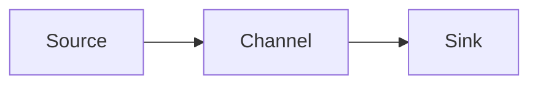

# 深入Flume架构：探秘数据流动引擎

作者：禅与计算机程序设计艺术

## 1. 背景介绍

### 1.1 大数据时代的数据流挑战

随着互联网、物联网以及移动设备的普及，全球数据量呈爆炸式增长。海量数据的产生对数据的采集、存储、处理和分析提出了严峻挑战。如何在海量数据中及时获取有价值的信息，成为企业和组织面临的重要课题。

传统的数据库系统难以应对海量数据的实时处理需求，数据仓库技术又无法满足数据实时性的要求。为了解决这些问题，分布式流处理平台应运而生。这些平台能够实时采集、处理和分析海量数据流，为企业提供实时决策支持。

### 1.2 Flume：灵活高效的数据采集引擎

Apache Flume是一个分布式、可靠且可用的系统，用于高效地收集、聚合和移动大量日志数据。它具有基于流的简单灵活的架构，并提供各种内置源、通道和接收器组件，用于处理各种用例。

Flume最初由Cloudera开发，现在是Apache Software Foundation的一个顶级项目。它被广泛应用于各种场景，例如：

* 收集和聚合来自各种来源的日志数据，包括Web服务器、应用程序服务器和数据库。
* 将数据流式传输到 Hadoop 生态系统中的其他组件，例如 HDFS、HBase 和 Hive。
* 实时监控和分析数据流，以便及时检测和响应异常情况。

## 2. 核心概念与联系

### 2.1 Flume 核心组件

Flume的核心是其基于代理的架构。每个 Flume 代理都是一个独立的 JVM 进程，负责收集、聚合和移动数据。代理由三个主要组件组成：

* **Source（源）：**源是数据的入口点。它从外部源（例如 Web 服务器、应用程序服务器和消息队列）接收数据，并将数据转换为 Flume 事件。
* **Channel（通道）：**通道是源和接收器之间的缓冲区。它存储从源接收到的事件，直到它们被传递到接收器。
* **Sink（接收器）：**接收器是数据的出口点。它从通道接收事件，并将事件写入外部目标（例如 HDFS、HBase 和 Kafka）。

### 2.2 Flume 事件流

数据在 Flume 中以事件的形式流动。事件是 Flume 中数据传输的基本单元，它由一个字节数组和一组可选的 headers 组成。headers 是键值对，用于存储有关事件的元数据，例如事件的时间戳、事件来源和事件类型。

### 2.3 Flume Agent 内部数据流

下图展示了 Flume Agent 内部数据流的流程：



1. **Source 从外部源接收数据**，并将数据转换为 Flume 事件。
2. **Source 将事件发送到 Channel。**
3. **Channel 存储事件**，直到它们被传递到 Sink。
4. **Sink 从 Channel 接收事件**，并将事件写入外部目标。

### 2.4 Flume 核心组件关系图

```mermaid
graph LR
    subgraph "Flume Agent"
        Source --> Channel --> Sink
    end
    Source --> "外部数据源"
    Sink --> "外部目标"
```

## 3. 核心算法原理具体操作步骤

### 3.1 Source 数据采集

Flume 提供了各种内置的 Source，用于从各种数据源中采集数据。例如：

* **Avro Source：**从 Avro 客户端接收 Avro 事件。
* **Exec Source：**执行一个 Unix 命令并消费其标准输出。
* **Kafka Source：**从 Kafka 主题消费消息。
* **Spooling Directory Source：**监控指定目录中的新文件，并将文件内容作为事件读取。
* **Syslog Source：**接收 syslog 事件。

每个 Source 都实现了特定的数据采集逻辑。例如，Spooling Directory Source 会定期扫描指定目录，并将新文件的内容读取为 Flume 事件。

### 3.2 Channel 数据缓冲

Channel 负责在 Source 和 Sink 之间缓冲数据。Flume 提供了两种类型的 Channel：

* **Memory Channel：**将事件存储在内存中。它提供了最佳的性能，但如果 Flume 代理崩溃，则数据将会丢失。
* **File Channel：**将事件存储在磁盘上。它比 Memory Channel 慢，但提供了持久性，即使 Flume 代理崩溃，数据也不会丢失。

### 3.3 Sink 数据输出

Sink 负责将数据写入外部目标。Flume 提供了各种内置的 Sink，例如：

* **HDFS Sink：**将事件写入 HDFS 文件。
* **HBase Sink：**将事件写入 HBase 表格。
* **Kafka Sink：**将事件发布到 Kafka 主题。
* **Logger Sink：**将事件写入 Flume 日志文件。

每个 Sink 都实现了特定的数据输出逻辑。例如，HDFS Sink 会将事件写入 HDFS 文件，并根据配置的策略滚动文件。

### 3.4 Flume 事务机制

Flume 使用事务机制来确保数据可靠性。每个 Source 和 Sink 都在一个事务的上下文中运行。如果事务成功完成，则数据将被提交到下一个组件；如果事务失败，则数据将被回滚。

## 4. 数学模型和公式详细讲解举例说明

Flume 没有涉及复杂的数学模型和公式。

## 5. 项目实践：代码实例和详细解释说明

### 5.1 配置文件示例

以下是一个简单的 Flume 配置文件示例，演示了如何从控制台读取数据，并将数据写入 HDFS 文件：

```conf
# 定义一个名为 agent1 的代理
agent1.sources = console
agent1.sinks = hdfs
agent1.channels = memory

# 配置 console 源
agent1.sources.console.type = exec
agent1.sources.console.command = cat

# 配置 hdfs 接收器
agent1.sinks.hdfs.type = hdfs
agent1.sinks.hdfs.hdfs.path = /flume/events
agent1.sinks.hdfs.hdfs.fileType = DataStream

# 配置 memory 通道
agent1.channels.memory.type = memory
agent1.channels.memory.capacity = 10000

# 将源、接收器和通道绑定在一起
agent1.sources.console.channel = memory
agent1.sinks.hdfs.channel = memory
```

### 5.2 代码实例

以下是一个简单的 Java 代码示例，演示了如何使用 Flume Java API 创建一个简单的 Flume 应用程序：

```java
import org.apache.flume.Channel;
import org.apache.flume.Event;
import org.apache.flume.EventDeliveryException;
import org.apache.flume.agent.embedded.EmbeddedAgent;
import org.apache.flume.channel.MemoryChannel;
import org.apache.flume.conf.Configurables;
import org.apache.flume.event.EventBuilder;
import org.apache.flume.source.AvroSource;

import java.util.HashMap;
import java.util.Map;

public class FlumeExample {

    public static void main(String[] args) throws EventDeliveryException {
        // 创建一个内存通道
        Channel channel = new MemoryChannel();
        Configurables.configure(channel, new Context());

        // 创建一个 Avro 源
        AvroSource source = new AvroSource();
        Map<String, String> sourceProps = new HashMap<>();
        sourceProps.put("bind", "0.0.0.0");
        sourceProps.put("port", "41414");
        Configurables.configure(source, new Context(sourceProps));

        // 创建一个嵌入式代理
        EmbeddedAgent agent = new EmbeddedAgent("agent1");
        agent.configure(new Context());
        agent.putChannel("channel1", channel);
        agent.putSource("source1", source);

        // 启动代理
        agent.start();

        // 发送一些事件
        for (int i = 0; i < 10; i++) {
            Event event = EventBuilder.withBody(("Event " + i).getBytes());
            channel.put(event);
        }

        // 停止代理
        agent.stop();
    }
}
```

## 6. 实际应用场景

### 6.1 日志收集与分析

Flume 可以用于收集和聚合来自各种来源的日志数据，例如 Web 服务器、应用程序服务器和数据库。收集到的日志数据可以存储在 HDFS 中，并使用 Hadoop 生态系统中的其他工具进行分析，例如 Hive 和 Pig。

### 6.2 实时监控与告警

Flume 可以用于实时监控数据流，并根据预定义的规则生成告警。例如，可以使用 Flume 监控 Web 服务器日志，并在检测到异常流量模式时生成告警。

### 6.3 数据仓库 ETL

Flume 可以作为数据仓库 ETL 流程的一部分，用于将数据从源系统实时传输到数据仓库。例如，可以使用 Flume 将数据库事务日志实时传输到 HDFS，以便在数据仓库中进行分析。

## 7. 工具和资源推荐

### 7.1 Apache Flume 官方网站

* https://flume.apache.org/

### 7.2 Flume 用户邮件列表

* user@flume.apache.org

### 7.3 Flume 书籍

* Flume in Action by Hari Shreedharan and Alex Holmes

## 8. 总结：未来发展趋势与挑战

### 8.1 未来发展趋势

* **云原生支持：**随着云计算的普及，Flume 需要更好地支持云原生环境，例如 Kubernetes 和 Docker。
* **流处理集成：**Flume 可以与流处理引擎（例如 Apache Flink 和 Apache Kafka）更紧密地集成，以提供更强大的实时数据处理能力。
* **机器学习支持：**Flume 可以集成机器学习算法，以实现更智能的数据采集和分析。

### 8.2 面临挑战

* **性能和可扩展性：**随着数据量的不断增长，Flume 需要不断提高其性能和可扩展性。
* **安全性：**Flume 需要提供强大的安全功能，以保护敏感数据。
* **易用性：**Flume 的配置和管理可能很复杂，需要简化其易用性。

## 9. 附录：常见问题与解答

### 9.1 如何监控 Flume 代理的运行状况？

可以使用 Flume 提供的 JMX 或 HTTP API 监控 Flume 代理的运行状况。

### 9.2 如何处理 Flume 中的数据丢失问题？

可以使用 File Channel 来确保数据持久性。还可以配置 Flume 的事务机制，以确保数据可靠性。

### 9.3 如何调整 Flume 的性能？

可以调整 Flume 的各种配置参数来优化性能，例如 Channel 的容量、Sink 的批量大小和 Source 的线程数。
