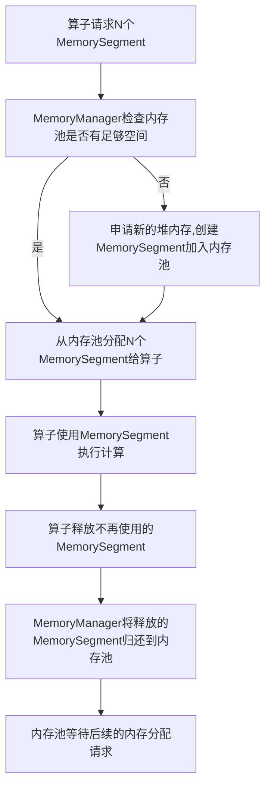
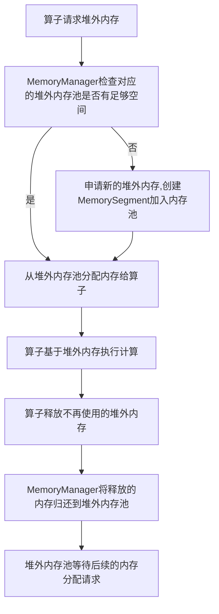

# 深入理解Flink内存模型:堆内存与堆外内存

作者：禅与计算机程序设计艺术

## 1. 背景介绍

### 1.1 Flink简介
Apache Flink是一个开源的、高性能的分布式流式大数据处理引擎,可对有界和无界数据流进行有状态的计算。Flink能够支持海量数据的实时处理,具有低延迟、高吞吐、准确性和容错性等优点。

### 1.2 Flink内存管理的重要性
在大数据处理系统中,内存管理是一个关键问题。高效的内存管理机制可以显著提升系统性能,减少内存消耗,避免出现内存溢出等问题。Flink作为新一代大数据处理引擎,其内存管理模型值得我们深入探究。

### 1.3 本文结构安排
本文将围绕Flink的内存管理展开,重点分析Flink的堆内和堆外内存模型。内容安排如下:
- 介绍Flink的基本概念和内存管理总体架构
- 深入剖析堆内存管理机制,包括内存分配、回收等
- 详细讲解堆外内存的工作原理,以及在Flink中的应用
- 总结Flink内存管理的特点,并探讨未来的优化方向

## 2. 核心概念与架构

### 2.1 TaskManager & Slot
在Flink中,TaskManager 是实际执行计算任务的工作进程。每个 TaskManager 都拥有一定数量的 Slot,每个Slot代表一个固定大小的资源子集,如内存、CPU、网络等。Slot 为任务提供了一个隔离的执行环境。

### 2.2 State  Backend
Flink 中的状态指一个任务的中间计算结果,默认保存在 Java 的堆内存中。为了增强状态的存储能力,Flink 引入了 State Backend 的概念,支持使用其他存储介质存储状态,如 RocksDB。

### 2.3 MemoryManager
MemoryManager 是 Flink 中负责内存管理的核心组件。它基于一种逻辑上的内存池,负责在系统各个组件之间分配和管理内存。MemoryManager 支持堆内存和堆外内存两种模式。

### 2.4 Flink 内存管理架构


如上图所示,Flink 内存管理的主要组成部分有:
- Framework Heap Memory:Flink框架本身使用的 JVM 堆内存 
- Task Heap Memory:Flink任务算子的执行用到的 JVM 堆内存
- Managed Memory:Flink 统一管控的一块本地内存,可存储大块数据结构如哈希表等
- Direct Memory: Flink 中的堆外内存,可直接访问,减少不必要的内存复制

## 3. 堆内存管理

### 3.1 框架堆内存 vs 任务堆内存
Flink JVM 进程的堆内存主要由 Framework Heap Memory 和 Task Heap Memory 两部分组成:
- Framework Heap Memory 主要用于 Flink 框架本身的执行,如 JobMaster、TaskManager 的启动等,其大小可通过参数 `framework.heap.size` 配置。
- Task Heap Memory 是执行具体任务时用到的堆内存,由 MemoryManager 负责分配,大小通过 `taskmanager.memory.task.heap.size` 参数设置。

### 3.2 任务堆内存管理
对于任务堆内存,Flink 采用了pooling的方式来避免频繁的分配和释放,从而减少GC压力:
- MemoryManager内部维护了多个MemorySegment,每个大小为32KB。
- 当一个算子请求内存时,MemoryManager会从空闲内存池中分配一些MemorySegment。
- 当算子不再使用这些内存时,它们会被释放并重新放回到内存池中,供后续的请求使用。

### 3.3  MemorySegment的分配与回收
MemorySegment 是 Flink 中最小的内存分配单元,它的分配和回收流程如下:



这种做法的优点是: 
1. 避免了大量的内存碎片  
2. 相比每次都向系统申请和释放内存,复用pools中的内存 可以减轻GC压力
3. 预申请内存可以减少内存分配的调用开销

## 4. 堆外内存管理

### 4.1 堆外内存的优势
与堆内存相比,堆外内存具有如下优势:  
- 访问速度快: 直接访问,避免了中间缓冲区的数据拷贝
- 减轻GC压力: 堆外内存是直接内存,不受JVM GC管理,有助于减少GC频率和耗时
- 更大的内存空间: 堆外内存不占用JVM内存,可以利用更大的内存空间

### 4.2 堆外内存在Flink中的应用
在Flink中,Direct Memory主要用在如下场景:  
- 流式shuffle过程: 在Map端缓存待发送的数据,Reduce端缓存接收到的数据
- 流式聚合: 将每个Key的聚合结果放在堆外内存,快速更新
- RocksDB State Backend: 使用RocksDB存储状态数据,便于支持更大状态量
- Batch Shuffle: 批处理作业的shuffle跨节点传输数据

### 4.3 堆外内存的分配与回收
与堆内存类似,Flink为了降低直接内存分配的开销,也使用了基于池化的内存管理方式。内存池由多个内存块组成,并由Flink中的DirectMemorySegment进行封装。

Flink为不同的Shuffle场景设置了不同的直接内存池:
- 网络缓冲内存池,用于缓存发送和接受的网络数据。
- Batch Shuffle内存池,用于批作业的Shuffle过程。

下图展示了堆外内存的分配和回收过程:



需要注意的是,虽然堆外内存不受JVM GC管理,但仍需要我们手动管理和释放,否则可能造成直接内存泄漏crash整个进程。Flink在算子的生命周期管理中,会自动帮我们释放不再使用的直接内存。

## 5. 内存模型的数学分析

### 5.1 内存使用的度量
我们定义如下符号表示Flink内存使用情况:

- $H$: 堆内存总量
- $D$: 堆内存中任务使用的内存量
- $R$: 保留给Flink框架的堆内存量
- $M$: 托管内存总量
- $O$: 堆外直接内存总量 

则有: $H = D + R$,即堆内存可分为任务内存和预留内存两部分。

进一步,定义Flink总内存使用量 $U$:
$$U = H + M + O$$

### 5.2 内存使用的约束
由上述定义,我们得出Flink内存使用的约束条件:

1. $D + R \leq H$,即任务堆内存与预留内存之和不能超过堆总量。
2. $M \leq M_{max}$,即托管内存不能超过配置的最大值。  
3. $O \leq O_{max}$,即堆外直接内存不能超过配置的最大值。
4. $U \leq P$,即Flink进程总内存使用不能超过申请的量。

### 5.3 吞吐率与内存的关系
假设Flink集群由 $N$ 个TaskManager组成,每个TaskManager有 $C$ 个CPU核心,平均每核心吞吐率为 $T$,则整个集群的总吞吐率 $S$ 可估算为:

$$S = N * C * T$$

为了提高单核心吞吐率 $T$,需要为任务分配更多内存$D$,即增大每个算子可使用的缓存。但 $D$ 持续增大会导致 Flink 频繁 Full GC 而降低性能。

所以需要权衡内存分配 $D$ 与实际可用 CPU $C$ 的比例,过大或过小都会减少整体吞吐率 $S$。只有找到一个合适的 $D/C$ 比例,才能在保证充分利用CPU的同时,又不会导致GC过于频繁。

### 5.4 小结
Flink 内存管理的核心在于权衡:
- 预留内存 $R$ 与任务内存 $D$ 的比例
- 堆内内存 $H$ 、托管内存 $M$ 和堆外内存 $O$ 各组成部分的比例
- 任务内存 $D$ 与 CPU 核心 $C$ 的比例

只有harmony好这些因素,才能在充分利用内存的同时,又能保持高效的计算性能,达到最佳的内存使用状态。

## 6. 内存管理的典型应用

### 6.1 流式聚合
在流式聚合场景下,如sum、minBy等聚合, Flink为每个Key维护一个聚合结果状态值(ValueState),会频繁进行状态的读取、更新操作。如果状态完全存储在堆内存,每次读写操作都会产生大量的对象创建和GC消耗。

优化方法是引入Managed Memory,将中间结果缓存在堆外内存中,只在必要时同步到堆内state中,减少了堆内存对象创建频率。

### 6.2 窗口计算
窗口计算在流处理中应用广泛。例如每5分钟统计一次过去1小时中每个商品的销量总和Top N。

```
stream.keyBy(item -> item.getProductId())
      .window(SlidingEventTimeWindows.of(Time.hours(1), Time.minutes(5))) 
      .aggregate(new CountAgg(), new WindowResultFunction());
```  

在窗口1小时、滑动步长5分钟的滑动窗口案例中,Flink最多需要同时维护12个窗口的中间结果。如果每次触发窗口计算,都基于原始数据重新算一遍,代价很高。

优化方案是借助RocksDB State Backend,将每个窗口的中间结果(部分聚合值)缓存在RocksDB中,等窗口触发时,再合并各窗口的中间结果,得到最终Top N。RocksDB采用堆外内存,减少了JVM GC,可支撑百亿级别的状态。

### 6.3 Batch Shuffle
在Flink批处理作业中,Shuffle是很常见的场景,如ReduceFunction、GroupReduceFunction等算子。对于数据量较大的Shuffle,Flink默认采用基于Sort的Shuffle方式,具体步骤如下:

1. Map端利用Direct Memory对数据进行排序,并持久化到磁盘。
2. Reduce端拉取Map端处理好的数据,在Direct Memory中进行Merge排序。
3. 经过Merge的数据再次持久化,最后交给Reduce算子消费。

在这个过程中,堆外直接内存起到了关键作用,利用其高IO速率和访问效率,加速了磁盘和网络间的数据传输。同时也节省了JVM内存,降低GC发生的概率。

## 7. Flink内存管理的调优建议

### 7.1 根据作业特点预估所需内存
针对不同类型的作业,预估其所需的Framework、Task、Managed、Direct内存,Neither太少影响运行,Nor过多浪费资源。重点考虑:
- 有状态计算对Managed Memory要求较高
- 网络传输、Shuffle等依赖Direct Memory