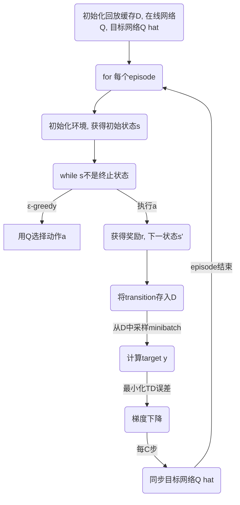

# 深度 Q-learning：在无人驾驶中的应用

作者：禅与计算机程序设计艺术

## 1. 背景介绍
### 1.1 无人驾驶技术概述  
无人驾驶技术是指利用计算机视觉、雷达、GPS等传感器以及先进的控制算法，使车辆能够在没有人类驾驶员主动控制的情况下安全地操作的技术。无人驾驶技术有望提高交通效率、减少交通事故，并为人们带来更加便捷的交通方式。

### 1.2 强化学习在无人驾驶中的应用
强化学习(Reinforcement Learning)是一种机器学习范式，它通过让智能体(agent)在与环境的交互中学习，以获得最大的累积奖励(reward)。强化学习非常适合应用于无人驾驶领域，因为无人车需要在复杂多变的交通环境中连续地做出最优决策。目前已有多个研究和项目尝试将强化学习应用于无人驾驶的感知、决策、规划等模块。

### 1.3 深度 Q-learning 算法简介
Q-learning 是一种经典的强化学习算法，通过学习 action-value 函数 $Q(s,a)$ 来选择最优动作。传统的 Q-learning 使用 Q 表格(Q-table)来存储每个状态-动作对的 Q 值。但在连续状态空间下，Q 表格很难扩展。

深度 Q-learning (DQN) 是将深度神经网络与 Q-learning 相结合的算法，用深度神经网络 $Q(s,a;\theta)$ 来近似表示 Q 函数，其中 $\theta$ 为网络参数。这使得 DQN 能够处理原始的高维状态输入（如图像），并输出每个动作的Q值。DQN 的提出极大地推动了强化学习在复杂决策领域中的应用。

## 2. 核心概念与关联
### 2.1 马尔可夫决策过程(MDP)
在强化学习中，环境通常被建模为马尔可夫决策过程(Markov Decision Process, 简称MDP)。一个MDP由状态空间 $\mathcal{S}$，动作空间 $\mathcal{A}$，状态转移概率 $\mathcal{P}$，奖励函数 $\mathcal{R}$ 和折扣因子 $\gamma$ 五元组 $<\mathcal{S}, \mathcal{A}, \mathcal{P}, \mathcal{R}, \gamma>$ 所定义。

在无人驾驶中，状态 $s$ 可以是车辆所处的位置、速度、与障碍物的距离等信息的组合；动作 $a$ 可以是方向盘转角、油门、刹车等控制量；奖励函数 $R(s,a)$ 可以根据车辆行驶的平顺性、安全性、高效性等设计。

MDP的性质为：在某状态 $s$ 下选择某动作 $a$ 后，环境转移到新状态 $s'$ 的概率 $P(s'|s,a)$ 只取决于当前状态和动作，与之前的历史状态无关，即满足马尔可夫性。

### 2.2 Q-learning 与 Bellman 方程
Q-learning 的核心是学习 action-value 函数，它表示在状态 $s$ 下选择动作 $a$ 的期望总回报：
$$Q(s,a) = \mathbb{E}[R_t | s_t=s, a_t=a]$$

Q 函数满足贝尔曼(Bellman)方程：
$$Q(s,a) = \mathbb{E}_{s'}[R(s,a) + \gamma \max_{a'}Q(s',a')]$$

贝尔曼方程揭示了当前状态-动作的Q值等于立即奖励 $R$ 加上下一状态的最优Q值的折扣累积期望。Q-learning 的目标就是通过样本的贝尔曼方程来更新拟合 Q 函数。

## 3. DQN 算法原理与操作步骤
DQN 的主要思想是使用神经网络 $Q(s,a;\theta)$ 来逼近Q函数。算法的核心步骤如下：

### 3.1 经验回放(Experience Replay)
DQN 引入了经验回放机制。在与环境交互的过程中，将每一步的转换 $(s_t, a_t, r_t, s_{t+1})$ 作为一个样本存入回放缓冲区 $\mathcal{D}$。训练时从 $\mathcal{D}$ 中随机采样一批转换样本来更新网络参数。这种做法可以打破样本之间的相关性，提高训练稳定性。

### 3.2 目标网络(Target Network) 
DQN 使用了两个结构相同但参数不同的神经网络：在线网络 $Q(s,a;\theta)$ 和目标网络 $\hat{Q}(s,a;\hat{\theta})$。在每次迭代中，在线网络被用来选择动作并计算 TD 误差，目标网络被用来计算下一状态的目标Q值。目标网络的参数 $\hat{\theta}$ 每隔一定步数从在线网络复制一次。这种做法可以降低目标计算中的波动，提高学习稳定性。

### 3.3 损失函数与网络更新
对于采样的一个转换 $(s,a,r,s')$，它的目标 Q 值为：
$$y = r+ \gamma \max_{a'}\hat{Q}(s',a';\hat{\theta})$$

整个网络的损失函数为：
$$\mathcal{L}(\theta) = \mathbb{E}_{(s,a,r,s')\sim\mathcal{D}} [(Q(s,a;\theta) - y)^2]$$

网络参数的更新通过随机梯度下降实现:
$$\theta \leftarrow \theta - \alpha \nabla_{\theta} \mathcal{L}(\theta)$$

DQN 算法流程总结如下:



## 4. 数学推导与案例说明
考虑一个简化的无人车转向控制任务。车辆在直道上行驶，状态为与车道中心线的横向距离 $x$ 和偏离角度 $\phi$ 的组合 $s=(x, \phi)$，动作空间为方向盘转角的 $N$ 个级别 $\mathcal{A}={a_1,\cdots,a_N}$。目标是让车辆尽可能沿着车道中心线行驶。

### 4.1 状态转移模型
假设车辆的横向运动可近似为匀速直线运动，则经过 $\Delta t$ 时间后，车辆状态更新为：
$$
\begin{aligned}
x_{t+1} &= x_t + v · \Delta t · \sin(\phi_t)\\
\phi_{t+1} &= \phi_t + \frac{v}{L} · \Delta t · \tan(a_t)
\end{aligned}
$$
其中 $v$ 为车速，$L$ 为轴距，$a_t$ 为 $t$ 时刻选择的转角。

### 4.2 奖励函数设计
奖励函数 $R$ 可以根据车辆偏离中心线的程度和大幅度转向的程度来设计，例如：
$$R(s_t, a_t) = -x_t^2 - \alpha · |\phi_t| - \beta ·|\tan(a_t)|$$
其中 $\alpha$ 和 $\beta$ 为权重系数。这个奖励函数惩罚车辆偏离中心和大幅转向的行为。

### 4.3 DQN 网络结构 
状态 $(x,\phi)$ 首先被编码为特征向量。网络主体可采用几层全连接层，然后输出每个动作的 Q 值。假设采用 2 个隐藏层，每层 $M$ 个神经元，则网络可表示为：

$$
\begin{aligned}
h_1 &= \sigma(W_1 · [x, \phi] + b_1) \\
h_2 &= \sigma(W_2 · h_1 + b_2) \\
Q(s,a) &= W_3 · h_2 + b_3
\end{aligned}
$$
其中 $W,b$ 为待学习的网络参数，$\sigma$ 为激活函数，如 ReLU。

在训练过程中，网络以随机梯度下降的方式最小化 TD 误差，即在线网络的输出 $Q(s,a)$ 与目标网络给出的目标值  $r+\gamma Q'(s',a';\hat{\theta})$ 间的均方差，如第 3 节所述。

## 5. 项目实践：代码实例
本节给出了一个简单的 DQN 算法在 Keras 中的实现示例。完整代码参见 [Github](https://github.com/DRL-CSDN/dqn-demo)。

首先定义 Q 网络：
```python
class QNetwork(nn.Module):
    def __init__(self, state_size, action_size, hidden_size=64):
        super(QNetwork, self).__init__()
        self.fc1 = nn.Linear(state_size, hidden_size)
        self.fc2 = nn.Linear(hidden_size, hidden_size) 
        self.fc3 = nn.Linear(hidden_size, action_size)

    def forward(self, state):
        x = F.relu(self.fc1(state))
        x = F.relu(self.fc2(x))
        return self.fc3(x)
```
然后定义 DQN Agent：
```python 
class DQNAgent:
    def __init__(self, state_size, action_size):
        self.state_size = state_size
        self.action_size = action_size
        self.memory = deque(maxlen=2000)
        self.Q_net = QNetwork(state_size, action_size)
        self.Q_target = QNetwork(state_size, action_size)
        self.optimizer = optim.Adam(self.Q_net.parameters())

    def memorize(self, state, action, reward, next_state, done):
        self.memory.append((state, action, reward, next_state, done))
    
    def act(self, state, epsilon):
        if random.random() > epsilon: 
            return np.argmax(self.Q_net(state).data.numpy())
        else:
            return random.choice(np.arange(self.action_size))
    
    def learn(self, batch_size):
        minibatch = random.sample(self.memory, batch_size)
        for state, action, reward, next_state, done in minibatch:
            if done:
                target = reward
            else:
                target = reward + GAMMA * torch.max(self.Q_target(next_state)) 
                
            Q_values = self.Q_net(state)
            Q_values[action] = target
            loss = self.criterion(Q_values, target)
            
            self.optimizer.zero_grad()
            loss.backward()
            self.optimizer.step()
                
    def update_target(self):
        self.Q_target.load_state_dict(self.Q_net.state_dict())
```
主循环如下：
```python
agent = DQNAgent(state_size, action_size)

for episode in range(MAX_EPISODES):
    state = env.reset()
    done = False
    while not done:
        action = agent.act(state, epsilon)
        next_state, reward, done, _ = env.step(action) 
        agent.memorize(state, action, reward, next_state, done)
        state = next_state

        if len(agent.memory) > BATCH_SIZE:
            agent.learn(BATCH_SIZE)
            
        if episode % TARGET_UPDATE == 0:
            agent.update_target()  
```
以上代码展示了 DQN 的核心组件，包括 Q 网络定义、经验回放、ε-greedy 策略、网络更新等。在实际项目中，还需要根据具体问题，合理设置状态与动作空间、奖励函数等。

## 6. 实际应用场景
DQN 及其变体在无人驾驶中有广泛的应用，例如：

- 端到端驾驶：通过 DQN 直接学习从摄像头图像到车辆控制量（转向、加速、刹车）的映射，实现面向目标导航、车道保持、避障等功能。
- 决策与规划：DQN 可用于学习驾驶策略，如换道决策、交叉路口通行、超车等。结合其他规划模块，可实现更安全、高效的自动驾驶。
- 场景理解：将场景信息（如车辆位置、障碍物、交通标志等）作为状态输入，DQN 可以学习对交通场景进行分析和理解。

例如，英伟达(NVIDIA)公司在 DAVE-