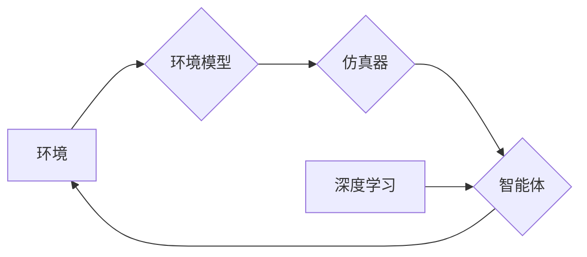

## 《深度强化学习：环境建模与仿真》

作者：禅与计算机程序设计艺术

## 1. 背景介绍

### 1.1 强化学习与环境交互

强化学习 (Reinforcement Learning, RL) 是一种机器学习范式，其目标是让智能体 (Agent) 通过与环境交互学习最佳行为策略。智能体在环境中执行动作，并根据环境的反馈 (奖励或惩罚) 调整其策略，以最大化累积奖励。

### 1.2 环境建模的必要性

在许多实际应用中，直接与真实环境交互成本高昂、风险较大，甚至难以实现。例如，训练自动驾驶汽车需要在真实道路上进行大量测试，这既费时又危险。为了克服这些问题，环境建模与仿真技术应运而生。

### 1.3 环境建模与仿真的优势

环境建模与仿真具有以下优势：

* **安全性:**  在仿真环境中进行训练，可以避免对真实世界造成潜在的危害。
* **成本效益:**  仿真环境的搭建和运行成本远低于真实环境。
* **可重复性:**  仿真环境可以提供可重复的实验条件，方便进行算法调试和比较。
* **可控性:**  研究人员可以自由地控制仿真环境的各种参数，以便进行更深入的分析。


## 2. 核心概念与联系

### 2.1 环境模型

环境模型是对真实环境的抽象表示，它描述了环境的状态、动作和奖励之间的关系。常见的环境模型包括：

* **基于模型的环境:**  这类模型使用数学公式或物理规律来描述环境的动态变化，例如经典的倒立摆模型。
* **无模型的环境:**  这类模型不依赖于任何先验知识，而是通过与环境交互收集数据来学习环境的动态特性。

### 2.2 仿真器

仿真器是用于模拟环境行为的软件程序，它根据环境模型生成环境的状态、奖励等信息。仿真器可以提供逼真的环境体验，允许智能体在安全可控的环境中进行训练。

### 2.3 深度强化学习

深度强化学习 (Deep Reinforcement Learning, DRL) 是将深度学习技术应用于强化学习领域的一种方法。DRL 使用深度神经网络来逼近智能体的策略函数或值函数，从而提升强化学习算法的性能。

### 2.4 概念联系图



## 3. 核心算法原理具体操作步骤

### 3.1 基于模型的强化学习

基于模型的强化学习 (Model-Based RL) 首先构建环境模型，然后利用模型进行规划和决策。常见的算法包括：

* **动态规划 (Dynamic Programming, DP):**  DP 是一种基于模型的规划方法，它通过迭代计算最优值函数来找到最优策略。
* **蒙特卡洛树搜索 (Monte Carlo Tree Search, MCTS):**  MCTS 是一种基于模型的搜索方法，它通过模拟未来轨迹来评估不同动作的价值。

#### 3.1.1 动态规划步骤

1. 定义状态空间、动作空间和奖励函数。
2. 初始化值函数。
3. 迭代更新值函数，直到收敛。
4. 根据最优值函数推导出最优策略。

#### 3.1.2 蒙特卡洛树搜索步骤

1. 从当前状态开始，模拟多条未来轨迹。
2. 对于每条轨迹，计算累积奖励。
3. 根据累积奖励更新节点的价值估计。
4. 选择价值最高的动作作为下一步行动。

### 3.2 无模型的强化学习

无模型的强化学习 (Model-Free RL) 不需要构建环境模型，而是直接从与环境交互的经验中学习策略。常见的算法包括：

* **Q-learning:**  Q-learning 是一种基于值函数的学习方法，它通过迭代更新 Q 值来学习最优策略。
* **策略梯度 (Policy Gradient, PG):**  PG 是一种直接优化策略函数的方法，它通过梯度上升来调整策略参数。

#### 3.2.1 Q-learning 步骤

1. 初始化 Q 值表。
2. 在每个时间步，选择一个动作并观察环境的奖励和下一个状态。
3. 更新 Q 值表，以最大化未来预期奖励。
4. 重复步骤 2-3，直到 Q 值收敛。

#### 3.2.2 策略梯度步骤

1. 定义策略函数，例如神经网络。
2. 初始化策略参数。
3. 收集多条轨迹数据。
4. 计算每条轨迹的回报。
5. 根据回报计算策略梯度。
6. 更新策略参数，以最大化预期回报。

## 4. 数学模型和公式详细讲解举例说明

### 4.1 马尔可夫决策过程 (Markov Decision Process, MDP)

MDP 是强化学习的数学框架，它描述了智能体与环境交互的过程。MDP 由以下元素组成：

* **状态空间 (State Space):**  所有可能的状态的集合。
* **动作空间 (Action Space):**  所有可能的动作的集合。
* **状态转移函数 (State Transition Function):**  描述了在当前状态下执行某个动作后，转移到下一个状态的概率。
* **奖励函数 (Reward Function):**  定义了在某个状态下执行某个动作后，智能体获得的奖励。

### 4.2 Bellman 方程

Bellman 方程是 MDP 的核心方程，它描述了值函数之间的关系。值函数表示在某个状态下，遵循某个策略所能获得的预期累积奖励。Bellman 方程可以用来计算最优值函数和最优策略。

$$
V^*(s) = \max_{a \in A} \left[ R(s,a) + \gamma \sum_{s' \in S} P(s'|s,a) V^*(s') \right]
$$

其中：

* $V^*(s)$ 表示在状态 $s$ 下的最优值函数。
* $A$ 表示动作空间。
* $R(s,a)$ 表示在状态 $s$ 下执行动作 $a$ 获得的奖励。
* $\gamma$ 表示折扣因子，用于平衡当前奖励和未来奖励之间的权重。
* $S$ 表示状态空间。
* $P(s'|s,a)$ 表示在状态 $s$ 下执行动作 $a$ 后，转移到状态 $s'$ 的概率。

## 5. 项目实践：代码实例和详细解释说明

### 5.1 OpenAI Gym

OpenAI Gym 是一个用于开发和比较强化学习算法的工具包，它提供了各种各样的环境，例如经典控制问题、游戏、机器人模拟等。

### 5.2 CartPole 环境

CartPole 是 OpenAI Gym 中的一个经典控制问题，目标是控制一根杆子使其不倒下。

### 5.3 代码实例 (Python)

```python
import gym

# 创建 CartPole 环境
env = gym.make('CartPole-v1')

# 初始化状态
state = env.reset()

# 循环执行动作
for _ in range(1000):
    # 渲染环境
    env.render()

    # 选择随机动作
    action = env.action_space.sample()

    # 执行动作并观察结果
    next_state, reward, done, info = env.step(action)

    # 更新状态
    state = next_state

    # 如果游戏结束，则重置环境
    if done:
        state = env.reset()

# 关闭环境
env.close()
```

### 5.4 代码解释

* `gym.make('CartPole-v1')` 创建 CartPole 环境。
* `env.reset()` 初始化环境状态。
* `env.render()` 渲染环境画面。
* `env.action_space.sample()` 随机选择一个动作。
* `env.step(action)` 执行动作并返回结果。
* `done` 表示游戏是否结束。
* `env.close()` 关闭环境。

## 6. 实际应用场景

### 6.1 游戏 AI

DRL 在游戏 AI 领域取得了巨大成功，例如 AlphaGo、AlphaStar 等。DRL 可以训练智能体在复杂的游戏环境中学习最佳策略，从而战胜人类顶级玩家。

### 6.2 机器人控制

DRL 可以用于训练机器人控制策略，例如抓取、导航、避障等。DRL 可以帮助机器人适应不同的环境和任务，提高其自主性和智能化程度。

### 6.3 自动驾驶

DRL 可以用于训练自动驾驶汽车的控制策略，例如路径规划、速度控制、车道保持等。DRL 可以帮助自动驾驶汽车在复杂的路况下安全行驶，提高其驾驶效率和安全性。

### 6.4 金融交易

DRL 可以用于训练金融交易策略，例如股票交易、期货交易等。DRL 可以帮助交易员识别市场趋势、预测价格波动，从而获得更高的投资回报。

## 7. 总结：未来发展趋势与挑战

### 7.1 未来发展趋势

* **更逼真的环境模型:**  随着计算能力的提升和建模技术的进步，未来将出现更逼真的环境模型，可以更好地模拟真实世界的复杂性。
* **更强大的 DRL 算法:**  DRL 算法将不断发展，以解决更复杂的任务，例如多智能体协作、部分可观察环境等。
* **更广泛的应用领域:**  DRL 将被应用于更多领域，例如医疗保健、教育、制造业等，为人类社会带来更大的价值。

### 7.2 挑战

* **样本效率:**  DRL 算法通常需要大量的训练数据才能达到良好的性能，如何提高样本效率是一个重要挑战。
* **泛化能力:**  DRL 算法在训练环境中表现良好，但在新的环境中可能表现不佳，如何提高泛化能力是一个重要挑战。
* **安全性:**  DRL 算法的安全性是一个重要问题，如何确保 DRL 系统的安全性是一个重要挑战。

## 8. 附录：常见问题与解答

### 8.1 什么是强化学习？

强化学习是一种机器学习范式，其目标是让智能体通过与环境交互学习最佳行为策略。

### 8.2 为什么需要环境建模？

在许多实际应用中，直接与真实环境交互成本高昂、风险较大，甚至难以实现。环境建模可以提供安全、高效、可控的训练环境。

### 8.3 深度强化学习有哪些优势？

深度强化学习可以使用深度神经网络来逼近智能体的策略函数或值函数，从而提升强化学习算法的性能。

### 8.4 DRL有哪些应用场景？

DRL 可以应用于游戏 AI、机器人控制、自动驾驶、金融交易等领域。
