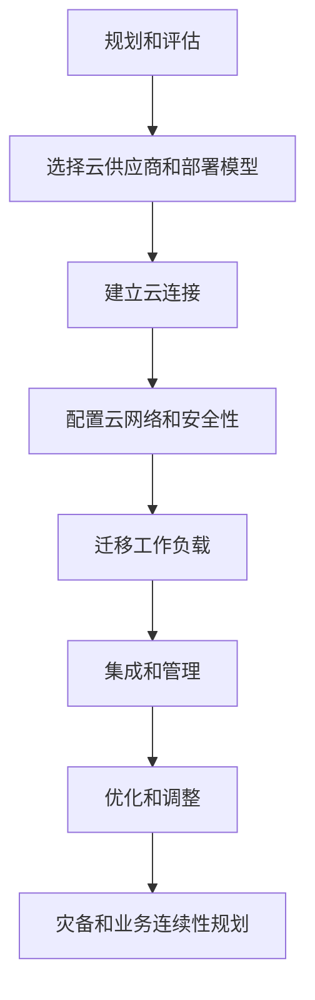
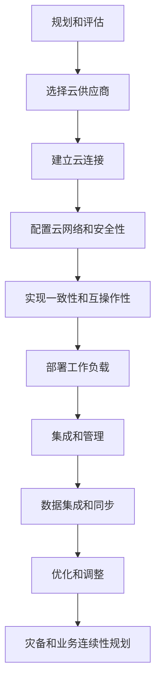

# 混合云与多云部署原理与代码实战案例讲解

## 1.背景介绍

随着云计算技术的不断发展和企业对于IT资源的灵活性、可扩展性和成本效益的需求日益增长,混合云和多云部署模式逐渐成为主流趋势。混合云是指将本地私有云或数据中心与公有云资源相结合,实现资源的无缝整合和统一管理。而多云则是指在不同的公有云供应商之间部署和使用多个云环境,以实现灵活性、可用性和成本优化。

无论是混合云还是多云,它们都旨在为企业提供更高的IT基础设施弹性、更好的灾备能力、更强的数据安全性以及更优的成本效益。然而,在实施这些部署模式时,企业也面临着诸多挑战,如数据迁移、应用程序可移植性、治理和合规性、供应商锁定等问题。因此,全面理解混合云和多云部署的原理、架构和最佳实践至关重要。

### 1.1 混合云部署的动机和优势

混合云部署的主要动机包括:

- **业务灵活性**: 企业可以根据实际需求动态调配公有云资源,快速扩展或缩减IT基础设施规模。
- **成本优化**: 将非关键工作负载迁移到公有云可降低硬件和运维成本。
- **灾备和业务连续性**: 通过跨云部署实现异地容灾,提高系统可用性。
- **合规性和数据主权**: 敏感数据可以存储在本地私有云中,满足严格的合规性和数据保护要求。

混合云部署的主要优势包括:

- **基础设施优化**: 利用公有云资源补充本地资源,实现基础设施的最佳利用。
- **应用程序现代化**: 将传统应用迁移到云端,利用云原生技术实现应用现代化。
- **灵活扩展能力**: 可根据需求动态扩展或收缩资源,提高资源利用率。
- **多样化的云服务**: 混合云环境可以整合多个云供应商的优势服务。

### 1.2 多云部署的动机和优势  

多云部署的主要动机包括:

- **避免供应商锁定**: 通过使用多个云供应商,降低对单一供应商的依赖。
- **满足特定需求**: 不同云供应商可能在特定领域具有优势,例如AI/ML、大数据等。
- **灾备和业务连续性**: 跨云部署可实现异地容灾,提高系统可用性。
- **满足合规性要求**: 某些行业或地区可能需要在特定云环境中存储和处理数据。

多云部署的主要优势包括:

- **供应商选择灵活性**: 可根据需求选择最佳云供应商和服务。
- **成本优化**: 通过在不同供应商之间进行资源调配,可实现成本优化。
- **应对供应商中断**: 如果某个云供应商出现中断,可将工作负载转移到其他云环境。
- **避免供应商锁定**: 降低对单一供应商的依赖,提高业务灵活性。

## 2.核心概念与联系

### 2.1 混合云部署模型

混合云部署通常采用以下几种模型:

1. **基于 VPN 的混合云**:通过 VPN(虚拟专用网络)连接将本地数据中心与公有云环境相连接。这是最基本的混合云模型,但存在性能和安全性挑战。

2. **基于直接连接的混合云**:借助专用网络连接(如 AWS Direct Connect 或 Azure ExpressRoute)将本地环境直接连接到公有云,提供更高的带宽、更低的延迟和更好的安全性。

3. **基于云管理平台的混合云**:使用统一的云管理平台(如 VMware Cloud Foundation、Red Hat OpenShift 等)在本地和公有云环境之间管理和编排资源。

4. **基于容器的混合云**:利用容器技术(如 Kubernetes)在本地和公有云环境之间编排和管理应用程序,实现应用程序的可移植性和灵活部署。

5. **基于无服务器(Serverless)的混合云**:结合使用本地资源和公有云的无服务器功能(如 AWS Lambda、Azure Functions 等),实现高度自动化和按需付费。

### 2.2 多云部署模型

多云部署通常采用以下几种模型:

1. **复制模型**:在多个云环境中部署相同的应用程序和数据,实现冗余和容灾。

2. **临时突发模型**:在主云环境资源不足时,临时借助其他云环境的资源来满足突发需求。

3. **云无关模型**:开发云无关(Cloud-agnostic)的应用程序,使其能够在任何云环境中运行。

4. **多云编排模型**:使用统一的云编排工具(如 Terraform、Ansible 等)在多个云环境中自动化资源供应和配置管理。

5. **多云数据集成**:通过数据集成和同步工具(如 Azure Data Factory、AWS Data Pipeline 等)在不同云环境之间共享和交换数据。

6. **多云分析**:利用不同云供应商的分析服务(如 AWS Athena、Azure Synapse Analytics 等)对来自多个云环境的数据进行分析和处理。

### 2.3 核心组件和技术

实现混合云和多云部署需要以下核心组件和技术:

- **云管理平台**:提供统一的资源管理、自动化和治理能力,如 VMware vRealize、Red Hat CloudForms 等。

- **容器编排工具**:如 Kubernetes、Docker Swarm 等,用于在混合云和多云环境中编排和管理容器化应用程序。

- **无服务器计算**:如 AWS Lambda、Azure Functions 等,支持按需自动扩展资源。

- **数据集成和同步工具**:如 Azure Data Factory、AWS Data Pipeline 等,用于在不同云环境之间共享和交换数据。

- **云编排和基础设施即代码工具**:如 Terraform、Ansible、Pulumi 等,支持跨云环境自动化资源供应和配置管理。

- **云网络和连接技术**:如 VPN、直接连接、软件定义网络(SDN)等,用于连接本地环境和多个云环境。

- **云监控和日志分析工具**:如 Azure Monitor、AWS CloudWatch 等,用于跨云环境监控和故障排查。

- **云安全和治理工具**:如 AWS Control Tower、Azure Blueprints 等,用于实施云安全、合规性和治理策略。

- **云成本优化工具**:如 AWS Cost Explorer、Azure Cost Management 等,用于跨云环境成本分析和优化。

## 3.核心算法原理具体操作步骤

### 3.1 混合云部署流程

混合云部署通常遵循以下流程:

1. **规划和评估**:评估业务需求、现有IT基础设施、合规性要求等,制定混合云战略和路线图。

2. **选择云供应商和部署模型**:根据需求选择合适的公有云供应商和混合云部署模型(VPN、直连等)。

3. **建立云连接**:通过 VPN、直连或其他网络技术,将本地环境与公有云环境连接。

4. **配置云网络和安全性**:在公有云端配置虚拟网络、子网、安全组、路由表等网络和安全组件。

5. **迁移工作负载**:将适合迁移到公有云的工作负载(如Web应用、开发/测试环境等)迁移到公有云。

6. **集成和管理**:使用云管理平台或其他工具对混合云资源进行统一管理、监控和自动化。

7. **优化和调整**:持续监控和优化混合云环境的性能、成本和安全性,根据需求进行调整。

8. **灾备和业务连续性规划**:制定跨云环境的灾备和业务连续性计划,确保关键工作负载的高可用性。

下面是混合云部署流程的 Mermaid 流程图:

### 3.2 多云部署流程

多云部署流程与混合云部署类似,但需要额外考虑跨云环境的一致性和互操作性。典型的多云部署流程如下:

1. **规划和评估**:评估业务需求、现有IT基础设施、合规性要求等,制定多云战略和路线图。

2. **选择云供应商**:根据需求选择合适的多个公有云供应商。

3. **建立云连接**:通过 VPN、直连或其他网络技术,将各个云环境相互连接。

4. **配置云网络和安全性**:在每个云环境中配置虚拟网络、子网、安全组、路由表等网络和安全组件。

5. **实现一致性和互操作性**:采用云无关的架构和工具,确保应用程序和数据在不同云环境中的一致性和互操作性。

6. **部署工作负载**:根据需求,在不同云环境中部署和分布工作负载。

7. **集成和管理**:使用云编排和基础设施即代码工具对多云资源进行统一管理、监控和自动化。

8. **数据集成和同步**:使用数据集成和同步工具在不同云环境之间共享和交换数据。

9. **优化和调整**:持续监控和优化多云环境的性能、成本和安全性,根据需求进行调整。

10. **灾备和业务连续性规划**:制定跨云环境的灾备和业务连续性计划,确保关键工作负载的高可用性。

下面是多云部署流程的 Mermaid 流程图:

## 4.数学模型和公式详细讲解举例说明

在混合云和多云环境中,通常需要考虑资源分配、成本优化、负载均衡和容量规划等问题。这些问题通常可以使用数学模型和公式进行描述和求解。

### 4.1 资源分配模型

资源分配模型旨在确定在混合云或多云环境中如何有效分配资源,以满足应用程序的性能需求并优化成本。常用的资源分配模型包括整数规划模型和线性规划模型。

假设有 $n$ 个应用程序需要部署在 $m$ 个云环境中,每个应用程序 $i$ 在云环境 $j$ 上的资源需求为 $r_{ij}$,每个云环境 $j$ 的可用资源为 $R_j$,我们希望最小化总体成本。可以建立如下整数规划模型:

$$
\begin{aligned}
\min \quad & \sum_{i=1}^{n} \sum_{j=1}^{m} c_{ij} x_{ij} \\
\text{s.t.} \quad & \sum_{j=1}^{m} x_{ij} = 1, \quad i = 1, \ldots, n \\
& \sum_{i=1}^{n} r_{ij} x_{ij} \leq R_j, \quad j = 1, \ldots, m \\
& x_{ij} \in \{0, 1\}, \quad i = 1, \ldots, n, \quad j = 1, \ldots, m
\end{aligned}
$$

其中,决策变量 $x_{ij}$ 表示应用程序 $i$ 是否部署在云环境 $j$ 上,目标函数是最小化总体成本。约束条件包括:每个应用程序只能部署在一个云环境中,以及每个云环境的总资源需求不能超过可用资源。

### 4.2 成本优化模型

在混合云和多云环境中,成本优化是一个关键问题。我们可以使用成本优化模型来确定在满足性能需求的前提下,如何最小化总体成本。

假设有 $n$ 个应用程序需要部署在 $m$ 个云环境中,每个应用程序 $i$ 在云环境 $j$ 上