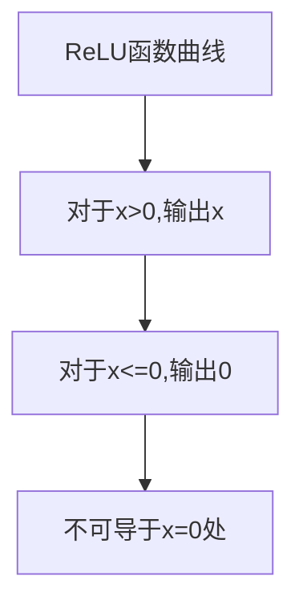
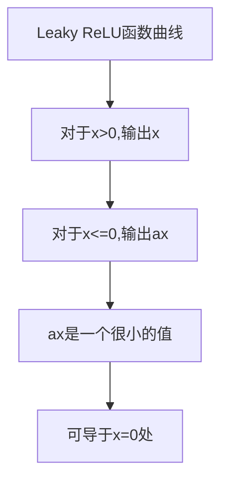
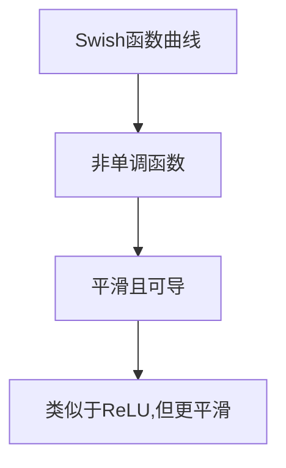

# 激活函数 (Activation Function)

## 1.背景介绍

### 1.1 什么是激活函数

在神经网络和深度学习中,激活函数(activation function)是一种非线性函数,通常应用于神经元的输出层。它引入了非线性,使得神经网络能够学习和近似任意复杂的函数映射。如果没有激活函数,每一个神经元只不过是对输入的加权求和,这种简单的线性运算无法解决复杂的任务。

### 1.2 为什么需要激活函数

如果没有激活函数,神经网络将只能学习线性函数或者仿射函数。因为在神经网络中,每一层的输出都是通过线性变换获得的。即便堆叠了多层线性变换,最终的输出也只是另一个线性变换。这严重限制了神经网络的表达能力。

引入非线性激活函数后,神经网络就获得了学习非线性映射的能力。激活函数为神经网络引入了非线性,从而使得神经网络能够逼近任意连续函数,大大提高了其表达能力和学习复杂模式的能力。

## 2.核心概念与联系

### 2.1 激活函数的作用

激活函数在神经网络中扮演着至关重要的角色,主要有以下几个作用:

1. **引入非线性**: 如上所述,激活函数赋予了神经网络非线性的能力,使其能够学习复杂的映射。
2. **增加网络表达能力**: 激活函数使得神经网络能够逼近任意连续函数,从而极大地提高了网络的表达能力和学习复杂模式的能力。
3. **提供了可导性质**: 大多数激活函数都是可导的,这使得神经网络可以利用反向传播算法进行有效的训练。
4. **引入稀疏表达**: 一些激活函数(如ReLU)具有稀疏性,这有助于减少过拟合并提高模型的泛化能力。

### 2.2 常用激活函数

常见的激活函数有以下几种:

1. Sigmoid函数
2. Tanh函数
3. ReLU(整流线性单元)
4. Leaky ReLU 
5. Swish
6. Softmax(用于多分类任务的输出层)

不同的激活函数具有不同的特性,适用于不同的场景和任务。选择合适的激活函数对神经网络的性能至关重要。

## 3.核心算法原理具体操作步骤

接下来,我们将详细介绍几种最常用的激活函数,包括它们的数学定义、计算过程、导数等。

### 3.1 Sigmoid函数

#### 3.1.1 定义

Sigmoid函数的数学表达式为:

$$\sigma(x) = \frac{1}{1+e^{-x}}$$

其函数曲线如下所示:

```mermaid
 graph TD
   A[Sigmoid函数曲线] --> B[将输入压缩到(0,1)范围]
   B --> C[S型曲线]
   C --> D[平滑且可导]
```

Sigmoid函数将输入压缩到(0,1)的范围内,函数曲线呈现出平滑的S型,并且在整个定义域内可导。

#### 3.1.2 计算过程

给定输入 $x$, 计算Sigmoid函数的输出 $\sigma(x)$ 的步骤如下:

1. 计算 $t = -x$
2. 计算 $e^t$
3. 计算 $1 + e^t$  
4. 计算 $\sigma(x) = \frac{1}{1+e^t}$

#### 3.1.3 导数

Sigmoid函数的导数为:

$$\frac{d\sigma(x)}{dx} = \sigma(x)(1-\sigma(x))$$

这个性质在反向传播算法中计算梯度时会被用到。

### 3.2 Tanh函数  

#### 3.2.1 定义

Tanh(双曲正切)函数的数学表达式为:

$$\tanh(x) = \frac{e^x - e^{-x}}{e^x + e^{-x}}$$

它的函数曲线如下:

```mermaid
graph TD
  A[Tanh函数曲线] --> B[将输入压缩到(-1,1)范围]
  B --> C[类似于Sigmoid的S型曲线]
  C --> D[平滑且可导]
```

Tanh函数将输入压缩到(-1,1)范围,函数曲线类似于Sigmoid函数,但是在原点处有更明显的曲率变化,是一种平滑可导的S型函数。

#### 3.2.2 计算过程 

给定输入 $x$, 计算Tanh函数的输出的步骤如下:

1. 计算 $e^x$
2. 计算 $e^{-x}$
3. 计算 $e^x - e^{-x}$
4. 计算 $e^x + e^{-x}$
5. 计算 $\tanh(x) = \frac{e^x - e^{-x}}{e^x + e^{-x}}$

#### 3.2.3 导数

Tanh函数的导数为:

$$\frac{d\tanh(x)}{dx} = 1 - \tanh^2(x)$$

### 3.3 ReLU(整流线性单元)

#### 3.3.1 定义 

ReLU(Rectified Linear Unit)是一种最简单也是最常用的激活函数,其数学定义为:

$$\text{ReLU}(x) = \max(0, x)$$

其函数曲线如下所示:



可以看到,ReLU函数在正半轴保持线性,在负半轴全为0。它是一个不可导的分段线性函数。

#### 3.3.2 计算过程

给定输入 $x$, 计算ReLU函数输出的步骤如下:

1. 判断 $x$ 是否大于0
2. 如果大于0,输出 $x$
3. 否则输出0

#### 3.3.3 导数

ReLU函数的导数为:

$$\frac{d\text{ReLU}(x)}{dx} = \begin{cases}
1, & \text{if }x>0\\
0, & \text{if }x \leq 0
\end{cases}$$

需要注意的是,在 $x=0$ 处ReLU函数不可导。但是在实际应用中,我们通常将 $x=0$ 时的导数定义为0。

### 3.4 Leaky ReLU

#### 3.4.1 定义

Leaky ReLU是ReLU的一个变体,它的定义为:

$$\text{LeakyReLU}(x) = \begin{cases}
x, & \text{if }x>0\\
\alpha x, & \text{if }x \leq 0
\end{cases}$$

其中 $\alpha$ 是一个很小的常数,通常取0.01。

Leaky ReLU的函数曲线如下:



相比ReLU,Leaky ReLU在负半轴不是完全为0,而是以一个很小的斜率 $\alpha$ 递减。这使得它可导于 $x=0$ 处,从而避免了ReLU的"死亡神经元"问题。

#### 3.4.2 计算过程

给定输入 $x$,计算Leaky ReLU函数输出的步骤如下:

1. 判断 $x$ 是否大于0 
2. 如果大于0,输出 $x$
3. 否则输出 $\alpha x$

#### 3.4.3 导数

Leaky ReLU函数的导数为:

$$\frac{d\text{LeakyReLU}(x)}{dx} = \begin{cases}
1, & \text{if }x>0\\
\alpha, & \text{if }x \leq 0
\end{cases}$$

### 3.5 Swish

#### 3.5.1 定义

Swish是谷歌大脑提出的一种自门控激活函数,定义为:

$$\text{Swish}(x) = x \cdot \sigma(\beta x)$$

其中 $\sigma$ 是Sigmoid函数, $\beta$ 是一个可训练的参数,通常初始化为1。

Swish函数的曲线形状如下:



可以看到,Swish函数类似于ReLU,但是更加平滑,并且是一个非单调函数。

#### 3.5.2 计算过程

给定输入 $x$, 计算Swish函数输出的步骤如下:

1. 计算 $\beta x$  
2. 计算 $\sigma(\beta x) = \frac{1}{1+e^{-\beta x}}$
3. 计算 $\text{Swish}(x) = x \cdot \sigma(\beta x)$

#### 3.5.3 导数

Swish函数的导数为:

$$\frac{d\text{Swish}(x)}{dx} = \sigma(\beta x) + \beta x \sigma'(\beta x)$$

其中 $\sigma'$ 是Sigmoid函数的导数。

### 3.6 Softmax

Softmax函数常用于神经网络的输出层,将神经元的输出值压缩到(0,1)范围内,并且所有输出之和为1,可以被解释为概率分布。

#### 3.6.1 定义

对于一个K维向量 $\boldsymbol{x} = (x_1, x_2, \ldots, x_K)$, Softmax函数定义为:

$$\text{Softmax}(\boldsymbol{x})_i = \frac{e^{x_i}}{\sum_{j=1}^K e^{x_j}}$$

其中 $i=1,2,\ldots,K$。

#### 3.6.2 计算过程

给定输入向量 $\boldsymbol{x}$, 计算Softmax函数输出的步骤如下:

1. 对每个 $x_i$ 计算 $e^{x_i}$
2. 计算 $\sum_{j=1}^K e^{x_j}$
3. 对每个 $i$, 计算 $\text{Softmax}(\boldsymbol{x})_i = \frac{e^{x_i}}{\sum_{j=1}^K e^{x_j}}$

#### 3.6.3 导数

Softmax函数的导数比较复杂,这里不再赘述。在实际使用中,通常由深度学习框架自动计算。

## 4.数学模型和公式详细讲解举例说明

在上一节中,我们已经给出了各种常用激活函数的数学定义和计算过程。现在让我们通过具体的例子,来进一步理解它们的工作原理。

### 4.1 Sigmoid函数举例

假设我们有一个输入 $x=2$, 需要计算Sigmoid函数的输出值。

根据Sigmoid函数的定义:

$$\sigma(x) = \frac{1}{1+e^{-x}}$$

将 $x=2$ 代入,按照计算过程:

1. $t = -2$
2. $e^t = e^{-2} \approx 0.1353$
3. $1 + e^t = 1 + 0.1353 = 1.1353$
4. $\sigma(2) = \frac{1}{1.1353} \approx 0.8808$

因此,Sigmoid(2)的输出值约为0.8808。

我们可以看到,Sigmoid函数将输入2压缩到(0,1)范围内。当输入值较大时,Sigmoid函数的输出值会接近1;当输入值较小时,输出值会接近0。

### 4.2 Tanh函数举例

假设我们有一个输入 $x=-1$, 需要计算Tanh函数的输出值。

根据Tanh函数的定义:

$$\tanh(x) = \frac{e^x - e^{-x}}{e^x + e^{-x}}$$

将 $x=-1$ 代入,按照计算过程:

1. $e^{-1} \approx 0.3679$ 
2. $e^1 \approx 2.7183$
3. $e^{-1} - e^1 = 0.3679 - 2.7183 = -2.3504$
4. $e^{-1} + e^1 = 0.3679 + 2.7183 = 3.0862$ 
5. $\tanh(-1) = \frac{-2.3504}{3.0862} \approx -0.7616$

因此,Tanh(-1)的输出值约为-0.7616。

我们可以看到,Tanh函数将输入压缩到(-1,1)范围内,其曲线形状与Sigmoid函数类似,但在原点处有更大的