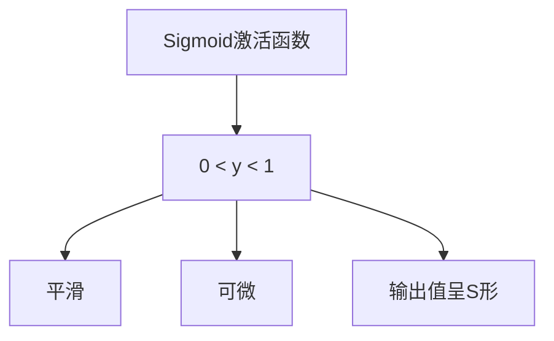
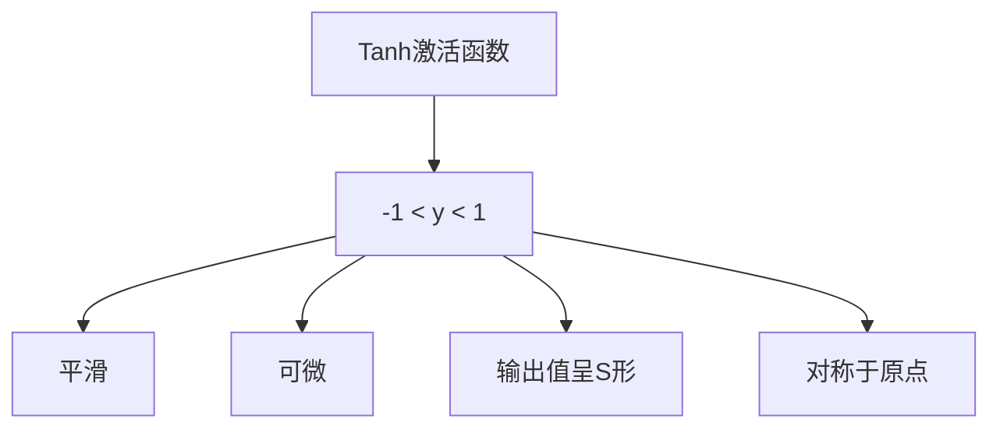
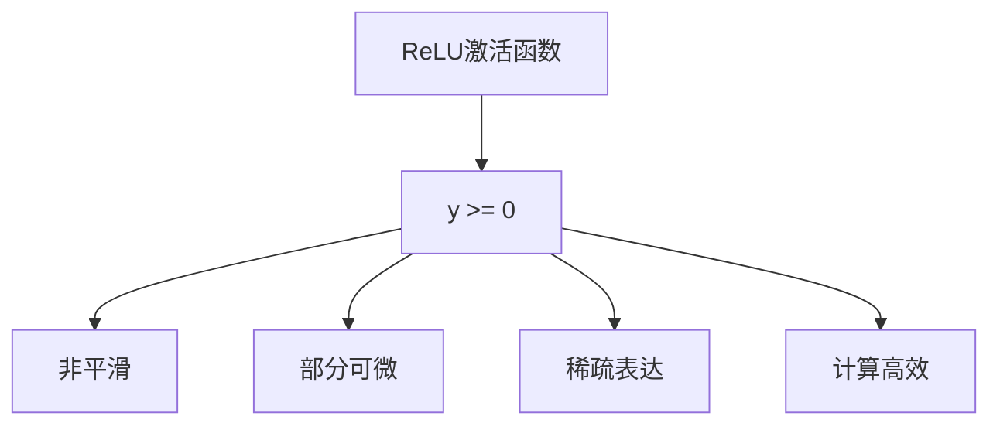

# 激活函数大比拼:Sigmoid、Tanh、ReLU谁主沉浮?

## 1.背景介绍

### 1.1 什么是激活函数?

在深度学习和神经网络领域,激活函数扮演着至关重要的角色。它是神经网络中每个神经元的非线性转换函数,决定了神经元的输出是否被"激活"。简单来说,激活函数引入了非线性因素,使得神经网络能够学习复杂的映射关系,从而解决更加棘手的问题。

### 1.2 激活函数的作用

激活函数的主要作用如下:

- **引入非线性**:如果没有非线性激活函数,神经网络将只能学习线性函数,无法解决复杂的非线性问题。
- **增加网络表达能力**:不同的激活函数具有不同的特性,可以赋予神经网络不同的表达和学习能力。
- **实现生物神经元特性**:激活函数模拟了生物神经元的"兴奋"和"抑制"行为。

### 1.3 激活函数的选择

选择合适的激活函数对于神经网络的性能至关重要。不同的激活函数在不同的场景下表现各不相同,因此需要根据具体问题进行选择和权衡。本文将重点比较三种常用的激活函数:Sigmoid、Tanh和ReLU,并探讨它们的优缺点和适用场景。

## 2.核心概念与联系

### 2.1 Sigmoid激活函数

Sigmoid激活函数的数学表达式为:

$$
\sigma(x) = \frac{1}{1 + e^{-x}}
$$

其函数曲线如下所示:



Sigmoid激活函数的主要特点包括:

- 输出范围在(0,1)之间,可用于二分类问题的输出层
- 曲线平滑且可导,便于梯度下降优化
- 存在梯度消失问题,当输入值较大或较小时,导数接近于0

### 2.2 Tanh激活函数

Tanh激活函数的数学表达式为:

$$
\tanh(x) = \frac{e^x - e^{-x}}{e^x + e^{-x}}
$$

其函数曲线如下所示:



Tanh激活函数的主要特点包括:

- 输出范围在(-1,1)之间,比Sigmoid函数的输出范围更大
- 曲线平滑且可导,便于梯度下降优化
- 对于正负输入是对称的,避免了Sigmoid函数的偏置问题
- 仍然存在梯度消失问题,但相对于Sigmoid函数有所缓解

### 2.3 ReLU激活函数

ReLU(整流线性单元)激活函数的数学表达式为:

$$
\text{ReLU}(x) = \max(0, x)
$$

其函数曲线如下所示:



ReLU激活函数的主要特点包括:

- 当输入大于0时,直接线性传递输入,计算高效
- 当输入小于0时,输出为0,实现了神经元的"死亡"效果,从而产生稀疏表达
- 解决了传统Sigmoid和Tanh函数的梯度消失问题
- 在输入为0时,函数不可微,可能会影响优化效果

## 3.核心算法原理具体操作步骤

### 3.1 Sigmoid激活函数的原理

Sigmoid激活函数的核心思想是将输入值映射到(0,1)区间内,实现非线性转换。其具体步骤如下:

1. 将输入值 $x$ 带入Sigmoid函数 $\sigma(x) = \frac{1}{1 + e^{-x}}$
2. 计算指数部分 $e^{-x}$
3. 将 $e^{-x}$ 代入分母,计算 $1 + e^{-x}$
4. 将结果取倒数,得到最终输出值 $y = \sigma(x)$

Sigmoid函数的导数可以简单地通过函数值本身来计算:

$$
\frac{d\sigma(x)}{dx} = \sigma(x)(1 - \sigma(x))
$$

这个性质在反向传播算法中计算梯度时非常有用。

### 3.2 Tanh激活函数的原理

Tanh激活函数的核心思想是将输入值映射到(-1,1)区间内,实现非线性转换。其具体步骤如下:

1. 将输入值 $x$ 带入Tanh函数 $\tanh(x) = \frac{e^x - e^{-x}}{e^x + e^{-x}}$
2. 分别计算分子和分母的指数部分 $e^x$ 和 $e^{-x}$
3. 将指数部分代入分子和分母,分别计算 $e^x - e^{-x}$ 和 $e^x + e^{-x}$
4. 将分子除以分母,得到最终输出值 $y = \tanh(x)$

Tanh函数的导数可以简单地通过函数值本身来计算:

$$
\frac{d\tanh(x)}{dx} = 1 - \tanh^2(x)
$$

这个性质在反向传播算法中计算梯度时非常有用。

### 3.3 ReLU激活函数的原理

ReLU激活函数的核心思想是将负值输入全部映射为0,正值输入保持不变,从而实现神经元的"死亡"效果和稀疏表达。其具体步骤如下:

1. 将输入值 $x$ 带入ReLU函数 $\text{ReLU}(x) = \max(0, x)$
2. 判断输入值 $x$ 是否大于0
3. 如果 $x > 0$,则输出 $y = x$
4. 如果 $x \leq 0$,则输出 $y = 0$

ReLU函数在输入大于0时的导数为1,在输入小于0时的导数为0,在输入等于0时不可导。在实际应用中,通常会对输入等于0时的情况进行一些平滑处理,以避免不可导的问题。

## 4.数学模型和公式详细讲解举例说明

### 4.1 Sigmoid函数的数学模型

Sigmoid函数的数学表达式为:

$$
\sigma(x) = \frac{1}{1 + e^{-x}}
$$

其中,

- $x$ 表示输入值
- $e$ 表示自然对数的底数,约为2.718
- $\sigma(x)$ 表示Sigmoid函数的输出值

当输入值 $x$ 趋近于正无穷时,Sigmoid函数的输出值 $\sigma(x)$ 趋近于1;当输入值 $x$ 趋近于负无穷时,Sigmoid函数的输出值 $\sigma(x)$ 趋近于0。

下面我们通过一个具体的例子来说明Sigmoid函数的计算过程。

**例子**:计算输入值 $x = 2$ 时,Sigmoid函数的输出值。

**解**:

1. 计算 $e^{-x} = e^{-2} \approx 0.1353$
2. 计算 $1 + e^{-x} = 1 + 0.1353 = 1.1353$
3. 计算 $\frac{1}{1 + e^{-x}} = \frac{1}{1.1353} \approx 0.8808$

因此,当输入值 $x = 2$ 时,Sigmoid函数的输出值 $\sigma(2) \approx 0.8808$。

### 4.2 Tanh函数的数学模型

Tanh函数的数学表达式为:

$$
\tanh(x) = \frac{e^x - e^{-x}}{e^x + e^{-x}}
$$

其中,

- $x$ 表示输入值
- $e$ 表示自然对数的底数,约为2.718
- $\tanh(x)$ 表示Tanh函数的输出值

当输入值 $x$ 趋近于正无穷时,Tanh函数的输出值 $\tanh(x)$ 趋近于1;当输入值 $x$ 趋近于负无穷时,Tanh函数的输出值 $\tanh(x)$ 趋近于-1。

下面我们通过一个具体的例子来说明Tanh函数的计算过程。

**例子**:计算输入值 $x = 1$ 时,Tanh函数的输出值。

**解**:

1. 计算 $e^x = e^1 \approx 2.7183$
2. 计算 $e^{-x} = e^{-1} \approx 0.3679$
3. 计算分子 $e^x - e^{-x} = 2.7183 - 0.3679 = 2.3504$
4. 计算分母 $e^x + e^{-x} = 2.7183 + 0.3679 = 3.0862$
5. 计算 $\frac{e^x - e^{-x}}{e^x + e^{-x}} = \frac{2.3504}{3.0862} \approx 0.7616$

因此,当输入值 $x = 1$ 时,Tanh函数的输出值 $\tanh(1) \approx 0.7616$。

### 4.3 ReLU函数的数学模型

ReLU函数的数学表达式为:

$$
\text{ReLU}(x) = \max(0, x)
$$

其中,

- $x$ 表示输入值
- $\text{ReLU}(x)$ 表示ReLU函数的输出值

ReLU函数的计算过程非常简单,只需要判断输入值 $x$ 是否大于0即可。如果输入值 $x > 0$,则输出值 $\text{ReLU}(x) = x$;如果输入值 $x \leq 0$,则输出值 $\text{ReLU}(x) = 0$。

下面我们通过两个具体的例子来说明ReLU函数的计算过程。

**例子1**:计算输入值 $x = 3$ 时,ReLU函数的输出值。

**解**:

由于 $x = 3 > 0$,因此输出值 $\text{ReLU}(3) = 3$。

**例子2**:计算输入值 $x = -2$ 时,ReLU函数的输出值。

**解**:

由于 $x = -2 \leq 0$,因此输出值 $\text{ReLU}(-2) = 0$。

## 4.项目实践:代码实例和详细解释说明

在本节中,我们将通过Python代码来实现Sigmoid、Tanh和ReLU激活函数,并对它们的性能进行比较和分析。

### 4.1 Sigmoid函数实现

```python
import numpy as np

def sigmoid(x):
    """
    Sigmoid激活函数
    """
    return 1 / (1 + np.exp(-x))
```

在上面的代码中,我们首先导入了NumPy库,因为我们需要使用NumPy中的指数函数`np.exp()`。

`sigmoid()`函数的实现直接对应了Sigmoid函数的数学表达式。首先,我们计算 $e^{-x}$ 的值,然后将其代入分母 $1 + e^{-x}$,最后取倒数得到Sigmoid函数的输出值。

我们可以通过以下代码来测试Sigmoid函数的输出:

```python
x = np.array([-5, -1, 0, 1, 5])
print(sigmoid(x))
```

输出结果为:

```
[0.00669285 0.26894142 0.5        0.73105858 0.99330715]
```

可以看到,当输入值 $x$ 趋近于正无穷时,Sigmoid函数的输出值趋近于1;当输入值 $x$ 趋近于负无穷时,Sigmoid函数的输出值趋近于0。

### 4.2 Tanh函数实现

```python
import numpy as np

def tanh(x):
    """
    Tanh激活函数
    """
    return (np.exp(x) - np.exp(-x)) / (np.exp(x) + np.exp(-x))
```

Tanh函数的实现与Sigmoid函数类似,只是计算分子和分母的表达式不同。我们首先分别计算 $e^x$ 和 $e^{-x}$,然后将它们代入分子和分母的表达式中,最后将分子除以分母得到Tanh函数的输出值。

我们可以通过以下代码来测试Tanh函数的输出:

```python
x = np.