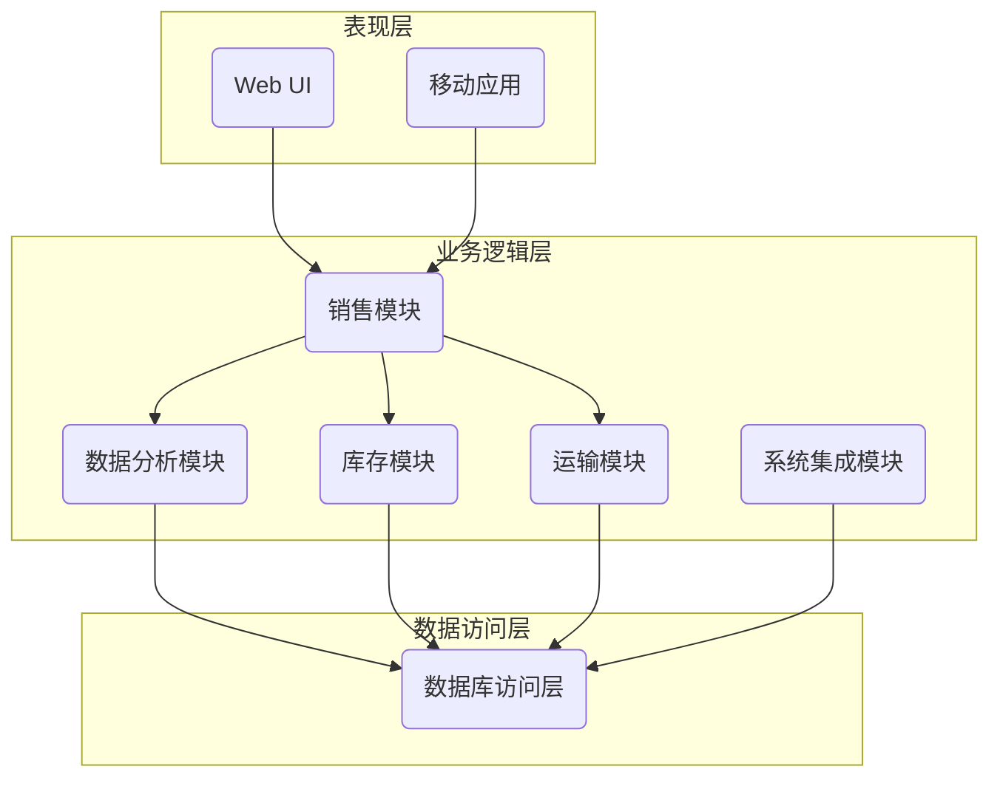

# 煤炭销售系统详细设计与具体代码实现

## 1. 背景介绍

### 1.1 煤炭行业概况

煤炭作为一种不可再生的化石燃料，在全球能源结构中仍然占有重要地位。根据国际能源署(IEA)的数据,2019年全球一次能源消费中,煤炭占比约27%,是仅次于石油和天然气的第三大能源。煤炭主要用于发电、钢铁生产和其他工业领域。

### 1.2 煤炭销售系统的必要性

随着煤炭行业的不断发展,煤矿企业面临着日益复杂的销售管理需求。传统的手工记录和人工处理方式已经无法满足现代化管理的要求,因此需要开发一套完整的煤炭销售管理系统来提高工作效率、降低运营成本、优化决策过程。

### 1.3 系统目标

本文将详细介绍一个煤炭销售管理系统的设计与实现,该系统旨在实现以下目标:

- 实现煤炭销售全流程的自动化管理
- 提供准确及时的销售数据分析
- 优化库存管理和运输调度
- 支持移动端访问和在线交易
- 集成企业内外部系统,实现数据共享

## 2. 核心概念与联系

### 2.1 系统架构

煤炭销售系统通常采用经典的三层架构,包括:

- **表现层(Presentation Layer)**: 提供用户界面,负责数据展示和用户交互
- **业务逻辑层(Business Logic Layer)**: 实现系统的核心业务流程和规则
- **数据访问层(Data Access Layer)**: 负责对底层数据库的访问和操作



### 2.2 核心概念

- **销售订单(Sales Order)**: 记录客户购买煤炭的详细信息,包括煤炭品种、数量、价格、交货时间等。
- **库存管理(Inventory Management)**: 实时监控煤炭库存水平,并根据销售订单和运输计划调配库存。
- **运输计划(Transport Planning)**: 合理规划运输路线和车辆调度,确保煤炭按时送达客户。
- **数据分析(Data Analytics)**: 对历史销售数据进行多维度分析,发现潜在规律,支持决策制定。
- **系统集成(System Integration)**: 将销售系统与企业其他系统(如ERP、财务系统等)集成,实现数据共享。

### 2.3 关键流程

1. **销售订单处理流程**
    - 录入客户订单信息 -> 校验库存 -> 安排运输 -> 出库发货 -> 开具发票 -> 收款结算
2. **库存管控流程**  
    - 采购入库 -> 实时监控库存 -> 根据订单和安全库存自动补货
3. **运输调度流程**
    - 制定运输计划 -> 分配运输任务 -> 实时跟踪运输状态 -> 处理异常
4. **数据分析流程**
    - 采集销售/库存/运输等数据 -> 汇总分析 -> 生成报表 -> 辅助决策

## 3. 核心算法原理具体操作步骤

### 3.1 库存优化算法

为了实现库存的科学管理,我们需要一种高效的库存优化算法,在满足客户需求的同时,尽可能降低库存成本。这里介绍一种常用的算法:

**经典经济订货模型算法(Economic Order Quantity, EOQ)**

EOQ模型通过计算最优订货量,使得每次订货的订购成本与库存持有成本之和达到最小。算法步骤如下:

1. 确定相关参数:
    - D: 年度需求量(吨)
    - C: 每次订货的订购成本(元/次)  
    - H: 每吨煤炭的年库存持有成本(元/吨/年)

2. 计算最优订货量Q*:

$$Q^* = \sqrt{\frac{2DC}{H}}$$

3. 确定最优订货周期T*和最小总成本TC:

$$T^*=\frac{Q^*}{D}$$  

$$TC=\frac{DH}{2}+\frac{DC}{Q^*}$$

4. 设置库存控制原则:
    - 当库存降至再订货点时,下订单Q*
    - 再订货点 = 最大预期需求量(在订货周期+订货延迟期内) 

通过EOQ模型,我们可以有效地权衡订购成本和库存持有成本,实现库存的经济化运作。

### 3.2 运输路径规划算法

为了降低运输成本并提高效率,需要合理规划运输路径。这里介绍一种常用的运输路径规划算法:

**Dijkstra最短路径算法**

Dijkstra算法可以计算出单源最短路径树,即从某个节点到其他节点的最短路径的集合。算法步骤如下:

1. 构建图G(V,E),其中V为节点集合,E为边的集合,边的权重表示路径长度。
2. 初始化源点到所有其他点的距离为无穷大,源点到自身的距离为0。
3. 从源点开始,每次选取当前最短路径的节点。
4. 更新该节点到其他节点的距离,如果新距离更短则进行更新。
5. 重复第3、4步骤,直到所有节点的最短路径都找到为止。

以下是Dijkstra算法的Python伪代码:

```python
def dijkstra(graph, source):
    dist = {node: float('inf') for node in graph}
    dist[source] = 0
    pq = [(0, source)]
    
    while pq:
        cur_dist, cur_node = heapq.heappop(pq)
        if cur_dist > dist[cur_node]:
            continue
            
        for neighbor, weight in graph[cur_node].items():
            new_dist = cur_dist + weight
            if new_dist < dist[neighbor]:
                dist[neighbor] = new_dist
                heapq.heappush(pq, (new_dist, neighbor))
                
    return dist
```

通过Dijkstra算法,可以快速计算出煤矿到各个目的地的最短路径,从而优化运输线路和降低成本。

## 4. 数学模型和公式详细讲解举例说明

### 4.1 需求预测模型

为了更好地管控库存水平,我们需要对未来的煤炭需求进行准确预测。这里介绍一种常用的时间序列预测模型:

**ARIMA(自回归移动平均模型)**

ARIMA模型由三个部分组成:

- AR(Auto Regressive): 自回归部分,表示序列当前值与过去值之间的关系。
- I(Integrated): 差分阶数,用于消除序列的非平稳性。  
- MA(Moving Average): 移动平均部分,表示序列当前值与过去误差项之间的关系。

ARIMA模型的一般形式为ARIMA(p,d,q),其中:

- p: 自回归阶数
- d: 差分阶数 
- q: 移动平均阶数

对于给定的时间序列数据$\{x_t\}$,ARIMA(p,d,q)模型可表示为:

$$x_t' = \phi_1x_{t-1}' + \phi_2x_{t-2}' + ... + \phi_px_{t-p}' + \theta_1\epsilon_{t-1} + \theta_2\epsilon_{t-2} + ... + \theta_q\epsilon_{t-q} + \epsilon_t$$

其中:
- $x_t'$是序列$\{x_t\}$经过d阶差分后的新序列
- $\phi_i(i=1,2,...,p)$是自回归系数
- $\theta_j(j=1,2,...,q)$是移动平均系数
- $\epsilon_t$是白噪声误差序列

通过估计ARIMA模型的参数,我们可以对未来的需求量进行准确预测,从而指导生产计划和库存控制。

### 4.2 价格优化模型

合理的定价策略对于煤炭销售至关重要。这里介绍一种基于回归模型的价格优化方法:

假设煤炭的销售价格P受如下因素影响:
- x1: 煤炭品质(热值、硫分等)
- x2: 运输距离
- x3: 市场供需状况
- ...

我们可以构建如下多元线性回归模型:

$$P = \beta_0 + \beta_1x_1 + \beta_2x_2 + \beta_3x_3 + ... + \epsilon$$

其中$\beta_i(i=0,1,2,...)$是回归系数,$\epsilon$是随机误差项。

通过对历史数据进行回归分析,我们可以估计出各个系数$\beta_i$的值。从而得到如下价格估算公式:

$$\hat{P} = \hat{\beta_0} + \hat{\beta_1}x_1 + \hat{\beta_2}x_2 + \hat{\beta_3}x_3 + ...$$

在给定影响因素的情况下,我们可以计算出煤炭的合理销售价格$\hat{P}$。同时,通过优化影响因素(如提高煤炭品质、缩短运输距离等),可以进一步提高销售价格。

该模型不仅可用于煤炭定价,也可推广至其他产品和服务的价格优化。

## 5. 项目实践:代码实例和详细解释说明  

### 5.1 系统架构实现

我们基于Python的Django Web框架,采用模型-视图-模板(MVT)架构模式实现了煤炭销售系统。以下是主要模块及其代码示例:

**models.py**
```python
from django.db import models

class Coal(models.Model):
    name = models.CharField(max_length=100)
    quality = models.FloatField()
    price = models.DecimalField(max_digits=10, decimal_places=2)
    
class SalesOrder(models.Model):
    customer = models.ForeignKey(Customer, on_delete=models.CASCADE)
    coal = models.ForeignKey(Coal, on_delete=models.CASCADE)
    quantity = models.PositiveIntegerField()
    order_date = models.DateField()
    delivery_date = models.DateField()

class Inventory(models.Model):
    coal = models.ForeignKey(Coal, on_delete=models.CASCADE)
    quantity = models.PositiveIntegerField()
    location = models.CharField(max_length=100)
```

**views.py**  
```python
from django.shortcuts import render
from .models import SalesOrder, Inventory
from .forms import SalesOrderForm

def sales_order(request):
    if request.method == 'POST':
        form = SalesOrderForm(request.POST)
        if form.is_valid():
            order = form.save()
            check_inventory(order)
            return redirect('order_success')
    else:
        form = SalesOrderForm()
    return render(request, 'sales_order.html', {'form': form})
        
def check_inventory(order):
    coal = order.coal
    required = order.quantity
    inventory = Inventory.objects.filter(coal=coal)
    total = sum(inv.quantity for inv in inventory)
    if total >= required:
        allocate_inventory(order, inventory)
    else:
        replenish_inventory(coal, required - total)
        
def allocate_inventory(order, inventory):
    ...
        
def replenish_inventory(coal, quantity):
    ...
```

**templates/sales_order.html**
```html



  <h2>Create Sales Order</h2>
  <form method="post">
    
    {{ form.as_p }}
    <button type="submit">Submit</button>
  </form>

```

上述代码实现了销售订单的录入、库存检查和分配等核心功能。其他模块如运输调度、数据分析等类似实现。

### 5.2 库存优化算法实现

以下是Python实现的经典经济订货模型(EOQ)算法:

```python
import math

def calculate_eoq(D, C, H):
    """
    计算最优订货量和最小总成本
    参数:
        D: 年度需求量(吨)
        C: 每次订货成本(元/次)
        H: 每吨库存持有成本(元/吨/年)
    返回:
        Q*: 最优订货量(吨)
        T*: 最优订货周期(年)
        TC: 最小总成本(元/年)
    """
    Q_star = math.sqrt(