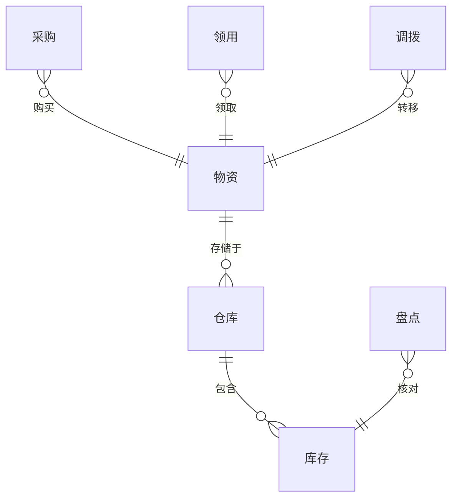

## 物资管理系统详细设计与具体代码实现

作者：禅与计算机程序设计艺术

## 1. 背景介绍

### 1.1. 物资管理的重要性

在当今快速发展的商业环境中，高效的物资管理对于企业的运营至关重要。从原材料采购到产品交付，每一个环节都离不开对物资的有效管理。传统的物资管理方式往往依赖于人工操作，存在着效率低下、信息不透明、数据易出错等问题。为了解决这些问题，越来越多的企业开始采用信息化手段来构建物资管理系统，以提高物资管理的效率和准确性。

### 1.2. 物资管理系统概述

物资管理系统（Materials Management System，MMS）是指利用计算机技术对企业生产经营过程中所需的各种物资进行管理的信息系统。它涵盖了物资的采购、仓储、库存、领用、调拨、盘点等各个环节，旨在实现物资信息的集中管理、资源的优化配置和业务流程的自动化。

### 1.3. 本文目标

本文旨在详细介绍一个基于现代软件工程方法的物资管理系统的设计与实现过程。我们将从需求分析、系统设计、数据库设计、代码实现等方面进行详细阐述，并结合实际案例进行说明，帮助读者深入理解物资管理系统的构建过程。

## 2. 核心概念与联系

### 2.1. 物资

物资是指企业生产经营过程中所需要的各种原材料、半成品、成品、燃料、工具、设备等。

### 2.2. 仓库

仓库是指用于存储物资的场所，可以是独立的建筑物，也可以是工厂内部的特定区域。

### 2.3. 库存

库存是指企业在一定时期内实际拥有的物资数量。

### 2.4. 采购

采购是指企业根据生产经营需要，从外部供应商处购买物资的行为。

### 2.5. 领用

领用是指企业内部部门或个人根据工作需要，从仓库领取物资的行为。

### 2.6. 调拨

调拨是指企业内部不同部门或仓库之间进行物资转移的行为。

### 2.7. 盘点

盘点是指企业定期或不定期地对仓库中的实际库存进行清点核对的行为。

### 2.8. 关系图

下面使用Mermaid语法绘制核心概念关系图：



## 3. 核心算法原理具体操作步骤

### 3.1. 库存管理算法

#### 3.1.1. 先进先出法（FIFO）

先进先出法是指先入库的物资先出库，后入库的物资后出库的计价方法。这种方法适用于不易变质、不易过时的物资。

#### 3.1.2. 后进先出法（LIFO）

后进先出法是指后入库的物资先出库，先入库的物资后出库的计价方法。这种方法适用于易变质、易过时的物资。

#### 3.1.3. 加权平均法

加权平均法是指根据每次入库物资的数量和单价计算出加权平均单价，然后根据出库数量计算出出库成本的计价方法。这种方法适用于价值波动较大的物资。

### 3.2. 采购管理算法

#### 3.2.1. 经济订货批量模型（EOQ）

经济订货批量模型是指在考虑订货成本和库存成本的情况下，确定最佳订货数量的模型。

#### 3.2.2. 材料需求计划（MRP）

材料需求计划是指根据产品的生产计划，确定原材料、零部件等的采购计划。

## 4. 数学模型和公式详细讲解举例说明

### 4.1. 经济订货批量模型（EOQ）

**公式：**

$$ Q^* = \sqrt{\frac{2DS}{H}} $$

**其中：**

*   $Q^*$：经济订货批量
*   $D$：年需求量
*   $S$：每次订货成本
*   $H$：单位库存成本

**举例说明：**

假设某企业每年需要采购某种原材料 1000 吨，每次订货成本为 100 元，单位库存成本为 2 元/吨，则该企业的经济订货批量为：

$$ Q^* = \sqrt{\frac{2 \times 1000 \times 100}{2}} = 100 \text{吨} $$

### 4.2. 加权平均法

**公式：**

$$ \text{加权平均单价} = \frac{\text{期初库存金额} + \text{本期采购金额}}{\text{期初库存数量} + \text{本期采购数量}} $$

$$ \text{出库成本} = \text{出库数量} \times \text{加权平均单价} $$

**举例说明：**

假设某企业期初库存某种物资 100 件，单价为 10 元/件，本期采购该物资 200 件，单价为 12 元/件，则该企业本期加权平均单价为：

$$ \text{加权平均单价} = \frac{100 \times 10 + 200 \times 12}{100 + 200} = 11.33 \text{元/件} $$

如果该企业本期出库该物资 150 件，则该企业本期出库成本为：

$$ \text{出库成本} = 150 \times 11.33 = 1700 \text{元} $$

## 5. 项目实践：代码实例和详细解释说明

### 5.1. 技术选型

*   编程语言：Java
*   数据库：MySQL
*   Web 框架：Spring Boot
*   前端框架：Vue.js

### 5.2. 数据库设计

```sql
-- 物资表
CREATE TABLE `material` (
  `id` int(11) NOT NULL AUTO_INCREMENT COMMENT '物资ID',
  `name` varchar(255) NOT NULL COMMENT '物资名称',
  `spec` varchar(255) DEFAULT NULL COMMENT '物资规格',
  `unit` varchar(255) DEFAULT NULL COMMENT '物资单位',
  PRIMARY KEY (`id`)
) ENGINE=InnoDB DEFAULT CHARSET=utf8mb4;

-- 仓库表
CREATE TABLE `warehouse` (
  `id` int(11) NOT NULL AUTO_INCREMENT COMMENT '仓库ID',
  `name` varchar(255) NOT NULL COMMENT '仓库名称',
  `address` varchar(255) DEFAULT NULL COMMENT '仓库地址',
  PRIMARY KEY (`id`)
) ENGINE=InnoDB DEFAULT CHARSET=utf8mb4;

-- 库存表
CREATE TABLE `inventory` (
  `id` int(11) NOT NULL AUTO_INCREMENT COMMENT '库存ID',
  `material_id` int(11) NOT NULL COMMENT '物资ID',
  `warehouse_id` int(11) NOT NULL COMMENT '仓库ID',
  `quantity` int(11) NOT NULL COMMENT '库存数量',
  PRIMARY KEY (`id`),
  KEY `fk_inventory_material` (`material_id`),
  KEY `fk_inventory_warehouse` (`warehouse_id`),
  CONSTRAINT `fk_inventory_material` FOREIGN KEY (`material_id`) REFERENCES `material` (`id`),
  CONSTRAINT `fk_inventory_warehouse` FOREIGN KEY (`warehouse_id`) REFERENCES `warehouse` (`id`)
) ENGINE=InnoDB DEFAULT CHARSET=utf8mb4;
```

### 5.3. 代码实现

#### 5.3.1. 物资管理

```java
@RestController
@RequestMapping("/api/material")
public class MaterialController {

    @Autowired
    private MaterialService materialService;

    @PostMapping
    public ResponseEntity<Material> create(@RequestBody Material material) {
        Material createdMaterial = materialService.create(material);
        return ResponseEntity.status(HttpStatus.CREATED).body(createdMaterial);
    }

    @GetMapping("/{id}")
    public ResponseEntity<Material> getById(@PathVariable Integer id) {
        Material material = materialService.getById(id);
        return ResponseEntity.ok(material);
    }

    @PutMapping("/{id}")
    public ResponseEntity<Material> update(@PathVariable Integer id, @RequestBody Material material) {
        Material updatedMaterial = materialService.update(id, material);
        return ResponseEntity.ok(updatedMaterial);
    }

    @DeleteMapping("/{id}")
    public ResponseEntity<Void> delete(@PathVariable Integer id) {
        materialService.delete(id);
        return ResponseEntity.noContent().build();
    }
}
```

#### 5.3.2. 库存管理

```java
@RestController
@RequestMapping("/api/inventory")
public class InventoryController {

    @Autowired
    private InventoryService inventoryService;

    @PostMapping
    public ResponseEntity<Inventory> create(@RequestBody Inventory inventory) {
        Inventory createdInventory = inventoryService.create(inventory);
        return ResponseEntity.status(HttpStatus.CREATED).body(createdInventory);
    }

    @GetMapping("/{id}")
    public ResponseEntity<Inventory> getById(@PathVariable Integer id) {
        Inventory inventory = inventoryService.getById(id);
        return ResponseEntity.ok(inventory);
    }

    @PutMapping("/{id}")
    public ResponseEntity<Inventory> update(@PathVariable Integer id, @RequestBody Inventory inventory) {
        Inventory updatedInventory = inventoryService.update(id, inventory);
        return ResponseEntity.ok(updatedInventory);
    }

    @DeleteMapping("/{id}")
    public ResponseEntity<Void> delete(@PathVariable Integer id) {
        inventoryService.delete(id);
        return ResponseEntity.noContent().build();
    }
}
```

## 6. 实际应用场景

### 6.1. 制造业

*   原材料采购管理
*   生产计划与物料需求计划
*   库存管理与控制
*   产品追溯与质量管理

### 6.2. 零售业

*   商品采购与供应商管理
*   门店库存管理与补货
*   线上线下销售与库存同步
*   商品促销与营销活动管理

### 6.3. 物流业

*   货物运输与跟踪管理
*   仓储管理与库存优化
*   配送路线规划与调度
*   物流成本控制与分析

## 7. 工具和资源推荐

### 7.1. 开源物资管理系统

*   Odoo
*   ERPNext
*   Dolibarr

### 7.2. 物资管理软件

*   用友U8
*   金蝶K/3
*   SAP ERP

### 7.3. 在线学习资源

*   网易云课堂
*   腾讯课堂
*   慕课网

## 8. 总结：未来发展趋势与挑战

### 8.1. 未来发展趋势

*   **智能化:**  利用人工智能、大数据等技术，实现物资管理的智能化、自动化和预测化。
*   **移动化:**  开发基于移动端的物资管理系统，方便用户随时随地进行物资管理操作。
*   **云计算:**  将物资管理系统部署到云平台，降低企业IT成本，提高系统可靠性和安全性。
*   **物联网:**  将物资与物联网技术相结合，实现物资的实时监控、跟踪和追溯。

### 8.2. 面临的挑战

*   **数据安全:**  随着物资管理系统存储的数据越来越重要，数据安全问题日益突出。
*   **系统集成:**  企业内部往往存在多个信息系统，如何实现物资管理系统与其他系统的有效集成是一个挑战。
*   **人才培养:**  物资管理系统的设计、开发和维护需要专业的技术人才，人才培养是一个长期任务。

## 9. 附录：常见问题与解答

### 9.1. 如何选择合适的物资管理系统？

企业在选择物资管理系统时，应根据自身规模、业务特点、预算等因素进行综合考虑。

### 9.2. 物资管理系统实施需要注意哪些问题？

物资管理系统实施需要注意的问题包括：需求调研、系统选型、数据准备、人员培训、系统测试等。

### 9.3. 如何提高物资管理效率？

提高物资管理效率的方法包括：优化业务流程、加强信息化建设、提高人员素质等。
