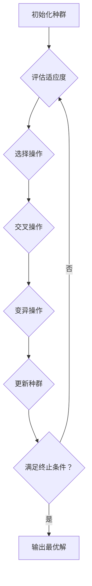

# 环境保护：遗传算法在环境监测和治理中的应用

作者：禅与计算机程序设计艺术

## 1. 背景介绍

### 1.1 环境问题日益严峻

随着工业化和城市化的快速发展，环境污染问题日益突出，对人类健康和生态系统构成了严重威胁。传统的环境监测和治理方法面临着效率低、成本高、难以应对复杂环境问题等挑战。

### 1.2 智能算法为环境保护提供新思路

近年来，人工智能技术的快速发展为环境保护提供了新的思路和方法。其中，遗传算法作为一种模拟自然进化过程的优化算法，在解决复杂环境问题方面展现出巨大潜力。

### 1.3 本文内容概述

本文将深入探讨遗传算法在环境监测和治理中的应用，详细介绍其核心概念、算法原理、应用案例以及未来发展趋势。

## 2. 核心概念与联系

### 2.1 遗传算法概述

遗传算法是一种模拟自然选择和遗传机制的优化算法，其基本思想是将问题的解表示为染色体，通过模拟自然进化过程中的选择、交叉和变异等操作，不断迭代优化种群，最终得到问题的最优解或近似最优解。

### 2.2 遗传算法基本要素

*   **种群（Population）：** 由多个个体组成的集合，每个个体代表问题的一个潜在解。
*   **染色体（Chromosome）：** 用于表示个体的基因序列，每个基因代表问题解的一个特征。
*   **适应度函数（Fitness Function）：** 用于评估个体对环境的适应程度，即解的优劣。
*   **选择操作（Selection）：** 根据个体的适应度，选择优秀的个体进行繁殖。
*   **交叉操作（Crossover）：** 将两个父代染色体的部分基因进行交换，产生新的子代染色体。
*   **变异操作（Mutation）：** 对染色体的某些基因进行随机改变，以增加种群的多样性。

### 2.3 遗传算法与环境监测和治理的联系

遗传算法可以应用于环境监测和治理的多个方面，例如：

*   **环境监测数据分析：** 利用遗传算法对环境监测数据进行分析，识别污染源、预测污染趋势、评估环境风险等。
*   **污染物排放优化控制：** 利用遗传算法优化工业生产过程，降低污染物排放量，实现节能减排的目标。
*   **环境治理方案设计：** 利用遗传算法设计环境治理方案，例如优化污水处理工艺、选择最佳的污染场地修复方案等。

## 3. 核心算法原理具体操作步骤

### 3.1 算法流程图



### 3.2 具体操作步骤

1.  **初始化种群：** 随机生成一定数量的个体，构成初始种群。
2.  **评估适应度：** 计算每个个体的适应度值，即解的优劣程度。
3.  **选择操作：** 根据个体的适应度值，选择优秀的个体进行繁殖。常用的选择方法包括轮盘赌选择、锦标赛选择等。
4.  **交叉操作：** 将两个父代染色体的部分基因进行交换，产生新的子代染色体。常用的交叉方法包括单点交叉、多点交叉等。
5.  **变异操作：** 对染色体的某些基因进行随机改变，以增加种群的多样性。常用的变异方法包括位翻转变异、高斯变异等。
6.  **更新种群：** 用新生成的子代个体替换部分或全部父代个体，形成新的种群。
7.  **判断是否满足终止条件：** 例如达到最大迭代次数、找到满足要求的解等。
8.  **输出结果：** 如果满足终止条件，则输出最优解或近似最优解；否则，返回步骤 2 继续迭代。

## 4. 数学模型和公式详细讲解举例说明

### 4.1 适应度函数设计

适应度函数是遗传算法的核心，其设计直接影响算法的效率和最终解的质量。在环境监测和治理中，适应度函数的设计需要考虑具体的应用场景和目标。

**示例：** 假设要利用遗传算法优化污水处理厂的处理工艺，以降低 COD（化学需氧量）排放量。则可以将 COD 排放量作为适应度函数的一个指标，排放量越低，适应度值越高。

### 4.2 选择操作

**轮盘赌选择：**

每个个体被选中的概率与其适应度值成正比。

$$
P_i = \frac{f_i}{\sum_{j=1}^N f_j}
$$

其中，$P_i$ 表示个体 $i$ 被选中的概率，$f_i$ 表示个体 $i$ 的适应度值，$N$ 表示种群大小。

**锦标赛选择：**

从种群中随机选择 k 个个体，其中适应度值最高的个体被选中。

### 4.3 交叉操作

**单点交叉：**

随机选择一个交叉点，将两个父代染色体在该点处断开，并将断开的部分进行交换，产生两个新的子代染色体。

**多点交叉：**

随机选择多个交叉点，将两个父代染色体在这些点处断开，并将断开的部分进行交换，产生两个新的子代染色体。

### 4.4 变异操作

**位翻转变异：**

随机选择染色体上的一个基因位，将其值取反。

**高斯变异：**

对染色体上的每个基因值，添加一个服从高斯分布的随机数。

## 5. 项目实践：代码实例和详细解释说明

### 5.1 环境监测数据分析

**问题描述：**

利用遗传算法对城市空气质量监测数据进行分析，识别主要污染源。

**代码实例：**

```python
import random

# 定义适应度函数
def fitness(chromosome):
    # 计算污染源排放量与监测数据之间的相关系数
    # ...
    return correlation_coefficient

# 定义遗传算法参数
population_size = 100
chromosome_length = 10
mutation_rate = 0.01
max_generations = 100

# 初始化种群
population = []
for i in range(population_size):
    chromosome = [random.randint(0, 1) for j in range(chromosome_length)]
    population.append(chromosome)

# 迭代优化
for generation in range(max_generations):
    # 评估适应度
    fitness_values = [fitness(chromosome) for chromosome in population]

    # 选择操作
    # ...

    # 交叉操作
    # ...

    # 变异操作
    # ...

    # 更新种群
    # ...

# 输出最优解
best_chromosome = max(population, key=fitness)
print(f"Best chromosome: {best_chromosome}")
print(f"Fitness value: {fitness(best_chromosome)}")
```

**代码解释：**

*   `fitness()` 函数定义了适应度函数，用于评估每个染色体的优劣程度。
*   `population_size`、`chromosome_length`、`mutation_rate`、`max_generations` 定义了遗传算法的参数。
*   代码中使用了循环迭代的方式进行优化，每次迭代都会执行选择、交叉、变异等操作，并更新种群。
*   最后，输出最优解及其适应度值。

### 5.2 污染物排放优化控制

**问题描述：**

利用遗传算法优化工厂的生产计划，以降低污染物排放量。

**代码实例：**

```python
import random

# 定义适应度函数
def fitness(chromosome):
    # 计算生产计划的污染物排放量
    # ...
    return emissions

# 定义遗传算法参数
# ...

# 初始化种群
# ...

# 迭代优化
# ...

# 输出最优解
best_chromosome = min(population, key=fitness)
print(f"Best chromosome: {best_chromosome}")
print(f"Emissions: {fitness(best_chromosome)}")
```

**代码解释：**

*   `fitness()` 函数定义了适应度函数，用于评估每个生产计划的污染物排放量。
*   代码中使用了循环迭代的方式进行优化，每次迭代都会执行选择、交叉、变异等操作，并更新种群。
*   最后，输出污染物排放量最小的生产计划及其排放量。

## 6. 实际应用场景

### 6.1 环境监测

*   **空气质量监测与预警：** 利用遗传算法识别主要污染源、预测污染趋势，为空气质量预警提供依据。
*   **水质监测与评价：** 利用遗传算法分析水质监测数据，评估水体污染程度，识别污染源。
*   **土壤污染监测与修复：** 利用遗传算法优化土壤污染监测方案，识别污染区域，设计土壤修复方案。

### 6.2 环境治理

*   **工业污染控制：** 利用遗传算法优化工业生产工艺，降低污染物排放量。
*   **污水处理：** 利用遗传算法优化污水处理工艺，提高处理效率，降低处理成本。
*   **固体废弃物处理：** 利用遗传算法优化垃圾分类、收集、运输和处理方案。
*   **噪声污染控制：** 利用遗传算法设计噪声屏障、优化交通路线，降低噪声污染。

## 7. 工具和资源推荐

### 7.1 遗传算法工具包

*   **DEAP：** Python 分布式进化算法库，提供了丰富的遗传算法组件和示例代码。
*   **GAlib：** C++ 遗传算法库，提供了多种遗传算法操作符和数据结构。
*   **Pyevolve：** Python 遗传算法框架，提供了灵活的配置选项和可视化工具。

### 7.2 环境数据资源

*   **国家环境监测总站：** 提供全国环境监测数据，包括空气质量、水质、土壤等。
*   **美国环保署：** 提供美国环境监测数据，包括空气质量、水质、污染物排放等。
*   **全球环境监测系统：** 提供全球环境监测数据，包括气候变化、生物多样性、水资源等。

## 8. 总结：未来发展趋势与挑战

### 8.1 未来发展趋势

*   **与其他人工智能技术的融合：** 将遗传算法与机器学习、深度学习等技术相结合，提高环境监测和治理的智能化水平。
*   **大数据驱动下的环境保护：** 利用大数据技术分析海量环境数据，为遗传算法提供更精准的优化目标和约束条件。
*   **智能化环境监测和治理平台：** 开发基于遗传算法的智能化环境监测和治理平台，实现环境问题的自动识别、预警和处理。

### 8.2 面临挑战

*   **数据质量问题：** 环境监测数据的准确性和可靠性直接影响遗传算法的优化效果。
*   **模型复杂度问题：** 构建能够准确描述复杂环境问题的数学模型是遗传算法应用的一大挑战。
*   **计算效率问题：** 遗传算法的计算量较大，如何提高算法效率是未来研究的重点。

## 9. 附录：常见问题与解答

### 9.1 遗传算法与其他优化算法的区别？

遗传算法是一种全局优化算法，而其他优化算法，例如梯度下降法，容易陷入局部最优解。

### 9.2 遗传算法的参数如何设置？

遗传算法的参数设置需要根据具体的应用场景进行调整，一般可以通过实验的方式确定最佳参数组合。

### 9.3 遗传算法的应用有哪些局限性？

遗传算法的计算量较大，对于大规模问题，计算效率较低。此外，遗传算法对初始种群的选择比较敏感，不同的初始种群可能会导致不同的优化结果。