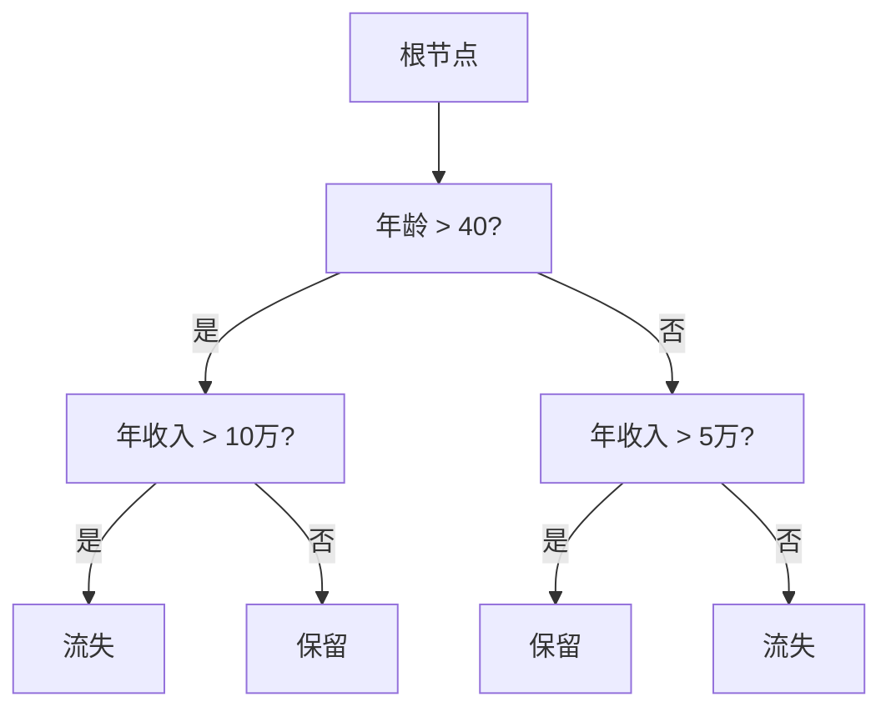

# 电信运营商客户流失分析与预测

## 1.背景介绍

### 1.1 电信行业概况

电信行业是现代经济的重要支柱,为各行业提供通信网络和服务支持。随着移动互联网、物联网和5G技术的快速发展,电信行业正经历着深刻的变革。用户需求日益多样化,竞争加剧,客户流失成为电信运营商亟待解决的重大问题。

### 1.2 客户流失的影响

客户流失不仅直接导致收入和市场份额下降,还会产生获取新客户的额外营销成本。根据行业数据,获取一个新客户的成本是留住一个老客户的5-10倍。因此,有效预防客户流失对电信运营商的盈利能力和长期发展至关重要。

### 1.3 客户流失分析的必要性

通过对已流失客户的行为数据进行深入分析,可以发现客户流失的潜在规律和风险因素。基于这些发现,电信运营商可以制定针对性的营销策略,提高客户满意度和留存率。同时,对潜在流失客户进行早期识别和精准营销,将有助于降低客户流失率。

## 2.核心概念与联系

### 2.1 客户流失

客户流失是指客户终止与企业的业务关系或服务订购,转而选择竞争对手。在电信行业,客户流失往往表现为用户退订服务或转网。

### 2.2 客户生命周期

客户生命周期描述了客户与企业关系的不同阶段,包括获取、发展、保留和离开。通过分析客户生命周期,可以制定差异化的营销策略,实现精准营销。

### 2.3 客户价值

客户价值是指客户为企业带来的收益和利润。通常,高价值客户的留存更为重要。电信运营商需要根据客户价值,制定相应的客户关系管理策略。

### 2.4 客户分群

将客户划分为不同的群组,有助于更好地了解客户需求,制定精准营销策略。常见的客户分群方法包括人口统计学、行为和价值等。

## 3.核心算法原理具体操作步骤

### 3.1 数据预处理

#### 3.1.1 数据清洗

- 处理缺失值:填充、插值或删除
- 去除重复数据
- 处理异常值

#### 3.1.2 数据转换

- 类别编码:one-hot编码、标签编码等
- 数据归一化:最大最小归一化、z-score归一化等
- 数据分段:年龄、收入等分箱

#### 3.1.3 特征工程

- 特征选择:过滤式、包裹式、嵌入式等
- 特征构造:多项式、交叉特征等

### 3.2 模型构建

客户流失分析常用的机器学习模型包括:

#### 3.2.1 逻辑回归

适用于二分类问题,模型简单且可解释性强。

$$\ln\left(\frac{p}{1-p}\right)=\beta_0+\beta_1x_1+\beta_2x_2+...+\beta_nx_n$$

其中$p$为正例概率,$x_i$为特征,$\beta_i$为权重系数。

#### 3.2.2 决策树

根据特征对样本进行分类,形成决策树模型。包括ID3、C4.5和CART等算法。

树的生成使用信息增益或基尼指数作为选择特征的标准。

#### 3.2.3 随机森林

构建多棵决策树,对单个树的高方差问题进行改善,整体具有更好的泛化能力。

#### 3.2.4 人工神经网络

- 前馈神经网络:多层感知器
- 深度学习模型:CNN、RNN等

#### 3.2.5 集成学习

- Boosting:AdaBoost、Gradient Boosting等
- Bagging:随机森林、Extra Trees等
- Stacking:多个模型预测结果集成

### 3.3 模型评估

- 划分训练集和测试集
- 混淆矩阵:TP、TN、FP、FN
- 准确率、精确率、召回率、F1
- ROC曲线和AUC

### 3.4 优化调参

- 交叉验证:K折、留一法等
- 网格搜索、随机搜索等超参数优化
- 特征重要性分析,迭代特征工程

## 4. 数学模型和公式详细讲解举例说明

### 4.1 逻辑回归

逻辑回归模型通过对数几率(log odds)将自变量$X$映射到$(0,1)$区间内的概率$p$。

$$\ln\left(\frac{p}{1-p}\right)=\beta_0+\beta_1x_1+\beta_2x_2+...+\beta_nx_n$$

其中:

- $p$为正例概率
- $x_i$为特征
- $\beta_i$为权重系数

对数几率为线性方程,通过最大似然估计可以求解参数$\beta$。

例如,假设有两个特征$x_1$(年龄)和$x_2$(年收入),逻辑回归模型为:

$$\ln\left(\frac{p}{1-p}\right)=0.03x_1-0.07x_2+5$$

对于一位30岁、年收入8万的用户,其流失概率为:

$$p=\frac{e^{0.03*30-0.07*80000+5}}{1+e^{0.03*30-0.07*80000+5}}=0.37$$

即37%的概率会发生流失。

### 4.2 决策树

决策树通过if-then规则将特征空间划分为互不相交的区域,每个区域对应一个类别。

以年龄和年收入作为特征构建的决策树示例:



决策树生成算法通常基于信息增益或基尼指数选择最优分割特征,使决策树具有较好的分类性能。

### 4.3 评估指标

#### 4.3.1 准确率

$$Accuracy=\frac{TP+TN}{TP+TN+FP+FN}$$

其中TP为真正例,TN为真负例,FP为假正例,FN为假负例。

准确率评估了正确分类的比例,但在正负例数量差距较大时,准确率可能会产生偏差。

#### 4.3.2 精确率和召回率

$$Precision=\frac{TP}{TP+FP}$$
$$Recall=\frac{TP}{TP+FN}$$

精确率评估了预测为正例的样本中真正例的比例,召回率评估了所有真正例被成功预测的比例。

通常需要在精确率和召回率之间权衡。

#### 4.3.3 F1值

$$F1=2*\frac{Precision*Recall}{Precision+Recall}$$

F1值是精确率和召回率的调和平均,综合考虑了两者。

#### 4.3.4 ROC和AUC

ROC(Receiver Operating Characteristic)曲线展示了不同阈值下真正率(TPR)和假正率(FPR)的变化关系。

$$TPR=\frac{TP}{TP+FN},FPR=\frac{FP}{FP+TN}$$

AUC(Area Under Curve)为ROC曲线下的面积,值越大模型性能越好。对于随机猜测,AUC=0.5。

## 5. 项目实践:代码实例和详细解释说明

本节将使用Python中的Scikit-Learn库,基于电信运营商客户流失数据集构建客户流失预测模型。

### 5.1 加载数据

```python
import pandas as pd

data = pd.read_csv('WA_Fn-UseC_-Telco-Customer-Churn.csv')
X = data.drop('Churn', axis=1) # 特征
y = data['Churn'] # 目标变量
```

### 5.2 数据预处理

```python
# 缺失值处理
X = X.fillna(X.mean())

# 类别编码
from sklearn.preprocessing import LabelEncoder
cat_cols = X.dtypes==object
X_cat = X.loc[:,cat_cols]
encoder = LabelEncoder()
X_cat = X_cat.apply(lambda x: encoder.fit_transform(x))
X = X.drop(X_cat.columns, axis=1)
X = pd.concat([X, X_cat], axis=1)
```

### 5.3 特征选择

```python
from sklearn.feature_selection import f_classif, chi2

# 卡方检验选择k个最佳特征
selected = chi2(X, y)[0] < 0.05
X = X.loc[:,selected]
```

### 5.4 模型构建与评估

```python 
from sklearn.model_selection import train_test_split
from sklearn.linear_model import LogisticRegression
from sklearn.tree import DecisionTreeClassifier
from sklearn.ensemble import RandomForestClassifier
from sklearn.metrics import accuracy_score, precision_score, recall_score, f1_score, roc_auc_score

X_train, X_test, y_train, y_test = train_test_split(X, y, test_size=0.2)

models = [LogisticRegression(), DecisionTreeClassifier(), RandomForestClassifier()]

for model in models:
    model.fit(X_train, y_train)
    y_pred = model.predict(X_test)
    
    print(f'{type(model).__name__} 评估指标:')
    print(f'准确率: {accuracy_score(y_test, y_pred):.3f}')
    print(f'精确率: {precision_score(y_test, y_pred):.3f}') 
    print(f'召回率: {recall_score(y_test, y_pred):.3f}')
    print(f'F1值: {f1_score(y_test, y_pred):.3f}')
    print(f'AUC: {roc_auc_score(y_test, model.predict_proba(X_test)[:,1]):.3f}')
```

上述代码对逻辑回归、决策树和随机森林三种模型在测试集上进行了评估。可以根据具体的评估指标选择最优模型。

## 6. 实际应用场景

客户流失分析在电信行业有着广泛的应用,主要包括以下几个方面:

### 6.1 客户细分与营销策略制定

通过对客户数据进行分群,可以更好地了解不同群体的特征和需求,从而制定有针对性的营销策略和服务方案,提高客户满意度和留存率。

### 6.2 客户生命周期管理

根据客户生命周期的不同阶段,采取不同的营销措施。对于新客户,注重获取和发展;对于老客户,注重挽留和维系,最大化客户价值。

### 6.3 客户价值分析

识别高价值客户,优先保留和提供增值服务;对于低价值客户,制定成本节约策略。

### 6.4 个性化营销

基于客户画像和行为特征,为不同客户群提供个性化的产品、服务和营销信息,提升营销效率。

### 6.5 渠道绩效评估

通过分析不同渠道获取的客户的流失情况,评估各渠道的营销效果,优化渠道资源配置。

### 6.6 早期预警与干预

对于被识别出有较高流失风险的客户,提前采取留存措施,如优惠政策、服务升级等,降低实际流失率。

## 7. 工具和资源推荐  

### 7.1 Python生态工具

- Scikit-Learn: 机器学习算法库
- Pandas: 数据处理库  
- Matplotlib/Seaborn: 数据可视化库
- XGBoost/LightGBM: 提升树算法库
- Tensorflow/PyTorch: 深度学习框架

### 7.2 云计算平台

- AWS
- 阿里云
- 腾讯云
- 谷歌云

云平台提供了数据存储、计算资源、机器学习服务等,方便构建和部署模型。

### 7.3 可视化工具

- Tableau
- PowerBI
- Qlik
- D3.js

通过图表和仪表盘直观展示分析结果,辅助决策。

### 7.4 在线学习平台

- Coursera
- edX
- Udacity
- DataCamp

提供机器学习、数据分析等系列课程。

### 7.5 书籍与文献

- 《利用Python进行数据分析》 Wes McKinney
- 《机器学习实战》 Peter Harrington
- 《集体智慧编程》 Toby Segaran
- 《数据挖掘：概念与技术》 Jiawei Han等

## 8. 总结:未来发展趋势与挑战

### 8.1 大数据与云计算