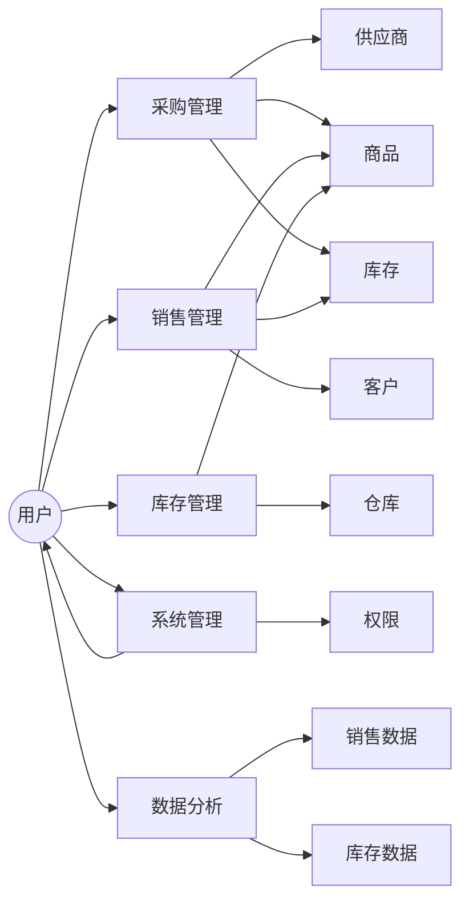

##  电脑公司进销存系统详细设计与具体代码实现

作者：禅与计算机程序设计艺术


## 1. 背景介绍

### 1.1 进销存系统概述
进销存系统，顾名思义，是指企业管理中对商品的进货、销售、库存进行管理的信息系统。它能够帮助企业准确掌握库存情况，优化采购策略，提高销售效率，降低运营成本，是现代企业不可或缺的管理工具。

### 1.2 电脑公司进销存系统的特殊性
电脑公司作为IT行业的典型代表，其进销存系统相较于传统行业，具有以下显著特点：

* **商品种类繁多，更新换代快:** 电脑硬件、软件、周边设备等产品种类繁多，且更新换代速度极快，需要系统能够灵活管理商品信息。
* **价格波动大，需要实时监控:** 电脑产品价格受市场供求关系影响较大，需要系统能够实时跟踪价格变化，并及时调整采购和销售策略。
* **售后服务重要，需要记录跟踪:**  电脑产品售后服务至关重要，需要系统能够记录客户信息、产品维修记录等，以便提供优质的售后服务。
* **数据分析需求高，辅助经营决策:** 电脑公司需要对销售数据、库存数据等进行深入分析，以了解市场趋势、优化产品结构、制定合理的经营策略。

### 1.3 本文目标
本文旨在设计并实现一套适用于电脑公司的进销存系统，以满足其特殊的业务需求。文章将从需求分析、系统设计、代码实现、测试部署等方面进行详细阐述，并结合实际案例进行讲解，帮助读者深入理解进销存系统的原理和实现方法。


## 2. 核心概念与联系

### 2.1 系统用户角色

* **管理员:** 拥有最高权限，负责系统设置、用户管理、数据备份等工作。
* **采购员:** 负责商品采购、供应商管理等工作。
* **销售员:** 负责商品销售、客户管理等工作。
* **仓库管理员:** 负责商品入库、出库、盘点等工作。

### 2.2 主要功能模块

* **采购管理:** 包括采购订单管理、采购入库管理、供应商管理等功能。
* **销售管理:** 包括销售订单管理、销售出库管理、客户管理等功能。
* **库存管理:** 包括商品入库、出库、盘点、调拨等功能。
* **系统管理:** 包括用户管理、权限管理、系统设置等功能。
* **数据分析:** 提供销售统计、库存统计等报表分析功能。

### 2.3  核心概念联系




## 3. 核心算法原理具体操作步骤

### 3.1 库存管理算法

#### 3.1.1  先进先出法 (FIFO)

先进先出法，顾名思义，是指先入库的商品先出库。该算法适用于保质期较短的商品，例如食品、药品等。

**操作步骤:**

1. 商品入库时，记录入库时间和数量。
2. 商品出库时，优先选择最早入库的商品进行出库。
3. 更新库存数量。

**代码示例:**

```python
class Inventory:
    def __init__(self):
        self.items = []

    def add_item(self, item):
        self.items.append(item)

    def remove_item(self):
        if self.items:
            return self.items.pop(0)
        else:
            return None
```

#### 3.1.2  加权平均法

加权平均法是指根据每次入库商品的成本和数量计算出一个平均成本，出库时按照平均成本计算出库商品的成本。该算法适用于成本波动较大的商品，例如原材料等。

**操作步骤:**

1. 商品入库时，记录入库成本、数量和总成本。
2. 计算平均成本 = 总成本 / 总数量。
3. 商品出库时，按照平均成本计算出库商品的成本。
4. 更新库存数量和总成本。

**代码示例:**

```python
class Inventory:
    def __init__(self):
        self.items = []
        self.total_cost = 0
        self.total_quantity = 0

    def add_item(self, cost, quantity):
        self.total_cost += cost * quantity
        self.total_quantity += quantity
        self.items.append((cost, quantity))

    def remove_item(self, quantity):
        if self.total_quantity >= quantity:
            average_cost = self.total_cost / self.total_quantity
            self.total_quantity -= quantity
            self.total_cost -= average_cost * quantity
            return average_cost * quantity
        else:
            return None
```

### 3.2 销售预测算法

#### 3.2.1  移动平均法

移动平均法是指用过去一段时间内的平均销售量来预测未来一段时间的销售量。该算法适用于销售数据波动较小的情况。

**操作步骤:**

1. 选择移动平均的时间周期，例如7天、30天等。
2. 计算过去一段时间内的平均销售量。
3. 用平均销售量预测未来一段时间的销售量。

**代码示例:**

```python
def moving_average(data, period):
    """
    计算移动平均值

    Args:
         销售数据列表
        period: 移动平均的时间周期

    Returns:
        移动平均值列表
    """

    if len(data) < period:
        raise Exception("数据长度必须大于等于时间周期")

    ma = []
    for i in range(period, len(data) + 1):
        ma.append(sum(data[i-period:i]) / period)

    return ma
```

#### 3.2.2  指数平滑法

指数平滑法是指用过去的销售数据加权平均来预测未来一段时间的销售量。该算法适用于销售数据波动较大的情况。

**操作步骤:**

1. 选择平滑系数，通常取值在0.1到0.3之间。
2. 计算第一个预测值为第一个实际销售量。
3. 对于后面的每个预测值，用前一个预测值加上平滑系数乘以实际销售量与前一个预测值之差来计算。

**代码示例:**

```python
def exponential_smoothing(data, alpha):
    """
    计算指数平滑值

    Args:
         销售数据列表
        alpha: 平滑系数

    Returns:
        指数平滑值列表
    """

    if not 0 <= alpha <= 1:
        raise Exception("平滑系数必须在0到1之间")

    es = [data[0]]
    for i in range(1, len(data)):
        es.append(alpha * data[i] + (1 - alpha) * es[i-1])

    return es
```

## 4. 数学模型和公式详细讲解举例说明

### 4.1  经济订货批量模型 (EOQ)

经济订货批量模型 (Economic Order Quantity, EOQ) 是指在每次订货成本和库存持有成本之间找到一个平衡点，以确定最佳的订货批量，从而使总成本最小化。

**公式:**

$$EOQ = \sqrt{\frac{2DS}{H}}$$

**其中:**

* D: 年需求量
* S: 每次订货成本
* H: 每单位商品的年持有成本

**举例说明:**

假设某电脑公司每年销售1000台笔记本电脑，每次订货成本为500元，每台笔记本电脑的年持有成本为100元。

**计算EOQ:**

```
EOQ = sqrt((2 * 1000 * 500) / 100) = 100 台
```

**结论:**

该电脑公司每次应该订购100台笔记本电脑，才能使总成本最小化。


## 5. 项目实践：代码实例和详细解释说明

### 5.1  技术选型

* **编程语言:** Python
* **Web框架:** Django
* **数据库:** MySQL
* **前端框架:** Bootstrap

### 5.2  数据库设计

```sql
-- 商品表
CREATE TABLE product (
  id INT PRIMARY KEY AUTO_INCREMENT,
  name VARCHAR(255) NOT NULL,
  category VARCHAR(255) NOT NULL,
  price DECIMAL(10, 2) NOT NULL,
  quantity INT NOT NULL DEFAULT 0
);

-- 供应商表
CREATE TABLE supplier (
  id INT PRIMARY KEY AUTO_INCREMENT,
  name VARCHAR(255) NOT NULL,
  contact VARCHAR(255) NOT NULL,
  phone VARCHAR(20) NOT NULL
);

-- 采购订单表
CREATE TABLE purchase_order (
  id INT PRIMARY KEY AUTO_INCREMENT,
  supplier_id INT NOT NULL,
  create_time DATETIME NOT NULL,
  status VARCHAR(20) NOT NULL DEFAULT '待审核',
  FOREIGN KEY (supplier_id) REFERENCES supplier(id)
);

-- 采购订单明细表
CREATE TABLE purchase_order_item (
  id INT PRIMARY KEY AUTO_INCREMENT,
  order_id INT NOT NULL,
  product_id INT NOT NULL,
  quantity INT NOT NULL,
  price DECIMAL(10, 2) NOT NULL,
  FOREIGN KEY (order_id) REFERENCES purchase_order(id),
  FOREIGN KEY (product_id) REFERENCES product(id)
);

-- 销售订单表
CREATE TABLE sales_order (
  id INT PRIMARY KEY AUTO_INCREMENT,
  customer_name VARCHAR(255) NOT NULL,
  customer_phone VARCHAR(20) NOT NULL,
  create_time DATETIME NOT NULL,
  status VARCHAR(20) NOT NULL DEFAULT '待付款'
);

-- 销售订单明细表
CREATE TABLE sales_order_item (
  id INT PRIMARY KEY AUTO_INCREMENT,
  order_id INT NOT NULL,
  product_id INT NOT NULL,
  quantity INT NOT NULL,
  price DECIMAL(10, 2) NOT NULL,
  FOREIGN KEY (order_id) REFERENCES sales_order(id),
  FOREIGN KEY (product_id) REFERENCES product(id)
);

-- 库存变动记录表
CREATE TABLE inventory_record (
  id INT PRIMARY KEY AUTO_INCREMENT,
  product_id INT NOT NULL,
  quantity INT NOT NULL,
  type VARCHAR(20) NOT NULL,
  create_time DATETIME NOT NULL,
  FOREIGN KEY (product_id) REFERENCES product(id)
);
```

### 5.3  关键代码实现

#### 5.3.1  采购入库

```python
def purchase_order_receive(request, order_id):
    """
    采购订单收货

    Args:
        request: HTTP请求对象
        order_id: 采购订单ID

    Returns:
        重定向到采购订单详情页面
    """

    order = get_object_or_404(PurchaseOrder, pk=order_id)

    if request.method == 'POST':
        # 获取采购订单明细
        order_items = PurchaseOrderItem.objects.filter(order=order)

        # 更新库存
        for item in order_items:
            product = item.product
            product.quantity += item.quantity
            product.save()

            # 记录库存变动
            InventoryRecord.objects.create(
                product=product,
                quantity=item.quantity,
                type='入库',
                create_time=timezone.now()
            )

        # 更新采购订单状态
        order.status = '已完成'
        order.save()

        # 发送通知邮件

        return redirect('purchase_order_detail', order_id=order.id)

    return render(request, 'purchase_order_receive.html', {'order': order})
```

#### 5.3.2  销售出库

```python
def sales_order_delivery(request, order_id):
    """
    销售订单发货

    Args:
        request: HTTP请求对象
        order_id: 销售订单ID

    Returns:
        重定向到销售订单详情页面
    """

    order = get_object_or_404(SalesOrder, pk=order_id)

    if request.method == 'POST':
        # 获取销售订单明细
        order_items = SalesOrderItem.objects.filter(order=order)

        # 检查库存
        for item in order_items:
            product = item.product
            if product.quantity < item.quantity:
                messages.error(request, f'{product.name} 库存不足，无法发货！')
                return redirect('sales_order_detail', order_id=order.id)

        # 更新库存
        for item in order_items:
            product = item.product
            product.quantity -= item.quantity
            product.save()

            # 记录库存变动
            InventoryRecord.objects.create(
                product=product,
                quantity=-item.quantity,
                type='出库',
                create_time=timezone.now()
            )

        # 更新销售订单状态
        order.status = '已发货'
        order.save()

        # 发送通知邮件

        return redirect('sales_order_detail', order_id=order.id)

    return render(request, 'sales_order_delivery.html', {'order': order})
```


## 6. 实际应用场景

### 6.1  场景一： 小型电脑配件店

* **需求描述:**  该店面规模较小，商品种类相对较少，主要销售电脑配件，例如内存、硬盘、显卡等。
* **系统方案:**  可以选择功能较为简单的进销存系统，例如金蝶精斗云、用友T+等，也可以选择开源的进销存系统进行二次开发。

### 6.2  场景二： 中型电脑销售公司

* **需求描述:**  该公司规模中等，商品种类较多，除了销售电脑整机外，还销售各种电脑配件、软件等。
* **系统方案:**  可以选择功能较为完善的进销存系统，例如管家婆、速达3000等，也可以选择定制开发进销存系统。

### 6.3  场景三： 大型电子商务平台

* **需求描述:**  该平台规模庞大，商品种类繁多，需要处理大量的订单和库存数据。
* **系统方案:**  需要选择高性能、高可用的进销存系统，例如SAP、Oracle等，也可以选择自建进销存系统。


## 7. 工具和资源推荐

* **数据库:** MySQL、PostgreSQL、Oracle
* **Web框架:** Django、Flask、Spring Boot
* **前端框架:** Bootstrap、Vue.js、React
* **开源进销存系统:** Odoo、ERPNext、Dolibarr
* **云进销存系统:** 金蝶精斗云、用友T+、钉钉进销存


## 8. 总结：未来发展趋势与挑战

### 8.1  未来发展趋势

* **云计算:**  越来越多的企业选择将进销存系统部署到云端，以降低成本、提高效率。
* **大数据:**  进销存系统积累了大量的业务数据，可以通过大数据分析技术，帮助企业进行经营决策。
* **人工智能:**  人工智能技术可以应用于进销存系统的各个环节，例如自动识别商品、预测销售趋势等。

### 8.2  挑战

* **数据安全:**  进销存系统存储着企业的核心业务数据，数据安全至关重要。
* **系统集成:**  进销存系统需要与企业的其他系统进行集成，例如财务系统、电商平台等。
* **人才短缺:**  随着进销存系统技术的不断发展，企业对相关人才的需求也越来越大。


## 9. 附录：常见问题与解答

### 9.1  如何选择合适的进销存系统？

选择合适的进销存系统需要考虑以下因素：

* **企业规模:**  不同规模的企业对进销存系统的功能需求不同。
* **行业特点:**  不同行业的企业对进销存系统的业务流程和功能需求不同。
* **预算成本:**  进销存系统的价格差异较大，需要根据企业的预算进行选择。
* **技术支持:**  选择进销存系统时，需要考虑供应商的技术支持能力。

### 9.2  如何保证进销存系统的数据安全？

保证进销存系统的数据安全可以采取以下措施：

* **设置复杂的密码:**  为系统管理员和用户设置复杂的密码，并定期修改密码。
* **数据备份:**  定期对系统数据进行备份，并将备份数据存储在安全的地方。
* **访问控制:**  对系统用户的访问权限进行严格控制，只允许授权用户访问敏感数据。
* **安全审计:**  定期对系统的安全状况进行审计，及时发现和修复安全漏洞。


### 9.3  如何学习进销存系统开发？

学习进销存系统开发可以参考以下资源：

* **在线教程:**  例如慕课网、网易云课堂等平台提供了大量的进销存系统开发教程。
* **书籍:**  例如《精通Java Web开发》、《Spring Boot实战》等书籍介绍了进销存系统开发的相关技术。
* **开源项目:**  例如Odoo、ERPNext等开源进销存系统提供了完整的代码，可以供开发者学习