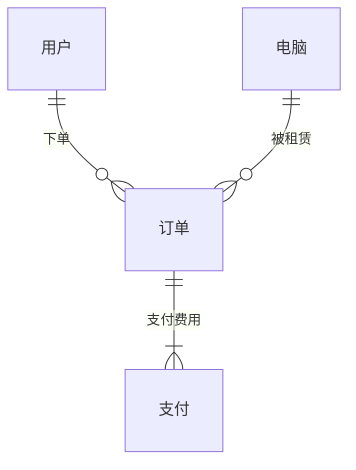

## 1. 背景介绍

### 1.1 电脑租赁市场现状

随着信息技术的飞速发展，电脑已经成为人们日常生活中不可或缺的一部分。然而，购买一台高性能电脑需要投入大量的资金，对于一些短期使用或预算有限的用户来说，租赁电脑成为了一种更加灵活和经济的选择。近年来，电脑租赁市场规模不断扩大，各种租赁模式和服务不断涌现，为用户提供了更加便捷、高效的租赁体验。

### 1.2 传统租赁模式的弊端

传统的电脑租赁模式主要依赖于线下门店，用户需要亲自到店挑选电脑、签订合同，流程繁琐且效率低下。此外，传统租赁模式的信息透明度较低，用户难以获取全面的电脑配置信息和租赁价格，容易产生信息不对称问题。

### 1.3  在线电脑租赁系统的优势

为了解决传统租赁模式的弊端，在线电脑租赁系统应运而生。在线租赁系统利用互联网技术，将租赁业务从线下搬到线上，为用户提供更加便捷、高效、透明的租赁服务。用户可以随时随地浏览电脑租赁信息，选择心仪的电脑进行租赁，并在线完成支付等操作，极大地提升了租赁效率和用户体验。

## 2. 核心概念与联系

### 2.1 用户

用户是电脑租赁系统的核心，包括个人用户和企业用户。用户可以在系统中注册账号，完善个人信息，浏览电脑租赁信息，下单租赁电脑，支付租赁费用，归还电脑等。

### 2.2 电脑

电脑是租赁系统的核心资源，包括台式电脑、笔记本电脑、平板电脑等各种类型。系统需要记录每台电脑的详细信息，例如品牌、型号、配置、租赁价格、库存状态等。

### 2.3 订单

订单是用户租赁电脑的凭证，记录了用户租赁的电脑信息、租赁时间、租赁费用等信息。系统需要对订单进行管理，例如生成订单、确认订单、取消订单、完成订单等。

### 2.4 支付

支付是用户支付租赁费用的方式，系统需要支持多种支付方式，例如支付宝、微信支付、银行卡支付等。

### 2.5 关系图

下面使用 Mermaid 语法绘制电脑租赁系统的核心概念关系图：



## 3. 核心算法原理具体操作步骤

### 3.1 用户注册登录

*   用户填写注册信息，包括用户名、密码、手机号码等。
*   系统校验用户信息，例如用户名是否已存在、密码是否符合安全规则等。
*   用户信息校验通过后，系统为用户创建账号，并发送激活邮件或短信验证码。
*   用户激活账号后，可以使用注册的用户名和密码登录系统。

### 3.2 电脑租赁流程

*   用户浏览电脑租赁信息，选择心仪的电脑和租赁时间。
*   用户提交租赁订单，系统校验订单信息，例如电脑库存是否充足、租赁时间是否合法等。
*   订单信息校验通过后，系统生成租赁订单，并引导用户进行支付。
*   用户完成支付后，系统确认订单，并更新电脑库存状态。
*   用户在租赁到期前归还电脑，系统确认电脑完好无损后，完成订单。

### 3.3 订单管理

*   系统管理员可以对订单进行管理，例如查询订单、确认订单、取消订单、完成订单等。
*   系统可以根据订单状态自动生成报表，例如日租赁量、月租赁量、用户租赁排名等。

## 4. 数学模型和公式详细讲解举例说明

### 4.1 租赁价格计算公式

租赁价格 = 日租金 \* 租赁天数 \* 折扣系数

其中：

*   日租金：每台电脑的每日租赁价格。
*   租赁天数：用户租赁电脑的天数。
*   折扣系数：根据租赁时间长短、用户类型等因素计算出的折扣系数，例如租赁时间越长，折扣系数越低。

### 4.2 库存管理模型

库存量 = 初始库存量 - 已租赁数量 + 归还数量

其中：

*   初始库存量：每台电脑的初始库存数量。
*   已租赁数量：当前已租赁出去的电脑数量。
*   归还数量：已归还的电脑数量。

## 5. 项目实践：代码实例和详细解释说明

### 5.1 技术选型

*   后端语言：Java
*   数据库：MySQL
*   Web 框架：Spring Boot
*   缓存：Redis

### 5.2 数据库设计

```sql
-- 用户表
CREATE TABLE `user` (
  `id` int(11) NOT NULL AUTO_INCREMENT COMMENT '用户ID',
  `username` varchar(255) NOT NULL COMMENT '用户名',
  `password` varchar(255) NOT NULL COMMENT '密码',
  `phone` varchar(20) DEFAULT NULL COMMENT '手机号码',
  PRIMARY KEY (`id`),
  UNIQUE KEY `username` (`username`)
) ENGINE=InnoDB DEFAULT CHARSET=utf8mb4;

-- 电脑表
CREATE TABLE `computer` (
  `id` int(11) NOT NULL AUTO_INCREMENT COMMENT '电脑ID',
  `brand` varchar(255) NOT NULL COMMENT '品牌',
  `model` varchar(255) NOT NULL COMMENT '型号',
  `price` decimal(10,2) NOT NULL COMMENT '日租金',
  `stock` int(11) NOT NULL COMMENT '库存数量',
  PRIMARY KEY (`id`)
) ENGINE=InnoDB DEFAULT CHARSET=utf8mb4;

-- 订单表
CREATE TABLE `order` (
  `id` int(11) NOT NULL AUTO_INCREMENT COMMENT '订单ID',
  `user_id` int(11) NOT NULL COMMENT '用户ID',
  `computer_id` int(11) NOT NULL COMMENT '电脑ID',
  `start_time` datetime NOT NULL COMMENT '租赁开始时间',
  `end_time` datetime NOT NULL COMMENT '租赁结束时间',
  `total_price` decimal(10,2) NOT NULL COMMENT '总租金',
  `status` tinyint(4) NOT NULL DEFAULT '0' COMMENT '订单状态（0：待支付，1：已支付，2：已取消，3：已完成）',
  PRIMARY KEY (`id`),
  KEY `user_id` (`user_id`),
  KEY `computer_id` (`computer_id`)
) ENGINE=InnoDB DEFAULT CHARSET=utf8mb4;
```

### 5.3 代码示例

```java
// 用户服务接口
public interface UserService {

    User register(User user);

    User login(String username, String password);

}

// 用户服务实现类
@Service
public class UserServiceImpl implements UserService {

    @Autowired
    private UserRepository userRepository;

    @Override
    public User register(User user) {
        // 校验用户信息
        // ...

        // 保存用户信息
        return userRepository.save(user);
    }

    @Override
    public User login(String username, String password) {
        // 校验用户名和密码
        // ...

        // 返回用户信息
        return user;
    }

}
```

## 6. 实际应用场景

### 6.1 企业短期办公

一些企业在进行项目开发、培训等短期工作时，需要租赁大量的电脑设备，在线电脑租赁系统可以为企业提供便捷、高效的租赁服务，帮助企业节省成本，提高工作效率。

### 6.2 个人短期使用

个人用户在旅行、出差、学习等短期场景下，也需要使用电脑设备，在线电脑租赁系统可以为个人用户提供灵活、经济的租赁方案，满足用户的个性化需求。

### 6.3 教育培训机构

教育培训机构在进行课程培训时，需要为学员提供电脑设备，在线电脑租赁系统可以为培训机构提供大批量、低成本的电脑租赁服务，降低培训成本，提高培训效率。

## 7. 总结：未来发展趋势与挑战

### 7.1 未来发展趋势

*   **个性化定制服务:** 随着用户需求的不断提高，未来在线电脑租赁系统将更加注重个性化定制服务，例如根据用户的预算、使用场景、电脑配置等需求，为用户推荐最合适的租赁方案。
*   **智能化推荐:** 利用大数据和人工智能技术，在线电脑租赁系统可以分析用户的租赁历史、浏览记录等信息，为用户推荐更加精准的电脑租赁方案。
*   **区块链技术应用:** 区块链技术可以应用于电脑租赁系统的租赁合同、支付交易等环节，提高租赁流程的透明度和安全性。

### 7.2 面临的挑战

*   **市场竞争激烈:** 随着在线电脑租赁市场规模的不断扩大，市场竞争也日益激烈，平台需要不断提升服务质量和用户体验，才能在竞争中脱颖而出。
*   **电脑租赁风险控制:** 电脑租赁存在一定的风险，例如电脑损坏、丢失等，平台需要建立完善的风险控制机制，保障用户和平台的利益。

## 8. 附录：常见问题与解答

### 8.1 问：如何注册账号？

答：您可以在网站首页点击“注册”按钮，填写注册信息并提交，即可完成账号注册。

### 8.2 问：如何租赁电脑？

答：您可以在网站上浏览电脑租赁信息，选择心仪的电脑和租赁时间，然后点击“立即租赁”按钮，填写租赁信息并提交订单，即可完成电脑租赁。

### 8.3 问：如何支付租赁费用？

答：我们支持多种支付方式，例如支付宝、微信支付、银行卡支付等，您可以在订单页面选择合适的支付方式进行支付。


