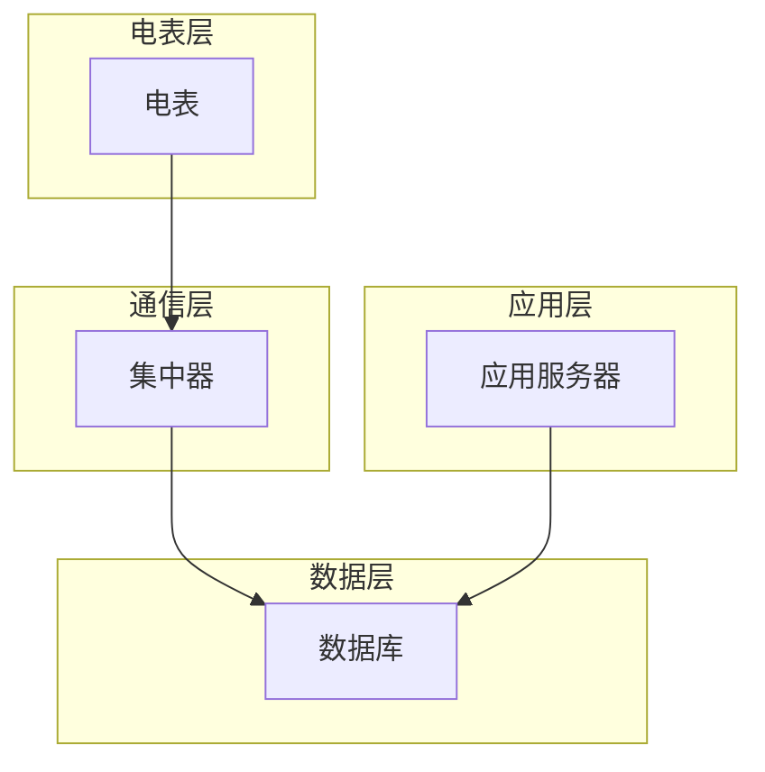

## 电表管理系统详细设计与具体代码实现

作者：禅与计算机程序设计艺术

## 1. 背景介绍

### 1.1 电力行业信息化发展趋势

随着电力行业的快速发展，电力系统的规模和复杂性不断提高，传统的电力管理模式已经难以适应现代化电力系统的发展需求。为了提高电力系统的运行效率、可靠性和经济效益，电力行业正在积极推进信息化建设，其中电能计量自动化是电力信息化建设的重要组成部分。

### 1.2 电表管理系统的意义

电表管理系统是电能计量自动化的核心系统之一，其主要功能是对电表进行集中管理，包括电表的远程抄读、控制、监控、数据分析等。电表管理系统的建设可以有效提高电能计量数据的准确性和可靠性，降低电力企业的运营成本，提高电力系统的安全性和稳定性。

### 1.3 本文目标

本文旨在介绍电表管理系统的详细设计与具体代码实现，帮助读者深入了解电表管理系统的架构、功能、技术实现等方面的内容。

## 2. 核心概念与联系

### 2.1 电表管理系统的基本概念

* **电表:**  用于测量电能消耗的仪表，是电表管理系统的核心对象。
* **集中器:**  用于采集和上传电表数据的设备，是电表管理系统与电表之间的桥梁。
* **通信协议:**  电表与集中器之间进行数据传输所遵循的规则，常见的通信协议有DL/T645、CJ/T188等。
* **数据库:**  用于存储电表管理系统数据的仓库，包括电表信息、抄表数据、用户信息等。
* **应用服务器:**  用于处理电表管理系统业务逻辑的服务器，例如用户登录、数据查询、报表生成等。

### 2.2 电表管理系统的系统架构



* **电表层:**  负责采集电能数据，并将数据上传至集中器。
* **通信层:**  负责接收电表上传的数据，并将数据转发至数据层。
* **数据层:**  负责存储和管理电表管理系统数据。
* **应用层:**  负责处理电表管理系统的业务逻辑，为用户提供各种服务。

## 3. 核心算法原理具体操作步骤

### 3.1 电表数据采集

* **轮询方式:**  集中器定时向电表发送抄表指令，电表收到指令后将数据上传至集中器。
* **事件驱动方式:**  电表在发生特定事件时主动上传数据，例如电量超限、故障报警等。

### 3.2 数据校验与处理

* **数据校验:**  对采集到的电表数据进行校验，例如校验码校验、数据范围校验等，确保数据的准确性。
* **数据处理:**  对校验通过的电表数据进行处理，例如数据格式转换、数据存储等。

### 3.3 数据分析与应用

* **数据分析:**  对电表数据进行统计分析，例如负荷分析、线损分析等，为电力企业提供决策依据。
* **数据应用:**  将电表数据应用于各种业务场景，例如电费结算、节能减排等。

## 4. 数学模型和公式详细讲解举例说明

### 4.1 电能计算公式

$$
E = \int_{t_1}^{t_2} P(t) dt
$$

其中：

* $E$ 为电能，单位为千瓦时 (kWh)
* $P(t)$ 为瞬时功率，单位为千瓦 (kW)
* $t_1$ 和 $t_2$ 分别为起始时间和结束时间

### 4.2 线损率计算公式

$$
\text{线损率} = \frac{\text{线路损耗电量}}{\text{线路供电量}} \times 100\%
$$

其中：

* 线路损耗电量 = 线路供电量 - 线路用电量
* 线路供电量为线路起点处的电量
* 线路用电量为线路终点处的电量

## 5. 项目实践：代码实例和详细解释说明

### 5.1 项目架构

本项目采用 Spring Boot 框架开发，项目架构如下：

```
├── src
│   ├── main
│   │   ├── java
│   │   │   └── com
│   │   │       └── example
│   │   │           └── metermanagementsystem
│   │   │               ├── controller
│   │   │               ├── service
│   │   │               ├── dao
│   │   │               ├── entity
│   │   │               ├── config
│   │   │               └── exception
│   │   └── resources
│   │       ├── application.yml
│   │       └── static
│   └── test
│       └── java
│           └── com
│               └── example
│                   └── metermanagementsystem
│                       └── MeterManagementSystemApplicationTests.java
└── pom.xml
```

* **controller:**  控制器层，负责接收用户请求并调用相应的服务进行处理。
* **service:**  服务层，负责处理业务逻辑。
* **dao:**  数据访问层，负责与数据库交互。
* **entity:**  实体类，对应数据库中的表。
* **config:**  配置类，用于配置 Spring Boot 应用程序。
* **exception:**  异常处理类，用于处理应用程序中的异常。

### 5.2 代码实例

#### 5.2.1 电表实体类

```java
package com.example.metermanagementsystem.entity;

import javax.persistence.Entity;
import javax.persistence.GeneratedValue;
import javax.persistence.GenerationType;
import javax.persistence.Id;

@Entity
public class Meter {

    @Id
    @GeneratedValue(strategy = GenerationType.IDENTITY)
    private Long id;

    private String meterNo;

    private String meterType;

    private String address;

    // 省略 getter 和 setter 方法
}
```

#### 5.2.2 电表服务接口

```java
package com.example.metermanagementsystem.service;

import com.example.metermanagementsystem.entity.Meter;

import java.util.List;

public interface MeterService {

    List<Meter> findAll();

    Meter findById(Long id);

    Meter save(Meter meter);

    void deleteById(Long id);
}
```

#### 5.2.3 电表服务实现类

```java
package com.example.metermanagementsystem.service.impl;

import com.example.metermanagementsystem.dao.MeterRepository;
import com.example.metermanagementsystem.entity.Meter;
import com.example.metermanagementsystem.service.MeterService;
import org.springframework.beans.factory.annotation.Autowired;
import org.springframework.stereotype.Service;

import java.util.List;

@Service
public class MeterServiceImpl implements MeterService {

    @Autowired
    private MeterRepository meterRepository;

    @Override
    public List<Meter> findAll() {
        return meterRepository.findAll();
    }

    @Override
    public Meter findById(Long id) {
        return meterRepository.findById(id).orElse(null);
    }

    @Override
    public Meter save(Meter meter) {
        return meterRepository.save(meter);
    }

    @Override
    public void deleteById(Long id) {
        meterRepository.deleteById(id);
    }
}
```

## 6. 实际应用场景

* **电力企业:**  用于电能计量、电费结算、线损分析等。
* **工矿企业:**  用于能源管理、成本控制等。
* **居民用户:**  用于实时监控用电情况、节约用电等。

## 7. 工具和资源推荐

* **Spring Boot:**  用于快速构建 Web 应用程序的框架。
* **MySQL:**  关系型数据库管理系统。
* **Postman:**  用于测试 API 的工具。

## 8. 总结：未来发展趋势与挑战

### 8.1 未来发展趋势

* **智能化:**  随着人工智能技术的不断发展，电表管理系统将更加智能化，例如自动识别异常用电行为、智能推荐节能方案等。
* **物联网化:**  电表管理系统将与其他物联网设备进行互联互通，构建更加完善的能源互联网。
* **云计算化:**  电表管理系统将逐步迁移至云平台，利用云计算的优势提高系统的可靠性和可扩展性。

### 8.2 面临的挑战

* **数据安全:**  电表管理系统存储着大量的用户用电数据，如何保障数据的安全是一个重要的挑战。
* **系统稳定性:**  电表管理系统是一个实时性要求较高的系统，如何保障系统的稳定运行是一个重要的挑战。
* **技术更新迭代:**  随着技术的不断发展，电表管理系统需要不断更新迭代，以适应新的技术和需求。

## 9. 附录：常见问题与解答

### 9.1 如何解决电表数据丢失问题？

* 提高集中器的可靠性，例如采用双机热备、UPS电源等措施。
* 采用数据缓存机制，将电表数据缓存到集中器本地，防止数据丢失。
* 定期备份电表数据，以便在数据丢失时进行恢复。

### 9.2 如何提高电表数据的准确性？

* 对电表进行定期校准，确保电表的准确性。
* 采用数据校验机制，对采集到的电表数据进行校验，防止错误数据进入系统。
* 优化数据采集策略，例如根据负荷变化情况调整抄表频率。


## 10. 后记

本文详细介绍了电表管理系统的详细设计与具体代码实现，希望能对读者有所帮助。电表管理系统是一个复杂的系统，需要综合考虑各种因素才能构建出一个高效、可靠、安全的系统。