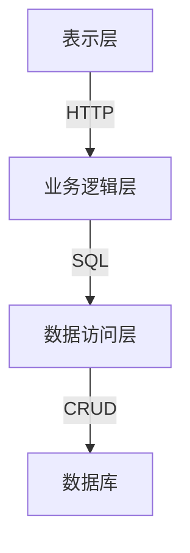

# 病历管理系统详细设计与具体代码实现

## 1.背景介绍

在现代医疗保健系统中,电子病历管理系统(EMR)扮演着至关重要的角色。它是一种数字化的信息系统,用于收集、存储、管理和检索患者的医疗记录。电子病历系统不仅提高了医疗数据的准确性和可访问性,还有助于优化临床工作流程、减少医疗错误并提高整体医疗质量。

传统的纸质病历管理系统存在诸多缺陷,如数据冗余、难以共享、存储空间有限等。电子病历系统的出现很大程度上解决了这些问题,使医疗数据的管理和利用更加高效。

### 1.1 电子病历的优势

相较于传统纸质病历,电子病历系统具有以下主要优势:

- **数据集中化**: 患者的所有医疗记录都集中存储在一个中央数据库中,方便医生快速查阅。
- **远程访问**: 授权医护人员可以从任何地点访问患者病历,提高工作效率。
- **数据安全性**: 采用加密和访问控制措施,保护患者隐私。
- **减少医疗差错**: 通过自动化和决策支持系统,降低手工操作引起的错误。

### 1.2 系统需求

一个完善的电子病历管理系统通常需要满足以下核心需求:

- 患者信息管理: 录入、修改和查询患者的基本信息。
- 病历记录管理: 创建、编辑和查阅患者的诊断记录、用药记录、检查报告等。
- 系统安全和访问控制: 实现角色权限管理,保护病历数据隐私。
- 医疗统计和报表: 生成各类统计报表,支持临床决策。
- 系统集成: 与其他医院信息系统(如HIS、LIS等)集成,实现数据共享。

## 2.核心概念与联系

在深入探讨系统设计之前,我们先介绍一些核心概念及其之间的关联。

### 2.1 核心概念

- **患者(Patient)**: 指接受医疗服务的个人,是病历系统的核心实体。
- **病历(Medical Record)**: 记录患者就诊过程中产生的所有医疗信息,包括病史、诊断、治疗、检查报告等。
- **医生(Doctor)**: 负责为患者诊断、开具治疗方案、维护病历等。
- **医疗机构(Medical Institution)**: 提供医疗服务的单位,如医院、诊所等,管理本机构相关人员和病历。

### 2.2 概念关联

这些核心概念之间存在如下关联关系:

- 一个患者可以拥有多条病历记录,体现其就诊历史。
- 一条病历由一名或多名医生负责创建和维护。
- 医生隶属于某个医疗机构,在该机构范围内管理病历。
- 一个医疗机构可以有多名医生和大量患者。

## 3.核心算法原理具体操作步骤 

电子病历系统的核心算法主要包括:数据库设计、权限控制、数据加密等。

### 3.1 数据库设计

数据库设计是系统的基础,直接影响系统的性能和可扩展性。常用的数据库设计范式包括:

1. **第一范式(1NF)**:每个属性值都是不可再分的原子值。
2. **第二范式(2NF)**:满足1NF,并且所有非主属性都完全依赖于候选码。
3. **第三范式(3NF)**:满足2NF,并且所有非主属性都直接依赖于候选码。

对于电子病历系统,我们可以设计如下核心表:

- 患者表(Patient)
- 病历表(MedicalRecord) 
- 医生表(Doctor)
- 医疗机构表(MedicalInstitution)
- 权限表(Permission)
- ...

每个表由多个字段组成,如患者表可能包含姓名、年龄、性别等字段。表与表之间通过外键建立关联关系。

例如,病历表通过PatientId外键与患者表关联,每条病历记录对应一个患者;同时通过DoctorId外键与医生表关联,记录了该病历的主治医生。

### 3.2 权限控制

为保护患者隐私,电子病历系统必须实现严格的权限控制机制。常见的访问控制模型包括:

1. **基于角色的访问控制(RBAC)**
2. **基于属性的访问控制(ABAC)** 
3. **强制访问控制(MAC)**
4. **自主访问控制(DAC)**

其中,RBAC是目前应用最广泛的模型。它将用户与权限进行解耦,通过角色作为中介,简化了权限管理。

在电子病历系统中,我们可以定义如下几种典型角色:

- 患者(Patient)
- 医生(Doctor)
- 护士(Nurse)
- 管理员(Administrator)

不同角色拥有不同的数据访问权限。例如,患者只能查看自己的病历;医生可以创建和修改所有病历,但只能查看自己管理范围内的患者数据;管理员拥有整个系统的最高权限。

```python
def has_permission(user, operation, record):
    # 根据用户角色和操作类型,判断是否有权限访问记录
    ...
```

### 3.3 数据加密

为防止敏感数据在传输和存储过程中被窃取,我们需要对数据进行加密。常用的加密算法包括:

1. **对称加密算法**: AES、DES等,加密解密使用同一密钥。
2. **非对称加密算法**: RSA、ECC等,使用公钥加密,私钥解密。
3. **哈希算法**: MD5、SHA等,不可逆,常用于密码存储。

在电子病历系统中,我们可以使用混合加密策略:

1. 对患者敏感信息(如身份证号、病历内容等)使用AES对称加密算法加密。
2. 使用RSA非对称加密算法对AES密钥进行加密传输。
3. 将用户密码使用SHA256等哈希算法进行不可逆加密存储。

```python
from Crypto.Cipher import AES
from Crypto.PublicKey import RSA
import hashlib

def encrypt_data(data, public_key):
    # 使用AES加密数据
    aes_key = get_random_bytes(16)
    cipher = AES.new(aes_key, AES.MODE_ECB)
    encrypted_data = cipher.encrypt(pad(data))
    
    # 使用RSA加密AES密钥
    encrypted_key = public_key.encrypt(aes_key, 32)[0]
    
    return encrypted_data, encrypted_key

def decrypt_data(encrypted_data, encrypted_key, private_key):
    # 使用RSA解密AES密钥
    aes_key = private_key.decrypt(encrypted_key)
    
    # 使用AES解密数据
    cipher = AES.new(aes_key, AES.MODE_ECB)
    decrypted_data = unpad(cipher.decrypt(encrypted_data))
    
    return decrypted_data
    
def hash_password(password):
    # 使用SHA256哈希算法加密密码
    sha256 = hashlib.sha256()
    sha256.update(password.encode('utf-8'))
    return sha256.hexdigest()
```

## 4.数学模型和公式详细讲解举例说明

在电子病历系统中,有许多场景需要使用数学模型进行分析和决策。例如,评估患者病情严重程度、预测疾病发展趋势、优化医院资源调配等。

### 4.1 病情严重程度评分模型

医生通常需要根据患者的多种症状和检查指标,综合评估其病情严重程度。这可以建模为一个多属性决策问题,使用加权求和模型求解:

$$
S = \sum_{i=1}^{n}w_ix_i
$$

其中:

- $S$为病情严重程度评分
- $n$为考虑的症状/指标数量
- $x_i$为第$i$个症状/指标的分值,取值区间为$[0,1]$
- $w_i$为第$i$个症状/指标的权重,且$\sum_{i=1}^{n}w_i=1$

不同症状和指标的权重可以通过医学专家打分或机器学习算法训练获得。

例如,对于支气管哮喘患者,我们可以考虑以下6个指标:

- $x_1$:呼吸困难程度(0~4分)
- $x_2$:肺活量百分比(0~100%)
- $x_3$:血氧饱和度(0~100%)
- $x_4$:心率(正常区间60~100次/分钟)
- $x_5$:体温(正常区间36~37.5摄氏度)
- $x_6$:咳嗽/痰量(0~4分)

将各指标分值归一化到$[0,1]$区间,并设置合理的权重后,我们可以计算出综合病情评分$S$。如果评分超过一定阈值(如0.7),则判定为重症,需要立即住院治疗。

### 4.2 疾病发展预测模型

对于某些慢性病,我们还可以利用历史数据,建立疾病发展预测模型。以糖尿病为例,我们可以尝试拟合如下逻辑斯蒂回归模型:

$$
P(y=1|X) = \sigma(\beta_0 + \beta_1x_1 + \beta_2x_2 + ... + \beta_nx_n)
$$

$$
\sigma(t) = \frac{1}{1+e^{-t}}
$$

其中:

- $y$为目标变量,当$y=1$时表示患者未来5年内将并发症(如视网膜病变、神经病变等)
- $X=(x_1,x_2,...,x_n)$为自变量(特征)向量,包括患者年龄、性别、体重指数、血糖水平、胆固醇等多个指标
- $\beta_i$为各特征的回归系数,反映其对目标变量的影响程度
- $\sigma(t)$为Logistic函数,将线性回归结果映射到$(0,1)$区间,得到发生概率值

利用已知患者的历史病历数据,我们可以通过最大似然估计等方法求解最优回归参数$\beta$,从而获得准确的疾病发展预测模型。

该模型不仅可以为临床决策提供参考,还可以为患者提供个性化的健康干预建议,延缓并发症发生。

## 5.项目实践: 代码实例和详细解释说明

为了更好地理解电子病历系统的实现细节,我们将展示一些核心功能的代码示例,并进行详细解释。

### 5.1 系统架构

我们采用经典的三层架构设计模式,将系统分为表示层(UI)、业务逻辑层和数据访问层。



- **表示层**:提供用户界面,接收用户请求,并将结果显示给用户。可以使用Web框架(如Flask、Django)或桌面框架(如PyQt)实现。
- **业务逻辑层**:处理业务逻辑,如权限验证、数据加密等。实现系统的核心功能。
- **数据访问层**:负责与数据库进行交互,执行增删改查操作。屏蔽不同数据库的访问细节。
- **数据库**:存储系统的所有数据,如患者信息、病历记录等。可以使用关系型数据库(如MySQL)或NoSQL数据库(如MongoDB)。

### 5.2 Patient模型

```python
from sqlalchemy import Column, Integer, String, ForeignKey
from sqlalchemy.orm import relationship
from database import Base

class Patient(Base):
    __tablename__ = 'patients'

    id = Column(Integer, primary_key=True)
    name = Column(String(50), nullable=False)
    gender = Column(String(10), nullable=False)
    age = Column(Integer, nullable=False)
    medical_institution_id = Column(Integer, ForeignKey('medical_institutions.id'))

    medical_records = relationship('MedicalRecord', back_populates='patient')

    def __repr__(self):
        return f"Patient(id={self.id}, name='{self.name}', gender='{self.gender}', age={self.age})"
```

这是一个使用SQLAlchemy ORM框架定义的Patient模型类。它映射到数据库中的`patients`表,包含了患者的基本信息,如姓名、性别、年龄等字段。

- `id`字段为主键,自动递增。
- `medical_institution_id`为外键,关联到所属的医疗机构。
- `medical_records`属性通过一对多关系,关联到该患者的