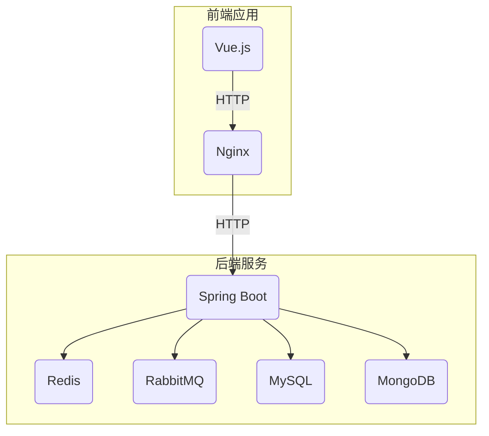
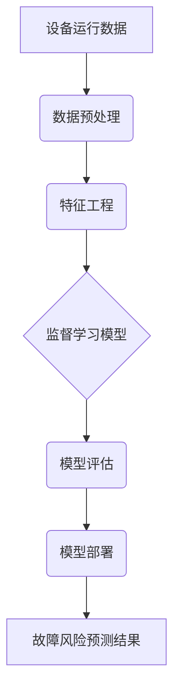

# 社区物业管理系统详细设计与具体代码实现

## 1. 背景介绍

### 1.1 社区物业管理的重要性

随着城市化进程的不断推进,社区物业管理已经成为了城市运营和社会治理的重要组成部分。高效、智能的社区物业管理系统不仅能够提高社区居民的生活质量,还能够促进社区资源的合理利用和社区环境的可持续发展。

### 1.2 传统物业管理模式的局限性

传统的物业管理模式主要依赖人工操作,效率低下且容易出错。信息化程度较低,缺乏数据积累和智能分析决策的支持。此外,传统模式下居民和物业管理方缺乏有效的沟通渠道,居民诉求难以及时解决。

### 1.3 智能物业管理系统的需求

为了克服传统模式的缺陷,迫切需要一套智能化、信息化的社区物业管理系统,实现物业管理的自动化、智能化和数字化转型。这种系统应该具备以下核心功能:

- 提供覆盖物业管理各环节的一站式服务平台
- 支持移动端操作,方便居民使用
- 基于大数据分析,提供智能化决策支持
- 实现物业管理流程的自动化和优化
- 促进居民与物业方的良性互动

## 2. 核心概念与联系

### 2.1 系统架构

社区物业管理系统采用前后端分离的架构设计,前端基于Vue.js框架开发,后端使用Spring Boot构建RESTful API,并整合了Redis、RabbitMQ等中间件,数据存储于MySQL和MongoDB数据库。系统架构图如下:



### 2.2 系统模块

该系统主要包括以下几个核心模块:

- **居民服务模块**:提供缴费、报修、投诉等服务,实现移动端自助操作。
- **物业管理模块**:包括人员管理、财务管理、设备管理等子模块,实现日常物业运营。
- **智能分析模块**:基于大数据分析,为决策提供支持,如费用预测、能耗优化等。
- **系统管理模块**:实现系统参数配置、权限管理、日志审计等功能。

各模块通过服务总线(RabbitMQ)集成,实现消息驱动、事件驱动的架构。

## 3. 核心算法原理具体操作步骤

### 3.1 设备故障预测算法

系统中集成了基于机器学习的设备故障预测算法,能够提前预测电梯、空调等重要设备的故障风险,从而实现预防性维护,提高设备使用寿命。算法原理如下:

1. **数据采集**:从设备传感器采集运行数据,包括温度、振动、电流等。
2. **数据预处理**:对采集的数据进行清洗、标准化等预处理。
3. **特征工程**:从预处理数据中提取时间域、频域等特征,作为模型输入。
4. **模型训练**:使用监督学习算法(如随机森林)训练故障预测模型。
5. **模型评估**:基于测试集评估模型性能,如准确率、精确率等指标。
6. **模型部署**:将训练好的模型部署到生产环境,持续进行在线预测。

算法流程图如下:



### 3.2 费用智能预测算法

该算法基于时间序列分析,预测未来一段时间内的物业费用支出,为财务决策提供依据。算法步骤如下:

1. **数据采集**:收集历史费用数据,包括水电费、人工费用等。
2. **数据预处理**:对数据进行差分、平稳性检验等预处理。
3. **模型识别**:使用自相关图、偏自相关图等工具,识别数据的模型类型(AR、MA、ARMA等)。
4. **模型训练**:根据模型类型,使用相应的时间序列模型(如ARIMA)进行参数估计。
5. **模型检验**:通过AIC、BIC等指标评估模型效果,必要时进行模型优化。
6. **预测求解**:利用训练的模型对未来费用进行滚动预测。

该算法的数学模型使用经典的ARIMA模型,其表达式为:

$$
Y_t = c + \phi_1Y_{t-1} + \phi_2Y_{t-2} + ... + \phi_pY_{t-p} + \theta_1e_{t-1} + \theta_2e_{t-2} + ... + \theta_qe_{t-q} + e_t
$$

其中:
- $Y_t$为时间t的观测值
- $\phi_i(i=1,2,...,p)$为自回归(AR)参数
- $\theta_j(j=1,2,...,q)$为移动平均(MA)参数
- $e_t$为白噪声项

通过对模型进行参数估计,即可获得未来时间序列的预测值。

## 4. 项目实践:代码实例和详细解释说明

### 4.1 设备管理模块

设备管理模块主要负责对社区内的电梯、空调等重要设备进行统一管理,包括设备信息录入、运行状态监控、维修保养记录等功能。

以电梯设备为例,其数据模型定义如下:

```java
@Document(collection = "elevators")
public class Elevator {
    @Id
    private String id;
    private String name;
    private String location;
    private String manufacturer;
    private Date installDate;
    private List<MaintenanceRecord> maintenanceRecords;
    // 其他属性...
}

@Embeddable
public class MaintenanceRecord {
    private Date date;
    private String description;
    private double cost;
    // 其他属性...
}
```

在Spring Boot中,我们定义了相应的Repository接口继承自MongoRepository,以实现对MongoDB的操作:

```java
public interface ElevatorRepository extends MongoRepository<Elevator, String> {
    // 自定义查询方法
}
```

控制层通过调用Service层方法来执行CRUD操作:

```java
@RestController
@RequestMapping("/api/elevators")
public class ElevatorController {
    
    @Autowired
    private ElevatorService elevatorService;

    @PostMapping
    public Elevator createElevator(@RequestBody Elevator elevator) {
        return elevatorService.createElevator(elevator);
    }

    @GetMapping("/{id}")
    public Elevator getElevatorById(@PathVariable String id) {
        return elevatorService.getElevatorById(id);
    }

    // 其他CRUD方法...
}
```

Service层则通过调用Repository层的方法与数据库交互:

```java
@Service
public class ElevatorServiceImpl implements ElevatorService {

    @Autowired
    private ElevatorRepository elevatorRepository;

    @Override
    public Elevator createElevator(Elevator elevator) {
        return elevatorRepository.save(elevator);
    }

    @Override
    public Elevator getElevatorById(String id) {
        return elevatorRepository.findById(id).orElse(null);
    }

    // 其他服务方法...
}
```

### 4.2 缴费模块

缴费模块实现了居民通过移动端自助缴纳物业费用的功能。其中的主要代码逻辑如下:

前端界面使用Vue.js及Element-UI组件库开发,发送HTTP请求到后端:

```html
<template>
  <div>
    <el-form @submit.native.prevent="submitPayment">
      <el-form-item label="缴费金额">
        <el-input v-model="paymentAmount"></el-input>
      </el-form-item>
      <el-form-item>
        <el-button type="primary" native-type="submit">缴费</el-button>
      </el-form-item>
    </el-form>
  </div>
</template>

<script>
import axios from 'axios'

export default {
  data() {
    return {
      paymentAmount: 0
    }
  },
  methods: {
    submitPayment() {
      const paymentData = {
        amount: this.paymentAmount,
        residentId: this.residentId // 从Vuex获取当前居民ID
      }
      axios.post('/api/payments', paymentData)
        .then(response => {
          // 处理成功响应
          console.log('Payment successful')
        })
        .catch(error => {
          // 处理错误响应
          console.error('Payment failed', error)
        })
    }
  }
}
</script>
```

后端Spring Boot接收请求,调用支付服务进行处理:

```java
@RestController
@RequestMapping("/api/payments")
public class PaymentController {

    @Autowired
    private PaymentService paymentService;

    @PostMapping
    public ResponseEntity<String> makePayment(@RequestBody PaymentRequest request) {
        try {
            paymentService.processPayment(request);
            return ResponseEntity.ok("Payment successful");
        } catch (Exception e) {
            return ResponseEntity.badRequest().body("Payment failed: " + e.getMessage());
        }
    }
}
```

PaymentService通过调用其他模块的服务来执行缴费逻辑:

```java
@Service
public class PaymentServiceImpl implements PaymentService {

    @Autowired
    private ResidentService residentService;

    @Autowired
    private FinanceService financeService;

    @Override
    public void processPayment(PaymentRequest request) {
        // 1. 验证居民身份和缴费金额
        Resident resident = residentService.getResidentById(request.getResidentId());
        if (resident == null) {
            throw new IllegalArgumentException("Invalid resident ID");
        }
        double amount = request.getAmount();
        if (amount <= 0) {
            throw new IllegalArgumentException("Invalid payment amount");
        }

        // 2. 更新居民账户余额
        resident.setBalance(resident.getBalance() + amount);
        residentService.updateResident(resident);

        // 3. 记录缴费流水
        PaymentRecord record = new PaymentRecord();
        record.setResidentId(request.getResidentId());
        record.setAmount(amount);
        record.setDate(new Date());
        financeService.recordPayment(record);
    }
}
```

该模块通过与居民服务模块和财务模块的集成,实现了完整的缴费流程。

## 5. 实际应用场景

### 5.1 小区公共设施管理

该系统可用于小区内公共设施的管理,如公园、健身房等。物业人员可以在系统中录入设施信息、开放时间等,居民则可以通过移动端查询设施状态、预约使用。同时,系统还能对设施的使用情况进行统计分析,为设施运营优化提供决策支持。

### 5.2 社区商业中心运营

对于社区商业中心,该系统可用于租户管理、营业执照管理、收费管理等。物业方可以在系统中录入租户信息、缴费记录,并根据大数据分析优化商户组合和营销策略。同时,商户也可通过系统渠道与物业方进行在线沟通。

### 5.3 社区安全管理

在安全管理方面,该系统可集成视频监控、门禁系统等硬件设备,对小区出入口、重点区域进行实时监控。通过人脸识别等人工智能技术,可以第一时间发现并处理安全隐患。此外,系统还能对历史安全事件数据进行分析,制定更加科学的巡逻、值守策略。

### 5.4 社区文化活动管理

该系统还可用于管理社区内的各类文体活动,如讲座、运动会等。活动发起方可以在系统中发布活动信息,居民可以进行在线报名。活动结束后,系统还能对参与情况、满意度等进行统计分析,为下次活动的策划提供参考。

## 6. 工具和资源推荐  

### 6.1 开发工具

- **IntelliJ IDEA**:强大的Java IDE,支持Spring Boot开发
- **Visual Studio Code**:轻量级代码编辑器,前端开发必备
- **RedisDesktopManager**:Redis可视化管理工具
- **Navicat**:数据库可视化管理工具
- **Postman**:API测试工具
- **Git**:代码版本控制工具

### 6.2 框架和中间件

- **Spring Boot**:Java开发框架,提供自动配置、开箱即用的特性
- **Vue.js**:渐进式JavaScript框架,用于构建用户界面
- **Redis**:高性能内存数据库,用于缓存数据
- **RabbitMQ**:消息队列中间件,实现异步通信
- **Elasticsearch**:分布式搜索引擎,支持全文检索和数据分析

### 