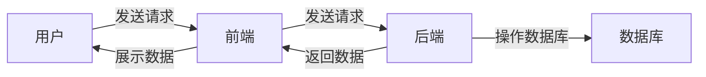

##  移动硬盘销售系统详细设计与具体代码实现

作者：禅与计算机程序设计艺术

## 1. 背景介绍

### 1.1 项目背景

随着信息技术的快速发展，人们对数据存储的需求日益增长。移动硬盘作为一种便携、大容量的存储设备，已经成为人们日常生活中不可或缺的一部分。为了满足用户日益增长的需求，开发一款功能完善、易于使用的移动硬盘销售系统显得尤为重要。

### 1.2 项目目标

本项目旨在设计和实现一个移动硬盘销售系统，该系统需要具备以下功能：

*   **商品管理：** 支持管理员对移动硬盘商品信息进行管理，包括商品的添加、修改、删除、上下架等操作。
*   **用户管理：** 支持用户注册、登录、修改个人信息等操作。
*   **订单管理：** 支持用户下单、查看订单状态、取消订单等操作。
*   **支付管理：** 支持多种支付方式，例如支付宝、微信支付等。
*   **库存管理：** 实时监控商品库存，及时提醒管理员进行补货。
*   **数据统计：** 提供销售数据统计分析功能，帮助管理员了解销售情况。

### 1.3 项目意义

本项目具有以下意义：

*   **提高销售效率：** 通过线上销售平台，可以突破时间和地域限制，扩大销售范围，提高销售效率。
*   **降低运营成本：** 线上销售平台可以减少人工成本和店铺租金等费用，降低运营成本。
*   **提升用户体验：** 用户可以随时随地浏览商品、下单购买，享受便捷的购物体验。
*   **数据驱动决策：** 通过对销售数据的分析，可以帮助企业更好地了解市场需求，制定更合理的营销策略。

## 2. 核心概念与联系

### 2.1 系统架构

本系统采用前后端分离的架构，前端使用 Vue 框架开发，后端使用 Spring Boot 框架开发，数据库使用 MySQL。



### 2.2 核心模块

本系统主要包含以下模块：

*   **用户模块：** 负责用户注册、登录、修改个人信息等功能。
*   **商品模块：** 负责商品信息的管理，包括商品的添加、修改、删除、上下架等操作。
*   **订单模块：** 负责用户下单、查看订单状态、取消订单等功能。
*   **支付模块：** 负责处理用户的支付请求，支持多种支付方式。
*   **库存模块：** 负责实时监控商品库存，及时提醒管理员进行补货。
*   **数据统计模块：** 负责提供销售数据统计分析功能。

### 2.3 模块间关系

*   用户模块和订单模块：用户下单需要登录账号，订单信息与用户信息关联。
*   商品模块和订单模块：用户下单需要选择商品，订单信息与商品信息关联。
*   订单模块和支付模块：用户下单后需要进行支付，支付信息与订单信息关联。
*   商品模块和库存模块：商品销售会减少库存，库存信息与商品信息关联。

## 3. 核心算法原理具体操作步骤

### 3.1 用户登录注册功能实现

#### 3.1.1 用户注册

1.  用户填写注册信息，包括用户名、密码、邮箱等。
2.  前端将注册信息发送给后端。
3.  后端校验用户信息是否合法，例如用户名是否已存在、密码是否符合要求等。
4.  如果校验通过，则将用户信息存储到数据库中，并返回注册成功信息。
5.  如果校验失败，则返回错误信息，提示用户修改注册信息。

#### 3.1.2 用户登录

1.  用户输入用户名和密码。
2.  前端将用户名和密码发送给后端。
3.  后端根据用户名查询数据库，如果用户不存在则返回错误信息。
4.  如果用户存在，则校验密码是否正确。
5.  如果密码正确，则生成 token 并返回给前端，前端将 token 存储在本地，用于后续请求的身份验证。
6.  如果密码错误，则返回错误信息，提示用户重新输入密码。

### 3.2 商品信息管理功能实现

#### 3.2.1 商品添加

1.  管理员填写商品信息，包括商品名称、价格、库存、图片等。
2.  前端将商品信息发送给后端。
3.  后端校验商品信息是否合法，例如商品名称是否为空、价格是否大于 0 等。
4.  如果校验通过，则将商品信息存储到数据库中，并返回添加成功信息。
5.  如果校验失败，则返回错误信息，提示管理员修改商品信息。

#### 3.2.2 商品修改

1.  管理员选择要修改的商品。
2.  前端将商品 ID 发送给后端。
3.  后端根据商品 ID 查询数据库，返回商品信息。
4.  管理员修改商品信息。
5.  前端将修改后的商品信息发送给后端。
6.  后端校验商品信息是否合法。
7.  如果校验通过，则更新数据库中对应的商品信息，并返回修改成功信息。
8.  如果校验失败，则返回错误信息，提示管理员修改商品信息。

#### 3.2.3 商品删除

1.  管理员选择要删除的商品。
2.  前端将商品 ID 发送给后端。
3.  后端根据商品 ID 查询数据库，判断商品是否存在。
4.  如果商品存在，则删除数据库中对应的商品信息，并返回删除成功信息。
5.  如果商品不存在，则返回错误信息，提示管理员商品不存在。

## 4. 数学模型和公式详细讲解举例说明

### 4.1 库存预警模型

为了避免出现商品缺货的情况，本系统引入库存预警模型。当商品库存低于预警值时，系统会自动发送邮件或短信通知管理员进行补货。

**库存预警模型公式：**

```
库存预警值 = 平均日销量 * 预警天数
```

**参数说明：**

*   平均日销量：过去一段时间内，该商品的平均每天的销量。
*   预警天数：当商品库存低于预警值时，需要提前多少天进行补货。

**举例说明：**

假设某款移动硬盘的平均日销量为 10 件，预警天数设置为 3 天，则该商品的库存预警值为：

```
库存预警值 = 10 * 3 = 30
```

当该商品的库存低于 30 件时，系统会自动发送预警信息给管理员，提醒管理员及时补货。

### 4.2 销售额统计模型

为了帮助管理员了解销售情况，本系统提供销售额统计功能。管理员可以根据不同的时间维度（例如日、周、月）统计销售额。

**销售额统计模型公式：**

```
销售额 = ∑ (商品售价 * 销量)
```

**参数说明：**

*   商品售价：商品的销售价格。
*   销量：该商品在统计时间段内的销售数量。

**举例说明：**

假设某店铺在一天内销售了以下商品：

| 商品名称          | 商品售价 | 销量 |
| :--------------- | :------- | :---- |
| A 品牌 1TB 移动硬盘 | 500 元   | 10    |
| B 品牌 2TB 移动硬盘 | 800 元   | 5     |
| C 品牌 4TB 移动硬盘 | 1200 元  | 2     |

则该店铺当天的销售额为：

```
销售额 = (500 * 10) + (800 * 5) + (1200 * 2) = 11400 元
```

## 5. 项目实践：代码实例和详细解释说明

### 5.1 后端代码实现

#### 5.1.1 商品实体类

```java
@Entity
@Table(name = "product")
public class Product {

    @Id
    @GeneratedValue(strategy = GenerationType.IDENTITY)
    private Long id;

    @Column(nullable = false)
    private String name;

    @Column(nullable = false)
    private BigDecimal price;

    @Column(nullable = false)
    private Integer stock;

    // 省略 getter 和 setter 方法
}
```

#### 5.1.2 商品服务接口

```java
public interface ProductService {

    Product addProduct(Product product);

    Product updateProduct(Product product);

    void deleteProduct(Long id);

    Product getProductById(Long id);

    List<Product> getAllProducts();
}
```

#### 5.1.3 商品服务实现类

```java
@Service
public class ProductServiceImpl implements ProductService {

    @Autowired
    private ProductRepository productRepository;

    @Override
    public Product addProduct(Product product) {
        return productRepository.save(product);
    }

    @Override
    public Product updateProduct(Product product) {
        return productRepository.save(product);
    }

    @Override
    public void deleteProduct(Long id) {
        productRepository.deleteById(id);
    }

    @Override
    public Product getProductById(Long id) {
        return productRepository.findById(id).orElse(null);
    }

    @Override
    public List<Product> getAllProducts() {
        return productRepository.findAll();
    }
}
```

### 5.2 前端代码实现

#### 5.2.1 商品列表组件

```vue
<template>
  <div>
    <table>
      <thead>
        <tr>
          <th>商品名称</th>
          <th>价格</th>
          <th>库存</th>
          <th>操作</th>
        </tr>
      </thead>
      <tbody>
        <tr v-for="product in products" :key="product.id">
          <td>{{ product.name }}</td>
          <td>{{ product.price }}</td>
          <td>{{ product.stock }}</td>
          <td>
            <button @click="editProduct(product)">编辑</button>
            <button @click="deleteProduct(product.id)">删除</button>
          </td>
        </tr>
      </tbody>
    </table>
  </div>
</template>

<script>
export default {
  data() {
    return {
      products: [],
    };
  },
  mounted() {
    this.getProducts();
  },
  methods: {
    getProducts() {
      // 发送请求获取商品列表
    },
    editProduct(product) {
      // 跳转到商品编辑页面
    },
    deleteProduct(id) {
      // 发送请求删除商品
    },
  },
};
</script>
```

## 6. 实际应用场景

本系统可以应用于以下场景：

*   **电商平台：** 例如淘宝、京东等电商平台上的移动硬盘销售。
*   **企业官网：** 移动硬盘生产厂家可以在官网上搭建自己的销售平台。
*   **线下门店：** 线下门店可以搭建线上销售平台，实现线上线下融合。

## 7. 总结：未来发展趋势与挑战

### 7.1 未来发展趋势

*   **个性化推荐：** 根据用户的购买历史和浏览记录，推荐用户可能感兴趣的商品。
*   **智能客服：** 使用人工智能技术，为用户提供 24 小时在线客服服务。
*   **大数据分析：** 利用大数据分析技术，挖掘用户需求，优化产品和服务。

### 7.2 面临的挑战

*   **数据安全：** 保护用户的个人信息和交易数据安全。
*   **竞争激烈：** 移动硬盘销售市场竞争激烈，需要不断提升产品和服务质量。
*   **技术更新迭代快：** 需要不断学习新技术，保持技术领先优势。

## 8. 附录：常见问题与解答

### 8.1 问：如何保证用户信息安全？

答：本系统采用 HTTPS 协议传输数据，并对用户密码进行加密存储，可以有效保证用户信息安全。

### 8.2 问：如何联系客服？

答：用户可以通过网站上的在线客服或客服电话联系客服。

### 8.3 问：如何申请退款？

答：用户可以在订单详情页面申请退款，客服会及时处理用户的退款请求。
