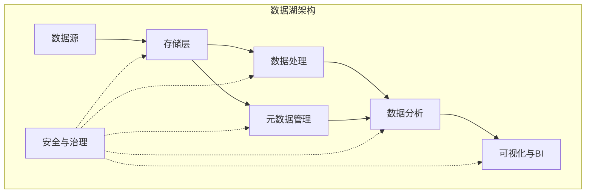
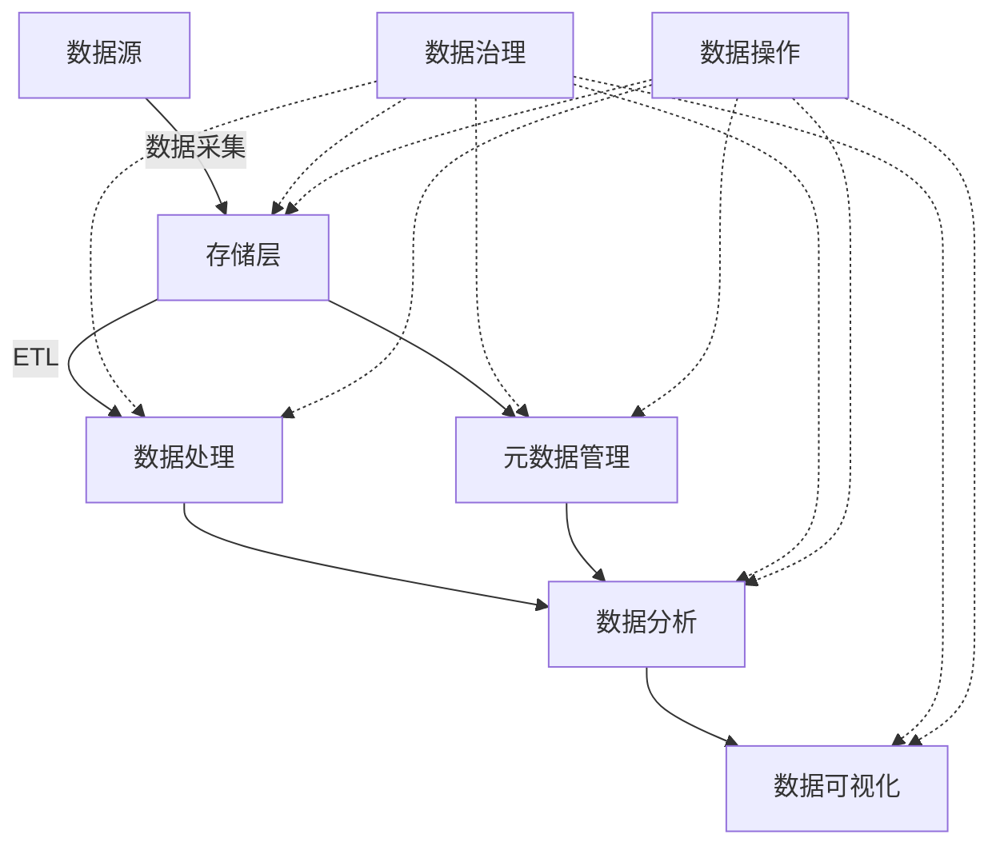

# 第二十六章：数据湖行业应用案例

## 1.背景介绍

### 1.1 数据湖的兴起

随着大数据时代的到来，传统的数据存储和处理方式已经无法满足企业日益增长的数据需求。在这种背景下,数据湖(Data Lake)作为一种新兴的大数据存储和处理平台应运而生。

数据湖允许企业以原始格式存储各种类型的数据,包括结构化数据(如关系数据库中的数据)、半结构化数据(如XML、JSON等)和非结构化数据(如文本、图像、视频等)。这种灵活的数据存储方式,使得数据湖能够容纳来自不同来源的海量数据,为数据分析和机器学习等应用提供了丰富的数据资源。

### 1.2 数据湖的优势

与传统数据仓库相比,数据湖具有以下几个主要优势:

1. **存储成本低廉**:数据湖通常建立在廉价的对象存储(如HDFS、AWS S3等)之上,相比于昂贵的数据仓库存储,可以显著降低存储成本。

2. **schema on read**:数据湖采用"读时模式"(schema on read),数据在写入时不需要预先定义模式,这种灵活的方式有利于快速ingestion各种格式的数据。

3. **容纳所有数据**:数据湖可存储各种格式的数据,包括结构化、半结构化和非结构化数据,为数据分析提供了丰富的数据源。

4. **分析灵活性**:数据湖支持批处理、流处理、交互式查询等多种数据处理方式,能够满足不同的数据分析需求。

### 1.3 主要应用场景

数据湖广泛应用于各个行业,主要应用场景包括但不限于:

- 金融服务
- 医疗健康
- 制造业
- 电信
- 零售
- 物联网(IoT)
- 网络安全等

## 2.核心概念与联系  

### 2.1 数据湖架构

数据湖通常由以下几个核心组件组成:

1. **存储层**:用于存储原始数据,通常使用分布式文件系统(如HDFS)或对象存储服务(如AWS S3)。

2. **元数据管理**:记录数据湖中数据的元数据信息,如数据来源、格式、schema等,方便数据的检索和管理。常用的工具有Apache Atlas、AWS Glue等。

3. **数据处理**:完成数据的提取、转换和加载等处理,常用的工具和框架包括Apache Spark、Apache Kafka、Apache NiFi等。

4. **数据分析**:支持批处理、流处理、交互式查询等多种分析方式,如Apache Hive、Apache Impala、Apache Spark SQL等。

5. **安全与治理**:确保数据的安全性和合规性,常用的工具有Apache Ranger、AWS Lake Formation等。

6. **可视化与BI**:为数据分析提供直观的可视化展示,如Apache Superset、Tableau、Qlik等。

这些组件协同工作,构建了完整的数据湖平台。下面是一个典型的数据湖架构示意图:

### 2.2 数据湖与数据仓库的区别

虽然数据湖和传统数据仓库都用于存储和分析数据,但是它们有着本质的区别:

1. **数据类型**:数据仓库主要存储结构化数据,而数据湖能够容纳结构化、半结构化和非结构化数据。

2. **数据模式**:数据仓库采用"先建模再写入"的模式,需要预先定义数据模式;数据湖采用"写入后建模"的模式,数据可以先写入,后续再确定模式。

3. **存储成本**:数据仓库通常使用昂贵的专用存储系统,而数据湖则建立在廉价的分布式存储系统之上,存储成本更低。

4. **处理方式**:数据仓库主要支持SQL查询,而数据湖支持批处理、流处理、交互式查询等多种处理方式。

5. **用户群体**:数据仓库主要服务于商业智能(BI)和报表应用,而数据湖可以为更广泛的用户群体提供数据服务,如数据科学家、机器学习工程师等。

6. **数据生命周期**:数据仓库中的数据通常是经过清洗和转换的,而数据湖存储的是原始数据,为后续的数据处理和分析提供了更大的灵活性。

### 2.3 数据湖的数据流程

在数据湖中,数据通常经历以下几个主要流程:

1. **数据采集(Data Ingestion)**:从各种数据源(如数据库、文件、流媒体等)采集原始数据,写入到数据湖的存储层。

2. **存储(Storage)**:原始数据以其原有格式存储在分布式文件系统或对象存储中。

3. **元数据管理(Metadata Management)**:记录数据的元数据信息,如数据格式、schema、数据lineage等,方便后续的数据发现和管理。

4. **数据处理(Data Processing)**:对原始数据进行提取、转换和加载(ETL)等处理,以满足不同的分析需求。常用的处理框架包括Apache Spark、Apache Kafka等。

5. **数据分析(Data Analytics)**:基于处理后的数据,进行批处理分析、流处理分析、交互式查询等多种分析方式。

6. **数据可视化(Data Visualization)**:将分析结果以直观的方式展示,如报表、仪表盘等。

7. **数据治理(Data Governance)**:确保数据的安全性、合规性和质量,包括访问控制、数据加密、数据血缘等。

8. **数据操作(Data Operations)**:对数据湖进行监控、优化、备份等运维工作,确保其稳定高效运行。

下面是数据湖中数据流程的示意图:

## 3.核心算法原理具体操作步骤

数据湖作为一种大数据平台,其核心算法和原理主要体现在以下几个方面:

### 3.1 分布式存储

数据湖通常建立在分布式文件系统(如HDFS)或对象存储服务(如AWS S3)之上,以支持海量数据的存储和处理。这些分布式存储系统通过将数据分块存储在多个节点上,实现了高可用性和高扩展性。

以HDFS为例,其核心算法包括:

1. **数据块置放策略**:HDFS采用机架感知策略,将数据块复制到不同的机架上,提高容错能力。

2. **复制管理**:NameNode负责管理数据块的复制,在数据块丢失或节点故障时,自动创建新的复制块。

3. **心跳机制**:DataNode定期向NameNode发送心跳信号,报告自身状态。NameNode根据心跳信号监控集群健康状况。

4. **负载均衡**:NameNode根据数据块的分布情况,进行负载均衡,避免数据倾斜。

对象存储服务(如AWS S3)也采用了类似的分布式存储和复制策略,确保数据的高可用性和容错性。

### 3.2 数据处理框架

数据湖中常用的数据处理框架包括Apache Spark、Apache Kafka等,它们都采用了分布式计算的架构和算法。

以Apache Spark为例,其核心算法包括:

1. **RDD(Resilient Distributed Dataset)**:Spark的核心数据结构,是一个不可变、分区的记录集合。RDD支持各种转换操作(如map、filter、join等)和行动操作(如count、collect等)。

2. **DAG(Directed Acyclic Graph)**:Spark将计算任务表示为DAG,通过分阶段执行任务,提高计算效率。

3. **工作分配**:Spark的集群管理器(如Standalone、YARN)负责将工作分配到各个Executor上执行。

4. **容错机制**:Spark通过RDD的lineage信息,在出现故障时进行重新计算,实现容错。

5. **内存计算**:Spark支持将中间数据缓存在内存中,避免不必要的磁盘IO,提高计算性能。

Apache Kafka作为流处理框架,其核心算法包括:

1. **分区(Partition)**:Kafka将消息流分成多个分区,每个分区在一个broker上顺序存储。

2. **复制(Replication)**:每个分区都有多个副本,以实现容错和负载均衡。

3. **消费者组(Consumer Group)**:消费者被组织成消费者组,每个消费者只消费部分分区的消息。

4. **位移(Offset)**:消费者通过维护位移,记录消费进度,以实现精确一次处理。

这些核心算法和原理,为数据湖提供了高效、可靠的数据处理能力。

### 3.3 交互式查询引擎

数据湖中常用的交互式查询引擎包括Apache Hive、Apache Impala等,它们采用了类似于并行数据库的架构和算法。

以Apache Impala为例,其核心算法包括:

1. **查询规划**:Impala查询优化器根据数据统计信息,生成高效的查询执行计划。

2. **并行执行**:Impala在多个节点上并行执行查询,充分利用集群资源。

3. **数据局部性**:Impala优先读取本地数据,减少数据传输开销。

4. **代码生成**:Impala在运行时动态生成优化的查询代码,提高查询性能。

5. **缓存和编码**:Impala支持数据缓存和列式存储编码,加速查询速度。

6. **资源管理**:Impala与YARN等资源管理框架集成,实现资源隔离和公平调度。

这些算法和技术使得Impala等交互式查询引擎能够在数据湖中提供低延迟、高并发的SQL查询能力。

### 3.4 元数据管理

元数据管理是数据湖中一个关键的组件,它记录了数据的元信息,如数据格式、schema、数据lineage等,为数据的发现、访问和管理提供支持。

常用的元数据管理工具包括Apache Atlas、AWS Glue等,它们采用了以下核心算法和原理:

1. **元数据提取**:从数据源(如Hive、Kafka等)自动提取元数据信息。

2. **元数据建模**:将提取的元数据信息组织成统一的模型,描述数据的各个方面。

3. **图数据库**:采用图数据库(如Apache Atlas使用的JanusGraph)存储和管理元数据,支持复杂的关系查询。

4. **数据血缘**:通过捕获数据处理流程,构建端到端的数据血缘信息。

5. **安全与访问控制**:为元数据提供细粒度的安全控制,保护敏感数据。

6. **元数据搜索**:支持基于各种条件(如标签、分类等)搜索和发现数据资产。

7. **集成与API**:与数据处理框架(如Spark)和数据目录工具集成,提供统一的元数据管理。

良好的元数据管理不仅有助于数据的可发现性和可访问性,也是实现数据治理和合规性的基础。

## 4.数学模型和公式详细讲解举例说明

在数据湖中,常常需要使用各种数学模型和算法进行数据分析和处理。以下是一些常见的数学模型和公式:

### 4.1 MapReduce模型

MapReduce是一种并行计算模型,广泛应用于大数据处理。它将计算过程分为两个阶段:Map阶段和Reduce阶段。

Map阶段的输入是一组键值对:

$$\text{Map}(k_1, v