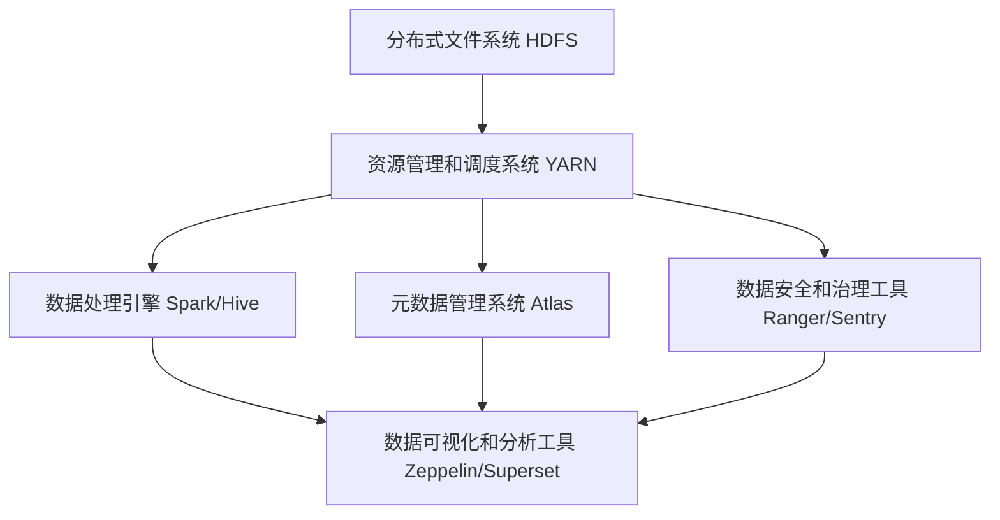
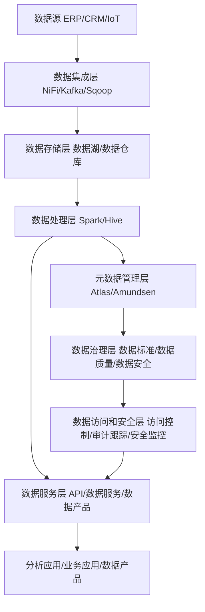

# 第十八章：数据湖与数据中台

## 1.背景介绍

### 1.1 数据爆炸时代的到来

在当今时代,随着互联网、物联网、人工智能等新兴技术的迅猛发展,数据正以前所未有的规模和速度不断产生和积累。传统的数据存储和管理系统已经无法有效地应对这种"数据爆炸"的挑战。企业需要一种新的数据架构来存储、管理和利用这些海量、多样化的数据资产。

### 1.2 数据价值挖掘的需求

数据被誉为"新时代的石油",蕴含着巨大的商业价值。然而,仅仅拥有大量的数据是不够的,关键在于如何高效地处理和分析这些数据,从中发现隐藏的见解和模式,为企业的决策提供有价值的支持。传统的数据仓库虽然可以存储结构化数据,但无法处理不断增长的非结构化和半结构化数据,如文本、图像、视频等。

### 1.3 数据孤岛与数据治理挑战

在许多组织中,数据通常分散存储在不同的系统和部门中,形成了数据孤岛。这种情况不仅降低了数据的可用性和一致性,还增加了数据治理的复杂性。随着数据量和种类的不断增加,有效地管理和维护数据质量、元数据、数据安全性和隐私保护等方面的挑战也日益严峻。

## 2.核心概念与联系

### 2.1 数据湖

数据湖(Data Lake)是一种新型的大数据存储和管理架构,旨在解决传统数据仓库的局限性。它能够高效存储各种类型的数据(结构化、半结构化和非结构化),包括文本、图像、视频等,而无需事先对数据进行结构化处理。数据湖通常建立在分布式文件系统(如HDFS)之上,利用廉价的存储硬件和开源软件(如Apache Hadoop生态系统)来实现可扩展性和成本效益。

数据湖的核心理念是"存储一切,计算一切"(Store Everything, Compute Anything)。它允许用户以原始格式存储所有数据,并在需要时通过各种计算引擎(如Apache Spark、Apache Hive等)对数据进行处理和分析。这种延迟模式(Schema on Read)与传统数据仓库的提前模式(Schema on Write)形成鲜明对比,为数据分析提供了更大的灵活性和可扩展性。

### 2.2 数据中台

数据中台(Data Middle Office)是一种数据管理和服务平台,旨在解决企业内部数据孤岛和数据治理的挑战。它作为企业数据资产的统一入口和出口,负责整合、管理和服务化企业内部的各种数据资源,为上下游的数据应用和业务系统提供高质量、标准化的数据服务。

数据中台的核心职能包括:

1. **数据集成**: 将企业内部的各种数据源(如ERP、CRM、物联网设备等)整合到统一的数据平台中,实现数据的统一存储和管理。

2. **数据治理**: 通过建立统一的数据标准、元数据管理、数据质量监控等机制,确保企业数据的一致性、完整性和准确性。

3. **数据服务**: 将经过处理和加工的数据资产以标准化的API、数据服务或数据产品的形式对内对外提供服务,支持企业的分析决策和业务创新。

4. **数据安全**: 通过访问控制、数据加密、审计跟踪等措施,保护企业数据资产的安全性和隐私性。

数据中台与数据湖的关系是互补的。数据湖可以作为数据中台的底层存储层,为数据中台提供原始数据的存储和计算能力;而数据中台则负责对数据湖中的原始数据进行整合、治理和服务化,为企业提供高质量、可信赖的数据资产。

## 3.核心算法原理具体操作步骤

### 3.1 数据湖架构与组件

一个典型的数据湖架构通常包括以下几个核心组件:

1. **分布式文件系统(Distributed File System)**: 如Apache Hadoop HDFS,用于存储原始数据。

2. **资源管理和调度系统(Resource Manager and Scheduler)**: 如Apache YARN,负责集群资源的管理和任务调度。

3. **数据处理引擎(Data Processing Engines)**: 如Apache Spark、Apache Hive等,用于对存储在数据湖中的原始数据进行批处理、流处理和交互式查询等操作。

4. **元数据管理系统(Metadata Management System)**: 如Apache Atlas,用于管理和维护数据湖中数据资产的元数据信息。

5. **数据安全和治理工具(Data Security and Governance Tools)**: 如Apache Ranger、Apache Sentry等,用于实现数据访问控制、审计跟踪和数据质量监控等功能。

6. **数据可视化和分析工具(Data Visualization and Analytics Tools)**: 如Apache Zeppelin、Apache Superset等,用于对处理后的数据进行可视化展示和商业智能分析。

下面是一个典型的数据湖架构示意图:

数据湖的核心操作步骤如下:

1. **数据摄入(Data Ingestion)**: 将各种来源的原始数据(结构化、半结构化和非结构化)通过批量或流式的方式加载到分布式文件系统(如HDFS)中。常用的数据摄入工具包括Apache Kafka、Apache NiFi、Apache Sqoop等。

2. **数据存储(Data Storage)**: 原始数据以其原生格式存储在分布式文件系统中,无需进行任何结构化处理。通常会采用列式存储格式(如Apache Parquet、Apache ORC)来提高查询性能。

3. **元数据管理(Metadata Management)**: 为存储在数据湖中的数据资产捕获和维护相关的元数据信息,如数据来源、schema、数据lineage等,以支持数据发现、数据治理和数据安全等功能。

4. **数据处理和分析(Data Processing and Analytics)**: 使用分布式计算引擎(如Apache Spark)对存储在数据湖中的原始数据进行批处理、流处理、交互式查询和机器学习等操作,以满足不同的分析需求。

5. **数据访问和服务(Data Access and Serving)**: 通过数据可视化和分析工具(如Apache Zeppelin、Apache Superset)或API服务,为数据分析师、数据科学家和应用程序提供对处理后数据的访问和服务。

6. **数据治理和安全(Data Governance and Security)**: 通过数据安全和治理工具(如Apache Ranger、Apache Sentry)实现对数据湖中数据资产的访问控制、审计跟踪、数据质量监控和策略执行等功能,确保数据的安全性和可靠性。

### 3.2 数据中台架构与流程

数据中台的核心架构通常包括以下几个主要组件:

1. **数据集成层(Data Integration Layer)**: 负责从各种数据源(如ERP、CRM、物联网设备等)采集数据,并将采集到的原始数据加载到数据湖或数据仓库中。常用的数据集成工具包括Apache NiFi、Apache Kafka、Apache Sqoop等。

2. **数据存储层(Data Storage Layer)**: 包括数据湖和数据仓库,用于存储原始数据和经过处理的数据资产。数据湖通常用于存储各种类型的原始数据,而数据仓库则专注于存储经过ETL(Extract, Transform, Load)处理后的结构化数据。

3. **数据处理层(Data Processing Layer)**: 使用各种数据处理引擎(如Apache Spark、Apache Hive等)对存储在数据湖和数据仓库中的数据进行清洗、转换、enrichment和建模等操作,以生成高质量的数据资产。

4. **数据服务层(Data Service Layer)**: 将处理后的数据资产通过标准化的API、数据服务或数据产品的形式对内对外提供服务,供上游的分析应用、业务应用和数据产品消费。

5. **元数据管理层(Metadata Management Layer)**: 负责管理和维护整个数据中台中数据资产的元数据信息,包括数据lineage、数据质量、数据字典等,支持数据发现、数据治理和数据安全等功能。

6. **数据治理层(Data Governance Layer)**: 通过建立统一的数据标准、数据质量规则、数据安全策略等机制,确保数据中台中数据资产的一致性、完整性、准确性和安全性。

7. **数据访问和安全层(Data Access and Security Layer)**: 负责对数据中台提供的数据服务实施访问控制、审计跟踪和安全监控,保护企业数据资产的安全性和隐私性。

下面是一个典型的数据中台架构示意图:

数据中台的核心操作流程如下:

1. **数据采集(Data Acquisition)**: 从各种数据源(如ERP、CRM、物联网设备等)采集原始数据,并通过数据集成工具加载到数据湖或数据仓库中。

2. **数据处理(Data Processing)**: 使用分布式计算引擎(如Apache Spark、Apache Hive)对存储在数据湖和数据仓库中的原始数据进行清洗、转换、enrichment和建模等操作,生成高质量的数据资产。

3. **元数据管理(Metadata Management)**: 捕获和维护整个数据中台中数据资产的元数据信息,包括数据lineage、数据质量、数据字典等,以支持数据发现、数据治理和数据安全等功能。

4. **数据治理(Data Governance)**: 通过建立统一的数据标准、数据质量规则、数据安全策略等机制,确保数据中台中数据资产的一致性、完整性、准确性和安全性。

5. **数据服务化(Data Servitization)**: 将处理后的数据资产以标准化的API、数据服务或数据产品的形式对内对外提供服务,供上游的分析应用、业务应用和数据产品消费。

6. **数据访问和安全(Data Access and Security)**: 对数据中台提供的数据服务实施访问控制、审计跟踪和安全监控,保护企业数据资产的安全性和隐私性。

7. **数据消费(Data Consumption)**: 上游的分析应用、业务应用和数据产品通过消费数据中台提供的数据服务,获取所需的高质量数据资产,支持分析决策和业务创新。

8. **持续优化(Continuous Optimization)**: 基于数据使用情况和反馈,不断优化数据中台的数据质量、数据服务和数据治理策略,以提高数据资产的价值和影响力。

## 4.数学模型和公式详细讲解举例说明

在数据湖和数据中台的背景下,有几个常用的数学模型和公式值得关注:

### 4.1 数据压缩算法

由于数据湖和数据中台需要存储大量的原始数据,因此数据压缩技术对于节省存储空间和提高I/O性能至关重要。常用的数据压缩算法包括:

1. **熵编码算法**:

   - **霍夫曼编码(Huffman Coding)**: 基于字符出现频率的无损压缩算法,压缩率较高。编码过程如下:

     $$
     L(c) = -\log_2 P(c)
     $$

     其中,$ L(c) $表示字符$ c $的编码长度,$ P(c) $表示字符$ c $的出