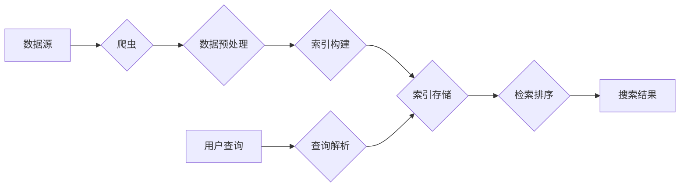

# 第四十九篇：全文搜索在金融领域的应用：提升风险控制能力

作者：禅与计算机程序设计艺术

## 1. 背景介绍

### 1.1 金融行业风险控制挑战

金融行业一直是风险管理的重点领域。随着金融市场全球化、自由化程度的提高，金融风险呈现出越来越复杂多变的特点，传统的风控手段已难以满足日益增长的需求。具体来说，金融机构面临以下挑战：

* **海量数据难以有效处理**: 金融交易数据量庞大且增长迅速，传统数据库难以有效存储和查询，更难以从中挖掘有价值的信息。
* **风险识别滞后**:  传统的风险控制方法主要依赖于人工经验和规则制定，难以及时捕捉新型风险和异常行为。
* **信息孤岛**: 金融机构内部各部门之间信息共享不足，导致风险难以全面评估和控制。

### 1.2 全文搜索技术优势

全文搜索技术作为一种高效的信息检索技术，能够帮助金融机构应对上述挑战。其优势主要体现在：

* **快速检索海量数据**: 全文搜索引擎能够快速索引和检索海量数据，即使是TB级别的金融数据也能够在毫秒级返回结果。
* **灵活的查询方式**: 全文搜索支持模糊查询、关键词组合查询、布尔逻辑查询等多种方式，能够满足金融机构多样化的风险控制需求。
* **语义理解**:  一些先进的全文搜索引擎还融入了自然语言处理技术，能够理解文本的语义，提高风险识别的准确性。

## 2. 核心概念与联系

### 2.1 全文搜索引擎核心组件

一个典型的全文搜索引擎架构如下图所示：



* **数据源**:  金融领域的数据源非常丰富，包括交易记录、客户信息、市场资讯、监管政策等。
* **爬虫**:  负责从各个数据源采集数据。
* **数据预处理**:  对原始数据进行清洗、转换、标准化等操作，为后续的索引构建做准备。
* **索引构建**:  根据预处理后的数据创建倒排索引，提高查询效率。
* **索引存储**:  将构建好的索引存储到磁盘或内存中。
* **查询解析**:  对用户输入的查询语句进行语法分析和语义理解。
* **检索排序**:  根据查询条件检索相关文档，并根据相关性进行排序。

### 2.2 全文搜索与风险控制关系

全文搜索技术可以应用于风险控制的各个环节，包括：

* **客户尽职调查**: 利用全文搜索技术对客户信息进行全面检索和分析，识别潜在风险。
* **交易监控**:  实时监控交易数据，识别异常交易行为，例如洗钱、欺诈等。
* **合规审查**:  对公司内部文件和外部监管政策进行检索和分析，确保公司运营合规。
* **舆情监测**:  实时监控网络舆情，及时发现和应对潜在的风险事件。

## 3. 核心算法原理具体操作步骤

### 3.1 倒排索引构建

倒排索引是全文搜索引擎的核心数据结构，它记录了每个关键词出现在哪些文档中。其构建过程主要包括以下步骤：

1. **分词**: 将文档文本切分成一个个关键词。
2. **去除停用词**: 去除一些没有实际意义的词语，例如“的”、“是”等。
3. **词干提取**: 将不同形式的同一个词语转换成统一的形式，例如“running”和“ran”都转换成“run”。
4. **构建倒排索引**:  记录每个关键词出现在哪些文档中，以及在文档中的位置信息。

### 3.2 相关性排序

当用户提交查询请求时，全文搜索引擎需要根据查询条件检索相关文档，并根据相关性进行排序。常用的相关性排序算法包括：

* **TF-IDF**:  TF-IDF算法考虑了关键词在文档中出现的频率以及在所有文档中出现的频率，能够有效区分文档的相关性。
* **BM25**:  BM25算法是TF-IDF算法的改进版本，它考虑了文档长度等因素，能够更准确地评估文档的相关性。
* **PageRank**:  PageRank算法最初用于网页排名，它根据网页之间的链接关系计算网页的重要性，也可以用于评估文档的相关性。

## 4. 数学模型和公式详细讲解举例说明

### 4.1 TF-IDF算法

TF-IDF算法的公式如下：

```
TF-IDF(t, d) = TF(t, d) * IDF(t)
```

其中：

* **t**:  关键词
* **d**:  文档
* **TF(t, d)**:  关键词t在文档d中出现的频率
* **IDF(t)**:  关键词t的逆文档频率，计算公式如下：

```
IDF(t) = log(N / df(t))
```

其中：

* **N**:  所有文档的数量
* **df(t)**:  包含关键词t的文档数量

**举例说明**:

假设我们有以下三篇文档：

* 文档1:  "The quick brown fox jumps over the lazy dog"
* 文档2:  "The quick brown fox jumps over the lazy cat"
* 文档3:  "The lazy dog sleeps soundly"

现在我们要计算关键词“fox”在文档1中的TF-IDF值。

* **TF("fox", 文档1)** = 1 / 9 (关键词“fox”在文档1中出现1次，文档1总共有9个词)
* **df("fox")** = 2 (包含关键词“fox”的文档数量为2)
* **IDF("fox")** = log(3 / 2) ≈ 0.405

因此，关键词“fox”在文档1中的TF-IDF值为：

```
TF-IDF("fox", 文档1) = (1 / 9) * 0.405 ≈ 0.045
```

### 4.2 BM25算法

BM25算法的公式如下：

```
score(D, Q) = sum(IDF(qi) * (f(qi, D) * (k1 + 1)) / (f(qi, D) + k1 * (1 - b + b * |D| / avgdl)))
```

其中：

* **D**:  文档
* **Q**:  查询语句
* **qi**:  查询语句中的第i个关键词
* **f(qi, D)**:  关键词qi在文档D中出现的频率
* **|D|**:  文档D的长度
* **avgdl**:  所有文档的平均长度
* **k1**:  调节参数，通常取值为1.2
* **b**:  调节参数，通常取值为0.75

## 5. 项目实践：代码实例和详细解释说明

### 5.1 Python Elasticsearch实现全文搜索

```python
from elasticsearch import Elasticsearch

# 连接Elasticsearch集群
es = Elasticsearch([{'host': 'localhost', 'port': 9200}])

# 创建索引
es.indices.create(index='financial_data', ignore=400)

# 插入数据
es.index(index='financial_data', doc_type='transaction', id=1, body={
    'customer_id': 123,
    'transaction_amount': 1000,
    'transaction_date': '2023-04-01',
    'transaction_description': 'Online purchase'
})

# 搜索数据
results = es.search(index='financial_data', body={
    'query': {
        'match': {
            'transaction_description': 'purchase'
        }
    }
})

# 打印搜索结果
print(results)
```

**代码解释**:

* 首先，我们需要安装Elasticsearch Python客户端库：`pip install elasticsearch`。
* 然后，我们连接到Elasticsearch集群，并创建一个名为“financial_data”的索引。
* 接下来，我们插入一条交易数据到索引中。
* 最后，我们使用`match`查询语句搜索交易描述中包含“purchase”的交易记录，并将搜索结果打印出来。

### 5.2 风险控制场景应用

在实际应用中，我们可以根据具体的需求对全文搜索引擎进行定制化开发，例如：

* **构建金融领域词库**:  将金融领域的专业术语添加到词库中，提高分词和查询的准确性。
* **开发自定义评分插件**:  根据业务需求开发自定义评分插件，例如可以根据交易金额、客户风险等级等因素调整文档的相关性评分。
* **集成机器学习模型**:  将机器学习模型集成到全文搜索引擎中，例如可以使用机器学习模型识别异常交易行为。

## 6. 工具和资源推荐

### 6.1 全文搜索引擎

* **Elasticsearch**:  开源的分布式全文搜索引擎，功能强大，性能优异。
* **Solr**:  Apache基金会下的开源全文搜索引擎，成熟稳定，文档齐全。
* **Sphinx**:  开源的全文搜索引擎，专注于数据库搜索，性能高效。

### 6.2 数据可视化工具

* **Kibana**:  Elasticsearch官方提供的可视化工具，可以方便地对搜索结果进行可视化分析。
* **Grafana**:  开源的数据可视化工具，支持多种数据源，可以创建各种类型的图表和仪表盘。

## 7. 总结：未来发展趋势与挑战

### 7.1 未来发展趋势

* **人工智能与全文搜索深度融合**:  随着人工智能技术的不断发展，未来全文搜索引擎将会更加智能化，例如能够自动识别风险、预测风险趋势等。
* **全文搜索云服务**:  越来越多的企业选择使用云服务来部署和管理全文搜索引擎，以降低成本和提高效率。
* **实时搜索**:  随着金融交易速度的不断加快，实时搜索将会成为未来金融风险控制的标配。

### 7.2 面临挑战

* **数据安全**:  金融数据非常敏感，如何保障数据安全是全文搜索技术应用于金融领域的一大挑战。
* **技术门槛**:  全文搜索技术相对复杂，需要专业的技术人员才能进行开发和维护。
* **成本控制**:  部署和维护全文搜索引擎需要一定的成本，如何控制成本也是企业需要考虑的问题。

## 8. 附录：常见问题与解答

### 8.1 如何选择合适的全文搜索引擎？

选择合适的全文搜索引擎需要考虑以下因素：

* **数据量**:  不同的全文搜索引擎适用于不同的数据量，例如Elasticsearch适用于海量数据，而Sphinx适用于中小规模数据。
* **性能需求**:  不同的全文搜索引擎性能表现不同，需要根据实际需求选择性能满足要求的引擎。
* **功能需求**:  不同的全文搜索引擎提供的功能有所差异，需要根据实际需求选择功能满足要求的引擎。
* **成本预算**:  不同的全文搜索引擎成本不同，需要根据实际预算选择合适的引擎。

### 8.2 如何提高全文搜索的准确性？

提高全文搜索准确性的方法有很多，例如：

* **优化分词**:  使用专业的金融领域词库进行分词，可以提高分词的准确性。
* **去除停用词**:  去除一些没有实际意义的词语，可以减少噪音，提高搜索的准确性。
* **词干提取**:  将不同形式的同一个词语转换成统一的形式，可以提高搜索的召回率。
* **使用同义词**:  将同义词添加到查询语句中，可以提高搜索的召回率。
* **调整评分算法**:  根据业务需求调整评分算法，可以提高搜索结果的相关性。