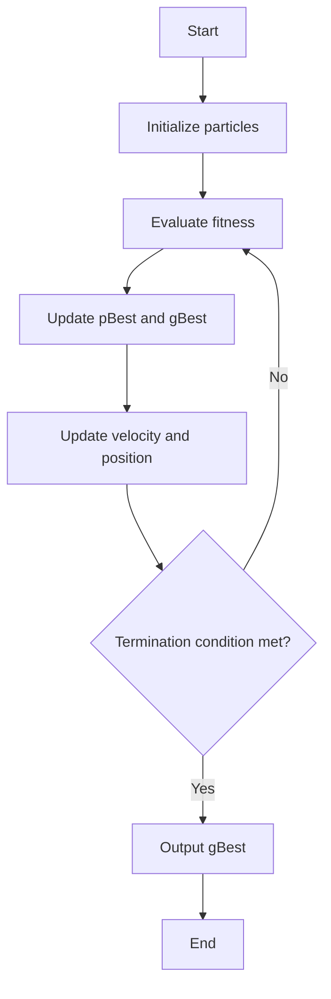

# 粒子群算法的Java实现:完整项目源码解析

## 1.背景介绍

### 1.1 粒子群算法概述

粒子群优化算法(Particle Swarm Optimization, PSO)是一种基于群体智能的进化计算技术,由肯尼迪和埃伯哈特于1995年提出。该算法源于对鸟群捕食行为的研究,模拟了鸟群在空中觅食时相互协作的过程。

粒子群算法将待优化的问题域中的每个可能解都看作是一个粒子,所有粒子在解空间中飞行并相互学习优化。每个粒子通过追踪两个"极值"来调整自身的飞行轨迹:一个是当前粒子所找到的最优解,另一个是当前所有粒子中最优的那个解。在飞行过程中,粒子会根据自身和群体的飞行经验不断调整自身的位置和速度,最终收敛到问题的最优解附近。

### 1.2 粒子群算法的应用

粒子群算法具有简单、高效、易于实现的特点,已广泛应用于函数优化、神经网络训练、模糊系统控制、任务调度等多个领域。它不需要对目标函数提供太多先验信息,也不容易陷入局部最优,因此在连续非线性约束优化问题中表现出较好的鲁棒性和全局收敛性。

### 1.3 为什么要学习粒子群算法

粒子群算法作为一种重要的群智能计算技术,具有重要的理论研究价值和工程应用价值。从理论层面上,粒子群涉及到动力学、混沌理论、矩阵理论等多个数学分支,具有丰富的数学理论基础;从应用层面上,粒子群算法已成功应用于机器学习、组合优化、多目标优化等多个领域,解决了许多实际问题。因此,深入学习和掌握粒子群算法及其编程实现,对于提升算法设计能力、解决复杂优化问题具有重要意义。

## 2.核心概念与联系

### 2.1 粒子群算法中的核心概念

1. **粒子(Particle)**: 粒子群算法中的基本组成单元。每个粒子都代表一个候选解,通过在解空间中飞行来寻找最优解。粒子由位置向量和速度向量组成。

2. **粒子位置(Position)**: 粒子在解空间中的当前位置,对应一个候选解。

3. **粒子速度(Velocity)**: 粒子在解空间中的飞行速度和方向,用于调整粒子的位置。

4. **个体最优解(pBest)**: 粒子在搜索过程中遇到的最优解,即粒子自身的历史最佳位置。

5. **全局最优解(gBest)**: 整个粒子群中所有粒子的最优解,即当前发现的全局最佳位置。

6. **适应度函数(Fitness Function)**: 用于评估粒子位置对应解的优劣程度,是算法的驱动力。

### 2.2 粒子群算法的核心思想

粒子群算法的核心思想是通过模拟鸟群捕食行为,利用粒子之间的信息共享来完成对解空间的有效搜索。算法的关键在于,每个粒子不仅能追踪自身搜索到的最优解,还能跟踪整个种群目前所找到的最优解。在每次迭代时,粒子根据自身历史最优位置和群体历史最优位置对自身速度和位置进行调整,从而逐步向全局最优解收敛。

### 2.3 粒子群算法与其他算法的联系

粒子群算法与其他常见的优化算法存在一定联系:

1. **与遗传算法(GA)的联系**: 粒子群算法和遗传算法都属于进化计算范畴,都是模拟生物进化过程的优化算法。但它们在算法思路和实现细节上存在明显差异。

2. **与蚁群算法(ACO)的联系**: 粒子群算法和蚁群算法都属于群智能算法,都是模拟生物群体行为的优化算法。但它们分别模拟了鸟群和蚁群的不同行为特征。

3. **与模拟退火算法(SA)的联系**: 粒子群算法和模拟退火算法都能有效避免陷入局部最优,但它们采用了不同的策略。粒子群算法利用群体协作,而模拟退火算法则通过概率跳出机制。

4. **与梯度下降算法的区别**: 粒子群算法是一种无梯度优化算法,不需要目标函数的梯度信息,因此在非线性、非凸、多峰等复杂优化问题上表现更好。

总的来说,粒子群算法吸收了其他算法的一些优点,但又具有自身的独特性,成为了优化领域中一种重要的算法范式。

## 3.核心算法原理具体操作步骤

### 3.1 粒子群算法的基本原理

粒子群算法的基本原理可以概括为以下几个步骤:

1. **初始化粒子群**:随机初始化一组粒子的位置和速度,并计算每个粒子的适应度值。

2. **更新个体最优解**:对每个粒子,将当前位置对应的适应度值与其历史最佳适应度值(pBest)进行比较,如果更优则更新pBest。

3. **更新全局最优解**:从所有粒子的pBest中选择最优值作为gBest。

4. **更新粒子速度和位置**:根据公式,使用当前粒子速度、pBest和gBest来更新每个粒子的速度和位置。

5. **终止判断**:检查是否达到终止条件(如最大迭代次数或目标函数值),若达到则输出最优解并结束,否则回到第2步继续迭代。

### 3.2 粒子速度和位置更新公式

粒子群算法中,粒子的速度和位置更新是算法的核心,其更新公式如下:

$$
v_{id}^{(t+1)} = w \cdot v_{id}^{(t)} + c_1 \cdot r_1 \cdot (p_{id}^{(t)} - x_{id}^{(t)}) + c_2 \cdot r_2 \cdot (p_{gd}^{(t)} - x_{id}^{(t)})
$$

$$
x_{id}^{(t+1)} = x_{id}^{(t)} + v_{id}^{(t+1)}
$$

其中:

- $v_{id}^{(t)}$是粒子i在第t次迭代时的速度向量的第d个分量
- $x_{id}^{(t)}$是粒子i在第t次迭代时的位置向量的第d个分量
- $p_{id}^{(t)}$是粒子i在第t次迭代时的个体最优解的第d个分量
- $p_{gd}^{(t)}$是粒子群在第t次迭代时的全局最优解的第d个分量
- $w$是惯性权重,用于控制粒子的飞行轨迹
- $c_1$和$c_2$是加速常数,控制粒子向pBest和gBest靠拢的程度
- $r_1$和$r_2$是[0,1]之间的随机数,用于增加算法的随机性

这个公式体现了粒子群算法的核心思想:粒子的新速度由三部分组成,分别是惯性部分、认知部分和社会部分。惯性部分使粒子保持当前飞行惯性,认知部分使粒子朝向自身历史最优位置飞行,社会部分使粒子朝向群体最优位置飞行。通过这三部分的综合作用,粒子在解空间中进行有效搜索。

### 3.3 算法流程图

使用Mermaid绘制粒子群算法的流程图:

算法的主要步骤如下:

1. 初始化粒子群,包括粒子的位置和速度。
2. 评估每个粒子的适应度值。
3. 更新每个粒子的pBest和全局gBest。
4. 根据公式更新每个粒子的速度和位置。
5. 检查是否满足终止条件,如果是则输出gBest作为最优解并结束,否则继续迭代。

该流程图清晰地展示了粒子群算法的基本执行过程,有助于理解算法的核心思路。

## 4.数学模型和公式详细讲解举例说明

### 4.1 粒子群算法的数学模型

粒子群算法的数学模型可以用以下符号表示:

- $D$: 搜索空间的维数
- $N$: 粒子群中粒子的数量
- $X_i = (x_{i1}, x_{i2}, ..., x_{iD})$: 第i个粒子的位置向量
- $V_i = (v_{i1}, v_{i2}, ..., v_{iD})$: 第i个粒子的速度向量
- $P_i = (p_{i1}, p_{i2}, ..., p_{iD})$: 第i个粒子的个体最优解
- $G = (g_1, g_2, ..., g_D)$: 全局最优解
- $f(X)$: 待优化的目标函数

粒子群算法的目标是在搜索空间中找到一个位置向量$X^*$,使得目标函数$f(X^*)$达到最小值或最大值。

在每次迭代中,第i个粒子的速度和位置更新公式如下:

$$
v_{ij}^{(t+1)} = w \cdot v_{ij}^{(t)} + c_1 \cdot r_1 \cdot (p_{ij}^{(t)} - x_{ij}^{(t)}) + c_2 \cdot r_2 \cdot (g_j^{(t)} - x_{ij}^{(t)})
$$

$$
x_{ij}^{(t+1)} = x_{ij}^{(t)} + v_{ij}^{(t+1)}
$$

其中$j = 1, 2, ..., D$表示维度,其他符号的含义与前面相同。

### 4.2 惯性权重的作用

在粒子群算法中,惯性权重$w$起着至关重要的作用。它控制着粒子在解空间中的飞行轨迹,影响着算法的收敛性能。

一般情况下,惯性权重$w$的取值范围为[0, 1]。较大的$w$值有利于算法在解空间中进行更加广泛的搜索,避免过早收敛于局部最优解;而较小的$w$值则有利于算法在解空间中进行更加精细的搜索,加快收敛速度。

惯性权重$w$通常采用线性递减策略,即随着迭代次数的增加,惯性权重逐渐减小。这样可以在算法的前期保持较好的全局搜索能力,而在后期则加快收敛速度,从而达到平衡全局搜索和局部搜索的目的。

例如,我们可以使用以下公式来动态调整惯性权重:

$$
w = w_{\max} - \frac{w_{\max} - w_{\min}}{iter_{\max}} \times iter
$$

其中:

- $w_{\max}$是最大惯性权重,通常取0.9
- $w_{\min}$是最小惯性权重,通常取0.4
- $iter_{\max}$是最大迭代次数
- $iter$是当前迭代次数

### 4.3 加速常数的作用

加速常数$c_1$和$c_2$分别控制着粒子向个体最优解和全局最优解靠拢的程度。一般情况下,我们取$c_1 = c_2 = 2$,这样可以较好地平衡个体和社会行为。

如果$c_1 > c_2$,则粒子更倾向于朝向自身的历史最优位置飞行,这有利于算法在局部区域进行细致搜索,但可能会过早收敛于局部最优解。

如果$c_2 > c_1$,则粒子更倾向于朝向群体的最优位置飞行,这有利于算法进行更加广泛的全局搜索,但可能会导致收敛速度变慢。

因此,在实际应用中,我们需要根据具体问题的特点来适当调整$c_1$和$c_2$的值,以获得更好的算法性能。

###