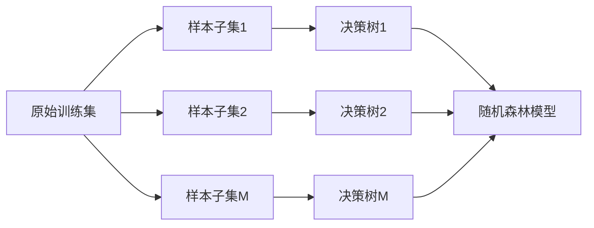

# 经典书籍推荐：深入理解随机森林

作者：禅与计算机程序设计艺术

## 1. 背景介绍
### 1.1 随机森林的起源与发展
随机森林(Random Forest)是由Leo Breiman和Adele Cutler在2001年提出的一种集成学习算法。它是基于决策树的集成学习方法,通过bootstrap抽样技术从训练集中随机有放回地抽取若干组子集,在每个子集上建立决策树模型,再将各个决策树的输出结果进行组合,最终得到随机森林模型的输出。

随机森林自提出以来,因其优异的性能和易于理解与实现的特点,在机器学习和数据挖掘领域得到了广泛的应用。它在分类、回归、异常检测、特征选择等任务上都取得了非常好的效果。

### 1.2 随机森林的优缺点分析
随机森林具有如下优点:
1. 可以处理高维数据,对特征数量没有限制。
2. 训练速度快,预测准确率高,能够有效避免过拟合。
3. 能够评估各个特征的重要性,可解释性强。  
4. 对噪声和异常值不敏感,鲁棒性好。
5. 支持并行化计算,可扩展性强。

随机森林的缺点主要有:
1. 对于噪声较大的分类问题,泛化能力较差。
2. 对于少数类别的样本,容易导致这些类别的样本被忽略。

## 2. 核心概念与联系
### 2.1 决策树
决策树是一种树形结构,由结点和有向边组成。内部结点表示一个特征或属性,叶结点表示一个类别。从树的根结点到叶结点的每条路径构建一个判定规则。使用决策树进行预测时,从根结点出发,
测试待预测样本对应的属性,根据属性值选择分支,直到达到叶子结点,将叶结点的类别作为该样本的预测值。

常见的决策树算法有ID3、C4.5、CART等。随机森林使用CART作为基学习器。

### 2.2 集成学习
集成学习是通过构建多个学习器并将其组合来完成学习任务的一种方法。常见的集成学习方法有Bagging和Boosting。

Bagging通过bootstrap抽样得到若干组不同的训练子集,在每个子集上训练一个基学习器,然后将这些基学习器进行组合。Bagging的代表算法就是随机森林。

Boosting通过多轮迭代,每一轮根据上一轮基学习器的表现对训练样本分布进行调整,使得先前基学习器做错的训练样本在后续受到更多关注。Boosting的代表算法有AdaBoost和GBDT。

### 2.3 随机性引入
随机森林在两个方面引入了随机性:
1. 样本随机性。使用bootstrap方法对原始训练集进行抽样,得到若干不同的训练子集。这样一方面增加了模型的多样性,另一方面也使得模型更加鲁棒。
2. 属性随机性。在决策树节点分裂时,不是在所有属性中选择最佳分裂属性,而是在所有属性的一个随机子集中选择最佳分裂属性。这样不仅能降低计算开销,而且能降低模型方差,提高泛化能力。

## 3. 核心算法原理具体操作步骤

随机森林的具体训练过程如下:

1. 从原始训练集中使用bootstrap方法有放回地抽取N个样本,共进行M轮抽样,得到M个不同的训练子集。
2. 对每个训练子集,训练一棵CART决策树:
   - 对当前节点数据,随机选择k个属性作为候选属性子集;
   - 在候选属性子集中,选取某个最佳分裂属性,把当前节点的样本划分到两个子节点中;
   - 递归地在子节点上重复上述步骤,直到满足叶节点停止条件。
3. 重复步骤2,共训练M棵决策树,构成随机森林。

随机森林的预测过程如下:
1. 对于分类问题,由M棵决策树分别对待预测样本进行分类,再使用投票法得到最终的分类标签;
2. 对于回归问题,由M棵决策树分别对待预测样本进行回归预测,再计算M个预测值的均值作为最终的预测结果。



## 4. 数学模型和公式详细讲解举例说明

假设原始训练集为$D=\{(x_1,y_1),(x_2,y_2),...,(x_N,y_N)\}$,其中$x_i$为特征向量,$y_i$为对应的类别标签或回归目标值。

### 4.1 决策树的数学模型

使用CART算法建立决策树。对于分类问题,使用基尼指数(Gini)作为分裂指标。假设有K个类别,样本点属于第k类的概率为$p_k$,则Gini定义为:

$$Gini(p)=\sum_{k=1}^{K}p_k(1-p_k)=1-\sum_{k=1}^{K}p_k^2$$

Gini值越小,节点的纯度越高。分类树的目标是选择Gini值最小的属性作为最佳分裂属性。 

对回归问题,使用平方误差作为分裂指标。假设一个节点上有N个样本,每个样本的回归目标值为$y_i$,平均值为$\bar{y}$,则平方误差定义为:

$$S=\sum_{i=1}^{N}(y_i-\bar{y})^2$$

回归树的目标是选择平方误差最小的属性作为最佳分裂属性。

### 4.2 随机森林推断的数学模型

假设随机森林由M棵决策树构成,对于分类问题,每棵决策树的分类结果记为$h_i(x)$,则随机森林的分类结果为:

$$H(x)=argmax_{y} \sum_{i=1}^{M}I(h_i(x)=y)$$

其中,$I$为指示函数,当$h_i(x)=y$时,$I=1$,否则,$I=0$。即随机森林使用投票法决定最终的分类标签。

对于回归问题,随机森林的预测结果为所有决策树预测值的均值:

$$H(x)=\frac{1}{M} \sum_{i=1}^{M}h_i(x)$$

## 5. 项目实践：代码实例和详细解释说明

下面用Python语言和scikit-learn库来实现随机森林算法:

```python
from sklearn.ensemble import RandomForestClassifier
from sklearn.datasets import make_classification

# 生成一个随机分类数据集
X, y = make_classification(n_samples=1000, n_features=4, n_classes=2) 

# 建立随机森林分类器
rf = RandomForestClassifier(n_estimators=100, max_depth=2, random_state=0)

# 在训练集上训练随机森林
rf.fit(X, y)

# 在测试集上测试分类器性能
print(rf.score(X, y))

# 打印随机森林中的第1棵决策树  
from sklearn.tree import export_graphviz
export_graphviz(rf.estimators_[0], out_file='tree.dot') 
```

代码解释:
1. 导入随机森林分类器`RandomForestClassifier`和数据生成器`make_classification`。
2. 使用`make_classification`生成一个含1000个样本,4个特征,2个类别的分类数据集。
3. 建立随机森林分类器,设置决策树个数为100,最大深度为2,随机种子为0。
4. 用`fit`函数在训练集上训练随机森林模型。
5. 用`score`函数在测试集上测试模型的分类准确率。 
6. 使用`export_graphviz`方法,将随机森林中的第1棵决策树可视化输出到`tree.dot`文件中。

## 6. 实际应用场景
随机森林可以应用在多种实际场景中,比如:
1. 金融领域的贷款违约预测、客户流失预警等。
2. 医疗领域的疾病诊断、药物分子活性预测等。
3. 工业领域的设备故障诊断、产品质量预测等。
4. 网络安全领域的异常检测、垃圾邮件识别等。
5. 自然语言处理领域的文本分类、情感分析等。

## 7. 工具和资源推荐
1. scikit-learn: 包含随机森林的Python机器学习库。官网:https://scikit-learn.org
2. R语言randomForest包:R语言的随机森林实现。官网:https://cran.r-project.org/web/packages/randomForest/
3. Weka: 基于Java的数据挖掘工具,包含随机森林算法。官网:https://www.cs.waikato.ac.nz/ml/weka/ 
4. 随机森林原论文:《Random Forests》,作者Leo Breiman,发表于Machine Learning, 2001.
5. 随机森林的可视化与调参指南:《Complete Guide to Parameter Tuning in Random Forest》,地址:https://www.analyticsvidhya.com/blog/2020/03/beginners-guide-random-forest-hyperparameter-tuning/

## 8. 总结：随机森林的未来发展趋势与挑战

### 8.1 未来发展趋势
1. 与深度学习结合,研究深度随机森林模型。
2. 改进决策树构建方法,提高随机森林性能,如使用极端随机树作为基学习器。
3. 设计更高效的并行化算法,进一步提高随机森林的训练和预测速度。
4. 将随机森林与其他算法集成,如将随机森林和神经网络结合,提高预测准确率。

### 8.2 面临的挑战
1. 随机森林在处理高度失衡数据时,容易偏向多数类,性能有待提高。  
2. 随机森林模型通常很大,需要大量存储空间,模型压缩是一个值得研究的问题。
3. 如何降低随机森林的计算复杂度,使其更适用于大规模数据集,是一个需要解决的难题。

## 9. 附录
### 9.1 随机森林的常见问题

**1. 随机森林的超参数有哪些?如何调参?**

答:随机森林的主要超参数包括:
- n_estimators:决策树的数量
- max_depth:决策树的最大深度  
- max_features:每次分裂时考虑的最大特征数
- min_samples_split:内部节点再划分所需最小样本数
- min_samples_leaf:叶子节点最少样本数

调参步骤通常为:
1. 使用网格搜索对n_estimators和max_depth进行调参。
2. 固定n_estimators和max_depth,调整max_features。 
3. 再验证min_samples_split和min_samples_leaf的影响。
4. 使用交叉验证选择最优参数组合。

**2. 随机森林为什么不容易过拟合?**

答:主要有两方面原因:
1. 使用bootstrap对训练集重采样,每棵决策树使用不同的训练子集,树之间具有多样性,降低了过拟合风险。
2. 在每个节点分裂时引入属性随机选择,进一步增加了树的差异性,提高了模型的泛化能力,减少过拟合。

**3. 随机森林如何评估特征重要性?**

答:随机森林评估特征重要性的常用指标是"平均不纯度减少(Mean Decrease Impurity)"和"平均精确率减少(Mean Decrease Accuracy)":
1. 平均不纯度减少:对每棵决策树,计算每个特征在节点分裂时不纯度(如基尼指数)的减小量,然后取平均,就得到该特征的重要性。
2. 平均精确率减少:对每棵决策树,随机改变某个特征的取值,看精确率的减小量,然后取平均,就得到该特征的重要性。

特征重要性评分高的特征,对模型的预测性能影响大。

以上就是关于如何深入理解随机森林算法的一些要点总结。作为机器学习的重要算法之一,随机森林在多个领域都有着广泛的应用前景。建议感兴趣的读者继续深入