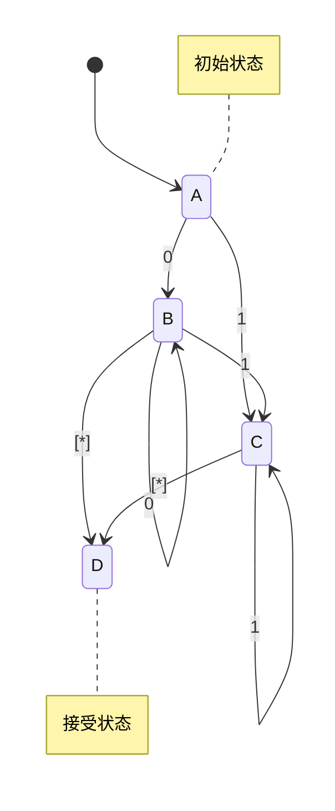

# 编译原理在线答疑系统设计与实现

## 1. 背景介绍

### 1.1 编译原理的重要性

编译原理是计算机科学中一个核心领域,是软件工程、程序设计语言和计算机体系结构等多个领域的基础。它研究如何将高级编程语言翻译成机器可执行的低级语言,是计算机系统的核心组成部分。编译器的设计和实现直接影响到程序的执行效率和系统的性能,因此编译原理在计算机科学中扮演着至关重要的角色。

### 1.2 编译原理学习的挑战

尽管编译原理的重要性不言而喻,但它涉及的理论知识繁杂,概念抽象,算法复杂,给学习者带来了极大挑战。许多学生在学习过程中感到吃力,很难掌握编译原理的精髓。此外,编译原理与实际应用密切相关,需要学生具备扎实的编程能力和系统设计能力,才能真正理解和运用所学知识。

### 1.3 在线答疑系统的必要性

为了帮助学生更好地学习编译原理,提高教学效果,构建一个高质量的在线答疑系统是非常必要的。通过在线答疑系统,学生可以及时解决学习中遇到的疑惑,获得专业的指导和反馈。同时,教师也可以更好地了解学生的学习情况,针对性地优化教学方式。此外,在线答疑系统还可以促进学生之间的交流和讨论,形成良性的学习氛围。

## 2. 核心概念与联系

### 2.1 编译原理的核心概念

编译原理包含了诸多核心概念,其中最为重要的有:

1. **词法分析(Lexical Analysis)**: 将源代码分割成一个个有意义的基本单元(token),如关键字、标识符、运算符等。
2. **语法分析(Syntax Analysis)**: 根据语言的语法规则,将token序列构建成抽象语法树(AST)的过程。
3. **语义分析(Semantic Analysis)**: 对AST进行语义检查,确保程序的正确性和合理性。
4. **中间代码生成(Intermediate Code Generation)**: 将AST转换为更加抽象和机器无关的中间代码表示。
5. **代码优化(Code Optimization)**: 对中间代码进行等价变换,以提高目标代码的执行效率。
6. **目标代码生成(Target Code Generation)**: 将优化后的中间代码转换为可执行的机器代码。

这些概念相互关联,构成了编译器的主要工作流程。

### 2.2 核心概念之间的联系

编译原理的核心概念之间存在着紧密的联系,它们共同构成了一个完整的编译系统。具体来说:

1. 词法分析是编译过程的第一步,为后续的语法分析和语义分析提供基础输入。
2. 语法分析依赖于词法分析的结果,并生成AST供语义分析使用。
3. 语义分析基于AST进行类型检查、作用域分析等,确保程序的正确性。
4. 中间代码生成使用AST和语义分析的结果,生成更抽象的中间表示。
5. 代码优化对中间代码进行等价变换,以提高目标代码的性能。
6. 目标代码生成将优化后的中间代码转换为可执行的机器代码。

这些核心概念相互作用、环环相扣,共同完成了从高级语言到机器语言的翻译过程。

## 3. 核心算法原理具体操作步骤

### 3.1 词法分析算法

词法分析的主要任务是将源代码按照一定的规则分割成一个个有意义的token。常用的词法分析算法有确定有限自动机(DFA)和正则表达式等。

1. **DFA算法步骤**:
   1) 构建有限状态自动机
   2) 初始化当前状态为开始状态
   3) 读取输入字符
   4) 根据当前状态和输入字符,进行状态转移
   5) 如果达到接受状态,输出对应token
   6) 重复3-5直到读完全部输入

2. **正则表达式算法步骤**:
   1) 将正则表达式转换为非确定有限自动机(NFA)
   2) 将NFA子集构造为DFA
   3) 使用DFA进行词法分析

这两种算法都可以高效地完成词法分析任务,但正则表达式算法更加灵活和通用。

### 3.2 语法分析算法

语法分析的目标是根据语言的语法规则,将token序列构建成抽象语法树(AST)。常用的语法分析算法有自顶向下分析(如LL分析)和自底向上分析(如LR分析)。

1. **LL分析算法步骤**:
   1) 构造预测分析表
   2) 初始化分析栈为开始符号
   3) 读取下一个token
   4) 根据分析栈顶符号和当前token,查预测分析表执行对应动作
   5) 重复3-4直到分析完成

2. **LR分析算法步骤**:
   1) 构造LR分析表
   2) 初始化分析栈和输入缓冲区
   3) 根据当前状态和输入符号,查LR分析表执行对应动作
   4) 重复3直到分析完成

LL分析适用于LL(1)文法,而LR分析适用范围更广,可处理大部分编程语言的语法。

### 3.3 语义分析算法

语义分析的主要任务包括类型检查、作用域分析、继承属性计算等。常用的语义分析算法有自顶向下翻译方案和自底向上翻译方案。

1. **自顶向下翻译方案步骤**:
   1) 构造语法制导定义(SDT)
   2) 在语法分析的同时执行语义动作
   3) 根据SDT计算每个语法规则的语义动作

2. **自底向上翻译方案步骤**:
   1) 构造语法制导定义(SDT)
   2) 在语法分析的同时构建语法树
   3) 对语法树进行自底向上遍历,执行语义动作

这两种方案都可以有效地完成语义分析任务,具体选择取决于语言的特性和设计偏好。

### 3.4 中间代码生成算法

中间代码生成的目标是将AST转换为更加抽象和机器无关的中间表示,常用的中间码表示形式有三地址码、静态单赋值形式等。

1. **三地址码生成算法步骤**:
   1) 对AST进行深度优先遍历
   2) 为每个语法构造生成对应的三地址码序列
   3) 维护临时变量和标签的分配

2. **静态单赋值形式生成算法步骤**:
   1) 对AST进行深度优先遍历
   2) 为每个语法构造生成对应的静态单赋值形式
   3) 插入 φ 函数实现控制流合并

这两种算法都可以高效地生成中间码,但静态单赋值形式更利于后续的代码优化。

### 3.5 代码优化算法

代码优化的目标是对中间代码进行等价变换,以提高目标代码的执行效率。常用的优化算法有常量传播、死代码消除、循环不变式外提等。

1. **常量传播算法步骤**:
   1) 构建值号映射表
   2) 对中间代码进行反向传播分析
   3) 将常量值替换为对应的值号

2. **死代码消除算法步骤**:
   1) 构建控制流图
   2) 对控制流图进行可达性分析
   3) 删除不可达的代码块

3. **循环不变式外提算法步骤**:
   1) 对循环进行数据流分析
   2) 识别循环不变式表达式
   3) 将循环不变式代码块外提

这些优化算法可以单独使用,也可以组合使用,从而实现更高效的代码优化。

### 3.6 目标代码生成算法

目标代码生成的目标是将优化后的中间代码转换为可执行的机器代码。常用的目标代码生成算法有基本块划分、指令选择和寄存器分配等。

1. **基本块划分算法步骤**:
   1) 构建控制流图
   2) 根据控制流图划分基本块
   3) 对每个基本块进行后续代码生成

2. **指令选择算法步骤**:
   1) 构建目标指令集的模式匹配规则
   2) 对中间代码进行模式匹配
   3) 选择最优的目标指令序列

3. **寄存器分配算法步骤**:
   1) 构建干涉图
   2) 使用图着色算法为每个变量分配寄存器
   3) 为未分配到寄存器的变量分配内存位置

这些算法相互协作,共同完成了从中间代码到目标代码的转换过程。

## 4. 数学模型和公式详细讲解举例说明

编译原理中涉及到许多数学模型和公式,这些模型和公式为编译器的设计和实现提供了理论基础。下面我们将详细介绍其中几个重要的数学模型和公式。

### 4.1 有限自动机模型

有限自动机是编译原理中一个非常重要的数学模型,它被广泛应用于词法分析和语法分析等编译器前端任务。有限自动机可以形式化地描述许多计算问题,具有简单、高效的特点。

有限自动机由一个五元组 $(Q, \Sigma, \delta, q_0, F)$ 定义,其中:

- $Q$ 是一个有限的状态集合
- $\Sigma$ 是一个有限的输入符号集合
- $\delta$ 是一个状态转移函数,定义了在给定当前状态和输入符号的情况下,自动机应该转移到的下一个状态
- $q_0$ 是初始状态
- $F$ 是一个终止状态集合

有限自动机的工作过程可以用状态转移图来直观地表示。例如,下面是一个识别二进制数的有限自动机:

在这个有限自动机中,状态 A 是初始状态,状态 D 是接受状态。如果输入的字符串是二进制数,最终会转移到接受状态 D,否则会停留在其他状态。

有限自动机的数学模型为编译器的设计和实现提供了坚实的理论基础,也为其他计算问题的求解提供了有力工具。

### 4.2 正规文法和上下文无关文法

正规文法和上下文无关文法是描述形式语言的两种重要文法系统,它们在编译原理中扮演着核心角色。

#### 4.2.1 正规文法

正规文法是一种简单但强大的文法系统,它由一个四元组 $(N, \Sigma, P, S)$ 定义,其中:

- $N$ 是一个有限的非终结符号集合
- $\Sigma$ 是一个有限的终结符号集合
- $P$ 是一个有限的产生式集合,每个产生式的形式为 $A \rightarrow \alpha$,其中 $A \in N$,而 $\alpha \in (N \cup \Sigma)^*$
- $S$ 是开始符号,属于 $N$

正规文法可以用于描述正规语言,它们与有限自动机等价,具有相同的表示能力。例如,下面是一个描述二进制数的正规文法:

$$
\begin{align*}
S &\rightarrow 0B \\
B &\rightarrow 0B \mid 1B \mid \epsilon
\end{align*}
$$

其中,开始符号 $S$ 表示二进制数的开头,非终结符 $B$ 表示二进制数的后续部分,$\epsilon$ 表示空串。这个文法可以生成所有合法的二进制数字符串。

正规文法在编译原理中主要应用于词法分析阶段,用于描述和识别编程语言中的单词模式。

#### 4.2.2 上下文无关文法

上下文无关文法是一种更加通用和强大的文法系统,它由一个四元组 $(N, \Sigma, P, S