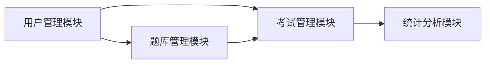

## 1. 背景介绍

### 1.1 编译原理课程教学现状

编译原理作为计算机科学的核心课程之一，在计算机专业人才培养中扮演着至关重要的角色。然而，传统的编译原理课程教学模式存在着一些亟待解决的问题：

* **理论性强，实践环节薄弱：** 课程内容侧重于语法分析、语义分析、中间代码生成等理论知识，学生缺乏将理论应用于实践的机会。
* **考试方式单一，难以全面评估学生能力：**  传统的考试方式主要以笔试为主，难以全面考察学生对编译原理知识的理解和应用能力。
* **缺乏互动性和趣味性，学生学习兴趣不高：**  编译原理课程本身较为抽象，传统的教学方式缺乏互动性和趣味性，难以激发学生的学习兴趣。

### 1.2 在线考试系统优势

为了解决上述问题，开发一个功能完善、易于使用的编译原理在线考试系统势在必行。相较于传统的考试方式，在线考试系统具有以下优势：

* **提高教学效率：**  在线考试系统可以自动批改试卷，减轻教师的工作负担，提高教学效率。
* **增强学习效果：**  在线考试系统可以提供实时反馈，帮助学生及时发现和纠正错误，巩固学习成果。
* **激发学习兴趣：**  在线考试系统可以采用更加灵活多样的考试形式，例如在线编程、代码调试等，提高学生的学习兴趣和参与度。

### 1.3 本系统目标

本系统旨在设计和实现一个功能完善的编译原理在线考试系统，以满足高校编译原理课程教学和学生学习的需求。具体目标如下：

* **实现编译原理知识点的全面覆盖：**  系统应包含词法分析、语法分析、语义分析、中间代码生成、目标代码生成等编译原理核心知识点。
* **提供灵活多样的考试形式：**  系统应支持选择题、填空题、判断题、编程题等多种考试形式，以满足不同层次学生的学习需求。
* **实现自动组卷和批改功能：**  系统应具备自动组卷和批改功能，减轻教师的工作负担，提高考试效率。
* **提供详细的考试结果分析：**  系统应能够对学生的考试结果进行详细分析，帮助教师了解学生的学习情况，并进行针对性的教学指导。

## 2. 核心概念与联系

### 2.1 编译器基本结构

一个典型的编译器通常由以下几个主要阶段组成：

1. **词法分析（Lexical Analysis）：**  将源程序代码分解成一个个的词法单元（Token）。
2. **语法分析（Syntax Analysis）：**  根据语法规则，将词法单元序列组合成语法树。
3. **语义分析（Semantic Analysis）：**  对语法树进行语义检查，例如类型检查、符号表管理等。
4. **中间代码生成（Intermediate Code Generation）：**  将语法树转换成一种中间表示形式，例如三地址码。
5. **代码优化（Code Optimization）：**  对中间代码进行优化，提高代码的执行效率。
6. **目标代码生成（Target Code Generation）：**  将中间代码转换成目标机器的机器语言代码。

### 2.2 在线考试系统功能模块

本系统主要包含以下功能模块：

1. **用户管理模块：**  实现用户注册、登录、权限管理等功能。
2. **题库管理模块：**  实现试题的添加、删除、修改、查询等功能。
3. **考试管理模块：**  实现考试的创建、编辑、发布、评分等功能。
4. **统计分析模块：**  实现考试结果的统计分析，生成报表等功能。

### 2.3 模块间联系

下图展示了各模块之间的联系：



## 3. 核心算法原理具体操作步骤

### 3.1 词法分析算法

词法分析器的主要任务是将源程序代码分解成一个个的词法单元。常用的词法分析算法有：

* **有限自动机（Finite Automata）：**  使用状态转换图来识别词法单元。
* **正则表达式（Regular Expression）：**  使用正则表达式来描述词法单元的模式。

本系统将采用正则表达式来实现词法分析功能。

#### 3.1.1 正则表达式定义

正则表达式是一种用于描述字符串模式的工具。常用的正则表达式元字符如下：

| 元字符 | 描述 |
|---|---|
| . | 匹配任意单个字符 |
| * | 匹配前一个字符的零次或多次重复 |
| + | 匹配前一个字符的一次或多次重复 |
| ? | 匹配前一个字符的零次或一次重复 |
| [ ] | 匹配字符集中任意一个字符 |
| - | 在字符集中表示字符范围 |
| ^ | 匹配字符串的开头 |
| $ | 匹配字符串的结尾 |

#### 3.1.2 词法分析器实现

```python
import re

# 定义词法单元的正则表达式
token_patterns = [
    (r'[a-zA-Z_][a-zA-Z0-9_]*', 'IDENTIFIER'), # 标识符
    (r'[0-9]+', 'NUMBER'), # 数字
    (r'\+', 'PLUS'), # 加号
    (r'-', 'MINUS'), # 减号
    (r'\*', 'MULTIPLY'), # 乘号
    (r'/', 'DIVIDE'), # 除号
    (r'\(', 'LPAREN'), # 左括号
    (r'\)', 'RPAREN'), # 右括号
]

# 词法分析器函数
def lexer(code):
    tokens = []
    i = 0
    while i < len(code):
        match = None
        for pattern, token_type in token_patterns:
            match = re.match(pattern, code[i:])
            if match:
                token = (token_type, match.group(0))
                tokens.append(token)
                i += match.end()
                break
        if not match:
            raise Exception(f'Illegal character: {code[i]}')
    return tokens
```

#### 3.1.3 词法分析示例

```
>>> code = 'int a = 10 + 20;'
>>> tokens = lexer(code)
>>> print(tokens)
[('IDENTIFIER', 'int'), ('IDENTIFIER', 'a'), ('ASSIGN', '='), ('NUMBER', '10'), ('PLUS', '+'), ('NUMBER', '20'), ('SEMICOLON', ';')]
```

### 3.2 语法分析算法

语法分析器的主要任务是根据语法规则，将词法单元序列组合成语法树。常用的语法分析算法有：

* **自顶向下分析（Top-down Parsing）：**  从语法树的根节点开始，逐步推导出输入的词法单元序列。
* **自底向上分析（Bottom-up Parsing）：**  从输入的词法单元序列开始，逐步构建语法树，直到根节点。

本系统将采用递归下降分析法（Recursive Descent Parsing）来实现语法分析功能。

#### 3.2.1 递归下降分析法

递归下降分析法是一种自顶向下的语法分析方法，它为每个非终结符定义一个递归函数。

#### 3.2.2 语法分析器实现

```python
class Parser:
    def __init__(self, tokens):
        self.tokens = tokens
        self.current_token = None
        self.index = 0

    def parse(self):
        self.next_token()
        return self.program()

    def next_token(self):
        if self.index < len(self.tokens):
            self.current_token = self.tokens[self.index]
            self.index += 1

    def program(self):
        statements = []
        while self.current_token:
            statements.append(self.statement())
        return statements

    def statement(self):
        if self.current_token[0] == 'IDENTIFIER':
            return self.assignment_statement()
        else:
            raise Exception(f'Invalid statement: {self.current_token}')

    def assignment_statement(self):
        identifier = self.current_token[1]
        self.next_token()
        if self.current_token[0] == 'ASSIGN':
            self.next_token()
            expression = self.expression()
            return {'type': 'assignment', 'identifier': identifier, 'expression': expression}
        else:
            raise Exception(f'Expected assignment operator, got: {self.current_token}')

    def expression(self):
        left = self.term()
        while self.current_token and self.current_token[0] in ('PLUS', 'MINUS'):
            operator = self.current_token[0]
            self.next_token()
            right = self.term()
            left = {'type': 'binary_operation', 'left': left, 'operator': operator, 'right': right}
        return left

    def term(self):
        left = self.factor()
        while self.current_token and self.current_token[0] in ('MULTIPLY', 'DIVIDE'):
            operator = self.current_token[0]
            self.next_token()
            right = self.factor()
            left = {'type': 'binary_operation', 'left': left, 'operator': operator, 'right': right}
        return left

    def factor(self):
        if self.current_token[0] == 'NUMBER':
            number = int(self.current_token[1])
            self.next_token()
            return {'type': 'number', 'value': number}
        elif self.current_token[0] == 'IDENTIFIER':
            identifier = self.current_token[1]
            self.next_token()
            return {'type': 'identifier', 'value': identifier}
        elif self.current_token[0] == 'LPAREN':
            self.next_token()
            expression = self.expression()
            if self.current_token[0] == 'RPAREN':
                self.next_token()
                return expression
            else:
                raise Exception(f'Expected closing parenthesis, got: {self.current_token}')
        else:
            raise Exception(f'Invalid factor: {self.current_token}')
```

#### 3.2.3 语法分析示例

```
>>> code = 'int a = 10 + 20;'
>>> tokens = lexer(code)
>>> parser = Parser(tokens)
>>> ast = parser.parse()
>>> print(ast)
[{'type': 'assignment', 'identifier': 'a', 'expression': {'type': 'binary_operation', 'left': {'type': 'number', 'value': 10}, 'operator': 'PLUS', 'right': {'type': 'number', 'value': 20}}}]
```

### 3.3 语义分析

语义分析器的主要任务是：

* **符号表管理：**  记录标识符的类型、作用域等信息。
* **类型检查：**  检查表达式和赋值语句中的类型是否匹配。

#### 3.3.1 符号表

符号表用于存储标识符的信息，例如：

| 字段 | 描述 |
|---|---|
| 名称 | 标识符的名称 |
| 类型 | 标识符的数据类型 |
| 作用域 | 标识符的作用域 |

#### 3.3.2 类型检查

类型检查用于确保表达式和赋值语句中的类型匹配。例如，不能将一个整数赋值给一个字符串变量。

### 3.4 中间代码生成

中间代码生成器的主要任务是将语法树转换成一种中间表示形式，例如三地址码。

#### 3.4.1 三地址码

三地址码是一种类似于汇编语言的中间代码表示形式。每条三地址码指令都包含一个操作符和最多三个操作数。

#### 3.4.2 中间代码生成器实现

```python
class CodeGenerator:
    def __init__(self):
        self.code = []
        self.temp_count = 0

    def generate(self, ast):
        for statement in ast:
            self.generate_statement(statement)
        return self.code

    def generate_statement(self, statement):
        if statement['type'] == 'assignment':
            self.generate_assignment_statement(statement)
        else:
            raise Exception(f'Invalid statement: {statement}')

    def generate_assignment_statement(self, statement):
        address = self.generate_expression(statement['expression'])
        self.code.append(f'{statement["identifier"]} := {address}')

    def generate_expression(self, expression):
        if expression['type'] == 'number':
            return expression['value']
        elif expression['type'] == 'identifier':
            return expression['value']
        elif expression['type'] == 'binary_operation':
            left = self.generate_expression(expression['left'])
            right = self.generate_expression(expression['right'])
            temp = self.new_temp()
            self.code.append(f'{temp} := {left} {expression["operator"]} {right}')
            return temp
        else:
            raise Exception(f'Invalid expression: {expression}')

    def new_temp(self):
        self.temp_count += 1
        return f't{self.temp_count}'
```

#### 3.4.3 中间代码生成示例

```
>>> code = 'int a = 10 + 20;'
>>> tokens = lexer(code)
>>> parser = Parser(tokens)
>>> ast = parser.parse()
>>> generator = CodeGenerator()
>>> intermediate_code = generator.generate(ast)
>>> print(intermediate_code)
['t1 := 10 + 20', 'a := t1']
```

## 4. 数学模型和公式详细讲解举例说明

本节将介绍编译原理中常用的数学模型和公式，并结合实例进行详细讲解。

### 4.1 有限自动机

有限自动机（Finite Automata，FA）是一种用于识别字符串的数学模型。它由以下几个部分组成：

* **状态集（Q）：**  表示自动机可能处于的不同状态。
* **输入字母表（Σ）：**  表示自动机可以接受的输入符号。
* **状态转移函数（δ）：**  描述自动机在当前状态下，接收到某个输入符号后，应该转移到哪个状态。
* **初始状态（q0）：**  表示自动机开始运行时的初始状态。
* **接受状态集（F）：**  表示自动机在哪些状态下，可以接受输入字符串。

#### 4.1.1 确定性有限自动机（DFA）

确定性有限自动机（Deterministic Finite Automata，DFA）是指对于每个状态和每个输入符号，状态转移函数都有且只有一个确定的下一个状态。

#### 4.1.2 非确定性有限自动机（NFA）

非确定性有限自动机（Nondeterministic Finite Automata，NFA）是指对于某个状态和某个输入符号，状态转移函数可能有多个下一个状态，也可能没有下一个状态。

#### 4.1.3 DFA 和 NFA 的转换

每个 NFA 都可以转换成一个等价的 DFA。

### 4.2 正则表达式

正则表达式（Regular Expression）是一种用于描述字符串模式的工具。

#### 4.2.1 正则表达式的语法

正则表达式可以使用以下语法规则来定义：

* **空串：**  ε
* **单个字符：**  a
* **并运算：**  r1 | r2
* **连接运算：**  r1 r2
* **闭包运算：**  r*
* **正闭包运算：**  r+
* **可选运算：**  r?

#### 4.2.2 正则表达式和有限自动机的关系

每个正则表达式都可以转换成一个等价的 NFA，每个 NFA 都可以转换成一个等价的 DFA。

### 4.3 上下文无关文法

上下文无关文法（Context-free Grammar，CFG）是一种用于描述程序设计语言语法规则的工具。

#### 4.3.1 上下文无关文法的定义

上下文无关文法由以下几个部分组成：

* **终结符集（Σ）：**  表示语言中所有可能的单词。
* **非终结符集（V）：**  表示语法规则中的变量。
* **开始符号（S）：**  表示语法规则的开始符号。
* **产生式集（P）：**  表示语法规则的集合。

#### 4.3.2 推导

推导是指根据产生式，将一个字符串转换成另一个字符串的过程。

#### 4.3.3 语法树

语法树是一种用于表示推导过程的树形结构。

## 5. 项目实践：代码实例和详细解释说明

本节将结合代码实例，详细讲解编译原理在线考试系统的具体实现。

### 5.1 系统架构

本系统采用 MVC（Model-View-Controller）架构模式，将系统分为模型层、视图层和控制器层。

* **模型层：**  负责数据存储和处理，包括用户模型、试题模型、考试模型等。
* **视图层：**  负责用户界面展示，包括用户注册页面、登录页面、考试页面、结果页面等。
* **控制器层：**  负责处理用户请求，调用模型层和视图层完成业务逻辑。

### 5.2 数据库设计

本系统使用关系型数据库 MySQL 来存储数据。

#### 5.2.1 用户表

| 字段 | 类型 | 描述 |
|---|---|---|
| id | int | 用户 ID |
| username | varchar(255) | 用户名 |
