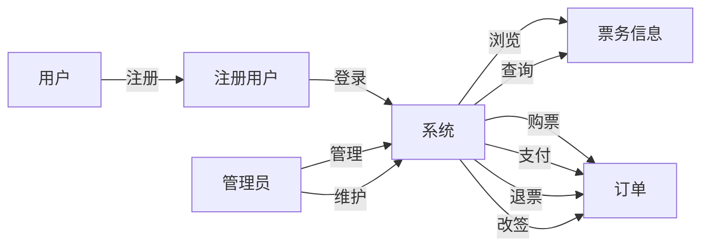

# 网上售票系统详细设计与具体代码实现

作者：禅与计算机程序设计艺术

## 1. 背景介绍

### 1.1  网上售票系统概述

随着互联网技术的快速发展，电子商务已经深入到人们生活的方方面面，网上购物、网上银行、网上订餐等已经成为一种常态。作为电子商务的重要组成部分，网上售票系统也越来越受到人们的青睐。网上售票系统是指通过互联网为用户提供在线购票服务的系统，它可以方便用户随时随地购票，提高售票效率，降低售票成本。

### 1.2  网上售票系统发展现状

近年来，随着移动互联网、云计算、大数据等新技术的兴起，网上售票系统也得到了快速发展，呈现出以下发展趋势：

* **移动化:**  随着智能手机的普及，越来越多的用户选择使用手机进行网上购票，因此，移动端购票体验成为网上售票系统的重要竞争力。
* **个性化:**  用户对个性化购票服务的需求越来越高，例如根据用户的购票历史、偏好等推荐个性化的购票方案。
* **安全性:**  网上支付安全一直是用户关注的焦点，网上售票系统需要采取更加严格的安全措施来保障用户的资金安全。
* **大数据应用:**  网上售票系统积累了大量的用户购票数据，利用大数据技术可以对用户行为进行分析，为用户提供更加精准的购票服务。

### 1.3  网上售票系统应用领域

网上售票系统应用领域非常广泛，例如：

* **电影票:**  猫眼电影、淘票票等
* **火车票:**  12306、携程等
* **飞机票:**  去哪儿、携程等
* **演唱会门票:**  大麦网、永乐票务等
* **体育赛事门票:**  体育之窗、懂球帝等

## 2. 核心概念与联系

### 2.1  系统用户角色

网上售票系统主要涉及以下用户角色：

* **游客:**  未注册用户，可以浏览网站信息，查询票务信息。
* **注册用户:**  已注册用户，可以使用用户名和密码登录系统，进行购票、退票、修改个人信息等操作。
* **管理员:**  负责系统的维护和管理，包括发布票务信息、管理用户信息、处理用户反馈等。

### 2.2  系统核心功能模块

网上售票系统主要包括以下功能模块：

* **用户管理模块:**  负责用户注册、登录、修改个人信息、找回密码等功能。
* **票务管理模块:**  负责发布票务信息、管理票务库存、设置票价等功能。
* **订单管理模块:**  负责用户下单、支付、退票、改签等功能。
* **支付管理模块:**  负责对接第三方支付平台，完成支付功能。
* **数据分析模块:**  负责收集用户行为数据，进行数据分析，为运营决策提供支持。

### 2.3  系统核心概念关系图



## 3. 核心算法原理具体操作步骤

### 3.1  用户注册流程

1. 用户填写注册信息，包括用户名、密码、手机号码等。
2. 系统校验用户输入的信息是否合法。
3. 如果信息合法，则将用户信息保存到数据库中，并发送激活邮件到用户邮箱。
4. 用户点击激活链接，激活账号。

### 3.2  用户登录流程

1. 用户输入用户名和密码。
2. 系统校验用户名和密码是否匹配。
3. 如果匹配，则生成token，并将token返回给用户。
4. 用户后续请求接口时，需要携带token进行身份验证。

### 3.3  购票流程

1. 用户选择要购买的票品和数量。
2. 系统校验库存是否充足。
3. 如果库存充足，则生成订单，并将订单信息保存到数据库中。
4. 用户选择支付方式进行支付。
5. 支付成功后，系统更新订单状态，并发送购票成功通知给用户。

### 3.4  退票流程

1. 用户选择要退的订单。
2. 系统校验是否符合退票规则。
3. 如果符合退票规则，则更新订单状态，并退款给用户。

## 4. 数学模型和公式详细讲解举例说明

### 4.1  库存计算模型

```
库存 = 总库存 - 已售库存
```

**举例说明:**

假设某场演唱会总共售卖10000张门票，目前已售出5000张，则剩余库存为：

```
库存 = 10000 - 5000 = 5000 张
```

### 4.2  票价计算模型

```
票价 =  成本价 + 服务费 + 利润
```

**举例说明:**

假设某场电影的成本价为30元，服务费为5元，利润为10元，则票价为：

```
票价 = 30 + 5 + 10 = 45 元
```

## 5. 项目实践：代码实例和详细解释说明

### 5.1  技术选型

* **后端:** Spring Boot
* **数据库:** MySQL
* **缓存:** Redis
* **消息队列:** RabbitMQ
* **前端:** Vue.js

### 5.2  代码实例

**用户注册接口:**

```java
@RestController
@RequestMapping("/user")
public class UserController {

    @Autowired
    private UserService userService;

    @PostMapping("/register")
    public Result register(@RequestBody User user) {
        // 校验用户输入的信息是否合法
        if (!validateUser(user)) {
            return Result.fail("用户信息不合法");
        }

        // 保存用户信息到数据库
        userService.save(user);

        // 发送激活邮件
        sendEmail(user);

        return Result.success("注册成功，请前往邮箱激活账号");
    }

    // 校验用户信息
    private boolean validateUser(User user) {
        // TODO
        return true;
    }

    // 发送激活邮件
    private void sendEmail(User user) {
        // TODO
    }
}
```

**购票接口:**

```java
@RestController
@RequestMapping("/order")
public class OrderController {

    @Autowired
    private OrderService orderService;

    @PostMapping("/create")
    public Result createOrder(@RequestBody Order order) {
        // 校验库存是否充足
        if (!checkInventory(order)) {
            return Result.fail("库存不足");
        }

        // 生成订单
        orderService.createOrder(order);

        // 返回订单信息
        return Result.success(order);
    }

    // 校验库存
    private boolean checkInventory(Order order) {
        // TODO
        return true;
    }
}
```

## 6. 实际应用场景

### 6.1  电影院在线购票系统

用户可以在线选择电影、场次、座位，并完成支付，然后凭取票码到电影院自助取票机取票观影。

### 6.2  火车票在线购票系统

用户可以在线查询列车时刻表、选择车次、席别，并完成支付，然后凭身份证到火车站自助取票机取票乘车。

### 6.3  演唱会在线购票系统

用户可以在线选择演唱会场次、座位等级，并完成支付，然后凭电子票或快递配送的纸质票入场观看演唱会。

## 7. 工具和资源推荐

### 7.1  开发工具

* **IntelliJ IDEA:**  一款功能强大的 Java 开发工具。
* **Navicat:**  一款数据库管理工具，支持 MySQL、Oracle、SQL Server 等多种数据库。
* **Postman:**  一款接口测试工具，可以方便地发送 HTTP 请求和查看响应结果。

### 7.2  学习资源

* **Spring Boot 官方文档:**  https://spring.io/projects/spring-boot
* **MySQL 官方文档:**  https://dev.mysql.com/doc/
* **Redis 官方文档:**  https://redis.io/documentation/

## 8. 总结：未来发展趋势与挑战

### 8.1  未来发展趋势

* **人工智能化:**  利用人工智能技术，可以实现智能客服、智能推荐等功能，提升用户体验。
* **区块链技术:**  利用区块链技术，可以保障票务信息的真实性和安全性，防止黄牛倒票。
* **虚拟现实技术:**  利用虚拟现实技术，可以为用户提供更加真实的购票体验，例如虚拟选座等。

### 8.2  挑战

* **高并发:**  网上售票系统需要面对高并发的访问请求，如何保证系统的稳定性和性能是一个挑战。
* **安全性:**  网上支付安全一直是用户关注的焦点，如何保障用户的资金安全是一个挑战。
* **用户体验:**  如何提升用户购票体验，例如简化购票流程、提供更加个性化的服务等，也是一个挑战。

## 9. 附录：常见问题与解答

### 9.1  如何防止黄牛倒票？

可以通过以下措施防止黄牛倒票：

* **实名制购票:**  要求用户使用真实姓名和身份证号码进行购票。
* **限制购票数量:**  限制每个用户在一定时间内最多可以购买的票数。
* **验证码机制:**  在购票过程中设置验证码，防止机器刷票。
* **IP 限制:**  限制单个 IP 地址在一定时间内最多可以访问的次数。

### 9.2  如何保证支付安全？

可以通过以下措施保证支付安全：

* **选择正规的第三方支付平台:**  例如支付宝、微信支付等。
* **使用 HTTPS 协议:**  使用 HTTPS 协议可以加密传输数据，防止数据被窃取。
* **设置支付密码:**  设置支付密码可以防止他人盗用账号进行支付。

### 9.3  如何处理用户投诉？

可以通过以下步骤处理用户投诉：

1.  耐心倾听用户的投诉内容，并记录下来。
2.  核实用户投诉的情况，并查找问题的原因。
3.  根据问题的原因，给出解决方案，并告知用户处理结果。
4.  跟踪问题的解决情况，并及时向用户反馈。