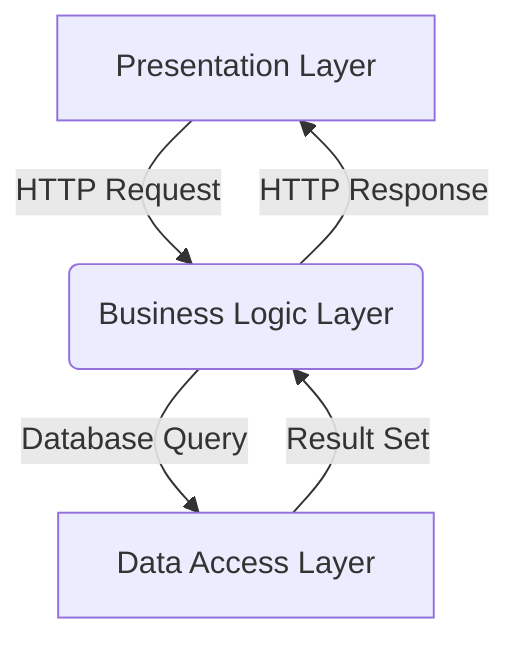
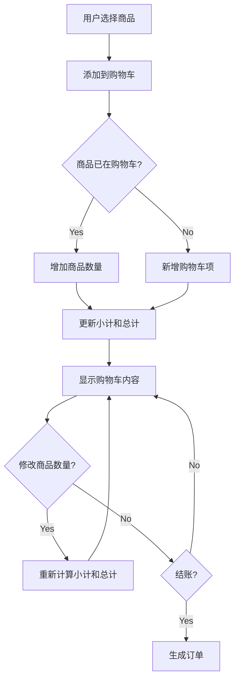

下面是标题为《网上图书销售系统详细设计与具体代码实现》的技术博客正文:

## 1.背景介绍

### 1.1 网上图书销售系统概述

随着互联网和电子商务的快速发展,网上购物已经成为人们生活中不可或缺的一部分。在这个大潮流中,网上图书销售系统应运而生,为读者提供了前所未有的购书便利。

网上图书销售系统是一种基于B2C(Business to Customer)模式的电子商务应用系统,它将出版社、实体书店、配送中心等传统图书销售渠道与互联网技术相结合,为用户提供在线浏览、选购、支付和配送服务。

### 1.2 网上图书销售系统的优势

与传统的实体书店相比,网上图书销售系统具有以下显著优势:

1. **种类丰富**:不受实体空间限制,可提供海量图书种类供选择。

2. **价格实惠**:减少中间环节,降低运营成本,价格更加亲民。

3. **24小时服务**:不受时间和地点限制,随时随地均可购书。

4. **方便快捷**:无需排队等候,一键下单,足不出户即可买到心仪的书籍。

5. **个性化推荐**:根据用户浏览和购买记录,提供个性化图书推荐服务。

### 1.3 网上图书销售系统的发展现状

近年来,随着互联网技术的进一步发展和电子商务的日益普及,网上图书销售系统取得了长足进步。大型电商平台如亚马逊、当当网、京东等都开设了图书频道,成为图书销售的主要渠道。同时,一些专门的网上书店如博库书城、纪伊国屋书店等也在业内占有一席之地。

根据相关统计数据,2022年全球网上图书销售额已超过500亿美元,占整个图书销售市场的40%以上。可以预见,未来网上图书销售将继续保持快速增长的态势。

## 2.核心概念与联系  

### 2.1 系统架构

网上图书销售系统通常采用经典的三层架构(Presentation Layer、Business Logic Layer、Data Access Layer),具体如下:

1. **表现层**(Presentation Layer): 负责与用户交互,包括Web界面、移动APP等,接收用户请求并展示处理结果。常用技术有HTML、CSS、JavaScript等。

2. **业务逻辑层**(Business Logic Layer): 处理具体的业务逻辑,如用户认证、订单管理、库存查询等,作为系统的"大脑"。常用语言有Java、Python、C#等。

3. **数据访问层**(Data Access Layer): 负责与数据库进行交互,执行数据查询、插入、更新、删除等操作。常用技术有JDBC、Hibernate、MyBatis等。

### 2.2 系统功能模块

一个典型的网上图书销售系统通常包含以下核心功能模块:

1. **用户模块**: 实现用户注册、登录、个人信息管理等基本功能。

2. **购物车模块**: 临时存储用户选购的图书,方便下单付款。

3. **订单模块**: 处理订单的创建、支付、发货、签收等流程。

4. **库存模块**: 管理图书信息、库存数量,与订单模块实现库存更新。

5. **支付模块**: 对接第三方支付平台,实现在线支付功能。

6. **搜索模块**: 提供全文检索和个性化推荐,优化用户购书体验。

7. **后台管理模块**: 供管理员管理图书、订单、用户等信息。

### 2.3 关键技术

实现网上图书销售系统需要综合运用多种关键技术,包括但不限于:

- **Web开发技术**: HTML、CSS、JavaScript、JSP、Servlet等

- **服务器端语言**: Java、Python、C#、PHP等

- **数据库技术**: MySQL、Oracle、SQL Server等关系型数据库,ElasticSearch、MongoDB等NoSQL数据库

- **缓存技术**: Redis、Memcached等,用于提高系统响应速度

- **消息队列**: RabbitMQ、Kafka等,实现系统解耦和异步处理

- **搜索引擎技术**: Lucene、Solr、ElasticSearch等,支持高效全文检索

- **安全技术**: HTTPS、数字证书、防火墙等,保障系统和数据安全

- **DevOps技术**: Docker、Kubernetes等,实现自动化部署和弹性伸缩

上述技术在系统中发挥着不同的作用,需要有机结合和协同配合,方能构建一个高效、安全、可靠的网上图书销售系统。

## 3.核心算法原理具体操作步骤

### 3.1 购物车算法

购物车是网上购物系统的核心功能之一,它的实现涉及到多个步骤和算法,包括添加商品、修改商品数量、计算总价、生成订单等。以下是一种常见的购物车算法流程:

1. **添加商品到购物车**
    - 判断该商品是否已在购物车中
    - 若已存在,增加商品数量
    - 若不存在,新增一个购物车项
    - 更新小计(单价x数量)和总计(所有小计之和)

2. **修改商品数量**
    - 若数量增加,直接更新数量和小计
    - 若数量减少到0,从购物车中移除该项
    - 重新计算总计

3. **生成订单**
    - 遍历购物车中所有项目
    - 构建订单详情,包含商品ID、数量、小计等
    - 生成订单主体,包含总计、下单时间等
    - 清空购物车

该算法的时间复杂度与购物车项目数量成正比,最坏情况下为O(n),其中n为购物车项目数。在实现时还需处理并发、库存等问题。

### 3.2 个性化推荐算法

为了提高用户体验和销售额,网上图书销售系统通常会提供个性化图书推荐功能。这里介绍一种基于协同过滤(Collaborative Filtering)的推荐算法:

1. **计算用户相似度**

    假设有m个用户,n个图书,可以构建一个m x n的用户-图书评分矩阵R。基于R,计算任意两个用户i和j的相似度,常用方法有:
    
    - 基于欧几里得距离:
      $$sim(i,j)=\frac{1}{1+\sqrt{\sum\limits_{k \in R_i \cap R_j}(r_{ik}-r_{jk})^2}}$$

    - 基于皮尔逊相关系数:
      $$sim(i,j)=\frac{\sum\limits_{k \in R_i \cap R_j}(r_{ik}-\overline{r_i})(r_{jk}-\overline{r_j})}{\sqrt{\sum\limits_{k \in R_i \cap R_j}(r_{ik}-\overline{r_i})^2}\sqrt{\sum\limits_{k \in R_i \cap R_j}(r_{jk}-\overline{r_j})^2}}$$

      其中$\overline{r_i}$、$\overline{r_j}$分别为用户i和j的平均评分。

2. **计算图书预测评分**

    对于目标用户u和未评分的图书p,基于与u相似的用户对p的评分,预测u对p的评分:

    $$r_{up}=\overline{r_u}+\frac{\sum\limits_{v \in S(u,p)}sim(u,v)(r_{vp}-\overline{r_v})}{\sum\limits_{v \in S(u,p)}sim(u,v)}$$

    其中S(u,p)为已对图书p评分并与u相似的用户集合。

3. **生成推荐列表**

    对所有未评分的图书,计算预测评分并排序,取前N个作为推荐列表呈现给用户。

该算法的时间复杂度主要取决于相似度计算,通常为O(m*n*k),其中k为共同评分图书的数量。在实践中还需考虑评分矩阵的稀疏性、冷启动问题等,可结合其他算法如基于内容的推荐等进行优化和改进。

## 4.数学模型和公式详细讲解举例说明

在网上图书销售系统中,数学模型和公式广泛应用于各个模块,如库存管理、订单计算、个性化推荐等。以下将对几个典型的数学模型进行详细讲解。

### 4.1 库存管理模型

设某图书的初始库存量为$Q_0$,在时间段[0,T]内的需求量为$D(t)$,补货周期为T,补货量为Q。我们需要确定最优的补货量Q,使得总成本最小。

总成本包括两部分:

1. **库存持有成本**: $C_h$为单位时间单位商品的持有成本,则在一个补货周期内的持有成本为:

$$C_h \int_0^T Q(t)dt = \frac{C_hQT}{2}$$

2. **补货成本**: $C_o$为每次补货的固定成本,则总补货成本为:

$$\frac{TD(T)}{Q}C_o$$

将上述两部分相加,得到总成本函数:

$$TC(Q) = \frac{C_hQT}{2} + \frac{TD(T)}{Q}C_o$$

对Q求导并令导数等于0,可得最优补货量:

$$Q^* = \sqrt{\frac{2D(T)TC_o}{C_h}}$$

将$Q^*$代入总成本函数,即可得到最小总成本。

该模型适用于确定性需求情况,在随机需求情况下需要修正。通过合理控制补货量,可以有效降低库存管理成本。

### 4.2 订单折扣计算模型

为了刺激销售,网上书店通常会对订单设置折扣策略。假设有以下折扣规则:

- 订单金额低于100元,无折扣
- 订单金额大于等于100元,小于500元,享受9折优惠
- 订单金额大于等于500元,享受8折优惠

设订单原价为$P$,最终实付金额为$F$,则可以用如下公式计算:

$$F=\begin{cases}
P, & P<100\\
0.9P, & 100\leq P<500\\
0.8P, & P\geq 500
\end{cases}$$

例如,若订单原价为680元,则最终实付金额为:

$$F = 0.8 \times 680 = 544 \text{(元)}$$

该模型可以根据实际需求进行修改和扩展,例如增加其他折扣条件、设置折扣上限等。在代码实现时,可以使用条件语句或者函数映射的方式来实现计算逻辑。

### 4.3 商品相似度计算

在个性化推荐过程中,需要计算各商品之间的相似度。一种常用的方法是基于商品被购买记录的Jaccard相似系数(Jaccard Similarity Coefficient)。

设有两个商品集合$A$和$B$,分别表示购买过商品A和商品B的用户集合,则$A$和$B$的相似度定义为:

$$sim(A,B) = \frac{|A \cap B|}{|A \cup B|}$$

其中$|A \cap B|$表示既购买过A又购买过B的用户数量,$|A \cup B|$表示购买过A或B的总用户数量。

例如商品A的购买记录为{1,2,3,4,5},商品B的购买记录为{4,5,6,7},则:

$$sim(A,B) = \frac{|{4,5}|}{|{1,2,3,4,5,6,7}|} = \frac{2}{7} \approx 0.286$$

相似度的值域为[0,1],值越大表示两个商品越相似。该公式可以直接用于推荐系统,也可以作为其他相似度算法(如基于内容的相似度)的辅助计算。

## 4.项目实践:代码实例和详细解释说明

下面通过一