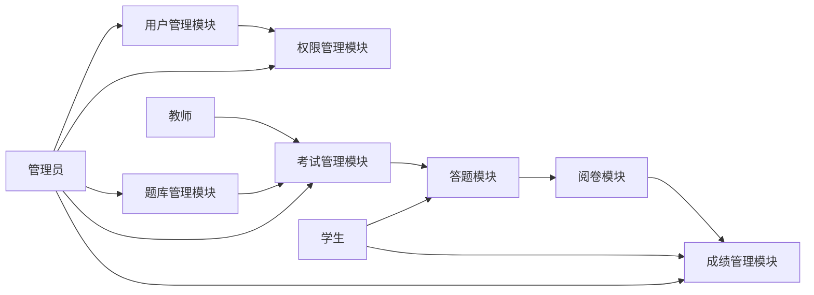
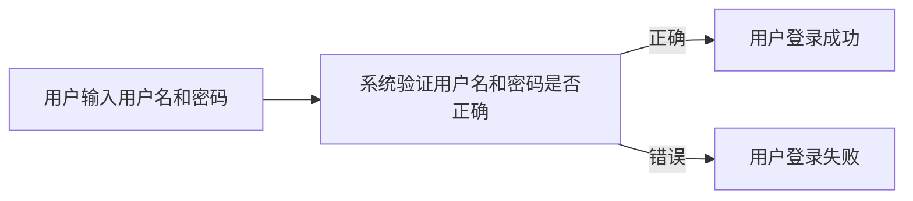

##  网上模拟考试系统的设计与实现

作者：禅与计算机程序设计艺术

## 1. 背景介绍

### 1.1 传统考试模式的弊端

传统的线下考试模式存在着诸多弊端：

* **时间和空间的限制:** 考生和考务人员需要在特定的时间和地点进行考试，这对于一些工作繁忙或居住地偏远的考生来说非常不便。
* **人力成本高:** 组织一次线下考试需要投入大量的人力物力，包括场地租赁、试卷印刷、监考人员等。
* **效率低下:** 线下考试的阅卷和统计工作通常需要花费较长时间，而且容易出现人为错误。
* **安全性问题:** 试卷的保管和运输存在安全隐患，容易发生泄题或作弊等情况。

### 1.2  网上模拟考试系统的优势

为了克服传统考试模式的弊端，网上模拟考试系统应运而生。与传统的线下考试相比，网上模拟考试系统具有以下优势：

* **突破时间和空间限制:** 考生可以随时随地进行考试，无需受到时间和地点的限制。
* **降低成本:**  网上模拟考试系统可以节省大量的场地租赁、试卷印刷和人工成本。
* **提高效率:**  网上模拟考试系统可以实现自动阅卷和统计，大大提高了考试效率。
* **增强安全性:**  网上模拟考试系统可以通过技术手段有效防止作弊行为，保障考试的公平公正。

### 1.3  网上模拟考试系统的应用领域

网上模拟考试系统可以广泛应用于各种考试场景，例如：

* **学校教育:**  用于学生阶段性学习成果的评估，例如期中考试、期末考试、模拟考试等。
* **企业招聘:**  用于评估求职者的专业技能和知识水平，例如笔试、机试等。
* **职业资格认证:**  用于评估专业人员的职业技能和知识水平，例如注册会计师考试、律师资格考试等。

## 2. 核心概念与联系

### 2.1  系统用户

网上模拟考试系统主要包含以下用户角色：

* **管理员:** 负责系统的整体运营和维护，包括用户管理、权限管理、题库管理、考试管理、成绩管理等。
* **教师:** 负责创建和管理考试，包括选择题型、设置考试时间、发布考试、批改试卷等。
* **学生:**  参加考试的用户，可以查看考试信息、进行答题、查看成绩等。

### 2.2  系统功能模块

网上模拟考试系统主要包括以下功能模块：

* **用户管理模块:**  实现用户注册、登录、信息修改、密码找回等功能。
* **权限管理模块:**  对不同用户角色进行权限控制，例如管理员可以管理所有功能，教师只能管理自己创建的考试，学生只能参加考试和查看成绩等。
* **题库管理模块:**  实现试题的录入、编辑、分类、查重等功能。
* **考试管理模块:**  实现考试的创建、编辑、发布、取消等功能。
* **答题模块:**  为考生提供答题界面，支持多种题型，例如单选题、多选题、判断题、填空题、简答题、编程题等。
* **阅卷模块:**  实现自动阅卷和人工阅卷功能，支持多种评分方式，例如客观题自动评分、主观题人工评分等。
* **成绩管理模块:**  实现成绩的统计、查询、导出等功能。

### 2.3  核心概念关系图



## 3. 核心算法原理具体操作步骤

### 3.1  用户认证和授权

用户认证和授权是保证系统安全的重要环节。

* **用户认证:**  验证用户身份的真实性，常用的认证方式包括用户名密码认证、手机验证码认证、第三方登录认证等。
* **用户授权:**  根据用户的角色分配不同的权限，控制用户可以访问的资源和执行的操作。

#### 3.1.1  用户名密码认证流程



#### 3.1.2  基于角色的访问控制（RBAC）

RBAC是一种常用的权限控制模型，它将用户、角色和权限关联起来，通过角色来控制用户可以访问的资源和执行的操作。

* **用户:**  使用系统的个体，例如管理员、教师、学生等。
* **角色:**  一组权限的集合，例如管理员角色拥有所有权限，教师角色拥有创建和管理考试的权限，学生角色拥有参加考试和查看成绩的权限等。
* **权限:**  对系统资源的操作，例如创建考试、删除考试、查看成绩等。

RBAC模型的优点是可以灵活地配置权限，方便地管理用户权限。

### 3.2  试题查重

试题查重是为了避免试题重复，保证考试的公平性。

#### 3.2.1  基于文本相似度的查重算法

基于文本相似度的查重算法是指通过计算两段文本之间的相似度来判断试题是否重复。常用的文本相似度算法包括：

* **余弦相似度:**  将两段文本表示成向量空间模型，计算两个向量之间的夹角余弦值，值越大表示相似度越高。
* **编辑距离:**  计算将一段文本转换成另一段文本所需的最少编辑操作次数，操作次数越少表示相似度越高。
* **SimHash算法:**  将一段文本映射成一个指纹，比较两个指纹的汉明距离，距离越小表示相似度越高。

#### 3.2.2  基于知识图谱的查重算法

基于知识图谱的查重算法是指将试题转换成知识图谱，通过比较两个知识图谱之间的相似度来判断试题是否重复。知识图谱是一种用图结构来表示知识的数据，可以更好地表达试题之间的语义关系。

### 3.3  自动阅卷

自动阅卷是指系统根据预先设定的评分规则自动对考生的答案进行评分。

#### 3.3.1  客观题自动评分

客观题是指答案是唯一的，例如单选题、多选题、判断题等。

* **单选题和判断题:**  直接判断考生选择的答案是否与正确答案一致。
* **多选题:**  判断考生选择的答案是否与正确答案完全一致。

#### 3.3.2  主观题人工评分

主观题是指答案不是唯一的，需要人工进行评分，例如填空题、简答题、编程题等。

* **填空题:**  教师可以设置关键词，系统根据关键词匹配度进行评分。
* **简答题:**  教师可以设置评分标准，系统根据评分标准进行评分。
* **编程题:**  系统可以编译运行考生的代码，并根据代码的正确性、效率、代码风格等方面进行评分。

### 3.4  成绩统计

成绩统计是指系统对考试成绩进行统计分析，例如计算平均分、最高分、最低分、及格率等。

#### 3.4.1  基本统计指标

* **平均分:**  所有考生得分之和除以考生人数。
* **最高分:**  所有考生中得分最高的成绩。
* **最低分:**  所有考生中得分最低的成绩。
* **及格率:**  得分达到及格线的考生人数占总考生人数的比例。

#### 3.4.2  成绩分布

成绩分布是指将所有考生的成绩按照一定的区间进行分组，统计每个区间内的人数和比例。常用的成绩分布图包括直方图、饼图等。

## 4. 数学模型和公式详细讲解举例说明

### 4.1  余弦相似度

余弦相似度是一种常用的文本相似度算法，它将两段文本表示成向量空间模型，计算两个向量之间的夹角余弦值，值越大表示相似度越高。

#### 4.1.1  向量空间模型

向量空间模型是一种将文本表示成向量的模型。在向量空间模型中，每个词语对应一个维度，每个文本表示成一个向量，向量的每个元素表示对应词语在文本中出现的频率。

例如，有两段文本：

* 文本1: 我爱编程
* 文本2: 我喜欢编程

构建词典：{“我”: 0, “爱”: 1, “编程”: 2, “喜欢”: 3}

将两段文本表示成向量：

* 文本1: [1, 1, 1, 0]
* 文本2: [1, 0, 1, 1]

#### 4.1.2  余弦相似度计算公式

$$
\cos(\theta) = \frac{\sum_{i=1}^{n}A_i \times B_i}{\sqrt{\sum_{i=1}^{n}(A_i)^2} \times \sqrt{\sum_{i=1}^{n}(B_i)^2}}
$$

其中，$A$ 和 $B$ 分别表示两个向量，$n$ 表示向量的维度。

#### 4.1.3  计算示例

计算文本1和文本2的余弦相似度：

$$
\begin{aligned}
\cos(\theta) &= \frac{1 \times 1 + 1 \times 0 + 1 \times 1 + 0 \times 1}{\sqrt{1^2 + 1^2 + 1^2 + 0^2} \times \sqrt{1^2 + 0^2 + 1^2 + 1^2}} \\
&= \frac{2}{\sqrt{3} \times \sqrt{3}} \\
&= \frac{2}{3}
\end{aligned}
$$

因此，文本1和文本2的余弦相似度为 $\frac{2}{3}$。

### 4.2  编辑距离

编辑距离是指将一段文本转换成另一段文本所需的最少编辑操作次数，操作次数越少表示相似度越高。常用的编辑操作包括：

* **插入:**  在一个字符串中插入一个字符。
* **删除:**  从一个字符串中删除一个字符。
* **替换:**  将一个字符串中的一个字符替换成另一个字符。

#### 4.2.1  编辑距离计算公式

编辑距离可以使用动态规划算法来计算。

假设有两个字符串 $A$ 和 $B$，长度分别为 $m$ 和 $n$，定义一个二维数组 $dp$，其中 $dp[i][j]$ 表示 $A$ 的前 $i$ 个字符和 $B$ 的前 $j$ 个字符的编辑距离。

则有如下递推公式：

$$
dp[i][j] =
\begin{cases}
j & \text{if } i = 0 \\
i & \text{if } j = 0 \\
dp[i - 1][j - 1] & \text{if } A[i - 1] = B[j - 1] \\
\min(dp[i - 1][j], dp[i][j - 1], dp[i - 1][j - 1]) + 1 & \text{otherwise}
\end{cases}
$$

其中，$A[i - 1]$ 表示字符串 $A$ 的第 $i$ 个字符，$B[j - 1]$ 表示字符串 $B$ 的第 $j$ 个字符。

#### 4.2.2  计算示例

计算字符串 "kitten" 和 "sitting" 的编辑距离：

```
k i t t e n
s i t t i n g
```

```
   0 1 2 3 4 5 6
0  0 1 2 3 4 5 6
1  1 1 2 3 4 4 5
2  2 2 1 2 3 4 5
3  3 3 2 1 2 3 4
4  4 4 3 2 2 3 4
5  5 5 4 3 3 2 3
```

因此，字符串 "kitten" 和 "sitting" 的编辑距离为 3。

## 5. 项目实践：代码实例和详细解释说明

### 5.1  技术选型

* **后端:**  Spring Boot
* **数据库:**  MySQL
* **前端:**  Vue.js

### 5.2  数据库设计

```sql
-- 用户表
CREATE TABLE `user` (
  `id` int(11) NOT NULL AUTO_INCREMENT COMMENT '用户ID',
  `username` varchar(255) NOT NULL COMMENT '用户名',
  `password` varchar(255) NOT NULL COMMENT '密码',
  `role` int(11) NOT NULL COMMENT '角色：1-管理员，2-教师，3-学生',
  PRIMARY KEY (`id`)
) ENGINE=InnoDB DEFAULT CHARSET=utf8mb4;

-- 题库表
CREATE TABLE `question` (
  `id` int(11) NOT NULL AUTO_INCREMENT COMMENT '试题ID',
  `type` int(11) NOT NULL COMMENT '题型：1-单选题，2-多选题，3-判断题，4-填空题，5-简答题，6-编程题',
  `content` text NOT NULL COMMENT '试题内容',
  `options` text COMMENT '选项',
  `answer` varchar(255) NOT NULL COMMENT '答案',
  `score` int(11) NOT NULL COMMENT '分数',
  PRIMARY KEY (`id`)
) ENGINE=InnoDB DEFAULT CHARSET=utf8mb4;

-- 考试表
CREATE TABLE `exam` (
  `id` int(11) NOT NULL AUTO_INCREMENT COMMENT '考试ID',
  `name` varchar(255) NOT NULL COMMENT '考试名称',
  `start_time` datetime NOT NULL COMMENT '开始时间',
  `end_time` datetime NOT NULL COMMENT '结束时间',
  `duration` int(11) NOT NULL COMMENT '考试时长（分钟）',
  `total_score` int(11) NOT NULL COMMENT '总分',
  `status` int(11) NOT NULL COMMENT '状态：1-未开始，2-进行中，3-已结束',
  PRIMARY KEY (`id`)
) ENGINE=InnoDB DEFAULT CHARSET=utf8mb4;

-- 考试试题表
CREATE TABLE `exam_question` (
  `id` int(11) NOT NULL AUTO_INCREMENT COMMENT '考试试题ID',
  `exam_id` int(11) NOT NULL COMMENT '考试ID',
  `question_id` int(11) NOT NULL COMMENT '试题ID',
  PRIMARY KEY (`id`),
  KEY `exam_id` (`exam_id`),
  KEY `question_id` (`question_id`),
  CONSTRAINT `exam_question_ibfk_1` FOREIGN KEY (`exam_id`) REFERENCES `exam` (`id`),
  CONSTRAINT `exam_question_ibfk_2` FOREIGN KEY (`question_id`) REFERENCES `question` (`id`)
) ENGINE=InnoDB DEFAULT CHARSET=utf8mb4;

-- 考试成绩表
CREATE TABLE `exam_score` (
  `id` int(11) NOT NULL AUTO_INCREMENT COMMENT '考试成绩ID',
  `exam_id` int(11) NOT NULL COMMENT '考试ID',
  `user_id` int(11) NOT NULL COMMENT '用户ID',
  `score` int(11) NOT NULL COMMENT '得分',
  PRIMARY KEY (`id`),
  KEY `exam_id` (`exam_id`),
  KEY `user_id` (`user_id`),
  CONSTRAINT `exam_score_ibfk_1` FOREIGN KEY (`exam_id`) REFERENCES `exam` (`id`),
  CONSTRAINT `exam_score_ibfk_2` FOREIGN KEY (`user_id`) REFERENCES `user` (`id`)
) ENGINE=InnoDB DEFAULT CHARSET=utf8mb4;
```

### 5.3  核心代码实现

#### 5.3.1  用户登录认证

```java
@RestController
@RequestMapping("/api/user")
public class UserController {

    @Autowired
    private UserService userService;

    @PostMapping("/login")
    public Result<String> login(@RequestBody UserLoginRequest request) {
        // 校验用户名和密码
        User user = userService.findByUsername(request.getUsername());
        if (user == null || !user.getPassword().equals(request.getPassword())) {
            return Result.fail("用户名或密码错误");
        }

        // 生成token
        String token = JwtUtil.createToken(user.getId(), user.getRole());

        // 返回token
        return Result.success(token);
    }
}
```

#### 5.3.2  试题查重

```java
@Service
public class QuestionServiceImpl implements QuestionService {

    @Autowired
    private QuestionRepository questionRepository;

    @Override
    public boolean checkDuplicate(Question question) {
        // 计算试题指纹
        String fingerprint = SimHashUtil.simHash(question.getContent());

        // 查询数据库中是否存在相同指纹的试题
        List<Question> questions = questionRepository.findByFingerprint(fingerprint);

        // 如果存在相同指纹的试题，则判断试题内容是否相同
        for (Question q : questions) {
            if (q.getContent().