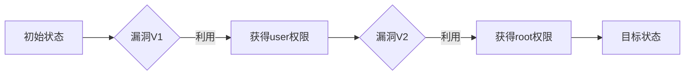

# 网络安全评估工具的设计与实现

作者：禅与计算机程序设计艺术

## 1.背景介绍
### 1.1 网络安全的重要性
#### 1.1.1 网络安全对个人的影响
#### 1.1.2 网络安全对企业的影响 
#### 1.1.3 网络安全对国家的影响
### 1.2 网络安全评估的必要性
#### 1.2.1 及时发现安全漏洞
#### 1.2.2 评估网络安全风险
#### 1.2.3 制定有效的安全策略
### 1.3 现有网络安全评估工具的局限性
#### 1.3.1 功能单一,缺乏整合能力
#### 1.3.2 操作复杂,易用性差
#### 1.3.3 缺乏智能化和自动化能力

## 2.核心概念与关联
### 2.1 网络安全评估的定义与目标
#### 2.1.1 网络安全评估的定义
#### 2.1.2 网络安全评估的目标
### 2.2 网络安全评估的分类与方法
#### 2.2.1 渗透测试
#### 2.2.2 漏洞扫描
#### 2.2.3 安全审计
### 2.3 网络安全评估工具的核心功能
#### 2.3.1 资产发现与识别
#### 2.3.2 漏洞扫描与分析
#### 2.3.3 渗透测试与验证
#### 2.3.4 风险评估与报告生成

## 3.核心算法原理与操作步骤
### 3.1 资产发现算法
#### 3.1.1 IP地址扫描算法
#### 3.1.2 端口扫描算法
#### 3.1.3 指纹识别算法  
### 3.2 漏洞扫描算法
#### 3.2.1 基于特征的漏洞扫描算法
#### 3.2.2 基于行为的漏洞扫描算法
#### 3.2.3 模糊测试算法
### 3.3 渗透测试算法
#### 3.3.1 暴力破解算法
#### 3.3.2 Web应用攻击算法
#### 3.3.3 缓冲区溢出攻击算法
### 3.4 风险评估算法
#### 3.4.1 资产价值评估算法
#### 3.4.2 威胁评估算法
#### 3.4.3 脆弱性评估算法

## 4.数学模型和公式详解
### 4.1 脆弱性评分系统(CVSS)模型
#### 4.1.1 CVSS 模型介绍
CVSS即通用漏洞评分系统(Common Vulnerability Scoring System),是一个行业开放标准。它能够衡量漏洞的严重程度,并生成0-10分的标准评分,以帮助企业评估和确定漏洞的优先修复顺序。

CVSS v3.x模型把评分分为三个部分:基础评分(Base Score)、 时间评分(Temporal Score)和环境评分(Environmental Score)。
其基本公式为:

$$BaseScore=RoundUp(MinimumScoreRange+(1-MinimumScoreRange) × F(Impact,Exploitability))$$

其中$MinimumScoreRange$是漏洞评分的最低档,默认为0,$F$是一个复合函数,参数$Impact$代表漏洞对CIA(机密性、完整性、可用性)的影响,$Exploitability$代表漏洞的可利用性。

#### 4.1.2 详解基础评分中的影响因子 
Impact评分反应漏洞被利用后对机密性、完整性、可用性造成的损害程度。其计算公式为:

$Impact= 1-(1-ConfidentialityImpact) × (1-IntegrityImpact) × (1-AvailabilityImpact)$

其中$ConfidentialityImpact$, $IntegrityImpact$, $AvailabilityImpact$分别代表机密性、完整性、可用性受损的程度,它们的取值为:

- None: 0.0 
- Low: 0.22
- High: 0.56

#### 4.1.3 详解基础评分中的可利用性因子
$Exploitability$评分反应了攻击者利用漏洞的难易程度。计算公式为:

$Exploitability= 8.22 × AttackVector × AttackComplexity × PrivilegeRequired × UserInteraction$

其中$AttackVector$代表攻击途径,$AttackComplexity$代表攻击复杂度,$PrivilegeRequired$代表需要的权限,$UserInteraction$代表需要用户交互。

- AttackVector
  - Network: 0.85 
  - Adjacent: 0.62
  - Local: 0.55
  - Physical: 0.2
- AttackComplexity 
  - Low: 0.77
  - High: 0.44
- PrivilegeRequired
  - None: 0.85
  - Low: 0.62 
  - High: 0.27
- UserInteraction
  - None: 0.85
  - Required: 0.62

通过对CVSS评分模型的深入分析,我们不仅理解了其内在数学原理,也为网络安全评估系统中漏洞风险评估模块的实现奠定了坚实基础。

### 4.2 攻击图模型  
#### 4.2.1 攻击图模型简介
攻击图(Attack Graph)是一种结构化的方法来分析网络中的安全弱点以及攻击路径。攻击图以节点和边的形式,表示系统漏洞、攻击行动以及前置/后置条件之间的因果关系。通过生成攻击图,我们可以理解攻击者如何通过一系列步骤渗透网络,评估潜在风险。

一个典型的攻击图如下:


#### 4.2.2 攻击图的形式化定义
形式化地,一个攻击图定义为一个二元组G=(S, τ),其中:

- S是所有节点的集合,每个节点表示一个攻击状态
- τ⊆ S × S, 代表状态转移关系

节点集合S进一步分为三种类型:

1. 初始状态节点 $S_I \subseteq S$
2. 目标状态节点 $S_G \subseteq S$ 
3. 中间状态节点 $S_N= S \setminus (S_I \cup S_G)$

状态之间的转移通过攻击行动Arc(transition)来实现。一个攻击行动$a_i$定义为三元组:

$$a_i = (src, dst, C_i)$$

其中$src \in S$ 代表源状态,$dst \in S$ 代表目标状态,$C_i$代表一组攻击前提条件,只有$C_i$被满足,状态才能从$src$转移到$dst$。

一条攻击路径$P=\langle s_0,s_1,\dots,s_n \rangle$是一个状态序列,满足$s_0\in S_I,s_n \in S_G$,并且对于$0\leq i<n$,$(s_i,s_{i+1})\in \tau$。

#### 4.2.3 基于模型检测(Model Checking)的攻击图生成
传统上,安全专家根据网络拓扑、配置、已知漏洞手工生成攻击图。这一过程十分繁琐,难以应对复杂网络。

因此本文提出使用形式化方法中的模型检测技术自动生成攻击图。其基本思想为:将网络配置抽象为一个状态转移系统,编码为一个SMT公式,再使用SMT求解器求解公式。如果公式可满足,求解器将返回一条攻击路径。重复该过程直到找出所有路径,由此构建整个攻击图。

下面给出算法伪代码:
```
Algorithm GenerateAttackGraph(S, I, G, R):
  Input: 状态集合S, 初始状态集合I, 目标状态集合G, 转移关系R
  Output: Attack Graph G

  G := {}
  Paths := {}
  States := I
  while States ≠ ∅ do
    S := States.pop()
    if S ∈ G then
      P = Path(I, S)
      Paths := Paths ∪ {P}
    else 
      for each S' ∈ R(S) do 
        if S' not in G then
          G := G ∪ {S'}
          States := States ∪ {S'} 

  for each P ∈ Paths do
    for each (Si, Si+1) ∈ P do
      G := G ∪ {(Si, Si+1)}

  return G      
```

通过上述算法,我们可以高效自动化地生成攻击图。基于攻击图模型分析网络风险,可以帮助我们预测多步攻击,加强网络防御。将其整合到网络安全评估系统中,可以极大提升风险评估的全面性和准确性。

## 5.项目实践：代码实例和详细说明

下面展示一个用Python实现的简单攻击图生成程序。

```python
from z3 import *

class State:
    def __init__(self, name, initial=False, goal=False):
        self.name = name
        self.initial = initial
        self.goal = goal
        
    def __str__(self):
        return self.name
        
class Transition:
    def __init__(self, src, dst, cond):
        self.src = src
        self.dst = dst
        self.cond = cond
        
    def __str__(self):
        return f"{self.src} -> {self.dst} : {self.cond}"
        
def generate_attack_graph(states, transitions):
    solver = Solver()
    paths = []
    
    def dfs(state, path):
        if state.goal:
            paths.append(path)
        else:
            for t in transitions:
                if t.src == state:
                    solver.push()
                    solver.add(t.cond)
                    if solver.check() == sat:
                        dfs(t.dst, path + [t])
                    solver.pop()
    
    for s in states:
        if s.initial:
            dfs(s, [])
            
    return paths

# Example usage        
if __name__ == "__main__":
    s0 = State("Initial", initial=True) 
    s1 = State("User Privilege")
    s2 = State("Root Privilege", goal=True)
    
    t1 = Transition(s0, s1, Bool("vuln1"))
    t2 = Transition(s1, s2, Bool("vuln2"))
    
    states = [s0, s1, s2]
    transitions = [t1, t2]
    
    attack_paths = generate_attack_graph(states, transitions)
    
    print("Possible Attack Paths:")
    for path in attack_paths:
        print(" -> ".join(str(t) for t in path))
```

这个程序定义了State和Transition两个类,分别表示攻击图中的状态节点和转移边。`generate_attack_graph`函数使用了深度优先搜索(DFS)算法来搜索所有从初始状态到目标状态的路径。在搜索过程中,它使用Z3 SMT求解器检查转移条件是否可满足。如果一个转移的条件满足,就继续沿该转移扩展攻击路径。

在示例的`__main__`部分,我们构建了一个包含3个状态,2个转移的简单攻击图。vuln1和vuln2表示两个不同的漏洞利用。运行程序,它将输出所有可能的攻击路径,如:

```
Possible Attack Paths:
Initial -> User Privilege : vuln1 -> Root Privilege : vuln2
```

当然,在实际应用中,攻击图的生成需要根据网络拓扑、已知漏洞、访问控制等配置自动提取状态和转移。生成的攻击图也可能非常复杂。但上述代码展示了攻击图生成的基本原理。

为了进一步优化,我们可以在生成过程中引入剪枝策略,去除冗余路径,提高生成效率。我们还可以引入并行化和增量更新机制,让攻击图的生成和维护更加高效。将攻击图技术与其他安全分析方法(如漏洞扫描、入侵检测)结合,能够全面提升网络安全评估工具的分析和预测能力。

## 6.实际应用场景

网络安全评估系统的一个重要应用场景就是企业网络安全管理。假设公司网络管理员小王使用我们开发的工具对公司网络进行了一次全面的安全评估,具体过程如下:

1. 资产发现与管理
小王首先使用系统的资产发现功能对网络进行全面扫描。工具自动发现了网段中的所有活跃主机和网络设备,识别出服务器、终端、交换机、路由器等不同类型的资产。小王审核资产列表,为关键资产添加标签和重要程度属性。

2. 漏洞扫描与分析
接下来,小王对所有资产启动漏洞扫描任务。扫