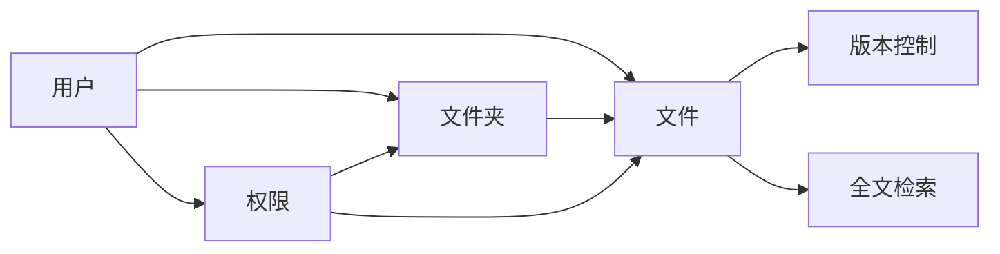

## 1. 背景介绍

### 1.1 云存储时代的到来

随着互联网技术的飞速发展，云计算技术应运而生。云计算将数据存储、计算资源等服务迁移到云端，用户可以通过网络随时随地访问和使用这些服务。云存储作为云计算的重要组成部分，为用户提供了便捷、安全、高效的数据存储方案。网络硬盘作为云存储的一种典型应用，近年来得到了广泛的普及和应用。

### 1.2 网络硬盘资源管理系统的需求

网络硬盘资源管理系统是用于管理和维护网络硬盘资源的软件系统。它为用户提供了文件上传、下载、存储、分享等功能，并支持用户对文件进行权限管理、版本控制、全文检索等操作。随着网络硬盘用户数量的不断增加，以及用户对网络硬盘功能需求的不断提高，网络硬盘资源管理系统的设计和实现也面临着越来越多的挑战。

### 1.3 本文目的

本文旨在详细介绍网络硬盘资源管理系统的详细设计与具体代码实现。我们将从系统架构、功能模块、数据库设计、核心算法、代码实例、实际应用场景等方面进行深入探讨，并提供工具和资源推荐，以及对未来发展趋势与挑战的展望。

## 2. 核心概念与联系

### 2.1 用户

用户是网络硬盘资源管理系统的核心对象之一。用户可以注册账号，登录系统，上传、下载、管理自己的文件。

### 2.2 文件

文件是用户存储在网络硬盘上的数据对象。文件可以是文本、图片、音频、视频等多种类型。

### 2.3 文件夹

文件夹用于组织和管理文件。用户可以创建文件夹，并将文件放入文件夹中。

### 2.4 权限

权限用于控制用户对文件和文件夹的访问权限。用户可以设置文件和文件夹的访问权限，例如只读、可写、可删除等。

### 2.5 版本控制

版本控制用于记录文件的修改历史。用户可以查看文件的历史版本，并恢复到之前的版本。

### 2.6 全文检索

全文检索用于快速查找文件。用户可以根据关键字搜索文件，系统会返回包含关键字的文件列表。

### 2.7 关系图

下面使用Mermaid语法展示核心概念之间的联系：



## 3. 核心算法原理具体操作步骤

### 3.1 文件上传

1. 用户选择要上传的文件。
2. 系统对文件进行校验，例如文件大小、文件类型等。
3. 系统将文件分割成多个数据块。
4. 系统将数据块存储到不同的服务器上，并生成数据块的索引信息。
5. 系统将索引信息存储到数据库中。

### 3.2 文件下载

1. 用户选择要下载的文件。
2. 系统根据文件索引信息，从不同的服务器上获取数据块。
3. 系统将数据块合并成完整的文件。
4. 系统将文件发送给用户。

### 3.3 文件分享

1. 用户选择要分享的文件或文件夹。
2. 用户设置分享权限，例如可查看、可下载、可编辑等。
3. 系统生成分享链接。
4. 用户将分享链接发送给其他用户。
5. 其他用户通过分享链接访问文件或文件夹。

## 4. 数学模型和公式详细讲解举例说明

### 4.1 文件存储空间占用计算

文件存储空间占用 = 文件大小 × 数据块数量

例如，一个 1GB 的文件，如果分割成 100 个数据块，则存储空间占用为 1GB × 100 = 100GB。

### 4.2 文件下载速度计算

文件下载速度 = 网络带宽 ÷ 数据块数量

例如，如果网络带宽为 100Mbps，文件分割成 100 个数据块，则文件下载速度为 100Mbps ÷ 100 = 1Mbps。

### 4.3 文件检索效率计算

文件检索效率 = 检索时间 ÷ 文件数量

例如，如果检索 10000 个文件需要 1 秒，则文件检索效率为 1 秒 ÷ 10000 = 0.0001 秒/文件。

## 5. 项目实践：代码实例和详细解释说明

### 5.1 文件上传代码示例

```python
import os
import hashlib

def upload_file(file_path):
  """
  上传文件
  """
  # 获取文件大小
  file_size = os.path.getsize(file_path)

  # 计算文件哈希值
  with open(file_path, 'rb') as f:
    file_hash = hashlib.md5(f.read()).hexdigest()

  # 将文件分割成数据块
  chunk_size = 1024 * 1024 * 10 # 10MB
  chunks = []
  with open(file_path, 'rb') as f:
    while True:
      chunk = f.read(chunk_size)
      if not chunk:
        break
      chunks.append(chunk)

  # 将数据块存储到服务器
  for i, chunk in enumerate(chunks):
    # TODO: 将数据块存储到服务器

  # 生成索引信息
  index = {
    'file_name': os.path.basename(file_path),
    'file_size': file_size,
    'file_hash': file_hash,
    'chunk_size': chunk_size,
    'chunk_count': len(chunks),
  }

  # 将索引信息存储到数据库
  # TODO: 将索引信息存储到数据库

  return index
```

### 5.2 代码解释

- `os.path.getsize(file_path)`: 获取文件大小。
- `hashlib.md5(f.read()).hexdigest()`: 计算文件的 MD5 哈希值。
- `chunk_size = 1024 * 1024 * 10`: 设置数据块大小为 10MB。
- `with open(file_path, 'rb') as f`: 打开文件，以二进制读取模式。
- `f.read(chunk_size)`: 读取一个数据块。
- `TODO: 将数据块存储到服务器`: 将数据块存储到服务器，具体实现根据实际情况而定。
- `index`: 生成索引信息，包括文件名、文件大小、文件哈希值、数据块大小、数据块数量。
- `TODO: 将索引信息存储到数据库`: 将索引信息存储到数据库，具体实现根据实际情况而定。

## 6. 实际应用场景

### 6.1 个人云存储

网络硬盘资源管理系统可以作为个人云存储平台，为用户提供文件存储、分享、备份等服务。

### 6.2 企业云存储

网络硬盘资源管理系统可以作为企业云存储平台，为企业提供文件存储、协同办公、数据备份等服务。

### 6.3 在线教育

网络硬盘资源管理系统可以作为在线教育平台的课件存储和分享平台。

### 6.4 医疗影像

网络硬盘资源管理系统可以作为医疗影像存储和分享平台。

## 7. 工具和资源推荐

### 7.1 数据库

- MySQL
- PostgreSQL
- MongoDB

### 7.2 编程语言

- Python
- Java
- Go

### 7.3 云存储服务

- Amazon S3
- Google Cloud Storage
- Microsoft Azure Blob Storage

## 8. 总结：未来发展趋势与挑战

### 8.1 未来发展趋势

- 人工智能技术将被应用于网络硬盘资源管理系统，例如智能文件分类、智能文件检索等。
- 区块链技术将被应用于网络硬盘资源管理系统，例如数据安全、数据溯源等。
- 边缘计算技术将被应用于网络硬盘资源管理系统，例如数据本地化存储、数据快速访问等。

### 8.2 挑战

- 数据安全
- 数据隐私
- 系统性能
- 系统可扩展性

## 9. 附录：常见问题与解答

### 9.1 如何提高文件上传速度？

- 提高网络带宽。
- 减少数据块大小。
- 使用多线程上传。

### 9.2 如何保证文件安全？

- 使用 HTTPS 协议传输数据。
- 对文件进行加密存储。
- 设置文件访问权限。

### 9.3 如何提高文件检索效率？

- 使用全文检索技术。
- 对文件进行分类存储。
- 使用缓存技术。
