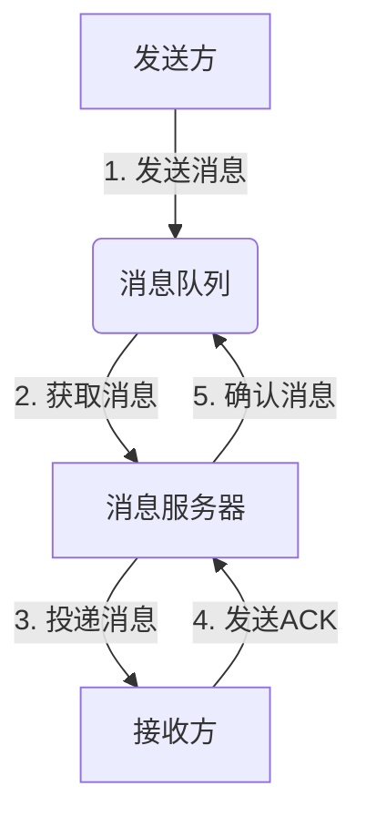
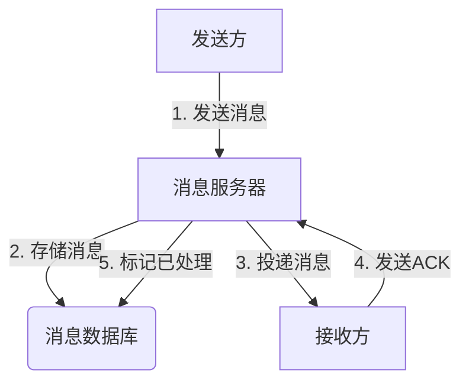
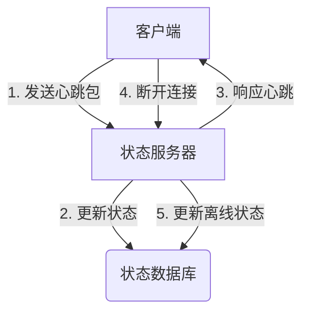

# 聊天室管理系统详细设计与具体代码实现

## 1. 背景介绍

### 1.1 聊天室系统概述

在当今互联网时代，实时通信和协作已经成为日常生活和工作中不可或缺的一部分。聊天室系统作为一种实时通信工具,为用户提供了便捷的即时消息传递、文件共享、在线协作等功能,广泛应用于社交、客户支持、团队协作等多个领域。随着移动互联网的兴起和云计算技术的发展,聊天室系统也逐渐演变为更加智能化、多功能化的实时通信平台。

### 1.2 聊天室系统的演进

早期的聊天室系统多基于文本通信,功能较为简单。随着多媒体技术的发展,聊天室系统逐渐支持了图片、语音、视频等多种消息类型。近年来,随着人工智能技术的不断进步,聊天室系统也开始融入智能助手、自动翻译、内容审核等智能化功能,为用户提供更加智能化和个性化的通信体验。

### 1.3 聊天室系统的重要性

聊天室系统已经成为现代社会不可或缺的通信基础设施。它们不仅方便了人与人之间的实时交流,也推动了企业内部的协作效率,促进了跨地域、跨组织的远程协作,为全球化发展提供了坚实的技术支撑。此外,聊天室系统还在电子商务、在线教育、远程医疗等领域发挥着重要作用。

## 2. 核心概念与联系

### 2.1 系统架构概览

聊天室管理系统通常采用分布式架构,由多个子系统组成,包括:

- **前端系统**: 提供用户界面,负责消息的发送和接收、展示等功能。
- **消息服务器**: 负责处理和路由消息,确保消息的实时传递和可靠性。
- **存储系统**: 负责持久化存储消息记录、用户信息等数据。
- **其他辅助系统**: 如认证授权系统、在线状态管理系统、文件服务器等。

这些子系统通过标准化的通信协议和接口进行交互,形成一个完整的聊天室管理系统。

### 2.2 核心概念解析

以下是聊天室管理系统中的一些核心概念:

1. **消息**:聊天室系统的核心是实现消息的实时传递。消息可以是文本、图片、语音、视频等多种类型。
2. **会话**:指特定的聊天对象,可以是一对一私聊,也可以是多人群聊。
3. **在线状态**:表示用户当前是否在线,以及最后一次活动时间等信息。
4. **离线消息**:当用户不在线时,发送给该用户的消息会被暂存,等待用户上线后转发。
5. **消息投递**:将消息从发送方路由并传递到接收方的过程。
6. **消息持久化**:将消息记录持久化存储,以便后续查询和审计。
7. **认证授权**:对用户进行身份验证,并控制访问权限。
8. **内容审核**:对用户发送的消息进行文本、图片等内容的审核,防止发送违规内容。

### 2.3 核心技术栈

聊天室管理系统涉及的核心技术栈包括:

- **前端技术**: HTML、CSS、JavaScript、React/Vue/Angular等前端框架。
- **后端技术**: Java、Python、Node.js、Go等编程语言和Web框架。
- **数据库**: MySQL、PostgreSQL、MongoDB等关系型和非关系型数据库。
- **消息队列**: RabbitMQ、Kafka、ActiveMQ等消息队列系统。
- **缓存**: Redis、Memcached等缓存系统。
- **WebSocket**: 实现双向实时通信的协议。
- **安全技术**: HTTPS、JWT、OAuth等安全认证和授权技术。

## 3. 核心算法原理具体操作步骤

### 3.1 消息投递算法

消息投递是聊天室系统的核心功能之一,需要高效、可靠地将消息从发送方路由并传递到接收方。常用的消息投递算法包括:

1. **基于长连接的直接投递**:发送方和接收方通过WebSocket等长连接技术建立持久连接,消息可以直接通过连接进行传递。适用于实时性要求较高的场景。

2. **基于消息队列的异步投递**:发送方将消息发送到消息队列,消息服务器从队列中获取消息并投递给接收方。适用于并发量较大、可靠性要求较高的场景。

3. **基于推送服务的投递**:发送方将消息发送到推送服务器,推送服务器负责将消息推送给接收方的客户端。适用于移动端应用场景。

以基于消息队列的异步投递为例,其具体操作步骤如下:



1. 发送方将消息发送到消息队列中。
2. 消息服务器从消息队列中获取消息。
3. 消息服务器将消息投递给接收方。
4. 接收方收到消息后,向消息服务器发送确认(ACK)。
5. 消息服务器收到确认后,从消息队列中删除或标记已处理该消息。

### 3.2 消息持久化算法

为了确保消息记录的可靠性和可审计性,聊天室系统需要将消息持久化存储。常用的消息持久化算法包括:

1. **基于数据库的持久化**:将消息记录存储在关系型或非关系型数据库中。适用于大多数场景。
2. **基于文件系统的持久化**:将消息记录存储在本地文件系统或分布式文件系统中。适用于对性能和可扩展性要求较高的场景。
3. **基于对象存储的持久化**:将消息记录存储在对象存储系统中,如Amazon S3、Aliyun OSS等。适用于海量数据存储场景。

以基于数据库的持久化为例,其具体操作步骤如下:



1. 发送方将消息发送给消息服务器。
2. 消息服务器将消息存储在消息数据库中。
3. 消息服务器将消息投递给接收方。
4. 接收方收到消息后,向消息服务器发送确认(ACK)。
5. 消息服务器收到确认后,在消息数据库中标记该消息已处理。

### 3.3 在线状态管理算法

为了提供良好的用户体验,聊天室系统需要实时跟踪和管理用户的在线状态。常用的在线状态管理算法包括:

1. **基于长连接的状态管理**:利用WebSocket等长连接技术,实时监测用户的连接状态。
2. **基于心跳机制的状态管理**:客户端定期向服务器发送心跳包,服务器根据心跳包判断用户的在线状态。
3. **基于推送服务的状态管理**:利用移动端推送服务,监测用户设备的在线状态。

以基于心跳机制的状态管理为例,其具体操作步骤如下:



1. 客户端定期向状态服务器发送心跳包,报告自己的在线状态。
2. 状态服务器将用户的在线状态更新到状态数据库中。
3. 状态服务器响应客户端的心跳包。
4. 如果客户端长时间未发送心跳包,状态服务器判断该客户端已离线。
5. 状态服务器将用户的状态更新为离线,并记录最后活动时间等信息。

## 4. 数学模型和公式详细讲解举例说明

### 4.1 消息路由算法

在聊天室系统中,消息服务器需要高效地将消息路由并投递给正确的接收方。常用的消息路由算法包括:

1. **基于哈希的一致性哈希算法**:将消息根据特定的哈希函数映射到一个环形空间,并根据映射位置将消息路由到对应的服务器节点。
2. **基于负载均衡的路由算法**:根据服务器节点的负载情况,将消息路由到负载较低的节点。
3. **基于优先级的路由算法**:根据消息的优先级,将高优先级的消息优先路由和投递。

以基于哈希的一致性哈希算法为例,其数学模型如下:

设有 $n$ 个服务器节点 $\{s_1, s_2, \dots, s_n\}$,哈希函数为 $h(x)$,将每个节点映射到环形空间 $[0, 2^{32})$ 上,得到映射点 $\{h(s_1), h(s_2), \dots, h(s_n)\}$。

对于任意一个消息 $m$,计算其哈希值 $h(m)$,并找到第一个大于等于 $h(m)$ 的映射点对应的服务器节点 $s_i$,将消息路由到该节点。

$$
s_i = \min\{s_j | h(s_j) \geq h(m)\}
$$

这种算法可以实现负载均衡,并且当服务器节点数量发生变化时,只需重新计算哈希映射即可,无需大量移动数据,具有良好的扩展性和容错性。

### 4.2 离线消息存储模型

对于离线消息的存储,常用的数学模型包括:

1. **基于队列的离线消息存储模型**:将每个用户的离线消息存储在一个队列中,当用户上线时,从队列中取出并投递离线消息。
2. **基于键值存储的离线消息存储模型**:将每个用户的离线消息以键值对的形式存储在键值数据库中,键为用户ID,值为该用户的离线消息列表。
3. **基于关系模型的离线消息存储模型**:在关系数据库中创建离线消息表,每条记录对应一条离线消息,包含发送方、接收方、消息内容等字段。

以基于队列的离线消息存储模型为例,其数学表示如下:

设有 $m$ 个用户 $\{u_1, u_2, \dots, u_m\}$,每个用户对应一个离线消息队列 $Q_i$。

当有消息 $M$ 发送给用户 $u_i$ 时,如果 $u_i$ 不在线,则将消息 $M$ 入队到 $Q_i$ 中:

$$
Q_i.enqueue(M)
$$

当用户 $u_i$ 上线时,从 $Q_i$ 中依次取出并投递离线消息:

$$
\text{while } !Q_i.empty(): \\
\quad M = Q_i.dequeue() \\
\quad \text{deliver}(M, u_i)
$$

这种模型简单高效,但需要注意队列长度的控制,避免队列无限增长导致内存溢出。

## 4. 项目实践:代码实例和详细解释说明

在本节中,我们将通过一个基于 Node.js 和 Socket.IO 的聊天室系统示例,演示如何实现核心功能。

### 4.1 服务器端代码

```javascript
const express = require('express');
const app = express();
const http = require('http').createServer(app);
const io = require('socket.io')(http);

// 存储在线用户
const onlineUsers = new Map();

// 处理新用户连接
io.on('connection', (socket) => {
  console.log('New user connected');

  // 用户上线
  socket.on('online', (username) => {
    onlineUsers.set(socket.id, username);
    socket.broadcast.emit('userOnline', username);
  });

  // 接收消息
  socket.on('message', (data) => {
    const { sender, receiver, content } = data;
    const receiverSocket = Array