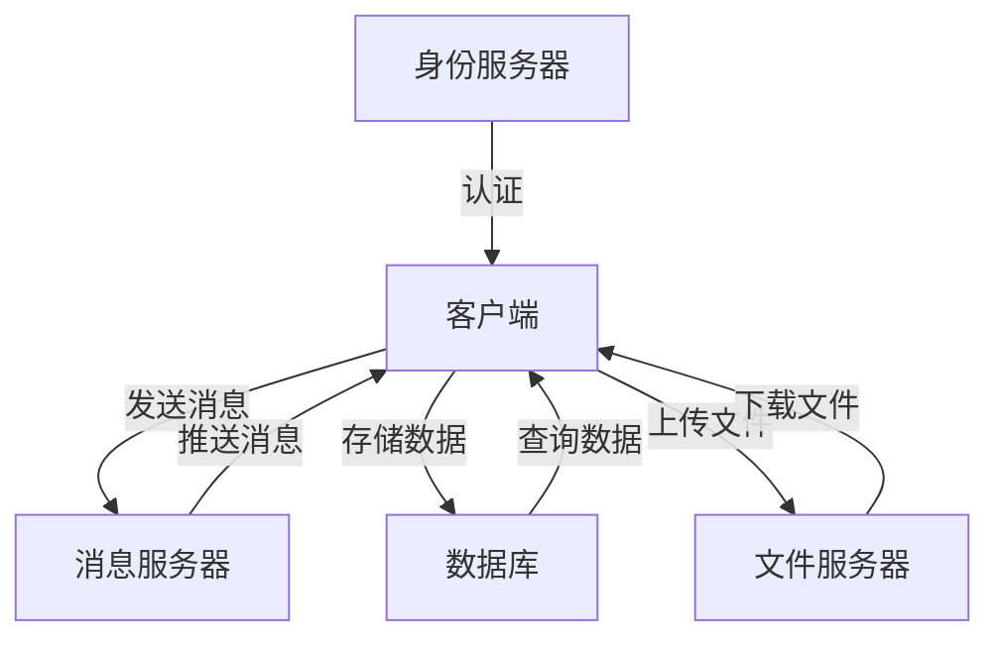
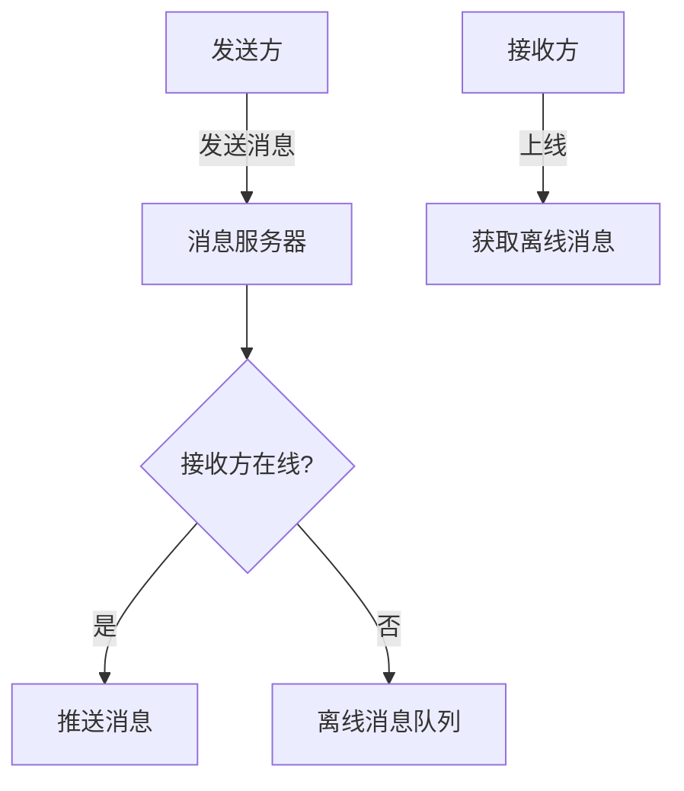
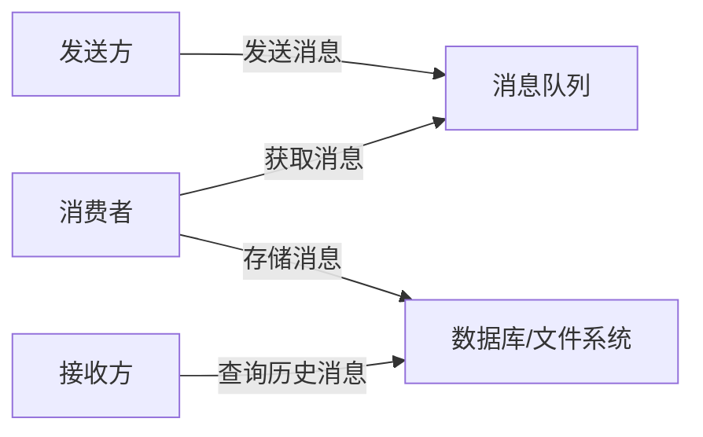
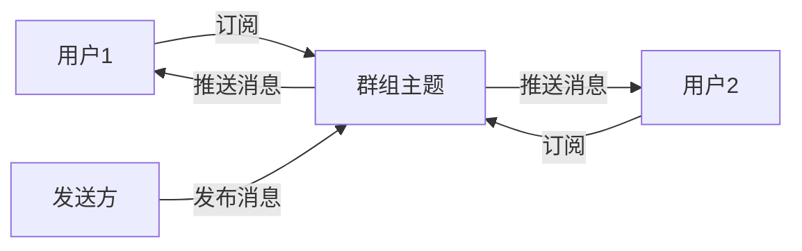

# 聊天室设计与开发系统详细设计与具体代码实现

## 1. 背景介绍

### 1.1 聊天室的重要性

在当今互联网时代,实时通信已成为人与人之间交流的重要方式。聊天室应用程序为用户提供了一种便捷的沟通渠道,无论是工作协作、社交娱乐还是即时客服支持,都可以借助聊天室实现高效的信息交换。

### 1.2 聊天室系统的发展历程

聊天室的起源可以追溯到20世纪70年代的BBS(电子公告板系统)时期。当时,用户可以在BBS上发布和阅读公告,并进行简单的文本交流。随着互联网的兴起,基于Web的聊天室应用开始流行,如IRC(Internet Relay Chat)等。进入21世纪后,即时通讯工具(如QQ、MSN等)逐渐取代了Web聊天室,提供了更加丰富的功能和更好的用户体验。

近年来,随着移动互联网的快速发展,移动聊天应用(如微信、WhatsApp等)风靡全球,成为人们日常社交的主要渠道之一。与此同时,企业级聊天室系统(如Slack、Discord等)也广泛应用于团队协作场景。

### 1.3 聊天室系统的挑战

设计和开发一个高性能、安全可靠的聊天室系统并非一蹴而就。需要解决的主要挑战包括:

1. 实时消息传递和同步
2. 系统的高并发和可扩展性
3. 消息的持久化和历史记录管理
4. 用户身份认证和隐私保护
5. 多媒体消息的支持(文本、图片、语音、视频等)
6. 群组聊天和频道管理
7. 跨平台和设备的支持
8. 安全防护(如防止垃圾信息、滥用等)

## 2. 核心概念与联系

### 2.1 系统架构概览

一个典型的聊天室系统通常包括以下几个核心组件:

- **客户端**:用户与系统交互的界面,可以是网页、桌面应用或移动APP等。
- **消息服务器**:负责实时消息的路由和分发,是整个系统的核心。
- **身份服务器**:处理用户认证、注册和登录等功能。
- **数据库**:用于存储用户信息、聊天记录和其他持久化数据。
- **文件服务器**:存储和分发多媒体文件(图片、音视频等)。

这些组件通过网络协议(如HTTP、WebSocket等)相互通信,构建出完整的聊天室系统。



### 2.2 关键技术

实现一个高效的聊天室系统需要综合运用多种技术,包括但不限于:

- **网络通信协议**: HTTP、WebSocket、Socket.IO等
- **消息队列和流处理**: RabbitMQ、Kafka、Redis等
- **数据库**: MySQL、MongoDB、Cassandra等
- **缓存**: Redis、Memcached等
- **负载均衡和反向代理**: Nginx、HAProxy等
- **分布式系统**: Zookeeper、etcd等
- **安全**: SSL/TLS、身份认证、防垃圾机制等

## 3. 核心算法原理具体操作步骤

### 3.1 消息路由算法

消息路由是聊天室系统的核心功能,需要高效可靠地将消息从发送方路由到接收方。常见的路由算法包括:

1. **点对点路由**:发送方直接将消息发送给接收方,适用于一对一聊天场景。
2. **主题订阅(Pub/Sub)路由**:发送方将消息发布到主题(Topic),接收方订阅感兴趣的主题并接收消息,适用于群组聊天和频道场景。
3. **内容路由**:根据消息内容(如关键词)将消息路由到相应的接收方,适用于智能客服等场景。

这些算法可以单独使用,也可以组合使用以满足不同的需求。

#### 点对点路由算法步骤

1. 发送方将消息发送到消息服务器
2. 消息服务器查询接收方的在线状态和路由信息
3. 如果接收方在线,直接将消息推送给接收方
4. 如果接收方离线,将消息存储到离线消息队列
5. 接收方上线时,从离线队列中获取未读消息



### 3.2 消息持久化算法

为了防止消息丢失和支持历史消息查询,聊天室系统需要将消息持久化存储到数据库或文件系统中。常见的持久化算法包括:

1. **消息队列持久化**:将消息先存入消息队列(如RabbitMQ、Kafka等),然后由消费者程序从队列中获取消息并存储到数据库或文件系统中。
2. **直接持久化**:发送方或消息服务器直接将消息存储到数据库或文件系统中。

#### 消息队列持久化算法步骤

1. 发送方将消息发送到消息队列
2. 消费者程序从消息队列中获取消息
3. 消费者程序将消息存储到数据库或文件系统中
4. 接收方从数据库或文件系统中查询历史消息



### 3.3 群组聊天算法

群组聊天是聊天室系统的一个重要功能,需要支持多人实时通信和群组管理。常见的群组聊天算法包括:

1. **主题订阅(Pub/Sub)算法**:每个群组对应一个主题,发送方将消息发布到该主题,订阅了该主题的所有用户都可以接收到消息。
2. **群组列表算法**:维护一个群组成员列表,发送方将消息发送给该列表中的所有成员。

#### 主题订阅算法步骤

1. 用户加入群组时,订阅该群组对应的主题
2. 发送方将消息发布到该群组主题
3. 订阅了该主题的所有用户都可以接收到消息
4. 用户退出群组时,取消订阅该主题



## 4. 数学模型和公式详细讲解举例说明

在聊天室系统中,一些关键算法和模型需要借助数学原理和公式来描述和优化。

### 4.1 消息路由模型

消息路由是聊天室系统的核心功能,需要高效可靠地将消息从发送方路由到接收方。我们可以使用图论中的最短路径算法来优化路由过程,minimizeimize消息的传输延迟和网络开销。

假设聊天室系统可以抽象为一个加权有向图$G=(V,E)$,其中$V$表示节点集合(服务器、客户端等),$E$表示边集合(网络链路)。每条边$(u,v)\in E$都有一个权重$w(u,v)$表示该链路的延迟或代价。

我们的目标是找到从发送方节点$s$到接收方节点$t$的最短路径,即:

$$
\min_{p\in P(s,t)}\sum_{(u,v)\in p}w(u,v)
$$

其中$P(s,t)$表示从$s$到$t$的所有可能路径集合。

这个问题可以使用著名的Dijkstra算法或Bellman-Ford算法来解决。以Dijkstra算法为例,其时间复杂度为$O((|V|+|E|)\log|V|)$,适用于权重为非负的情况。

在实际系统中,我们还需要考虑网络拓扑结构、链路带宽、服务器负载等因素,并动态调整路由策略以提高系统的整体性能。

### 4.2 消息队列模型

消息队列是实现异步消息传递和解耦的关键机制。我们可以使用排队论模型来分析和优化消息队列的性能。

假设消息到达服从泊松分布,其到达率为$\lambda$;消息服务时间服从指数分布,其服务率为$\mu$。根据排队论的M/M/1模型,我们可以得到以下公式:

$$
\begin{aligned}
\rho &=\frac{\lambda}{\mu} &&\text{(系统利用率)}\\
L &=\frac{\rho}{1-\rho} &&\text{(队列长度)}\\
W &=\frac{1}{\mu-\lambda} &&\text{(平均等待时间)}
\end{aligned}
$$

当$\rho<1$时,队列处于稳定状态;当$\rho\geq1$时,队列将无限增长,出现拥塞。

为了保证消息队列的高性能,我们需要控制$\rho$在一个合理的范围内,例如通过增加服务器资源(提高$\mu$)或限制发送速率(降低$\lambda$)等措施。

此外,我们还可以采用多队列、优先级队列等策略,根据消息的重要性和时效性进行分类处理,以提高整体吞吐量和响应时间。

## 5. 项目实践:代码实例和详细解释说明

在本节中,我们将通过一个简化的聊天室系统示例,展示如何使用Node.js和Socket.IO库来实现实时消息传递和群组聊天功能。

### 5.1 项目结构

```
chat-app/
├── package.json
├── server.js
└── public/
    ├── index.html
    ├── chat.js
    └── style.css
```

- `server.js`: 服务器端代码,使用Express.js框架和Socket.IO库
- `public/index.html`: 客户端HTML页面
- `public/chat.js`: 客户端JavaScript代码,使用Socket.IO客户端库
- `public/style.css`: 样式文件

### 5.2 服务器端代码

```javascript
const express = require('express');
const app = express();
const http = require('http').createServer(app);
const io = require('socket.io')(http);

app.use(express.static('public'));

const users = {};
const rooms = {};

io.on('connection', (socket) => {
  console.log('a user connected');

  // 用户加入聊天室
  socket.on('join', (data) => {
    const { username, room } = data;
    socket.join(room);
    users[socket.id] = { username, room };
    socket.broadcast.to(room).emit('message', `${username} has joined the chat`);
  });

  // 接收和广播消息
  socket.on('message', (data) => {
    const { message } = data;
    const { username, room } = users[socket.id];
    io.to(room).emit('message', `${username}: ${message}`);
  });

  // 用户离开聊天室
  socket.on('disconnect', () => {
    const { username, room } = users[socket.id];
    socket.broadcast.to(room).emit('message', `${username} has left the chat`);
    delete users[socket.id];
  });
});

const PORT = process.env.PORT || 3000;
http.listen(PORT, () => {
  console.log(`Server running on port ${PORT}`);
});
```

在这个示例中,我们使用`socket.io`库来处理实时通信。服务器端代码监听以下几种事件:

- `connection`: 当新的客户端连接到服务器时触发。
- `join`: 当用户加入聊天室时触发,将用户信息存储在`users`对象中,并通知其他用户。
- `message`: 当用户发送消息时触发,将消息广播给同一个聊天室的所有用户。
- `disconnect`: 当用户断开连接时触发,从`users`对象中删除用户信息,并通知其他用户。

### 5.3 客户端代码

```html
<!-- index.html -->
<!DOCTYPE html>
<html>
  <head>
    <title>Chat App</title>
    <link rel="stylesheet"