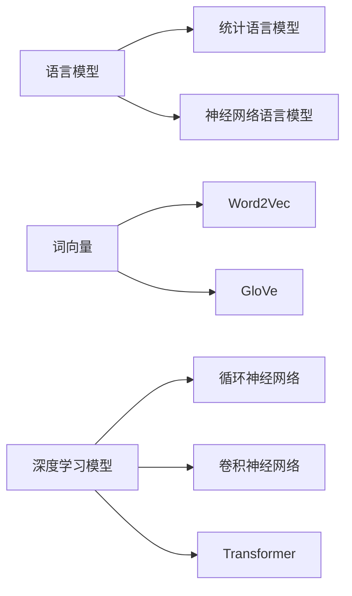

## 1. 背景介绍

### 1.1  自然语言处理的起源与发展

自然语言处理（Natural Language Processing, NLP）作为人工智能领域的一个重要分支，其目标是让计算机能够理解、解释和生成人类语言。自上世纪50年代图灵测试被提出以来，NLP经历了规则驱动、统计学习以及深度学习三个阶段，如今已发展成为一门集语言学、计算机科学、统计学等于一体的综合性学科。

### 1.2  自然语言处理的主要任务

NLP涵盖了众多研究方向，主要任务包括：

* **文本分析:**  文本分类、情感分析、关键词提取、主题模型等
* **信息抽取:** 命名实体识别、关系抽取、事件抽取等
* **机器翻译:**  将一种语言的文本自动翻译成另一种语言
* **问答系统:**  对用户提出的问题进行理解并给出准确答案
* **文本生成:**  自动生成文本摘要、对话、新闻报道等
* **语音识别与合成:**  将语音信号转换为文本，或将文本转换为语音

### 1.3  自然语言处理的应用领域

随着技术的进步和应用场景的不断拓展，NLP已经渗透到我们生活的方方面面，例如：

* **智能客服:**  自动回复用户咨询、处理订单等
* **机器翻译:**  跨语言交流、阅读外文文献等
* **搜索引擎:**  理解用户搜索意图，提供更精准的搜索结果
* **舆情监测:**  分析网络舆论，及时发现和应对突发事件
* **金融科技:**  风险控制、智能投顾等

## 2. 核心概念与联系

### 2.1  语言模型

语言模型是描述自然语言概率分布的统计模型，用于评估一个句子出现的可能性。常见的语言模型包括：

* **统计语言模型:**  基于统计方法，利用语料库中词语出现的频率来计算句子概率
* **神经网络语言模型:**  利用神经网络学习词语之间的语义关系，可以捕捉到更复杂的语言现象

### 2.2  词向量

词向量是将词语映射到向量空间的技术，可以将离散的符号表示转化为连续的数值表示，方便计算机进行处理。常见的词向量模型包括：

* **Word2Vec:**  利用神经网络训练得到词向量，可以捕捉到词语之间的语义相似度
* **GloVe:**  基于全局词共现矩阵，利用矩阵分解得到词向量

### 2.3  深度学习模型

近年来，深度学习在NLP领域取得了突破性进展，各种深度学习模型被广泛应用于不同的NLP任务中，例如：

* **循环神经网络（RNN）:**  适用于处理序列数据，例如文本
* **卷积神经网络（CNN）:**  适用于提取文本中的局部特征
* **Transformer:**  基于注意力机制，可以捕捉到句子中词语之间的长距离依赖关系

### 2.4  关系图

为了更清晰地展示上述核心概念之间的联系，我们可以使用Mermaid语法绘制如下关系图：



## 3. 核心算法原理具体操作步骤

### 3.1  文本预处理

在进行任何NLP任务之前，都需要对文本进行预处理，主要步骤包括：

* **分词:**  将文本按照一定的规则切分成词语序列
* **词性标注:**  为每个词语标注其词性，例如名词、动词、形容词等
* **命名实体识别:**  识别文本中的人名、地名、机构名等实体
* **停用词去除:**  去除对文本分析没有意义的词语，例如“的”、“是”、“了”等

### 3.2  特征工程

特征工程是指将原始数据转化为模型可接受的输入形式，例如：

* **词袋模型:**  将文本表示为词语出现的频率向量
* **TF-IDF:**  考虑词语在文本中的重要程度
* **词向量:**  将词语映射到向量空间

### 3.3  模型训练与评估

选择合适的模型和算法，利用标注数据进行模型训练，并使用测试集评估模型性能。

## 4. 数学模型和公式详细讲解举例说明

### 4.1  统计语言模型

统计语言模型假设一个句子出现的概率等于句子中每个词语出现的概率的乘积，例如：

$$
P(w_1, w_2, ..., w_n) = P(w_1) * P(w_2|w_1) * ... * P(w_n|w_1, w_2, ..., w_{n-1})
$$

其中，$P(w_i|w_1, w_2, ..., w_{i-1})$ 表示在已知前面 $i-1$ 个词语的情况下，第 $i$ 个词语出现的概率。

### 4.2  Word2Vec

Word2Vec 模型利用神经网络学习词向量，主要包括两种模型：

* **CBOW 模型:**  根据上下文预测目标词语
* **Skip-gram 模型:**  根据目标词语预测上下文

### 4.3  Transformer

Transformer 模型的核心是自注意力机制，可以捕捉到句子中词语之间的长距离依赖关系。

## 5. 项目实践：代码实例和详细解释说明

### 5.1  文本分类

```python
# 导入必要的库
from sklearn.datasets import fetch_20newsgroups
from sklearn.feature_extraction.text import TfidfVectorizer
from sklearn.linear_model import LogisticRegression
from sklearn.metrics import accuracy_score

# 加载数据集
categories = ['alt.atheism', 'soc.religion.christian']
train = fetch_20newsgroups(subset='train', categories=categories)
test = fetch_20newsgroups(subset='test', categories=categories)

# 特征工程
vectorizer = TfidfVectorizer()
train_features = vectorizer.fit_transform(train.data)
test_features = vectorizer.transform(test.data)

# 模型训练
model = LogisticRegression()
model.fit(train_features, train.target)

# 模型评估
predictions = model.predict(test_features)
accuracy = accuracy_score(test.target, predictions)
print('Accuracy:', accuracy)
```

### 5.2  情感分析

```python
# 导入必要的库
import nltk
from nltk.sentiment import SentimentIntensityAnalyzer

# 下载情感词典
nltk.download('vader_lexicon')

# 创建情感分析器
analyzer = SentimentIntensityAnalyzer()

# 进行情感分析
text = "This is a great movie! I highly recommend it."
scores = analyzer.polarity_scores(text)
print(scores)
```

## 6. 实际应用场景

* **智能客服:**  自动回复用户咨询、处理订单等
* **机器翻译:**  跨语言交流、阅读外文文献等
* **搜索引擎:**  理解用户搜索意图，提供更精准的搜索结果
* **舆情监测:**  分析网络舆论，及时发现和应对突发事件
* **金融科技:**  风险控制、智能投顾等

## 7. 工具和资源推荐

* **NLTK:**  Python 自然语言处理工具包
* **SpaCy:**  工业级自然语言处理库
* **Stanford CoreNLP:**  斯坦福大学开发的自然语言处理工具包
* **Hugging Face Transformers:**  预训练的深度学习模型库

## 8. 总结：未来发展趋势与挑战

### 8.1  未来发展趋势

* **预训练语言模型:**  更大规模、更强大的预训练语言模型将会出现
* **多模态学习:**  将文本、图像、语音等多种模态信息融合在一起进行处理
* **小样本学习:**  利用少量标注数据训练模型
* **可解释性:**  提高模型的可解释性，使其决策过程更加透明

### 8.2  挑战

* **数据稀疏性:**  许多语言缺乏足够的标注数据
* **模型泛化能力:**  模型在不同领域、不同语言上的泛化能力不足
* **伦理问题:**  人工智能技术应用带来的伦理问题

## 9. 附录：常见问题与解答

### 9.1  什么是词嵌入？

词嵌入是一种将词语映射到向量空间的技术，可以将离散的符号表示转化为连续的数值表示。

### 9.2  什么是 Transformer 模型？

Transformer 模型是一种基于注意力机制的深度学习模型，可以捕捉到句子中词语之间的长距离依赖关系。

### 9.3  自然语言处理有哪些应用场景？

自然语言处理的应用场景非常广泛，包括智能客服、机器翻译、搜索引擎、舆情监测、金融科技等。
