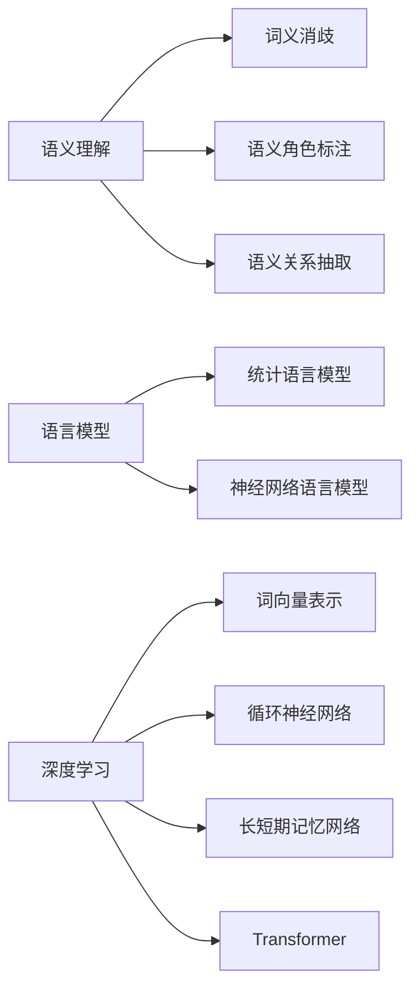

# 自然语言处理的未来:从理解到生成,跨越语义鸿沟

作者：禅与计算机程序设计艺术

## 1. 背景介绍

### 1.1 自然语言处理的演变历程

自然语言处理（Natural Language Processing, NLP）作为人工智能领域的核心分支之一，旨在赋予计算机理解和处理人类语言的能力。自图灵测试提出以来，NLP 经历了规则驱动、统计学习和深度学习三个主要阶段：

* **规则驱动时代 (20 世纪 50-80 年代):**  早期 NLP 系统主要依赖语言学家手工构建的语法规则和词典，例如基于规则的机器翻译系统。然而，这种方法难以处理自然语言的复杂性和歧义性，效果有限。
* **统计学习时代 (20 世纪 90 年代 - 21 世纪 10 年代):**  随着统计机器学习的兴起，NLP 开始采用统计模型，例如隐马尔可夫模型 (HMM)、条件随机场 (CRF) 等，从大规模语料库中自动学习语言规律。这极大地提升了 NLP 任务的性能，例如机器翻译、文本分类等。
* **深度学习时代 (21 世纪 10 年代至今):**  近年来，深度学习的突破性进展为 NLP 带来了革命性的变革。循环神经网络 (RNN)、长短期记忆网络 (LSTM)、Transformer 等深度学习模型能够有效地捕捉语言的长距离依赖关系和语义信息，在机器翻译、文本摘要、问答系统等任务上取得了显著成果。

### 1.2 语义鸿沟: NLP 面临的挑战

尽管 NLP 取得了长足进步，但仍然面临着巨大的挑战，其中最核心的问题之一是**语义鸿沟**。语义鸿沟指的是人类语言的丰富性和歧义性与计算机对语言的理解能力之间的差距。具体而言，语义鸿沟体现在以下几个方面：

* **多义性:**  同一个词语在不同的语境下可以表达不同的含义。
* **一词多义:**  不同的词语可以表达相同的含义。
* **隐喻和比喻:**  人类语言经常使用隐喻和比喻等修辞手法，难以用字面意思理解。
* **常识推理:**  人类语言理解依赖于大量的常识知识，而这些知识难以被计算机直接学习和利用。

### 1.3 从理解到生成: NLP 的未来方向

为了跨越语义鸿沟，未来的 NLP 研究需要从单纯的语言理解走向语言生成，实现更加智能、流畅、自然的语言交互。这意味着 NLP 系统需要具备以下能力：

* **深度语义理解:**  能够准确理解语言背后的语义信息，包括词语的多义性、语义角色、语义关系等。
* **常识知识推理:**  能够利用常识知识进行推理和判断，例如理解隐喻、比喻等修辞手法。
* **自然语言生成:**  能够生成流畅、自然、符合语法规则和语义逻辑的语言文本。

## 2. 核心概念与联系

### 2.1 语义理解

语义理解是 NLP 的核心任务之一，旨在让计算机理解自然语言文本的含义。语义理解涉及多个层次的概念和技术，包括：

* **词义消歧:**  确定多义词在特定语境下的具体含义。
* **语义角色标注:**  识别句子中各个成分的语义角色，例如施事者、受事者、时间、地点等。
* **语义关系抽取:**  识别实体之间的语义关系，例如父子关系、雇佣关系、因果关系等。

### 2.2 语言模型

语言模型是 NLP 的基础，用于描述自然语言的统计规律。语言模型可以用于预测下一个词语的概率，评估句子的流畅度，以及生成新的文本。常见的语言模型包括：

* **统计语言模型:**  基于统计方法，例如 N-gram 模型，从大规模语料库中学习词语出现的概率分布。
* **神经网络语言模型:**  基于神经网络，例如循环神经网络 (RNN) 和 Transformer，能够捕捉语言的长距离依赖关系和语义信息。

### 2.3 深度学习

深度学习是近年来推动 NLP 发展的重要力量，其核心思想是通过构建多层神经网络，自动学习数据中的复杂模式。深度学习在 NLP 中的应用包括：

* **词向量表示:**  将词语映射到低维向量空间，使得语义相似的词语在向量空间中距离更近。
* **循环神经网络 (RNN):**  能够处理序列数据，例如文本，并捕捉语言的长距离依赖关系。
* **长短期记忆网络 (LSTM):**  RNN 的一种变体，能够更好地处理梯度消失问题，并捕捉更长距离的依赖关系。
* **Transformer:**  一种基于注意力机制的网络结构，能够并行处理序列数据，并在机器翻译等任务上取得了显著成果。

### 2.4 核心概念联系图



## 3. 核心算法原理具体操作步骤

### 3.1  Transformer 模型

Transformer 模型是一种基于注意力机制的神经网络结构，近年来在自然语言处理领域取得了巨大成功。其核心思想是利用注意力机制捕捉句子中任意两个词语之间的依赖关系，从而更好地理解句子的语义信息。

#### 3.1.1  注意力机制

注意力机制的本质是从众多信息中选择出对当前任务更为关键的信息。在 Transformer 模型中，注意力机制用于计算句子中每个词语与其他所有词语之间的相关性，并根据相关性的大小为每个词语分配不同的权重。

具体而言，假设我们有一个句子 $X = \{x_1, x_2, ..., x_n\}$，其中 $x_i$ 表示句子中的第 $i$ 个词语。注意力机制的目标是计算一个权重矩阵 $A \in \mathbb{R}^{n \times n}$，其中 $A_{i,j}$ 表示词语 $x_i$ 对词语 $x_j$ 的注意力权重。

注意力机制的计算过程如下：

1. **计算查询向量、键向量和值向量:** 对于每个词语 $x_i$，将其对应的词向量分别与三个矩阵 $W_Q$、$W_K$ 和 $W_V$ 相乘，得到查询向量 $q_i$、键向量 $k_i$ 和值向量 $v_i$。

    $$q_i = x_i W_Q, \quad k_i = x_i W_K, \quad v_i = x_i W_V$$

2. **计算注意力权重:** 计算查询向量 $q_i$ 与所有键向量 $k_j$ 之间的点积，并使用 softmax 函数对点积结果进行归一化，得到注意力权重 $A_{i,j}$。

    $$A_{i,j} = \frac{\exp(q_i \cdot k_j)}{\sum_{k=1}^n \exp(q_i \cdot k_k)}$$

3. **加权求和:** 将所有值向量 $v_j$ 按照注意力权重 $A_{i,j}$ 进行加权求和，得到词语 $x_i$ 的上下文向量 $c_i$。

    $$c_i = \sum_{j=1}^n A_{i,j} v_j$$

#### 3.1.2  Transformer 模型结构

Transformer 模型主要由编码器和解码器两部分组成，如下图所示:


* **编码器:** 编码器由多个相同的层堆叠而成，每一层都包含自注意力层和前馈神经网络层。自注意力层用于计算句子中每个词语与其他所有词语之间的注意力权重，并生成上下文向量。前馈神经网络层则对上下文向量进行非线性变换，提取更高级的语义信息。

* **解码器:** 解码器与编码器结构类似，也由多个相同的层堆叠而成。不同之处在于，解码器在自注意力层的基础上，还包含一个编码器-解码器注意力层。该层用于将编码器输出的上下文信息融入到解码过程中，从而生成与输入句子相关的输出序列。

### 3.2  BERT 模型

BERT (Bidirectional Encoder Representations from Transformers) 模型是一种预训练语言模型，通过在大规模文本语料库上进行无监督学习，学习到丰富的语言知识。BERT 模型可以用于多种 NLP 任务，例如文本分类、问答系统等。

#### 3.2.1  BERT 模型的预训练任务

BERT 模型的预训练任务主要包括两个：

* **掩码语言模型 (Masked Language Model, MLM):**  随机掩盖输入句子中的一部分词语，然后训练模型根据上下文信息预测被掩盖的词语。
* **下一句预测 (Next Sentence Prediction, NSP):**  输入两个句子，训练模型判断第二个句子是否是第一个句子的下一句。

#### 3.2.2  BERT 模型的应用

BERT 模型可以用于多种 NLP 任务，例如：

* **文本分类:**  将 BERT 模型的输出向量作为文本的特征表示，用于文本分类任务。
* **问答系统:**  将问题和答案都输入到 BERT 模型中，利用 BERT 模型的编码能力提取问题和答案的语义信息，并计算问题和答案之间的相似度。

## 4. 数学模型和公式详细讲解举例说明

### 4.1  Softmax 函数

Softmax 函数是一种常用的归一化函数，用于将一个向量转换为概率分布。Softmax 函数的定义如下：

$$
\text{softmax}(x)_i = \frac{\exp(x_i)}{\sum_{j=1}^n \exp(x_j)}
$$

其中，$x = (x_1, x_2, ..., x_n)$ 是一个向量，$\text{softmax}(x)_i$ 表示向量 $x$ 经过 Softmax 函数处理后，第 $i$ 个元素对应的概率值。

**举例说明:**

假设我们有一个向量 $x = (1, 2, 3)$，则其经过 Softmax 函数处理后的结果为：

$$
\begin{aligned}
\text{softmax}(x)_1 &= \frac{\exp(1)}{\exp(1) + \exp(2) + \exp(3)} \approx 0.090 \\
\text{softmax}(x)_2 &= \frac{\exp(2)}{\exp(1) + \exp(2) + \exp(3)} \approx 0.245 \\
\text{softmax}(x)_3 &= \frac{\exp(3)}{\exp(1) + \exp(2) + \exp(3)} \approx 0.665
\end{aligned}
$$

可以看到，经过 Softmax 函数处理后，向量 $x$ 被转换为一个概率分布，每个元素的值都在 0 到 1 之间，且所有元素的概率值之和为 1。

### 4.2  交叉熵损失函数

交叉熵损失函数是一种常用的分类任务损失函数，用于衡量模型预测的概率分布与真实概率分布之间的差异。交叉熵损失函数的定义如下：

$$
L = -\sum_{i=1}^n y_i \log(p_i)
$$

其中，$y_i$ 表示真实标签的 one-hot 编码，$p_i$ 表示模型预测的概率值。

**举例说明:**

假设我们有一个二分类问题，真实标签为 $y = (0, 1)$，模型预测的概率分布为 $p = (0.2, 0.8)$，则交叉熵损失函数的值为：

$$
\begin{aligned}
L &= - (0 \times \log(0.2) + 1 \times \log(0.8)) \\
&\approx 0.223
\end{aligned}
$$

## 5. 项目实践：代码实例和详细解释说明

### 5.1  使用 Transformer 模型进行机器翻译

```python
import tensorflow as tf

# 定义 Transformer 模型
class Transformer(tf.keras.Model):
    def __init__(self, num_layers, d_model, num_heads, dff, input_vocab_size, target_vocab_size, dropout_rate=0.1):
        super(Transformer, self).__init__()

        self.encoder = Encoder(num_layers, d_model, num_heads, dff, input_vocab_size, dropout_rate)
        self.decoder = Decoder(num_layers, d_model, num_heads, dff, target_vocab_size, dropout_rate)

        self.final_layer = tf.keras.layers.Dense(target_vocab_size)

    def call(self, inp, tar, training, enc_padding_mask, look_ahead_mask, dec_padding_mask):
        enc_output = self.encoder(inp, training, enc_padding_mask)

        dec_output, attention_weights = self.decoder(
            tar, enc_output, training, look_ahead_mask, dec_padding_mask
        )

        final_output = self.final_layer(dec_output)

        return final_output, attention_weights

# 定义编码器
class Encoder(tf.keras.layers.Layer):
    def __init__(self, num_layers, d_model, num_heads, dff, input_vocab_size, dropout_rate=0.1):
        super(Encoder, self).__init__()

        self.d_model = d_model
        self.num_layers = num_layers

        self.