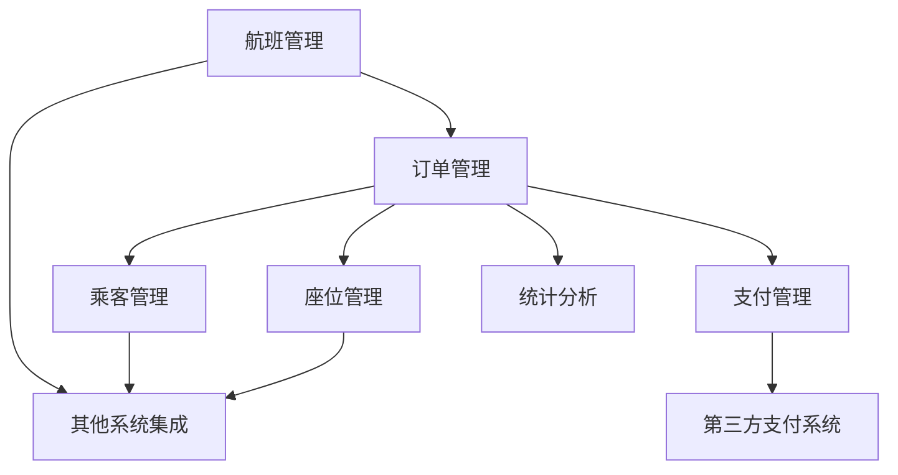
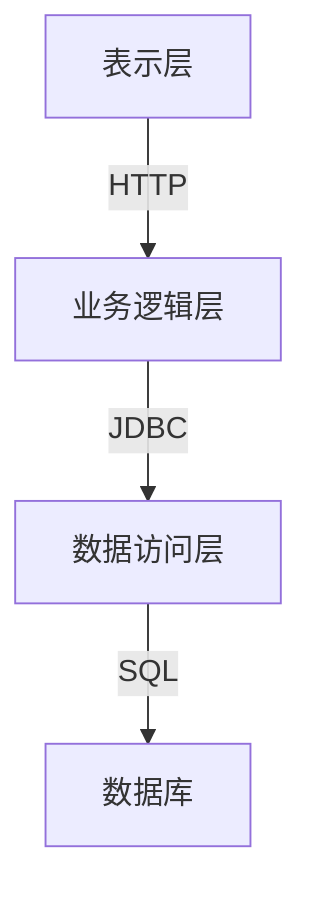

# 航空售票管理系统详细设计与具体代码实现

## 1. 背景介绍

随着航空旅行的日益普及,航空公司需要一个高效、可靠的航空售票管理系统来处理大量的订票请求、航班管理和机票销售。这种系统不仅需要处理传统的柜台购票,还需要支持在线订票、第三方代理商订票等多种购票渠道。同时,系统还需要与其他系统(如机场运营系统、机队管理系统等)进行数据交换和集成。

### 1.1 系统目标

航空售票管理系统的主要目标包括:

- 提供多渠道购票服务,支持在线订票、电话订票、柜台购票等
- 实现航班查询、选座、订票、付款、改签、退票等功能
- 与机场运营系统、机队管理系统等其他系统集成
- 提供数据统计和分析功能,支持决策
- 具有高可用性、可扩展性和安全性

### 1.2 系统架构

航空售票管理系统通常采用分层架构,包括:

- 表示层(客户端): Web客户端、移动客户端、呼叫中心等
- 业务逻辑层: 处理订票、查询、支付等业务逻辑
- 数据访问层: 负责与数据库进行交互
- 数据库层: 存储航班、订单、客户等数据

## 2. 核心概念与联系  

### 2.1 航班(Flight)

航班是航空公司按照既定的航线和时间运行的飞机。每个航班都有唯一的航班号、航线、起飞和降落时间、机型、座位等信息。

### 2.2 订单(Order)

订单是客户购买机票的记录,包含乘客信息、航班信息、支付信息等内容。一个订单可能包含多个航段。

### 2.3 乘客(Passenger)

乘客是购买机票并乘坐航班的人。乘客信息包括姓名、证件号、联系方式等。

### 2.4 座位(Seat)

座位是飞机上供乘客乘坐的位置,每个座位都有唯一编号。不同的座位可能有不同的舱位等级和价格。

### 2.5 支付(Payment)

支付是订单的重要环节,客户需要通过多种支付方式(信用卡、银行转账等)为订单付款。

### 2.6 主要模块关系

航空售票管理系统的主要模块之间的关系如下:



## 3. 核心算法原理具体操作步骤

### 3.1 航班查询算法

当用户查询航班时,系统需要根据出发地、目的地、日期等条件从航班数据中检索符合条件的航班记录。这可以使用以下步骤实现:

1. 根据出发地和目的地从航线数据中找到符合条件的航线记录
2. 根据查询日期从航班数据中筛选该航线当天的所有航班记录
3. 根据其他条件(如航空公司、机型等)进一步过滤
4. 将满足条件的航班记录返回给用户

该算法的时间复杂度取决于航线数据和航班数据的大小,通常情况下使用索引可以提高查询效率。

### 3.2 订单生成算法  

当用户选择航班和座位后,系统需要为其生成订单。该过程包括以下步骤:

1. 从用户选择中获取航班和座位信息
2. 获取乘客信息(如果是新乘客,则创建新的乘客记录)
3. 计算票价(根据舱位、折扣等因素)
4. 创建订单记录,包含航班、乘客、票价等信息
5. 根据订单金额进入支付流程

该算法的复杂度主要取决于乘客数量和计算票价的规则。

### 3.3 座位分配算法

对于大型航班,合理分配座位是一个复杂的问题。常用的座位分配算法包括:

1. **先到先得算法**: 按照订单生成的时间顺序为乘客分配座位
2. **舱位优先算法**: 根据舱位等级,优先为高舱位乘客分配座位
3. **座位图算法**: 维护一个座位图,为乘客选择合适的座位
4. **蒙特卡洛算法**: 使用随机模拟的方式寻找最优座位分配方案

这些算法的复杂度因算法不同而不同,需要权衡效率和公平性。

### 3.4 支付处理算法

订单生成后,系统需要处理乘客的支付请求。支付处理算法通常包括以下步骤:

1. 获取订单金额和支付方式
2. 连接第三方支付系统,发起支付请求
3. 等待支付结果,更新订单状态
4. 如果支付成功,为乘客保留座位
5. 如果支付失败,释放座位资源

该算法的关键是与第三方支付系统的集成,需要保证数据的一致性和安全性。

## 4. 数学模型和公式详细讲解举例说明

### 4.1 供给与需求平衡模型

航班的座位供给需要与旅客的需求相平衡,否则会导致资源浪费或无法满足需求。我们可以使用以下模型描述供给与需求的关系:

$$
\begin{aligned}
\min\ & \sum_{f \in F} c_f \cdot \max(0, s_f - d_f) \\
\text{s.t. } & \sum_{f \in F(r)} s_f \geq \sum_{f \in F(r)} d_f, \quad \forall r \in R \\
& 0 \leq s_f \leq C_f, \quad \forall f \in F
\end{aligned}
$$

其中:

- $F$ 是所有航班的集合
- $R$ 是所有航线的集合
- $F(r)$ 表示航线 $r$ 上的所有航班
- $s_f$ 表示航班 $f$ 的座位供给量
- $d_f$ 表示航班 $f$ 的座位需求量
- $c_f$ 表示航班 $f$ 超额供给的惩罚系数
- $C_f$ 表示航班 $f$ 的最大座位容量

该模型的目标是最小化所有航班的超额供给惩罚,约束条件是每条航线上的总供给量不小于总需求量,且每个航班的供给量在合理范围内。通过求解该优化模型,我们可以得到每个航班的最优座位供给量。

### 4.2 收益最大化模型

对于航空公司来说,机票收益的最大化是一个重要目标。我们可以使用以下模型描述收益最大化问题:

$$
\begin{aligned}
\max\ & \sum_{f \in F} \sum_{c \in C} r_{fc} \cdot x_{fc} \\
\text{s.t. } & \sum_{c \in C} x_{fc} \leq C_f, \quad \forall f \in F \\
& \sum_{f \in F(r, c)} x_{fc} \leq d_{rc}, \quad \forall r \in R, c \in C \\
& x_{fc} \geq 0, \quad \forall f \in F, c \in C
\end{aligned}
$$

其中:

- $F$ 是所有航班的集合
- $C$ 是所有舱位等级的集合
- $R$ 是所有航线的集合
- $r_{fc}$ 表示航班 $f$ 舱位 $c$ 的单价
- $x_{fc}$ 表示航班 $f$ 舱位 $c$ 的销售量
- $C_f$ 表示航班 $f$ 的总座位容量
- $d_{rc}$ 表示航线 $r$ 舱位 $c$ 的总需求量

该模型的目标是最大化所有航班和舱位等级的总收益,约束条件是每个航班的总销售量不超过座位容量,且每条航线每个舱位等级的总销售量不超过需求量。通过求解该优化模型,我们可以得到每个航班每个舱位等级的最优销售量,从而实现收益最大化。

这些数学模型为航空公司的决策提供了理论支持,但在实际应用中还需要考虑其他因素,如营销策略、舱位控制等。

## 5. 项目实践:代码实例和详细解释说明

下面我们通过一个基于 Java Spring Boot 框架的航空售票管理系统项目实例,来演示系统的具体实现。

### 5.1 系统架构

该系统采用经典的三层架构,包括表示层、业务逻辑层和数据访问层。



- **表示层**: 使用 Spring MVC 框架,提供 RESTful API 接口,支持前端 Web 应用和移动应用。
- **业务逻辑层**: 使用 Spring 框架,包含航班、订单、乘客等模块的业务逻辑实现。
- **数据访问层**: 使用 Spring Data JPA 框架,通过 JDBC 与关系型数据库进行交互。
- **数据库**: 使用 MySQL 关系型数据库存储系统数据。

### 5.2 数据模型

系统的核心数据模型包括以下几个实体类:

```java
// 航班实体
@Entity
public class Flight {
    @Id
    private String flightNumber; // 航班号
    private String airline; // 航空公司
    private String departure; // 出发地
    private String arrival; //目的地
    private LocalDateTime departureTime; // 起飞时间
    private LocalDateTime arrivalTime; // 到达时间
    private String aircraftType; // 机型
    private int capacity; // 座位容量
    // 其他属性...
}

// 订单实体
@Entity
public class Order {
    @Id
    @GeneratedValue
    private Long id;
    @OneToMany
    private List<Passenger> passengers; // 乘客列表
    @OneToMany
    private List<FlightSegment> flightSegments; // 航段列表
    private BigDecimal totalPrice; // 总价格
    private OrderStatus status; // 订单状态
    // 其他属性...
}

// 乘客实体
@Entity
public class Passenger {
    @Id
    @GeneratedValue
    private Long id;
    private String name;
    private String idNumber;
    // 其他属性...
}

// 航段实体
@Entity
public class FlightSegment {
    @Id
    @GeneratedValue
    private Long id;
    @ManyToOne
    private Flight flight;
    private String seatNumber; // 座位号
    private SeatClass seatClass; // 舱位等级
    private BigDecimal price; // 票价
    // 其他属性...
}
```

这些实体通过 JPA 注解映射到数据库表,建立了航班、订单、乘客和航段之间的关联关系。

### 5.3 服务层实现

下面是系统的主要服务层实现,包括航班查询、订单生成和支付处理等功能。

#### 航班查询服务

```java
@Service
public class FlightSearchService {
    @Autowired
    private FlightRepository flightRepo;

    public List<Flight> searchFlights(String departure, String arrival, LocalDate date) {
        return flightRepo.findByDepartureAndArrivalAndDepartureTimeBetween(departure, arrival,
                date.atStartOfDay(), date.atTime(23, 59, 59));
    }
}
```

该服务通过调用 `FlightRepository` 的 `findByDepartureAndArrivalAndDepartureTimeBetween` 方法,根据出发地、目的地和日期范围查询符合条件的航班记录。

#### 订单生成服务

```java
@Service
public class OrderService {
    @Autowired
    private PassengerRepository passengerRepo;
    @Autowired
    private OrderRepository orderRepo;

    public Order createOrder(List<Passenger> passengers, List<FlightSegment> flightSegments) {
        BigDecimal totalPrice = calculateTotalPrice(flightSegments);
        Order order = new Order();
        order.setPassengers(passengers);
        order.setFlightSegments(flightSegments);
        order.setTotalPrice(totalPrice);
        order.setStatus(OrderStatus.PENDING_PAYMENT);
        return orderRepo.save(order);
    }

    private BigDecimal calculateTotalPrice(List<FlightSegment> flightSegments) {
        return flightSegments.stream()
                .map(FlightSegment::getPrice)
                .reduce(BigDecimal.ZERO, BigDecimal::add);
    }
}
```

该服务实现了订单的创建逻辑。首先,它会计算订单的总价格,然后创建一个新的 `Order` 对象,