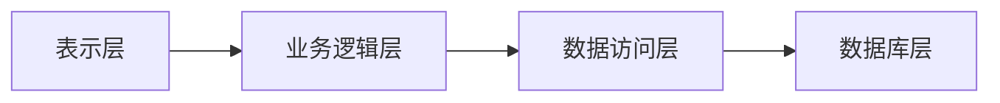

##  药店管理系统设计与实现

**作者：禅与计算机程序设计艺术**

## 1. 背景介绍

### 1.1 药店行业现状与挑战

随着社会经济的快速发展和人民生活水平的不断提高，人们对医疗保健的需求日益增长，医药行业迎来了前所未有的发展机遇。作为医药流通的重要环节，药店在满足人民群众基本用药需求、保障公众用药安全有效等方面发挥着不可替代的作用。

然而，传统的药店管理模式面临着诸多挑战：

* **信息化程度低:**  许多药店仍然依赖手工操作和纸质记录，导致效率低下、易出错、数据统计分析困难。
* **库存管理混乱:** 药品种类繁多、保质期短，传统的人工盘点方式难以准确掌握库存情况，容易造成药品过期或短缺。
* **销售统计分析滞后:**  无法及时获取销售数据，难以进行有效的市场分析和经营决策。
* **客户关系管理薄弱:**  缺乏有效的客户信息管理，难以提供个性化的服务，客户粘性低。

### 1.2 药店管理系统概述

为了应对上述挑战，越来越多的药店开始引入信息化管理系统。药店管理系统（Pharmacy Management System，PMS）是专门针对药店业务流程设计开发的软件系统，旨在通过信息技术手段提升药店的经营管理水平和服务质量。

药店管理系统通常包括以下核心功能模块：

* **进销存管理:**  药品采购、入库、销售、退货等全流程管理，实现库存实时监控和预警。
* **会员管理:**  建立完善的会员信息库，提供积分、优惠等个性化服务，提高客户忠诚度。
* **财务管理:**  记录和管理药店的收入、支出、利润等财务数据，生成财务报表，为经营决策提供依据。
* **报表统计:**  提供多种维度的数据统计分析功能，帮助管理者了解经营状况，发现问题，制定改进措施。

## 2. 核心概念与联系

### 2.1 系统架构设计

为了保证系统的稳定性、可扩展性和可维护性，药店管理系统通常采用分层架构设计，主要包括以下几个层次：

* **表示层:** 负责与用户进行交互，接收用户请求，并将处理结果展示给用户。
* **业务逻辑层:**  负责处理业务逻辑，包括数据校验、业务规则判断、数据处理等。
* **数据访问层:**  负责与数据库进行交互，进行数据的增删改查操作。
* **数据库层:**  用于存储系统的所有数据，包括药品信息、会员信息、销售记录等。




### 2.2 数据库设计

数据库设计是药店管理系统的核心，需要根据实际业务需求建立合理的数据库结构，以保证数据的完整性、一致性和安全性。

以下是一个简单的药店管理系统数据库设计示例：

**药品表 (medicines):**

| 字段名 | 数据类型 | 备注 |
|---|---|---|
| id | int | 药品ID，主键 |
| name | varchar | 药品名称 |
| specification | varchar | 药品规格 |
| unit | varchar | 药品单位 |
| manufacturer | varchar | 生产厂家 |
| price | decimal | 药品单价 |
| stock | int | 库存数量 |
| production_date | date | 生产日期 |
| expiration_date | date | 有效期 |

**会员表 (members):**

| 字段名 | 数据类型 | 备注 |
|---|---|---|
| id | int | 会员ID，主键 |
| name | varchar | 会员姓名 |
| phone | varchar | 会员电话 |
| address | varchar | 会员地址 |
| points | int | 会员积分 |

**销售记录表 (sales):**

| 字段名 | 数据类型 | 备注 |
|---|---|---|
| id | int | 销售记录ID，主键 |
| medicine_id | int | 药品ID |
| quantity | int | 销售数量 |
| total_price | decimal | 总价 |
| sale_time | datetime | 销售时间 |
| member_id | int | 会员ID |

### 2.3 功能模块设计

药店管理系统的主要功能模块包括：

#### 2.3.1 进销存管理

* **采购管理:**  创建采购订单、选择供应商、录入采购药品信息、确认收货等。
* **入库管理:**  记录药品入库信息，包括入库批次、数量、价格等，更新库存数量。
* **销售管理:**  根据顾客需求选择药品，录入销售数量，计算应收金额，打印销售小票。
* **退货管理:**  处理顾客退货，更新库存数量，生成退货记录。
* **库存管理:**  实时监控药品库存，设置库存预警线，生成库存报表。

#### 2.3.2 会员管理

* **会员注册:**  收集会员信息，创建会员档案，分配会员卡号。
* **会员信息维护:**  修改会员信息，例如联系方式、地址等。
* **积分管理:**  设置积分规则，记录会员积分，提供积分兑换商品或服务。
* **会员等级管理:**  根据会员消费金额或积分设置不同的会员等级，提供差异化服务。

#### 2.3.3 财务管理

* **收入管理:**  记录销售收入、会员充值等收入。
* **支出管理:**  记录药品采购、房租水电等支出。
* **利润统计:**  计算毛利润、净利润等财务指标。
* **报表生成:**  生成日报表、月报表、年报表等财务报表。

#### 2.3.4 报表统计

* **销售报表:**  统计不同时间段、不同药品的销售情况。
* **库存报表:**  统计当前库存、预警库存、过期库存等。
* **会员报表:**  统计会员数量、消费情况、积分情况等。
* **财务报表:**  统计收入、支出、利润等财务指标。

## 3. 核心算法原理具体操作步骤

### 3.1 库存管理算法

库存管理是药店管理系统的核心功能之一，需要保证药品库存的准确性和及时性，以避免药品过期或短缺。

#### 3.1.1  先进先出（FIFO）算法

先进先出（FIFO）算法是一种常用的库存管理算法，其基本原理是：先入库的药品先出库。

**操作步骤：**

1. 当有药品入库时，将入库信息（包括入库日期、数量等）记录到入库队列中。
2. 当有药品销售或出库时，从入库队列的头部取出最早入库的药品信息，根据销售或出库数量更新库存数量。
3. 如果销售或出库数量大于最早入库药品的库存数量，则继续从入库队列中取出下一批次的药品信息，直到满足销售或出库需求。

**优点：**

* 简单易行，容易理解和实现。
* 可以有效避免药品过期，保证药品的新鲜度。

**缺点：**

* 当药品价格波动较大时，可能会导致成本计算不准确。

#### 3.1.2  加权平均法

加权平均法是一种根据不同批次药品的入库价格和数量计算平均价格的库存管理算法。

**操作步骤：**

1.  每批次药品入库时，计算该批次药品的总金额（入库价格 * 入库数量）。
2.  计算所有批次药品的总金额和总数量。
3.  加权平均价格 = 总金额 / 总数量。

**优点：**

* 可以较为准确地反映药品的实际成本。

**缺点：**

* 计算较为复杂，需要记录每批次药品的入库价格和数量。

### 3.2  会员积分算法

会员积分是药店吸引顾客、提高顾客忠诚度的重要手段。

#### 3.2.1  固定积分算法

固定积分算法是指每次消费按照固定比例或金额赠送积分。

**操作步骤：**

1. 设置每消费多少元赠送多少积分的规则。
2. 顾客消费后，根据消费金额计算应赠送的积分。
3. 将积分累积到顾客的会员账户中。

**优点：**

* 简单易懂，容易实现。

**缺点：**

* 缺乏灵活性，难以根据不同顾客的消费情况进行差异化积分。

#### 3.2.2  等级积分算法

等级积分算法是指根据顾客的消费金额或积分设置不同的会员等级，不同等级的会员享受不同的积分比例或优惠。

**操作步骤：**

1. 设置不同的会员等级，例如普通会员、银卡会员、金卡会员等。
2. 每个等级对应不同的积分比例或优惠，例如普通会员每消费1元积1分，银卡会员每消费1元积2分，金卡会员每消费1元积3分。
3.  根据顾客的消费金额或积分，将顾客升级到相应的会员等级。

**优点：**

* 可以根据不同顾客的消费情况进行差异化积分，提高顾客忠诚度。

**缺点：**

*  规则较为复杂，需要根据实际情况进行设置。

## 4. 数学模型和公式详细讲解举例说明

### 4.1 库存周转率

库存周转率是衡量企业库存管理水平的重要指标，表示企业在一定时期内库存资产的周转次数。

**计算公式：**

```
库存周转率 =  销售成本 / 平均库存
```

**其中：**

* 销售成本是指企业在一定时期内销售产品的总成本。
* 平均库存是指企业在一定时期内期初库存与期末库存的平均值。

**举例说明：**

假设某药店2023年的销售成本为100万元，期初库存为20万元，期末库存为30万元，则该药店2023年的库存周转率为：

```
库存周转率 = 100 / ((20 + 30) / 2) = 4 
```

**结果分析：**

该药店2023年的库存周转率为4次，表示该药店一年内库存商品周转了4次。

### 4.2  会员贡献度

会员贡献度是指会员对企业利润的贡献程度，可以用来衡量会员的价值。

**计算公式：**

```
会员贡献度 =  会员消费金额 / 总消费金额 * 100%
```

**其中：**

* 会员消费金额是指会员在一定时期内的消费总金额。
* 总消费金额是指所有顾客在一定时期内的消费总金额。

**举例说明：**

假设某药店2023年的总消费金额为100万元，其中会员消费金额为60万元，则会员贡献度为：

```
会员贡献度 = 60 / 100 * 100% = 60%
```

**结果分析：**

该药店2023年的会员贡献度为60%，表示会员对该药店利润的贡献率为60%。

## 5. 项目实践：代码实例和详细解释说明

### 5.1 技术选型

* **编程语言:**  Java
* **数据库:**  MySQL
* **Web框架:**  Spring Boot
* **前端框架:**  Vue.js

### 5.2  代码实例

#### 5.2.1  药品入库接口

```java
@RestController
@RequestMapping("/api/medicines")
public class MedicineController {

    @Autowired
    private MedicineService medicineService;

    @PostMapping("/instock")
    public Result<Void> instock(@RequestBody InstockRequest request) {
        medicineService.instock(request);
        return Result.success();
    }

}
```

**参数说明：**

* `InstockRequest`: 入库请求参数，包括药品ID、入库数量、入库价格等。

**返回值说明：**

* `Result`: 接口返回值，包含状态码、提示信息和数据。

#### 5.2.2  药品销售接口

```java
@RestController
@RequestMapping("/api/sales")
public class SaleController {

    @Autowired
    private SaleService saleService;

    @PostMapping
    public Result<Void> sale(@RequestBody SaleRequest request) {
        saleService.sale(request);
        return Result.success();
    }

}
```

**参数说明：**

* `SaleRequest`: 销售请求参数，包括药品ID、销售数量、会员ID等。

**返回值说明：**

* `Result`: 接口返回值，包含状态码、提示信息和数据。

### 5.3 代码解释

* `@RestController` 注解表示该类是一个控制器类，用于处理HTTP请求。
* `@RequestMapping` 注解用于映射请求路径。
* `@Autowired` 注解用于自动注入依赖。
* `@PostMapping` 注解表示该方法处理POST请求。
* `@RequestBody` 注解表示将请求体中的JSON数据绑定到方法参数上。
* `Result` 是一个自定义的接口返回值类，用于封装接口返回值信息。

## 6. 实际应用场景

### 6.1  单体药店

对于规模较小的单体药店，可以选择功能较为简单的药店管理系统，例如金蝶、用友等财务软件的药店版本，或者一些免费的开源药店管理系统。

### 6.2  连锁药店

对于拥有多家门店的连锁药店，需要选择功能更加强大、支持多门店管理的药店管理系统，例如海典、思迅等专业的药店管理软件。

### 6.3  医药电商

随着互联网技术的快速发展，医药电商平台也越来越普及。医药电商平台需要开发自己的药店管理系统，以实现线上线下一体化管理。

## 7. 总结：未来发展趋势与挑战

### 7.1 未来发展趋势

* **智能化:**  随着人工智能技术的不断发展，药店管理系统将更加智能化，例如智能推荐药品、智能客服等。
* **移动化:**  移动支付、移动办公的普及，将推动药店管理系统向移动化方向发展，方便药店管理者随时随地管理药店业务。
* **数据化:**  药店管理系统将更加注重数据的收集和分析，为药店经营决策提供更加精准的依据。

### 7.2  挑战

* **数据安全:**  药店管理系统存储了大量的药品信息、会员信息等敏感数据，如何保障数据安全是一个重要挑战。
* **系统集成:**  药店管理系统需要与其他系统进行集成，例如医保系统、支付系统等，如何实现无缝集成是一个挑战。
* **成本控制:**  药店管理系统的开发、维护和升级都需要一定的成本，如何控制成本是一个挑战。

## 8. 附录：常见问题与解答

### 8.1  如何选择合适的药店管理系统？

选择合适的药店管理系统需要考虑以下因素：

* 药店规模和业务需求
* 预算
* 系统功能
* 系统稳定性和安全性
* 售后服务

### 8.2  药店管理系统如何收费？

药店管理系统的收费方式主要有以下几种：

* 一次性购买
* 按年订阅
* 按使用量收费

### 8.3  药店管理系统需要哪些硬件设备？

药店管理系统通常需要的硬件设备包括：

* 电脑
* 打印机
* 条码扫描枪
* 收银机


希望这篇博客文章能够帮助你更好地了解药店管理系统的设计与实现。