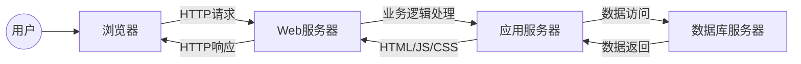

# 药店管理系统详细设计与具体代码实现

作者：禅与计算机程序设计艺术

## 1. 背景介绍

### 1.1 药店管理现状与挑战

随着我国医疗卫生体制改革的不断深入，医药分开、处方外流等政策的实施，零售药店作为医药服务的重要组成部分，其市场规模和发展潜力日益凸显。然而，传统的药店管理模式存在着诸多弊端，例如：

* **信息化程度低：**许多药店仍然依赖手工记账、人工盘点等方式，效率低下且容易出错。
* **库存管理混乱：**药品种类繁多、保质期短，传统的库存管理方式难以准确掌握库存情况，容易造成药品过期或积压。
* **销售统计分析滞后：**无法及时了解药品销售情况、客户消费习惯等信息，难以制定有效的营销策略。
* **服务质量参差不齐：**缺乏统一的服务标准和流程，服务质量难以保障。

### 1.2 药店管理系统概述

药店管理系统（Pharmacy Management System，PMS）是针对药店经营管理需求而开发的软件系统，旨在通过信息化手段提升药店运营效率、降低管理成本、提高服务质量。一个完善的药店管理系统应该具备以下功能：

* **进销存管理：**包括药品采购、入库、销售、退货、盘点等功能，实现药品的全程跟踪管理。
* **会员管理：**记录会员信息、消费记录、积分情况等，提供个性化的服务。
* **财务管理：**记录药店的收入、支出、利润等财务数据，生成财务报表。
* **报表统计：**提供各种统计报表，例如销售排行榜、库存预警、会员消费分析等，为经营决策提供数据支持。
* **系统设置：**包括用户管理、权限设置、系统参数配置等功能，保证系统的安全稳定运行。

## 2. 核心概念与联系

### 2.1 系统架构

药店管理系统通常采用B/S架构，即浏览器/服务器架构，用户可以通过浏览器访问系统，无需安装客户端软件。



### 2.2 主要模块

* **进销存管理模块：**
    * 采购管理：创建采购订单、审核采购订单、入库登记、采购退货等。
    * 销售管理：创建销售订单、收银结算、销售退货等。
    * 库存管理：药品入库、出库、盘点、调拨等。
* **会员管理模块：**
    * 会员登记：记录会员基本信息、联系方式、积分情况等。
    * 会员消费：记录会员消费记录、积分变动等。
    * 会员统计：会员消费统计、积分排名等。
* **财务管理模块：**
    * 收入管理：记录药店的销售收入、其他收入等。
    * 支出管理：记录药店的采购支出、运营成本等。
    * 利润统计：计算药店的毛利润、净利润等。
* **报表统计模块：**
    * 销售报表：药品销售排行榜、销售趋势分析等。
    * 库存报表：库存预警、库存周转率分析等。
    * 会员报表：会员消费分析、会员积分排名等。
* **系统设置模块：**
    * 用户管理：创建用户、分配角色、修改密码等。
    * 权限管理：为不同角色设置不同的系统权限。
    * 系统参数配置：配置系统运行参数，例如打印模板、数据库连接等。

### 2.3 模块间关系

各个模块之间相互关联，例如：

* 销售管理模块需要调用库存管理模块查询药品库存信息。
* 会员管理模块需要调用销售管理模块记录会员消费记录。
* 财务管理模块需要调用进销存管理模块获取财务数据。

## 3. 核心算法原理具体操作步骤

### 3.1 库存管理算法

#### 3.1.1 加权平均法

加权平均法是一种常用的库存计价方法，其计算公式如下：

```
加权平均单价 = (期初库存金额 + 本期购货金额) / (期初库存数量 + 本期购货数量)
```

例如，某药品期初库存数量为100盒，单价为10元/盒，本期购入50盒，单价为12元/盒，则该药品的加权平均单价为：

```
加权平均单价 = (100 * 10 + 50 * 12) / (100 + 50) = 10.67 元/盒
```

#### 3.1.2 先进先出法

先进先出法（FIFO）是指先购入的药品先销售，后购入的药品后销售。

例如，某药品期初库存100盒，单价10元/盒，本期购入50盒，单价12元/盒，销售80盒，则销售成本为：

```
销售成本 = 100 * 10 + (80 - 100) * 12 = 1040 元
```

### 3.2 销售统计算法

#### 3.2.1 销售额统计

销售额统计是指统计一段时间内药店的销售总额，其计算公式如下：

```
销售额 = ∑(销售数量 * 销售单价)
```

#### 3.2.2 销售排名统计

销售排名统计是指统计一段时间内各种药品的销售数量或销售额排名。

### 3.3 会员积分算法

#### 3.3.1 积分规则设置

药店可以根据自身情况设置会员积分规则，例如消费1元积1分、生日当天积分翻倍等。

#### 3.3.2 积分计算

会员每次消费后，系统会根据积分规则计算会员获得的积分，并将积分累积到会员账户中。

## 4. 数学模型和公式详细讲解举例说明

### 4.1 库存周转率

库存周转率是指一定时间内库存货物周转的次数，反映了企业库存管理的效率。其计算公式如下：

```
库存周转率 = 销售成本 / 平均库存
```

其中，平均库存 = (期初库存 + 期末库存) / 2。

例如，某药店2023年的销售成本为100万元，期初库存为20万元，期末库存为30万元，则该药店的库存周转率为：

```
平均库存 = (20 + 30) / 2 = 25 万元
库存周转率 = 100 / 25 = 4 次
```

### 4.2 毛利率

毛利率是指毛利占销售收入的百分比，反映了企业的盈利能力。其计算公式如下：

```
毛利率 = 毛利 / 销售收入 * 100%
```

其中，毛利 = 销售收入 - 销售成本。

例如，某药店2023年的销售收入为120万元，销售成本为100万元，则该药店的毛利率为：

```
毛利 = 120 - 100 = 20 万元
毛利率 = 20 / 120 * 100% = 16.67%
```

## 5. 项目实践：代码实例和详细解释说明

### 5.1 技术选型

* **开发语言：**Java
* **数据库：**MySQL
* **Web框架：**Spring Boot
* **前端框架：**Vue.js

### 5.2 代码实例

#### 5.2.1 药品实体类

```java
public class Drug {

    private Long id; // 药品ID
    private String name; // 药品名称
    private String specification; // 药品规格
    private String unit; // 药品单位
    private Double price; // 药品单价
    private Integer stock; // 药品库存
    // ...其他属性和方法
}
```

#### 5.2.2 药品入库接口

```java
@RestController
@RequestMapping("/api/drug")
public class DrugController {

    @Autowired
    private DrugService drugService;

    @PostMapping("/instock")
    public Result instock(@RequestBody DrugInstockRequest request) {
        // 校验参数
        // ...
        // 调用service层方法进行入库操作
        drugService.instock(request);
        return Result.success();
    }
}
```

### 5.3 代码解释

* `Drug`实体类用于存储药品信息。
* `DrugController`类用于处理药品相关的HTTP请求。
* `instock`接口用于处理药品入库请求，首先对参数进行校验，然后调用`drugService`的`instock`方法进行入库操作。

## 6. 实际应用场景

* **连锁药店：**可以实现多门店之间的数据共享和业务协同，提高管理效率。
* **单体药店：**可以提升药店的信息化管理水平，降低运营成本。
* **网上药店：**可以与电商平台对接，实现线上线下融合发展。

## 7. 总结：未来发展趋势与挑战

### 7.1 未来发展趋势

* **智能化：**利用人工智能技术，实现药品智能推荐、库存智能预警等功能。
* **移动化：**开发移动端应用程序，方便用户随时随地进行购药、咨询等操作。
* **数据化：**深度挖掘药店运营数据，为经营决策提供数据支持。

### 7.2 面临的挑战

* **数据安全：**药店管理系统存储着大量的患者隐私信息，需要加强数据安全防护。
* **系统稳定性：**药店管理系统需要保证7*24小时稳定运行，避免影响药店正常营业。
* **用户体验：**药店管理系统的用户界面需要简洁易用，方便药店员工操作。

## 8. 附录：常见问题与解答

### 8.1 如何选择合适的药店管理系统？

选择药店管理系统需要考虑以下因素：

* **功能需求：**不同的药店规模和经营模式，对系统功能的需求不同。
* **预算成本：**药店管理系统的价格差异较大，需要根据自身预算选择合适的系统。
* **售后服务：**选择售后服务完善的供应商，可以避免后顾之忧。

### 8.2 药店管理系统如何收费？

药店管理系统的收费模式主要有以下几种：

* **按年收费：**每年支付一定的软件使用费。
* **按模块收费：**根据使用的模块数量收费。
* **一次性买断：**一次性支付软件费用，永久使用。
