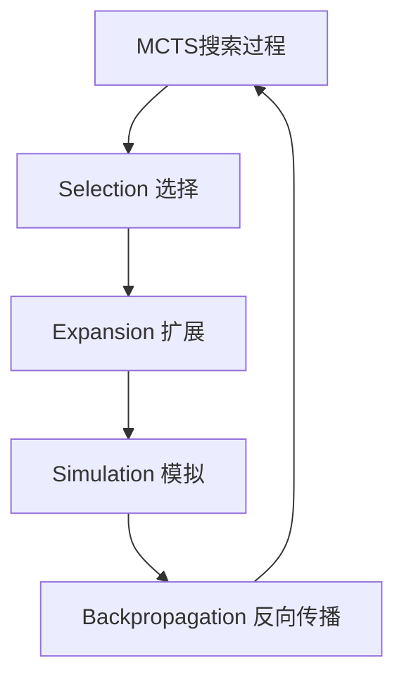
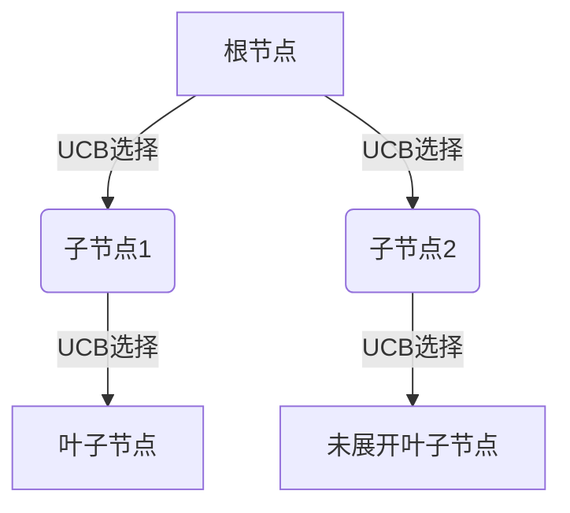
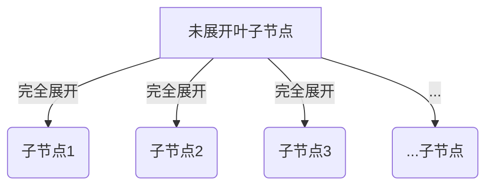
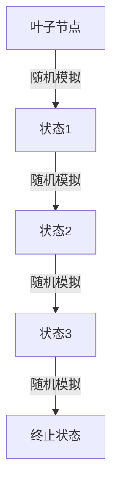
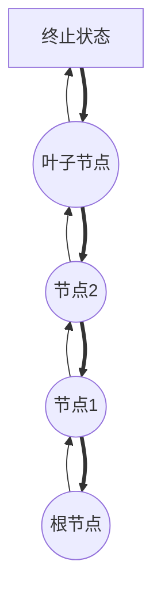

下面是关于"蒙特卡洛树搜索原理与代码实例讲解"的技术博客文章正文部分：

## 1.背景介绍

### 1.1 蒙特卡洛方法简介

蒙特卡洛方法是一种基于重复随机抽样来计算近似解的计算方法。它通过构建一些随机模型,利用概率统计理论对所关心的问题进行模拟,从而得到问题的数值解或者定性行为描述。

蒙特卡洛方法主要适用于求解数学上难以直接求解的复杂问题,特别是在研究多变量的复杂系统时,蒙特卡洛方法是一种非常有效的工具和手段。

### 1.2 蒙特卡洛树搜索的起源

蒙特卡洛树搜索(Monte Carlo Tree Search, MCTS)是一种有效的决策序列优化算法,最早由David Abramson在1987年的论文中提出。2006年,研究人员Coulom等人将其应用于计算机围棋程序,取得了巨大成功,从而引发了学术界和工业界对MCTS的广泛关注。

MCTS算法通过构建一个逐步展开的树形结构,对可能的移动或决策序列进行有策略的取样,从而发现局面中最优的行动。它结合了经典的树搜索算法和随机模拟方法的优点,在有限的计算资源下对庞大的决策树进行高效搜索。

### 1.3 蒙特卡洛树搜索的应用领域

由于MCTS算法能高效地处理具有庞大搜索空间的决策序列优化问题,因此它在人工智能领域有着广泛的应用,主要包括:

- 棋类游戏:国际象棋、围棋、跳棋等
- 机器人规划与控制
- 计算机辅助设计
- 组合优化问题
- 自动证明和定理证明
- 自然语言处理
- 基因测序
- ...

## 2.核心概念与联系

### 2.1 蒙特卡洛树搜索的核心思想

MCTS算法的核心思想是通过在树上逐步构建节点,并在树的叶节点处进行蒙特卡洛模拟评估,从而发现局面中的最优行动。具体来说,包含以下四个基本步骤:

1. **Selection(选择)**: 从根节点出发,沿着遍历/扩展策略选择节点,直到到达一个尚未完全展开的叶子节点。
2. **Expansion(扩展)**: 对选中的叶子节点进行展开,生成其子节点。
3. **Simulation(模拟)**: 从叶子节点出发,采用随机或者简单的策略对剩余的步骤进行模拟,直到到达终止状态。
4. **Backpropagation(反向传播)**: 利用模拟的结果更新当前叶子节点到根节点路径上的节点统计数据。

重复上述步骤,直到搜索时间用完或达到计算资源上限,最后选择根节点的子节点中评估值最高的行动作为输出。

### 2.2 蒙特卡洛树搜索的主要组成部分

MCTS算法主要包括以下四个核心组成部分:

1. **树的表示结构**
   - 通常使用基于向量或多维数组的平面化树数据结构
   - 高效地存储和访问节点状态和统计信息

2. **节点选择策略**
    - 用于在Selection阶段选择最优子节点
    - 典型的是UCB(Upper Confidence Bound)公式

3. **默认策略**
    - 用于在Simulation阶段进行随机模拟
    - 可以是简单的随机策略或启发式策略  

4. **蒙特卡洛树搜索的停止条件**
    - 最大迭代次数
    - 时间限制
    - 内存限制
    - 满足某个阈值条件
    
### 2.3 UCB公式

在节点选择策略中,常用的UCB(Upper Confidence Bound)公式如下:

$$
UCB = \overline{X_j} + C \sqrt{\frac{2\ln n}{n_j}}
$$

其中:
- $\overline{X_j}$是节点j的平均值(如胜率)
- $n_j$是访问节点j的次数 
- $n$是父节点的访问总次数
- $C$是一个调节exploitation和exploration的常数

UCB公式权衡了两个目标:
1) Exploitation(利用): 选择当前表现最好的节点
2) Exploration(探索): 适当探索其他节点,避免过早收敛

通过调节C值,可以控制exploitation和exploration之间的平衡。

## 3.核心算法原理具体操作步骤 

下面我们详细介绍MCTS算法的四个核心步骤:

### 3.1 Selection(选择)

Selection阶段的目标是从根节点出发,选择一条路径到达一个尚未完全展开的叶子节点。常用的选择策略有:

1. **UCB策略**
   - 根据UCB公式计算每个子节点的UCB值
   - 选择UCB值最大的子节点
   - 直到到达一个未展开的叶子节点

2. **基于快速启发式的策略**
   - 使用一个快速的启发式评估函数对子节点进行评分
   - 选择评分最高的子节点

### 3.2 Expansion(扩展)

在Expansion阶段,我们需要对选中的未展开叶子节点进行展开,生成其子节点。常见的做法包括:

1. **完全展开**
   - 生成所有可能的合法子节点

2. **部分展开**
   - 使用一个过滤函数筛选出部分子节点
   - 可以减少内存消耗,但可能丢失部分信息

3. **随机展开**
   - 随机选择一定数量的子节点进行展开
   - 可以进一步降低内存消耗

### 3.3 Simulation(模拟)

Simulation阶段是MCTS算法的核心部分。从选中的叶子节点出发,使用一个默认策略对剩余步骤进行模拟,直到到达终止状态。常见的默认策略有:

1. **随机模拟**
   - 在每一步中随机选择一个合法行动
   - 计算简单,但是质量较差

2. **启发式模拟** 
   - 使用一个启发式评估函数来指导模拟
   - 可以提高模拟质量,但计算开销较大

3. **基于规则的模拟**
   - 根据人工设计的规则或专家知识进行模拟
   - 需要领域知识,可能受到知识库的限制

4. **基于学习的模拟**
   - 使用监督学习或强化学习训练一个策略网络
   - 可以学习出较强的模拟策略,但需要大量数据

模拟结束后,我们获得了一个终止状态的评估值(如胜负)。

### 3.4 Backpropagation(反向传播)

在Backpropagation阶段,我们利用模拟的结果更新当前叶子节点到根节点路径上所有节点的统计数据,主要包括:

1. **访问次数(N)**
   - 每个节点的访问次数加1

2. **累积值(W)**
   - 根据模拟结果,更新每个节点的累积评估值
   - 如胜负结果、评估分数等

3. **平均值**
   - $\overline{X_j} = W_j / N_j$
   - 用于UCB公式计算

通过不断更新节点统计数据,MCTS逐步收敛到最优决策序列。

## 4.数学模型和公式详细讲解举例说明

在MCTS算法中,有几个重要的数学模型和公式,下面我们详细讲解并给出具体例子:

### 4.1 UCB公式

UCB(Upper Confidence Bound)公式用于在Selection阶段选择最优子节点,公式如下:

$$
UCB = \overline{X_j} + C \sqrt{\frac{2\ln n}{n_j}}
$$

其中:

- $\overline{X_j}$是节点j的平均评估值,如胜率
- $n_j$是访问节点j的次数
- $n$是父节点的访问总次数  
- $C$是一个调节exploitation和exploration的常数,通常取$\sqrt{2}$

UCB公式的目标是在exploitation(利用已有信息)和exploration(探索新信息)之间寻求平衡。

**例子**:
假设有一个节点的统计数据如下:
- 平均胜率$\overline{X_j} = 0.6$
- 访问次数$n_j = 20$ 
- 父节点访问总次数$n=100$
- $C=\sqrt{2}$

那么该节点的UCB值为:

$$
\begin{aligned}
UCB &= 0.6 + \sqrt{2} \sqrt{\frac{2\ln 100}{20}}\\
     &= 0.6 + 0.49\\
     &= 1.09
\end{aligned}
$$

我们会选择UCB值最大的子节点作为下一步扩展。

### 4.2 置信区间

在MCTS算法中,我们需要估计一个节点的真实评估值(如真实胜率)。由于只进行了有限次模拟,估计值会有统计误差。我们可以使用置信区间来量化这种不确定性。

对于节点j,其真实评估值$\mu_j$位于以下区间的置信度为100(1-α)%:

$$
\overline{X_j} - z_{\alpha/2} \frac{\sigma_j}{\sqrt{n_j}} \leq \mu_j \leq \overline{X_j} + z_{\alpha/2} \frac{\sigma_j}{\sqrt{n_j}}
$$

其中:
- $\overline{X_j}$是节点j的平均评估值
- $\sigma_j$是评估值的标准差
- $n_j$是访问节点j的次数
- $z_{\alpha/2}$是标准正态分布的上侧α/2分位数

**例子**:
假设对于一个二值评估问题(如胜负),节点j的统计数据为:
- $\overline{X_j} = 0.6$ 
- $n_j = 100$
- 置信度为95%,则$\alpha=0.05, z_{0.025}=1.96$
- 标准差$\sigma_j = \sqrt{\overline{X_j}(1-\overline{X_j})} = \sqrt{0.6 \times 0.4} = 0.49$

那么节点j的95%置信区间为:

$$
\begin{aligned}
0.6 - 1.96 \times \frac{0.49}{\sqrt{100}} \leq \mu_j &\leq 0.6 + 1.96 \times \frac{0.49}{\sqrt{100}}\\
0.51 \leq \mu_j &\leq 0.69
\end{aligned}
$$

这意味着以95%的置信度,该节点的真实胜率在0.51到0.69之间。

### 4.3 蒙特卡洛策略改进估计(Monte Carlo Policy Improvement Estimation)

在基于策略的MCTS算法中,我们需要估计一个新策略相对于旧策略的改进程度。这可以使用蒙特卡洛策略改进估计公式来计算:

$$
\rho = \frac{1}{N}\sum_{i=1}^{N}\left(G_i^{\pi'} - V^{\pi}(s_i)\right)
$$

其中:
- $\pi$是旧策略
- $\pi'$是