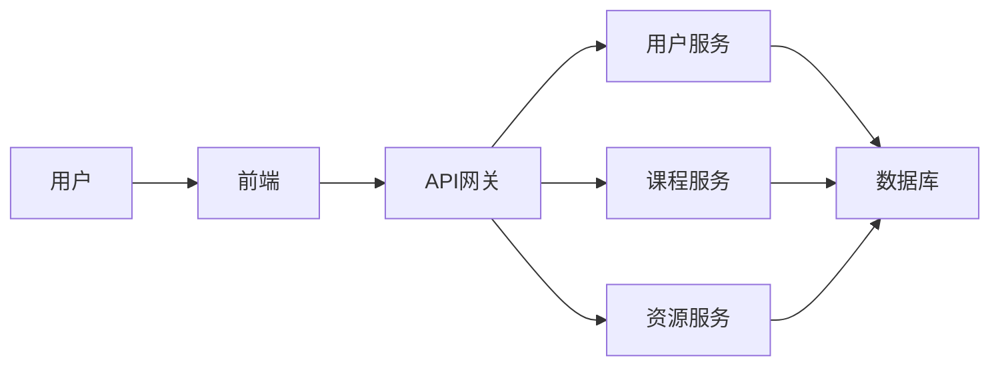
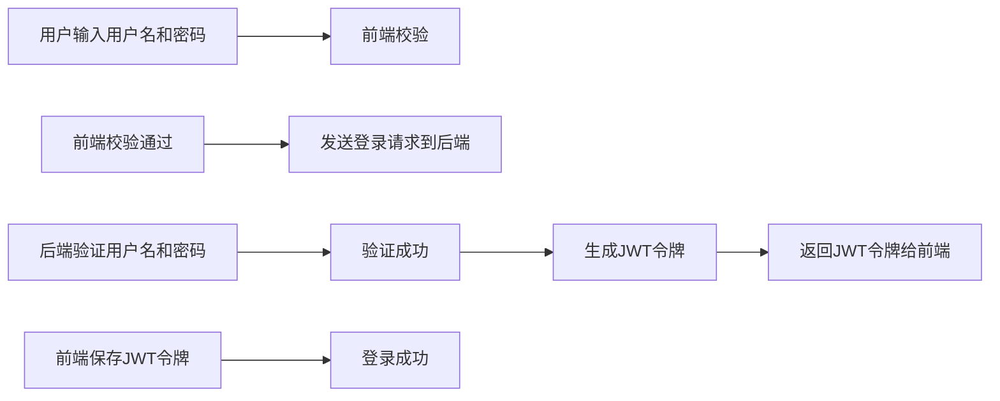

## 虚拟学校平台系统详细设计与具体代码实现

作者：禅与计算机程序设计艺术

## 1. 背景介绍

### 1.1  教育信息化的必然趋势

随着信息技术的飞速发展和互联网的普及，教育领域正在经历一场深刻的变革。传统的线下教育模式已经无法满足日益增长的个性化、多元化学习需求。虚拟学校平台作为一种新型教育模式，利用互联网技术构建高度仿真的虚拟学习环境，为学生提供随时随地、灵活便捷的学习体验，正逐渐成为未来教育发展的重要趋势。

### 1.2 虚拟学校平台的优势和价值

相比于传统教育模式，虚拟学校平台具有以下显著优势：

* **打破时空限制，实现随时随地学习：** 学生可以不受时间和地点的限制，随时随地登录平台进行学习，极大地方便了学习安排。
* **个性化学习体验，满足不同学生需求：** 平台可以根据学生的学习进度、兴趣爱好等，推荐个性化的学习内容和路径，实现因材施教。
* **丰富的学习资源，拓展学习视野：** 平台可以整合海量的优质教育资源，包括视频课程、电子书籍、在线测试等，为学生提供更加丰富多元的学习内容。
* **互动式学习体验，提升学习效率：** 平台提供在线讨论、答疑解惑、小组合作等功能，促进学生之间的互动交流，提高学习效率。

### 1.3 本文目标和结构

本文旨在探讨虚拟学校平台系统的设计与实现，详细介绍平台的架构设计、功能模块、技术选型、代码实现等方面内容，并结合实际案例进行分析，为广大教育工作者和技术爱好者提供参考和借鉴。

## 2. 核心概念与联系

### 2.1  系统架构

#### 2.1.1  整体架构

本系统采用前后端分离的架构设计，前端负责用户界面展示和交互，后端负责业务逻辑处理和数据存储。



#### 2.1.2  模块划分

* **用户模块：** 负责用户注册、登录、信息管理等功能。
* **课程模块：** 负责课程创建、管理、发布、学习等功能。
* **资源模块：** 负责教学资源的上传、管理、下载等功能。
* **考试模块：** 负责在线考试、成绩管理等功能。
* **互动模块：** 负责在线讨论、答疑解惑、小组合作等功能。

### 2.2  技术选型

#### 2.2.1  前端技术栈

* **React:**  用于构建用户界面，提供组件化、可复用、高性能的开发体验。
* **Redux:**  用于状态管理，实现数据流的单向流动，方便调试和维护。
* **Ant Design:**  提供丰富的UI组件库，加速开发效率。

#### 2.2.2  后端技术栈

* **Spring Boot:**  用于快速构建Web应用程序，提供自动配置、开箱即用等特性。
* **Spring Cloud:**  用于构建微服务架构，实现服务治理、负载均衡等功能。
* **MySQL:**  用于数据存储，提供高性能、可靠性、易用性等特点。
* **Redis:**  用于缓存数据，提高系统性能。

## 3. 核心算法原理具体操作步骤

### 3.1  用户登录认证流程

#### 3.1.1  流程图



#### 3.1.2  具体步骤

1. 用户在登录页面输入用户名和密码。
2. 前端对用户输入进行校验，例如用户名和密码不能为空、密码长度不能小于6位等。
3. 校验通过后，前端将用户名和密码发送到后端进行验证。
4. 后端接收到登录请求后，根据用户名查询数据库，验证密码是否正确。
5. 验证通过后，后端生成JWT令牌，并将令牌返回给前端。
6. 前端接收到JWT令牌后，将其保存在本地存储中，例如 localStorage 或 sessionStorage。
7. 后续请求中，前端将JWT令牌添加到请求头中，用于身份验证。

### 3.2  课程推荐算法

#### 3.2.1  算法原理

本系统采用基于内容的推荐算法，根据用户的学习历史、兴趣爱好等信息，推荐与其相关的课程。

#### 3.2.2  具体步骤

1. 收集用户的学习历史数据，例如已学习课程、收藏课程、评分记录等。
2. 对课程进行特征提取，例如课程名称、课程简介、课程标签等。
3. 计算用户和课程之间的相似度，例如使用余弦相似度算法。
4. 根据相似度排名，推荐与用户最相似的课程。

## 4. 数学模型和公式详细讲解举例说明

### 4.1  余弦相似度算法

#### 4.1.1  公式

$$
\cos(\theta) = \frac{\sum_{i=1}^{n} A_i \times B_i}{\sqrt{\sum_{i=1}^{n} A_i^2} \times \sqrt{\sum_{i=1}^{n} B_i^2}}
$$

其中：

* $A$ 和 $B$ 分别表示用户和课程的特征向量。
* $n$ 表示特征维度。
* $A_i$ 和 $B_i$ 分别表示用户和课程在第 $i$ 个特征上的取值。

#### 4.1.2  举例说明

假设用户 $A$ 的学习历史数据为：

* 已学习课程：数学、英语、物理
* 收藏课程：化学、生物

课程 $B$ 的特征为：

* 课程名称：化学
* 课程简介：介绍化学的基本概念和原理
* 课程标签：理科、高中

则用户 $A$ 和课程 $B$ 的特征向量分别为：

```
A = [1, 1, 1, 1, 1]
B = [1, 1, 0, 0, 0]
```

计算用户 $A$ 和课程 $B$ 的余弦相似度：

```
cos(A, B) = (1 * 1 + 1 * 1 + 1 * 0 + 1 * 0 + 1 * 0) / (sqrt(1^2 + 1^2 + 1^2 + 1^2 + 1^2) * sqrt(1^2 + 1^2 + 0^2 + 0^2 + 0^2))
         = 2 / (sqrt(5) * sqrt(2))
         = 0.8944
```

## 5. 项目实践：代码实例和详细解释说明

### 5.1  用户登录接口实现

```java
@RestController
@RequestMapping("/api/user")
public class UserController {

    @Autowired
    private UserService userService;

    @PostMapping("/login")
    public ResponseEntity<String> login(@RequestBody UserLoginRequest request) {
        // 校验用户名和密码
        if (StringUtils.isEmpty(request.getUsername()) || StringUtils.isEmpty(request.getPassword())) {
            return ResponseEntity.badRequest().body("用户名或密码不能为空");
        }
        // 调用service层进行登录认证
        String token = userService.login(request.getUsername(), request.getPassword());
        // 返回JWT令牌
        return ResponseEntity.ok(token);
    }
}
```

### 5.2  课程推荐接口实现

```java
@RestController
@RequestMapping("/api/course")
public class CourseController {

    @Autowired
    private CourseService courseService;

    @GetMapping("/recommend")
    public ResponseEntity<List<Course>> recommend(@RequestParam String userId) {
        // 调用service层获取推荐课程列表
        List<Course> courses = courseService.recommendCourses(userId);
        // 返回推荐课程列表
        return ResponseEntity.ok(courses);
    }
}
```

## 6. 实际应用场景

### 6.1  在线教育平台

虚拟学校平台可以应用于在线教育平台，为用户提供更加便捷、高效的学习体验。

### 6.2  企业培训系统

企业可以使用虚拟学校平台构建内部培训系统，对员工进行技能培训和知识更新。

### 6.3  学校教育

学校可以利用虚拟学校平台开展在线教学、翻转课堂等新型教学模式，提高教学质量和效率。

## 7. 总结：未来发展趋势与挑战

### 7.1  发展趋势

* **个性化学习：** 虚拟学校平台将更加注重个性化学习体验，根据学生的学习特点和需求，提供定制化的学习内容和路径。
* **智能化教学：** 人工智能技术将被广泛应用于虚拟学校平台，实现智能化的教学辅助、评估和反馈。
* **虚拟现实技术：** 虚拟现实技术将为虚拟学校平台带来更加沉浸式的学习体验，让学生身临其境地学习知识。

### 7.2  挑战

* **技术挑战：** 虚拟学校平台需要解决海量数据存储、高并发访问、数据安全等技术难题。
* **内容建设：** 优质的教学资源是虚拟学校平台的核心竞争力，需要不断丰富和完善平台的教学内容。
* **师资队伍：** 虚拟学校平台需要一支高素质的师资队伍，能够熟练运用信息技术开展在线教学。

## 8. 附录：常见问题与解答

### 8.1  如何注册账号？

用户可以通过访问平台首页，点击“注册”按钮，填写相关信息进行注册。

### 8.2  忘记密码怎么办？

用户可以通过点击登录页面上的“忘记密码”链接，按照提示进行密码重置。

### 8.3  如何联系客服？

用户可以通过平台上的“联系我们”页面，获取客服联系方式。
