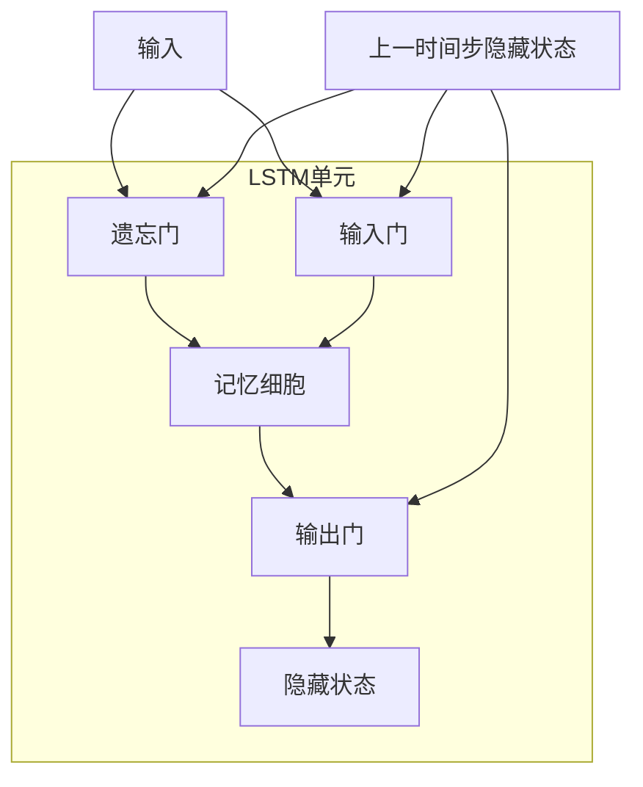

# 解锁时间序列：LSTM的魔力

## 1.背景介绍

### 1.1 时间序列数据的重要性

在当今数据驱动的世界中,时间序列数据无处不在。从股票市场的价格波动到天气预报,从用户行为模式到网络流量监控,时间序列数据都扮演着关键角色。能够有效地分析和建模时间序列数据,对于各个领域的决策者来说都是一项极其宝贵的技能。

### 1.2 时间序列数据的挑战

然而,时间序列数据具有其固有的复杂性和挑战性:

- **序列依赖性**:时间序列数据中的观测值通常依赖于过去的观测值,这种序列依赖性使得建模变得更加困难。
- **噪声和缺失值**:现实世界的时间序列数据往往包含噪声和缺失值,这需要robust的模型来处理。
- **多变量输入**:许多实际应用需要同时考虑多个相关变量的时间序列数据。
- **长期依赖关系**:某些时间序列数据中存在长期的依赖模式,需要模型能够捕捉这种长期依赖关系。

### 1.3 LSTM的出现

为了应对时间序列数据的挑战,研究人员不断探索新的建模方法。在这一过程中,Long Short-Term Memory(LSTM)神经网络凭借其独特的架构设计脱颖而出,成为分析时间序列数据的有力武器。

## 2.核心概念与联系  

### 2.1 递归神经网络(RNN)

要理解LSTM,我们首先需要了解递归神经网络(Recurrent Neural Network,RNN)的基本概念。RNN是一种特殊类型的人工神经网络,它被设计用于处理序列数据,如自然语言文本、语音或时间序列数据。

与传统的前馈神经网络不同,RNN在隐藏层之间引入了循环连接,使得网络能够捕捉序列数据中的动态行为和时间模式。具体来说,在处理序列数据时,RNN会逐个处理序列中的每个元素,并将当前元素的信息与来自前一时间步的隐藏状态相结合,从而学习序列模式。

然而,传统的RNN在处理长序列时存在梯度消失或梯度爆炸的问题,这使得它难以有效地捕捉长期依赖关系。为了解决这一问题,LSTM被提出并广为使用。

### 2.2 LSTM的核心思想

LSTM是RNN的一种改进版本,它通过引入一种称为"门控机制"的特殊结构,有效地解决了RNN在捕捉长期依赖关系方面的困难。

LSTM的核心思想是使用专门设计的记忆细胞(memory cell)和门控单元(gate units)来控制信息的流动。记忆细胞充当了一种信息高速公路,能够在整个序列中传递相关信息,而门控单元则决定了什么信息应该被存储在记忆细胞中、什么信息应该被读取、以及什么信息应该被遗忘。

这种独特的架构使得LSTM能够更好地捕捉长期依赖关系,同时也避免了梯度消失或梯度爆炸的问题,从而在处理时间序列数据时表现出色。

### 2.3 LSTM与其他序列模型的关系

除了LSTM之外,还有其他一些常用的序列模型,如GRU(Gated Recurrent Unit)、注意力机制(Attention Mechanism)等。

- **GRU**是LSTM的一种变体,它采用了类似但更简单的门控机制,在某些任务上的表现可能与LSTM相当,但计算复杂度更低。
- **注意力机制**通过自适应地为序列中的不同位置赋予不同的权重,使模型能够更好地关注重要的信息,从而提高了序列建模的性能。

虽然这些模型各有优缺点,但LSTM由于其强大的建模能力和广泛的应用,被公认为是分析时间序列数据的重要工具之一。

## 3.核心算法原理具体操作步骤

### 3.1 LSTM的网络架构

LSTM的核心组成部分包括:

- **记忆细胞(Memory Cell)**: 一种专门设计的单元,用于存储和传递整个序列的信息。
- **遗忘门(Forget Gate)**: 控制从上一时间步的记忆细胞中遗忘哪些信息。
- **输入门(Input Gate)**: 控制从当前输入和上一隐藏状态中获取哪些新信息,并更新记忆细胞的状态。
- **输出门(Output Gate)**: 控制从当前记忆细胞中输出哪些信息,作为当前时间步的隐藏状态。

下图展示了LSTM的基本架构:

### 3.2 LSTM的前向传播过程

LSTM的前向传播过程可以分为以下几个步骤:

1. **遗忘门**: 根据当前输入$x_t$和上一时间步的隐藏状态$h_{t-1}$,计算遗忘门的激活值$f_t$,决定从上一时间步的记忆细胞$c_{t-1}$中遗忘哪些信息:

$$f_t = \sigma(W_f \cdot [h_{t-1}, x_t] + b_f)$$

其中,$\sigma$是sigmoid激活函数,$W_f$和$b_f$是遗忘门的权重和偏置参数。

2. **输入门**: 计算输入门的激活值$i_t$和候选记忆细胞$\tilde{c}_t$,以决定将哪些新信息存储在当前时间步的记忆细胞$c_t$中:

$$i_t = \sigma(W_i \cdot [h_{t-1}, x_t] + b_i)$$
$$\tilde{c}_t = \tanh(W_c \cdot [h_{t-1}, x_t] + b_c)$$

3. **记忆细胞更新**: 根据遗忘门$f_t$、输入门$i_t$和候选记忆细胞$\tilde{c}_t$,更新当前时间步的记忆细胞$c_t$:

$$c_t = f_t \odot c_{t-1} + i_t \odot \tilde{c}_t$$

其中,$\odot$表示元素级别的向量乘积。

4. **输出门**: 计算输出门的激活值$o_t$,并基于当前记忆细胞$c_t$和输出门$o_t$,计算当前时间步的隐藏状态$h_t$:

$$o_t = \sigma(W_o \cdot [h_{t-1}, x_t] + b_o)$$
$$h_t = o_t \odot \tanh(c_t)$$

通过上述步骤,LSTM能够根据当前输入和过去的隐藏状态,选择性地遗忘不相关信息、存储新信息并输出相关隐藏状态,从而有效地捕捉序列数据中的长期依赖关系。

### 3.3 LSTM的反向传播和参数更新

与其他神经网络类似,LSTM的训练也需要通过反向传播算法来更新网络参数。由于LSTM的门控机制和记忆细胞的引入,其反向传播过程相对复杂一些,需要计算每个门和记忆细胞的梯度。

具体来说,在反向传播过程中,我们需要计算损失函数相对于每个门、记忆细胞和权重的梯度,然后使用优化算法(如随机梯度下降)来更新这些参数。这个过程需要利用链式法则和动态规划的思想,以有效地计算梯度。

由于计算过程较为复杂,本文不再赘述细节。读者可以参考相关资料进一步了解LSTM的反向传播算法。

## 4.数学模型和公式详细讲解举例说明

### 4.1 LSTM的数学表示

为了更好地理解LSTM的工作原理,我们可以使用矩阵和向量的形式来表示LSTM的前向传播过程。

假设我们有一个长度为$T$的序列$\{x_1, x_2, \ldots, x_T\}$,其中$x_t \in \mathbb{R}^n$表示第$t$个时间步的输入向量。LSTM的隐藏状态维度设为$m$,记忆细胞的维度也为$m$。

在时间步$t$,LSTM的计算过程可以表示为:

$$\begin{aligned}
f_t &= \sigma(W_f x_t + U_f h_{t-1} + b_f) \\
i_t &= \sigma(W_i x_t + U_i h_{t-1} + b_i) \\
o_t &= \sigma(W_o x_t + U_o h_{t-1} + b_o) \\
\tilde{c}_t &= \tanh(W_c x_t + U_c h_{t-1} + b_c) \\
c_t &= f_t \odot c_{t-1} + i_t \odot \tilde{c}_t \\
h_t &= o_t \odot \tanh(c_t)
\end{aligned}$$

其中:

- $f_t, i_t, o_t \in \mathbb{R}^m$分别表示遗忘门、输入门和输出门的激活值向量。
- $c_t \in \mathbb{R}^m$表示当前时间步的记忆细胞状态向量。
- $\tilde{c}_t \in \mathbb{R}^m$表示候选记忆细胞状态向量。
- $h_t \in \mathbb{R}^m$表示当前时间步的隐藏状态向量。
- $W_\ast, U_\ast, b_\ast$分别表示不同门或候选记忆细胞的权重矩阵和偏置向量。

通过上述公式,我们可以清楚地看到LSTM如何利用门控机制和记忆细胞来控制信息的流动,从而捕捉序列数据中的长期依赖关系。

### 4.2 实例:股票价格预测

为了更好地理解LSTM的工作原理,让我们来看一个实际的例子:使用LSTM预测股票价格。

假设我们有一个包含股票历史价格数据的序列$\{p_1, p_2, \ldots, p_T\}$,其中$p_t$表示第$t$个时间步的股票价格。我们的目标是基于过去的价格数据,预测未来一段时间内的股票价格。

在这个例子中,我们可以将股票价格序列$\{p_1, p_2, \ldots, p_T\}$作为LSTM的输入$\{x_1, x_2, \ldots, x_T\}$,其中$x_t = p_t$。然后,我们可以训练LSTM模型,使其学习从历史价格数据中捕捉价格变动的模式和趋势。

在训练过程中,我们需要定义一个合适的损失函数,例如均方误差(Mean Squared Error,MSE)或平均绝对误差(Mean Absolute Error,MAE),来衡量模型预测和实际价格之间的差异。通过反向传播算法和优化器(如Adam或RMSProp),我们可以不断更新LSTM的参数,使得模型在训练数据上的损失函数值最小化。

训练完成后,我们可以使用训练好的LSTM模型对未来的股票价格进行预测。具体来说,我们将历史价格序列$\{p_1, p_2, \ldots, p_T\}$输入到LSTM模型中,获得最后一个时间步的隐藏状态$h_T$。然后,我们可以将$h_T$作为初始隐藏状态,对未来的时间步进行预测,得到预测的价格序列$\{\hat{p}_{T+1}, \hat{p}_{T+2}, \ldots, \hat{p}_{T+k}\}$,其中$k$是我们希望预测的未来时间步数。

通过这个例子,我们可以看到LSTM在处理时间序列数据时的强大能力。当然,在实际应用中,我们可能还需要考虑其他因素,如数据预处理、特征工程、模型调优等,以获得更好的预测性能。

## 5.项目实践:代码实例和详细解释说明

为了更好地理解LSTM的工作原理和实现细节,让我们来看一个使用Python和PyTorch实现LSTM的示例代码。在这个示例中,我们将构建一个LSTM模型来预测正弦波序列。

### 5.1 准备数