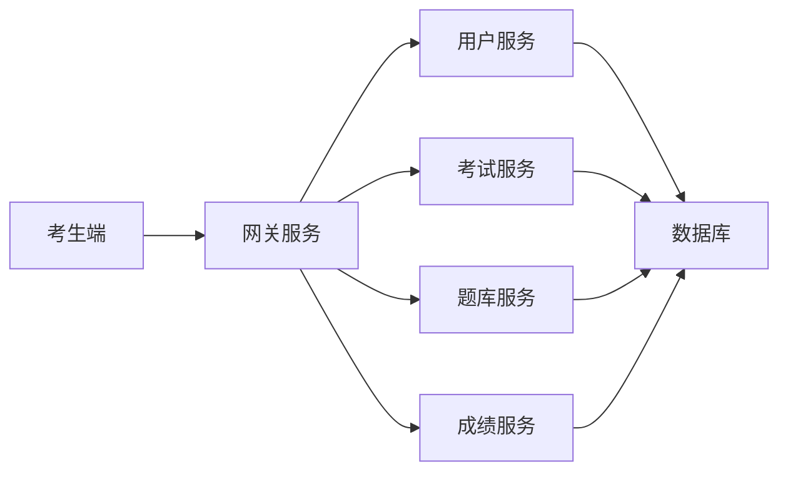

# 计算机等级考试系统设计与实现

作者：禅与计算机程序设计艺术

## 1. 背景介绍

### 1.1 计算机等级考试概述

计算机等级考试作为一项全国性的计算机水平考试，旨在评估考生的计算机应用能力，推动计算机教育和应用的发展。 随着信息技术的飞速发展，计算机等级考试在人才选拔、职业发展等方面扮演着越来越重要的角色。

### 1.2 现有系统存在的问题

传统的计算机等级考试系统在设计和实现上存在一些不足，例如：

* **系统架构老旧**:  许多系统采用传统的C/S架构，难以满足日益增长的用户需求和海量数据处理要求。
* **安全性不足**:  部分系统缺乏完善的安全机制，容易遭受攻击和数据泄露的风险。
* **用户体验欠佳**:  考试界面设计不友好，操作流程复杂，影响考生考试体验。
* **缺乏数据分析**:  系统无法对考试数据进行深度挖掘和分析，难以为考试改革和教育决策提供数据支撑。

### 1.3 新一代系统的设计目标

为了解决上述问题，新一代计算机等级考试系统的设计目标如下：

* **高性能**:  采用先进的技术架构，支持高并发用户访问和海量数据处理。
* **高安全性**:  构建完善的安全体系，保障系统和数据安全。
* **高可用性**:  实现系统的高可用性，确保考试顺利进行。
* **易用性**:  提供友好、便捷的操作界面，提升用户体验。
* **可扩展性**:  系统设计灵活，易于扩展和维护。
* **数据驱动**:  对考试数据进行深度挖掘和分析，为考试改革和教育决策提供数据支撑。

## 2. 核心概念与联系

### 2.1 系统架构

新一代计算机等级考试系统采用**微服务架构**，将系统拆分为多个独立的服务模块，每个模块负责特定的功能。服务之间通过轻量级的 API 进行通信，实现松耦合和高内聚。

**微服务架构的优势：**

* **独立部署**:  每个服务可以独立部署和扩展，提高系统的灵活性和可维护性。
* **技术异构**:  不同的服务可以使用不同的技术栈，方便技术选型和升级。
* **故障隔离**:  单个服务的故障不会影响其他服务的正常运行，提高系统的稳定性。

**系统架构图：**



### 2.2 核心模块

* **用户服务**:  负责用户注册、登录、信息管理等功能。
* **考试服务**:  负责考试安排、考场管理、考试过程控制等功能。
* **题库服务**:  负责试题的存储、管理、组卷等功能。
* **成绩服务**:  负责成绩的计算、查询、统计分析等功能。
* **网关服务**:  作为系统的统一入口，负责请求路由、身份认证、限流熔断等功能。

### 2.3 技术选型

* **编程语言**:  Java
* **数据库**:  MySQL
* **缓存**:  Redis
* **消息队列**:  Kafka
* **Web 框架**:  Spring Boot
* **前端框架**:  Vue.js

## 3. 核心算法原理具体操作步骤

### 3.1 试题推荐算法

为了提高考试的效率和公平性，系统采用**基于内容的推荐算法**为考生推荐个性化的试题。

**算法原理**:

1. 对每道试题进行关键词提取和知识点标注。
2. 根据考生的历史答题记录和知识点掌握情况，构建考生的用户画像。
3. 计算考生与试题之间的相似度，推荐相似度高的试题。

**操作步骤**:

1. **试题预处理**:  对每道试题进行分词、词干提取、停用词过滤等操作，提取关键词。
2. **知识点标注**:  为每道试题标注相应的知识点。
3. **用户画像构建**:  根据考生的历史答题记录和知识点掌握情况，构建考生的用户画像。
4. **相似度计算**:  使用余弦相似度等算法计算考生与试题之间的相似度。
5. **试题推荐**:  根据相似度排名，推荐相似度高的试题。

### 3.2 防作弊机制

为了防止作弊行为，系统采用多种防作弊机制，例如：

* **身份验证**:  采用人脸识别技术验证考生身份。
* **随机组卷**:  每次考试从题库中随机抽取试题组卷，防止考生提前获取试题。
* **监控录像**:  对考场进行实时监控录像，记录考生考试行为。
* **数据分析**:  对考试数据进行分析，识别异常行为。

## 4. 数学模型和公式详细讲解举例说明

### 4.1 余弦相似度

**公式**:

$$
similarity(A,B) = \frac{A \cdot B}{||A|| \cdot ||B||}
$$

**解释**:

* $A$ 和 $B$ 分别表示两个向量。
* $A \cdot B$ 表示两个向量的点积。
* $||A||$ 和 $||B||$ 分别表示两个向量的模长。

**举例**:

假设有两个向量 $A = (1, 2, 3)$ 和 $B = (4, 5, 6)$，计算它们的余弦相似度。

```
A · B = 1 * 4 + 2 * 5 + 3 * 6 = 32
||A|| = √(1² + 2² + 3²) = √14
||B|| = √(4² + 5² + 6²) = √77

similarity(A,B) = 32 / (√14 * √77) ≈ 0.97
```

### 4.2 逻辑回归模型

**公式**:

$$
P(Y=1|X) = \frac{1}{1 + e^{-(w^T X + b)}}
$$

**解释**:

* $P(Y=1|X)$ 表示在给定特征 $X$ 的情况下，样本属于类别 1 的概率。
* $w$ 表示权重向量。
* $b$ 表示偏置项。
* $X$ 表示特征向量。

**举例**:

假设要根据考生的历史成绩预测其是否能通过本次考试，可以使用逻辑回归模型。

* $Y$ 表示是否通过考试，取值为 0 或 1。
* $X$ 表示考生的历史成绩，例如历次考试的平均分、最高分等。

通过训练逻辑回归模型，可以得到权重向量 $w$ 和偏置项 $b$。然后，对于一个新的考生，输入其历史成绩 $X$，就可以预测其通过考试的概率 $P(Y=1|X)$。

## 5. 项目实践：代码实例和详细解释说明

### 5.1 用户登录接口

```java
@RestController
@RequestMapping("/api/user")
public class UserController {

    @Autowired
    private UserService userService;

    @PostMapping("/login")
    public Result<String> login(@RequestBody UserLoginRequest request) {
        // 参数校验
        if (StringUtils.isBlank(request.getUsername()) || StringUtils.isBlank(request.getPassword())) {
            return Result.fail("用户名或密码不能为空");
        }

        // 用户名密码验证
        User user = userService.findByUsername(request.getUsername());
        if (user == null || !passwordEncoder.matches(request.getPassword(), user.getPassword())) {
            return Result.fail("用户名或密码错误");
        }

        // 生成 JWT token
        String token = jwtUtil.generateToken(user.getId());

        return Result.success(token);
    }
}
```

**代码解释**:

* `@RestController` 注解表示该类是一个 RESTful 风格的控制器。
* `@RequestMapping("/api/user")` 注解表示该控制器处理 `/api/user` 路径下的请求。
* `@PostMapping("/login")` 注解表示该方法处理 `/api/user/login` 路径下的 POST 请求。
* `@RequestBody` 注解表示将请求体中的 JSON 数据绑定到 `UserLoginRequest` 对象。
* `userService.findByUsername()` 方法根据用户名查询用户信息。
* `passwordEncoder.matches()` 方法验证密码是否正确。
* `jwtUtil.generateToken()` 方法生成 JWT token。

### 5.2 随机组卷接口

```java
@RestController
@RequestMapping("/api/exam")
public class ExamController {

    @Autowired
    private ExamService examService;

    @GetMapping("/generatePaper")
    public Result<List<Question>> generatePaper(@RequestParam Long examId) {
        // 参数校验
        if (examId == null) {
            return Result.fail("考试 ID 不能为空");
        }

        // 获取考试信息
        Exam exam = examService.findById(examId);
        if (exam == null) {
            return Result.fail("考试不存在");
        }

        // 随机组卷
        List<Question> questions = examService.generatePaper(exam);

        return Result.success(questions);
    }
}
```

**代码解释**:

* `examService.findById()` 方法根据考试 ID 查询考试信息。
* `examService.generatePaper()` 方法根据考试信息随机组卷。

## 6. 实际应用场景

### 6.1 高校计算机等级考试

高校计算机等级考试是面向全国高校学生的计算机水平考试，可以利用该系统实现考试的报名、缴费、考场安排、在线考试、成绩查询等功能。

### 6.2 企业招聘考试

企业在招聘 IT 人才时，可以利用该系统进行在线笔试，评估应聘者的计算机应用能力。

### 6.3 职业技能培训

职业技能培训机构可以利用该系统进行在线考试和评估，帮助学员提升计算机技能。

## 7. 总结：未来发展趋势与挑战

### 7.1 未来发展趋势

* **人工智能化**:  利用人工智能技术实现智能组卷、自动阅卷、个性化学习等功能。
* **区块链技术**:  利用区块链技术保障考试数据的安全性和可信度。
* **虚拟现实技术**:  利用虚拟现实技术打造沉浸式的考试体验。

### 7.2 面临的挑战

* **技术挑战**:  需要不断探索和应用新的技术，以满足不断变化的用户需求。
* **安全挑战**:  需要构建更加完善的安全体系，应对日益复杂的网络攻击。
* **数据挑战**:  需要有效地管理和利用海量的考试数据，为考试改革和教育决策提供数据支撑。

## 8. 附录：常见问题与解答

### 8.1 如何报名参加考试？

考生可以在系统官网注册账号，并选择相应的考试进行报名。

### 8.2 考试费用是多少？

考试费用根据不同的考试等级和地区而有所不同，具体费用可以在系统官网查询。

### 8.3 考试成绩什么时候公布？

考试成绩一般在考试结束后一个月内公布，考生可以在系统官网查询成绩。
