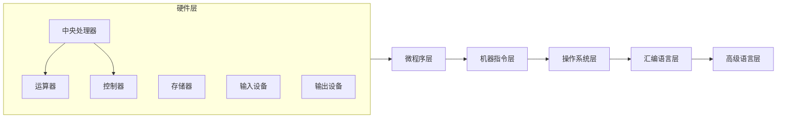

# 计算机组成原理网站详细设计与具体代码实现

作者：禅与计算机程序设计艺术

## 1. 背景介绍

### 1.1 计算机组成原理学习的必要性

计算机组成原理是计算机科学与技术专业以及电子信息类相关专业的一门核心基础课程，它主要讲解计算机系统的硬件组成、工作原理以及软件与硬件之间的交互关系。学习计算机组成原理，对于深入理解计算机系统的工作机制、提高软件开发能力、进行计算机系统维护和故障诊断等方面都具有重要意义。

### 1.2  传统学习方式的局限性

传统的计算机组成原理学习方式主要依赖于教材、课堂讲授和实验课程。然而，这些方式存在一些局限性：

* **内容枯燥抽象**: 计算机组成原理涉及大量的硬件结构、工作原理和指令系统等知识，对于初学者来说比较抽象和难以理解。
* **缺乏实践环节**:  传统的实验课程通常只能进行一些简单的模拟实验，无法让学生真正动手操作和调试真实的硬件设备。
* **学习资源有限**:  学生获取学习资源的途径主要局限于教材和课堂笔记，缺乏更加丰富和生动的学习资料。

### 1.3  计算机组成原理网站的优势

为了克服传统学习方式的局限性，开发一个交互式、可视化、易于理解的计算机组成原理网站显得尤为重要。该网站将提供以下优势：

* **生动形象**:  通过图形化界面、动画演示和交互式操作等方式，将抽象的硬件结构和工作原理形象地展示出来，提高学生的学习兴趣和效率。
* **实践操作**:  提供虚拟仿真实验平台，让学生可以在虚拟环境中模拟真实的硬件操作，加深对知识的理解和掌握。
* **资源丰富**:  整合丰富的学习资源，包括文字资料、图片、视频、习题等，满足学生的多样化学习需求。

## 2. 核心概念与联系

### 2.1 计算机系统的层次结构

为了更好地理解计算机系统，通常采用层次化的方式来描述其组成结构。从底层到高层，计算机系统可以分为以下几个层次：

* **硬件层**: 包括中央处理器(CPU)、存储器、输入输出设备等物理组件。
* **微程序层**:  CPU内部使用的一套指令集，用于解释和执行机器指令。
* **机器指令层**:  计算机能够直接识别和执行的指令集，也称为机器语言。
* **操作系统层**:  管理和控制计算机硬件资源，为应用程序提供运行环境。
* **汇编语言层**:  使用符号化的助记符代替机器指令，便于程序员编写和阅读程序。
* **高级语言层**:  更加接近人类自然语言的编程语言，例如C、Java、Python等。

### 2.2  五大核心部件

计算机系统由五大核心部件组成，它们分别是：

* **运算器**:  负责执行算术运算和逻辑运算。
* **控制器**:  负责控制各个部件协调工作。
* **存储器**:  用于存储程序和数据。
* **输入设备**:  用于接收用户输入的信息，例如键盘、鼠标等。
* **输出设备**:  用于向用户输出信息，例如显示器、打印机等。

### 2.3  核心概念之间的联系

这五大核心部件相互协作，共同完成计算机系统的各项功能。控制器根据程序指令从存储器中读取指令和数据，并将其传递给运算器进行处理。运算器完成运算后，将结果存储回存储器中。输入设备将外部信息输入到计算机系统中，输出设备将计算机处理后的结果输出给用户。




## 3. 核心算法原理具体操作步骤

### 3.1  指令执行过程

计算机程序是由一系列指令组成的，CPU 负责逐条执行这些指令。指令的执行过程可以分为以下几个步骤：

1. **取指**:  CPU 从存储器中读取下一条要执行的指令。
2. **译码**:  CPU 对指令进行解码，确定指令的操作码和操作数。
3. **执行**:  CPU 根据指令的操作码执行相应的操作。
4. **访存**:  如果指令涉及到内存操作，CPU 需要访问内存读取或写入数据。
5. **写回**:  将指令执行的结果写回存储器或者寄存器中。

### 3.2  算术逻辑单元(ALU)的工作原理

算术逻辑单元(ALU)是运算器的核心部件，负责执行算术运算和逻辑运算。ALU 的基本结构包括：

* **操作数寄存器**:  用于存储参与运算的操作数。
* **累加器**:  用于存储运算的中间结果和最终结果。
* **状态寄存器**:  用于存储运算过程中的状态信息，例如进位标志、零标志等。
* **逻辑运算单元**:  执行逻辑运算，例如与、或、非、异或等。
* **算术运算单元**:  执行算术运算，例如加法、减法、乘法、除法等。

ALU 的工作过程如下：

1.  控制器将操作数从寄存器或内存中读取到操作数寄存器中。
2.  控制器根据指令的操作码选择相应的运算单元。
3.  选定的运算单元对操作数进行运算，并将结果存储到累加器中。
4.  控制器将累加器中的结果写回寄存器或内存中。

### 3.3  存储器的寻址方式

存储器是计算机系统中用于存储程序和数据的部件。为了能够快速准确地访问存储器中的数据，CPU 使用地址来标识存储单元。常见的存储器寻址方式包括：

* **立即寻址**:  操作数直接包含在指令中。
* **直接寻址**:  指令中包含操作数的地址。
* **间接寻址**:  指令中包含一个地址，该地址指向另一个地址，而另一个地址才指向操作数。
* **寄存器寻址**:  操作数存储在 CPU 的寄存器中。
* **寄存器间接寻址**:  指令中包含一个寄存器地址，该寄存器中存储着操作数的地址。

## 4. 数学模型和公式详细讲解举例说明

### 4.1  二进制数的表示

计算机内部使用二进制数来表示数据，二进制数只有 0 和 1 两个数字。一个 n 位的二进制数可以表示 $2^n$ 个不同的数值。例如，一个 8 位的二进制数可以表示 0~255 之间的数值。

### 4.2  数据的编码方式

为了表示不同的数据类型，例如字符、整数、浮点数等，需要使用不同的编码方式。常见的编码方式包括：

* **ASCII 码**:  使用 7 位二进制数表示 128 个字符，包括大小写字母、数字、标点符号等。
* **Unicode 码**:  使用 16 位二进制数表示更多的字符，包括世界上大多数语言的字符。
* **原码、反码、补码**:  用于表示带符号的整数。
* **IEEE 754 标准**:  用于表示浮点数。

### 4.3  逻辑运算

逻辑运算是一种特殊的运算，其操作数和运算结果都是逻辑值，即真(true)或假(false)。常见的逻辑运算包括：

* **与运算**:  只有当两个操作数都为真时，结果才为真。
* **或运算**:  只要有一个操作数为真，结果就为真。
* **非运算**:  对操作数进行取反运算。
* **异或运算**:  当且仅当两个操作数不同时，结果才为真。

### 4.4  举例说明

#### 例 1：二进制数的加法运算

```
    1011  (十进制 11)
+   0011  (十进制 3)
-------
    1110  (十进制 14)
```

#### 例 2：字符 'A' 的 ASCII 码

字符 'A' 的 ASCII 码为 65，其二进制表示为 1000001。

## 5. 项目实践：代码实例和详细解释说明

### 5.1  网站架构设计

本网站采用前后端分离的架构设计，前端使用 HTML、CSS 和 JavaScript 实现用户界面和交互逻辑，后端使用 Python 的 Flask 框架实现数据处理和业务逻辑。前后端通过 RESTful API 进行数据交互。

### 5.2  虚拟仿真实验平台

为了让学生能够更加直观地理解计算机组成原理的知识，网站提供了一个虚拟仿真实验平台。该平台使用 JavaScript 实现，可以模拟 CPU、内存、输入输出设备等硬件组件的工作过程。

```javascript
// 模拟 CPU 的指令执行过程
function executeInstruction(instruction) {
  // 1. 取指
  const opcode = instruction.opcode;
  const operand1 = instruction.operand1;
  const operand2 = instruction.operand2;

  // 2. 译码
  // ...

  // 3. 执行
  switch (opcode) {
    case 'ADD':
      // 执行加法运算
      break;
    case 'SUB':
      // 执行减法运算
      break;
    // ...
  }

  // 4. 访存
  // ...

  // 5. 写回
  // ...
}
```

### 5.3  数据库设计

网站使用关系型数据库 MySQL 存储用户信息、学习进度、实验数据等信息。

```sql
-- 用户表
CREATE TABLE users (
  id INT PRIMARY KEY AUTO_INCREMENT,
  username VARCHAR(255) NOT NULL UNIQUE,
  password VARCHAR(255) NOT NULL
);

-- 学习进度表
CREATE TABLE progress (
  id INT PRIMARY KEY AUTO_INCREMENT,
  user_id INT NOT NULL,
  chapter_id INT NOT NULL,
  FOREIGN KEY (user_id) REFERENCES users(id),
  FOREIGN KEY (chapter_id) REFERENCES chapters(id)
);

-- 实验数据表
CREATE TABLE experiment_data (
  id INT PRIMARY KEY AUTO_INCREMENT,
  user_id INT NOT NULL,
  experiment_id INT NOT NULL,
  data JSON,
  FOREIGN KEY (user_id) REFERENCES users(id),
  FOREIGN KEY (experiment_id) REFERENCES experiments(id)
);
```

## 6. 实际应用场景

### 6.1  计算机科学与技术专业课程教学

本网站可以作为计算机科学与技术专业计算机组成原理课程的辅助教学工具，帮助学生更加深入地理解课程内容，提高学习效率。

### 6.2  电子信息类相关专业课程教学

本网站也可以应用于电子信息类相关专业的课程教学，例如微机原理与接口技术、嵌入式系统等课程。

### 6.3  个人自学和技能提升

对于对计算机组成原理感兴趣的个人学习者，本网站也提供了一个学习和实践的平台，帮助他们自学和提升相关技能。

## 7. 总结：未来发展趋势与挑战

### 7.1  未来发展趋势

* **更加智能化**:  利用人工智能技术，实现个性化学习推荐、自动答疑等功能。
* **更加虚拟化**:  利用虚拟现实技术，打造更加沉浸式的学习体验。
* **更加开放化**:  构建开放的学习资源平台，鼓励用户贡献和分享学习资源。

### 7.2  挑战

* **技术更新迭代快**:  需要不断学习和掌握新的技术，保持网站的先进性。
* **用户需求多样化**:  需要不断进行用户调研，了解用户的需求，提供更加优质的服务。
* **网站运营维护**:  需要投入人力和物力进行网站的日常运营和维护工作。

## 8. 附录：常见问题与解答

### 8.1  网站访问不了怎么办？

请检查您的网络连接是否正常，并确保您的浏览器版本是最新的。如果问题仍然存在，请联系网站管理员。

### 8.2  如何注册账号？

点击网站首页的“注册”按钮，填写相关信息并提交即可完成注册。

### 8.3  如何进行虚拟仿真实验？

登录网站后，进入相应的章节，点击“实验”按钮即可进入虚拟仿真实验平台。
